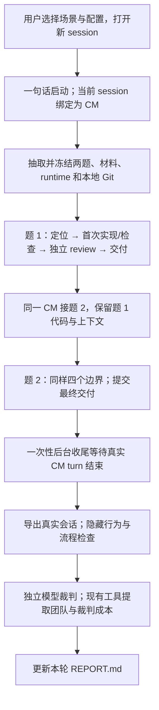

# 两项 CM 测试：执行、评分与数据统计

新增六题模式 `--suite five-plus-one`（`cm-six-v1`）：全部五类经典题按类别顺序，加随机一道
非典型题；六题说明与源码开局一次性分发，入口是本轮 `TASKS.md`。同一 CM 完成六题、24个
检查点后自动收尾，逐题保留首次实现和最终回归检查，团队与裁判成本仍分列。
该模式不使用两题的难度不同约束，亦不在第二题后结束；已有背景杂务仍在前两题触发。
两种 CM 入口均默认六题模式。实际模型自选，建议启动 prompt 见 QUICKSTART.md。
以下两题顺序投递流程仅在显式 `--suite pair` 时使用；历史冻结运行不变。

协议：`cm-pair-v1`。本文对照实现 `72213bdaba9a295df3c8dfcfa3a8d838809eb81a`。
适用目录：`C:/Projects/CodexBechmark`。本文件供测试组织者和结果分析者阅读；
被测 CM 只读取其 workspace 中分发的任务和指令。

**现在已经接通单轮自动流程：抽题、连续执行、留档、独立评分和成本提取。**
选择配置、打开全新 session 由用户完成；跨轮统计、策略排序和下一轮选择尚未自动化。
已出现真实候选试跑。2026-09-10修复自选组合、裁判材料传递和Windows收尾编码；
模型默认值只是建议，用户选择组合优先，实际模型由元数据记录。未核实证据不算通过。

## 1. 两个测试分别测什么

| 项目 | 直接实现基线 | 委派颗粒度与复用 |
| --- | --- | --- |
| 场景名 | `cm_direct_review` | `cm_delegation_granularity` |
| 问题 | 当前 CM 自己写代码、独立审查，质量与全链成本如何 | CM 交接写多细、如何复用，能否减少澄清和返工 |
| CM | 当前打开的顶层 session，Astra/medium | 当前打开的顶层 session，Astra/medium |
| Implementer | 无，CM 实现 | 真实 Terra/high 子代理实现 |
| 团队 reviewer | 真实 Astra/high 子代理 | 真实 Astra/high 子代理 |
| 最终独立裁判 | CM 结束后，另一个 Astra/high 根会话 | 相同 |
| 单轮题量 | 经典范例一题＋非范例一题 | 相同 |
| 交接处理 | 不套用 L0–L3 委派处理 | L0–L3 × fresh/reuse，单轮只选一格 |

Astra、Terra 的配置标识分别是 `gpt-6-astra`、`gpt-5.6-terra`。
表中角色配置是默认建议，用户可选择其他模型/effort组合。委派职责是实验处理，
不能称为生产 CM 当前默认做法。两项测试都没有运行中的 DM：任务由冻结题包提供，
不是再调用一个 DM 现场设计科学任务。它们也不启动原有 `root_delegation` 测试。

任务是根据当前项目代码边界构造的小型 synthetic 修复，代码、公开检查和 Git 操作真实执行。
背景回执是固定材料；不执行科研训练，不把背景完成声明作为候选代码通过的证据。

## 2. 用户如何启动

在 Codex 中选择对应目录，打开一个**没有读过题库、答案或其他配置结果的全新 session**：

| 用途 | 新 session 的工作目录 | 一句话示例 |
| --- | --- | --- |
| 直接实现基线 | `C:/Projects/CodexBechmark/cm_direct_review/workspace` | 开始测试，seed=17 |
| 委派默认对照 | `C:/Projects/CodexBechmark/cm_delegation_granularity/workspace` | 开始测试，L0 fresh，seed=17 |
| 委派指定策略 | 同上，另开全新 session | 开始测试，L2 reuse，seed=17 |

只说“开始测试”也可：未指定 seed 时自动产生并保存；委派默认 L0 fresh。
当前 session 本身就是 CM，不创建第二个 CM 子代理，也不从这个 session 再启动另一个 CM CLI。

入口指令让 CM 调用 `python -B start.py`，根据一句话带上相应参数。
内部等价于 `begin --mode direct|delegation`，绑定真实 `CODEX_THREAD_ID`。
默认题目检查使用本机 `C:/Users/fires/.conda/envs/hmasd-amd-cpu/python.exe`，
固定 NumPy 1.26.3、Torch 2.7.0+cpu。Git、Codex CLI 和现有成本 skill 也需可用。

模型配置在 session 启动前生效。当前入口已预设上表角色；若以后比较其他模型，
应先配置入口 `.codex` 的根模型与子代理角色，再开新 session，并记录匹配的请求参数。
运行中只改 `--cm/--implementer/--reviewer` 字符串不会改变已运行会话的模型。
最终导出核对实际模型/effort，不以请求名称代替事实。

单轮默认每题三十分钟是软时间参考，由 CM 按事实处理超时/未完成；
当前没有用这个数字强制杀进程，也没有设置单轮 token 或美元硬上限。

## 3. Spec 在测试中怎样分发

每个组都有相同的目标、源代码、必要科学事实、所属路径与验收。
**L0 不是“只给一句目标让执行者猜”**；它使用当前五项交接结构及完整任务事实。
L0–L3 是 CM→implementer 的指导处理，不代表已统计出的历史 DM→CM 消息平均粒度。

| 档位 | CM 需要真实生成的交接 |
| --- | --- |
| L0 | 目标、所属路径/入口、保护语义、验收/精准引用、预算/停止条件 |
| L1 | L0 ＋本题接口、shape/type、返回/错误/突变约定和现有代码习惯 |
| L2 | L1 ＋数据/状态流、关键顺序、分支与伪代码 |
| L3 | L2 ＋适用的局部函数骨架或代码例子；不替 implementer 完成整题 |

`fresh`：CM 依据本题逐次撰写交接，不分发新增模式库。
`reuse`：只分发该档允许的冻结材料；CM 选择适用部分、引用并写明差异。
L0 reuse 只有五项结构；L1/L2 获得对应的文字增量；L3 才得到可执行局部例子。
库里的假设不能覆盖非范例题明示的不同条件。

CM 在委派前保存真实 handoff，实际调用 implementer，处理澄清并验收。
首次子代理上下文不继承 CM 全部历史；同任务修复复用原执行者。
若 CM 接管编码，需要记录原因和改动范围，不能把接管成本从团队结果中扣掉。
完整定义见 [HANDOFF_LEVELS.md](HANDOFF_LEVELS.md)。

## 4. 单轮从启动到报告的全过程



### 抽题与准备

从五个经典候选中随机选一题，再从三个非范例中选一题。
默认第二题的 easy/medium/hard 预估标签与第一题不同。
这是带约束抽样，各具体题目的总体抽中概率不必相同；难度标签尚无模型成功率校准。

相同 seed、相同题库与抽样规则会得到相同两题和顺序。
seed 控制抽题，不保证语言模型输出可重复。
两题在开始时一起冻结，但先只向 CM 分发第一题；第二题在第一题交付边界后送达。

准备程序建立本轮源码仓库及本地 bare origin，保存输入与主持 runtime 的哈希、
题目元数据、请求配置和依赖版本。后续维护题库不会改变已准备 run 的第二题或 oracle。

### 每题四个边界

| 边界 | CM 此时应已完成 | 自动记录/后续动作 |
| --- | --- | --- |
| `located` | 读任务、定位相关代码，尚未编辑 | 保存现场，投递该位置的固定事件 |
| `checked` | 首次实现及公开检查尝试，尚未独立 review | 保存首次实现供后续独立验收 |
| `reviewed` | 真实 reviewer 返回，保存原报告和 CM 处理意见 | 保存现场，投递状态/收集类事件 |
| `accepted` | 必要修复、检查、显式 commit/push，或如实记录失败 | 保存交付事实；第一题后投递第二题，第二题后安排收尾 |

这些命令由 CM 按指令执行，用户不用逐项复制。
`accepted` 是提交结果的边界名，不代表主持者已经判定通过。
失败不能跳过记录或伪装成功；CM 可以按事实交付未完成结果，供最终判定。

直接实现场景由 CM 编码；委派场景由 implementer 编码。
两者都需要真实独立 reviewer，每题首次 review 前保留实现快照。
reviewer 的意见由 CM 核实和处理；它不承担最终给自己团队评分的工作。

两题共八个边界。期间穿插邻接无关修改、只改文档的提交、迟到或缺失背景产物、
相似 run 身份和状态询问。事件在工作边界投递，不是按墙钟随机打断。
CM 必须继续原任务、保留前题行为及无关修改，并按实际产物更新收集状态。

### 最后一次交付之后

CM 保存最终交付，再提交第二题的 accepted。
入口的后台 helper 此时才启动，等待本轮最后边界之后的真实 `task_complete`；
CM 给用户返回交付和 REPORT.md 链接，正常结束当前 turn，不能等“自己结束”。

helper 随后依次：

1. 从本地真实会话记录导出根/子代理、模型、effort、父子关系与公开原生调用证据。
2. 对首次实现和最终代码运行独立隐藏检查，核验 Git、交付及背景身份等流程产物。
3. 启动一个独立 Astra/high 根会话，评估语义、spec、review、接管和原生工作流证据。
4. 调用既有成本工具，分别生成 CM 团队与独立裁判的原始报告。
5. 更新本轮 REPORT.md 和收尾状态，退出 helper。

独立裁判只读冻结提交，不向候选反馈后再允许修改答案。
这份报告在磁盘上自动更新；当前不另外自动发送一条“评分完成”聊天通知。
如果打开的预览仍是占位内容，可重新打开文件。收尾期间不要继续用该 CM 做其他工作，
避免后续 turn 混入同一根会话的成本提取；汇总分析放在另一个 session。

## 5. 哪些数据是自动的

“自动”有三种来源：程序直接提取；被测代理按协议留下记录；独立模型根据证据评价。
后两类仍需检验真实性，不能把代理写下的自述直接当事实。

| 数据 | 当前如何产生 | 保存位置 |
| --- | --- | --- |
| run ID、seed、两题、难度、请求角色配置、依赖版本 | 程序自动冻结 | `state.json`、`export.json` |
| 八个边界的时间、源码、Git diff/HEAD/push/未提交修改 | 程序在 checkpoint 自动保存 | `snapshots/`、`state.json.checkpoints` |
| 首次/最终代码行为 | 隐藏检查自动执行；最终也核验前题回归 | `judgement.json.tasks` |
| Git、背景身份、交付及记录存在性 | 程序自动检查 | `judgement.json.protocol_checks` |
| 实际子代理、模型与 effort | 从 SQLite/rollout 提取并核对请求配置 | `export.json.runtime/configuration` |
| 实际交接、审查原文、CM 处理意见和接管说明 | CM/子代理按协议生成；独立裁判核查 | 候选 `work/` 及冻结快照 |
| spec 质量、review 是否有依据、语义和工作流 | 独立模型裁判自动评价，保留证据与限制 | `assessment/report.json` |
| token、缓存、角色 self cost、团队 tree cost、完成 turn/task 时长 | 现有成本工具自动提取 | `cost/team.md`、`cost/evaluator.md` |
| 精确追问/返工/接管次数 | 当前没有专门的稳定自动计数器；保留原始材料和裁判文字分析 | `work/`、`native_evidence`、裁判报告 |
| 准备至交付等阶段时间 | 时间戳已留档；REPORT 未汇总完整阶段耗时或等待分解 | `state.json`、各阶段 JSON |
| 库首次制作成本、实际复用摊销 | 当前尚未独立量得 | 保持 `unmeasured` |
| 跨 run 胜率、均值、置信区间、排行榜、难度校准 | 当前没有自动汇总器 | 需后续单独分析 |
| 配置矩阵运行进度、下一配置的选择与启动 | 当前不自动更新或调度 | MATRIX.json 仍是配置目录 |

`export.json.cost` 仍是导出时的 `unmeasured` 占位说明；
之后生成的费用应查看 `cost/`，该占位字段不会自动被回填。
“MATRIX.json 写着 not_run”也不是动态运行计数，应以各 run 的实际记录为准。

## 6. 评分怎样判读

当前不生成一个加权总分；行为、流程、实际配置、独立裁判分别保留。

| 字段 | 含义 |
| --- | --- |
| `tasks[].first_implementation.passed` | 首次实现快照能否通过独立行为检查 |
| `tasks[].final.passed` | 最终快照中的该题行为是否通过 |
| `behavior_passed` | 两题流程闭合，且两题最终行为均通过 |
| `protocol_artifacts_passed` | 已实现的流程产物检查是否全部通过 |
| `configuration.status` | `verified`：实际模型元数据齐备且符合显式选择；`mismatch`：偏离显式选择；`unmeasured`：证据缺失；角色职责与工作目录由独立工作流评审核实 |
| `semantic_review` / `assessment/report.json` | 语义、档位遵循、原生工作流、spec/review/接管的独立评价 |
| `full_run_passed` | 行为、流程、配置与成功完成的独立裁判共同满足要求 |

完整通过要求裁判成功退出，存在结束记录，并记录一个区别于 CM 的真实裁判 session ID；
裁判还需给出语义通过，以及 policy/native workflow conforming。

`full_run_passed=true` 表示上述实现条件满足。
`false` 表示已经发现行为/流程/显式配置偏离或独立评审确认的问题。
裁判未完成、证据不足等无法确认情况为 `null`，不能当成功，也不代表已发现代码缺陷。
`finalization.status=finished` 只表示收尾流程走到末尾，不等于质量通过、费用完整或裁判无故障。

原生交接正文若加密或缺失，裁判无法核实的部分应标 `insufficient_evidence`；
不得从“有一个审查文件”推断真实 review 已发生。
这类缺口要与已证实的代码缺陷分开报告。
独立裁判提供可审查的模型判断，仍可能出错；它不是数学正确性的证明。

## 7. 费用、tokens 与时间如何统计

runner 不按字数、工具次数或自报工作量估算美元，也不另写 token 加总公式。
它在 CM turn 结束后调用已安装的 `codex-task-cost-analysis`：

```text
summary --thread-id <实际根会话> --unit both --cost-scope both --format markdown
        --pricing-json <本轮冻结价表>
```

由该工具负责完成边界、后代归属、token 差分、价格和 self/tree 统计。
费用字段与数值以它的原始报告为准；质量判断由独立的行为检查和裁判负责。

团队成本包括 CM 的读题、写 spec、选择范例、委派/澄清、实现或接管、审查处理、验收，
以及 implementer 和团队 reviewer 的实际工作与返工。
角色比较看 self cost，完整团队看专用于本轮的 CM 根 tree cost；
不能再把已包含在 tree 中的子代理 self cost 加一遍。

独立裁判另起根会话，其成本保存在 evaluator.md，单列评测开销。
当前 REPORT 只链接两份原始报告，没有再生成一张“团队＋裁判＋公共准备投入”的总账。
库/题包首次制作尚未独立量得；不能按零计算，也不能宣称已经回本。

价格使用本轮冻结的 API Standard 参考费率，来源和观察日期保存在 pricing.json。
它不等于订阅额度或实际账单，也未建模未知 service tier 或超长单请求倍率。
input、cached input、cache write、output 分别处理；reasoning 是 output 的组成，不重复相加。

正常闭合但任务失败的 turn 仍有成本，不能从失败样本中删除。
aborted、活跃或未闭合 turn 可能被现有工具排除；因此这类运行的完整消耗可能不可得。
工具失败、缺价格或 `UNPRICED` 一律保留缺失状态，不能按零补齐。
`cost/status.json` 的 exit 0 只说明工具成功输出，还需看报告中的覆盖范围与 UNPRICED。

成本报告的时间遵循工具对已完成 turn/task 的定义。
并行子代理时长相加不等于用户等待时长；当前没有自动给出完整运行阶段的关键路径、
聚合 CPU 或峰值 RSS 分析。

## 8. 文件放在哪里、先看什么

两个场景各自保存记录，不共享隐含的 current run：

```text
C:/Projects/CodexBechmark/<scene>/workspace/
  <run-id>/                         # 被测代码和真实本地 Git
    AGENTS.md
    CURRENT.md
    tasks/
    work/
      <task-id>.md
      handoffs/                     # 委派场景
      reviews/
      background.json
      status.md
      final.md
      takeovers.md                  # 有接管时
  _host/runs/<run-id>/               # 主持记录，被测代理不得浏览
    REPORT.md                       # 人类阅读入口，后台更新
    state.json
    runtime/                        # 本轮冻结的执行/评分材料
    snapshots/                      # 八个边界现场
    origin.git/                     # 本机 bare remote
    export.json
    judgement.json
    assessment/
      report.json
      completion.json
      invocation.json
      cli.jsonl
      stderr.txt
    cost/
      team.md
      evaluator.md
      status.json
      pricing.json
      *-stderr.txt
    finalization.json
    finalizer.log
```

阅读顺序是 REPORT → judgement 的分项与实际 configuration → 独立裁判 → cost 原始报告。
发现矛盾后再查 snapshots 和日志，不以 CM 最后的“完成了”代替这些证据。
报告里存在链接不保证目标文件已成功生成，收尾异常时可能只有部分产物。

所有运行写入都留在打开的 workspace 内；`_host` 是协议访问边界，不是恶意代码防护。
维护时保留已有 run。候选结束后不要依据隐藏评分回写原提交。

## 9. 多轮如何比较：当前需要另做汇总

一个统计单位是“一个新 CM session 完成的两题流程”。
同一流程的两个题目、八个边界以及多个子代理都不是独立团队样本。

最小的两个场景对照可这样组织；下面只是操作示例，不会自动执行：

| 运行 | 场景 | 输入 |
| --- | --- | --- |
| A | 直接实现基线 | seed=17 |
| B | 委派 L0 fresh | 相同题库版本、相同 seed=17，另开新 session |

这是两个配置各一轮、每轮两题，可以检查运行和比较方法是否通顺，不能得出稳定优劣。
两组同时改变了实现职责分配与实现者模型，所以它比较部署组合，不能独立归因于“委派”。

若研究颗粒度，在同一模型组合下比较 L0 fresh 与 L2 fresh；
若研究复用，在同一档位下比较 L2 fresh 与 L2 reuse。
同时改变档位和复用方式得到的是组合策略差异。
后续选择更多 seed/重复需要另开新 session；不因为已有八格矩阵就自动把它们全跑一遍。

汇总时每个 run 保留一行，至少包含：

| 信息组 | 字段 |
| --- | --- |
| 归属 | run ID、原分配场景/档位/方式、seed、两题 ID、题库/runtime 版本 |
| 真实配置 | CM/implementer/reviewer 的实际模型与 effort、核验状态 |
| 质量 | 两题首次/最终行为、流程检查、完整判定、严重问题、未完成/证据不足原因 |
| 成本 | 团队、角色、独立裁判的原始报告链接、费率口径、测量覆盖与缺失 |
| 过程 | spec/review/接管评价、原始边界时间、必要偏差说明 |

跨配置核对两题、题库/runtime 字节和依赖，不能只看 seed。
不同 run 的路径、run ID 等会使部分生成文件哈希不同，不要求整个 input_hashes 对象逐项相等。

质量可报告“完整通过数 / 所有分配尝试数”，并另列失败、配置偏离、证据不足和提前中断。
保留原分配组，不通过事后换组或删除失败美化结果。
先检查是否达到相同质量，再比较可计量成本及时间；不强行合成一个总分。

费用及均值/中位数等通过既有成本工具按明确会话范围提取。
只有费用覆盖完整时，才解释“所有尝试总消耗 / 通过流程数”；
零通过没有有限的成功单位成本，缺失消耗不能按零补。
首用成本、模板维护和实际复用摊销仍需单独测量。
当前 runner 不自动生成这些跨轮表、比值、置信区间或推荐策略，也不自动改生产配置。

## 10. 未完成、异常与当前验证范围

| 情况 | 当前行为与判读 |
| --- | --- |
| 准备时依赖版本不符或必要命令不可用 | 返回错误；不能把未启动当低成本成功 |
| 不能创建真实 implementer/reviewer | 按事实记录偏差；不得模拟子代理回复 |
| 某题代码失败，但流程可继续 | 记录失败并提交边界，仍交付完整现场供评分 |
| 在最后 accepted 之前中断或提前结束 | 自动收尾尚未触发；保留现场，标为未完成，需从独立维护 session 处理 |
| 最后 accepted 后 CM turn 被 abort | helper 导出并尝试行为/成本收集，跳过模型裁判 |
| helper 一小时内未观察到 CM turn 结束 | 记录 error；不会启动裁判；这一小时不是整轮强制时限 |
| 在线裁判卡住 | 当前没有独立强制超时；查看 assessment/cli.jsonl、stderr.txt 和 finalizer.log |
| 裁判失败或缺会话身份 | 即使报告内容像通过，也不能形成完整通过 |
| 成本工具失败或缺价格 | 保存错误/UNPRICED；质量和成本状态分开 |
| REPORT 仍是占位内容 | 可能尚在执行或收尾；状态文件不是每个内部阶段的实时进度条，需结合日志判断 |

helper 是一次性进程，不是自动重启服务或持久调度器。
电脑休眠、进程终止、权限或实际日志格式等异常，不保证自行恢复；
不要通过再发“开始测试”覆盖原 run，或盲目重复发起已尝试的裁判。
维护/恢复先核对现有状态与实际接受记录，再处理明确缺口。

当前已通过七项离线协议检查、题库参考解/典型错误校准及独立工程审查。
离线证据覆盖抽题、材料分档、两题八边界、真实 Git、输入冻结、失败评分和收尾调用顺序。
其中模型和后台收尾的部分依赖使用测试替身；实际候选角色加载、在线裁判以及后台进程在
真实会话权限下的存活，尚未由候选试跑验证。见 [_host/IMPLEMENTATION.md](_host/IMPLEMENTATION.md)。

入口速查见 [QUICKSTART.md](QUICKSTART.md)，质量/成本口径见 [MEASUREMENT.md](MEASUREMENT.md)，
两题协议见 [DESIGN.md](DESIGN.md)。这些文档描述当前实现，不代表已发生模型比较或统计结论。
