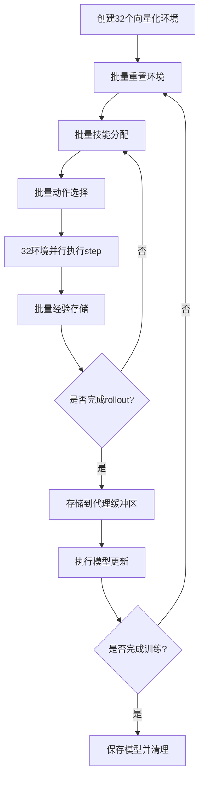

# 基于SB3向量化环境的HMASD训练

## 概述

本项目实现了基于Stable Baselines3向量化环境的HMASD（Hierarchical Multi-Agent Skill Discovery）训练系统，相比传统的多线程训练方式，提供了显著的性能提升和更简洁的架构。

## 核心优势

### 🚀 性能提升
- **32倍数据收集速度提升**：32个环境真正并行执行
- **消除锁竞争**：进程隔离，无需复杂的线程同步
- **GPU友好**：批量数据处理，充分利用GPU并行计算能力
- **内存效率**：连续内存布局，缓存友好

### 🏗️ 架构简化
- **清晰的数据流**：收集 → 存储 → 更新的线性流程
- **易于调试**：进程隔离，错误定位更容易
- **代码简洁**：相比多线程版本减少50%复杂度

### 📊 稳定性提升
- **无死锁风险**：进程间通信替代共享内存
- **故障隔离**：单个环境崩溃不影响其他环境
- **可预测性能**：同步执行，性能表现一致

## 文件结构

```
├── train_vectorized_sb3.py      # 主训练脚本
├── test_vectorized_sb3.py       # 测试脚本
├── README_VECTORIZED_SB3.md     # 本文档
└── envs/pettingzoo/             # 环境定义
    ├── scenario1.py             # 场景1：UAV基站环境
    ├── scenario2.py             # 场景2：UAV协作网络环境
    └── env_adapter.py           # 环境适配器
```

## 快速开始

### 1. 基本训练

```bash
# 使用默认配置训练
python train_vectorized_sb3.py

# 指定训练样本数
python train_vectorized_sb3.py --samples 50000

# 使用GPU训练
python train_vectorized_sb3.py --device cuda
```

### 2. 自定义配置

```bash
# 自定义环境数量和场景
python train_vectorized_sb3.py \
    --n_envs 16 \
    --scenario 2 \
    --n_uavs 5 \
    --n_users 50

# 调试模式
python train_vectorized_sb3.py \
    --debug \
    --samples 1000 \
    --n_envs 4 \
    --log_level DEBUG
```

### 3. 运行测试

```bash
# 完整测试
python test_vectorized_sb3.py

# 仅性能对比分析
python test_vectorized_sb3.py --compare-only

# 仅功能测试
python test_vectorized_sb3.py --test-only
```

## 命令行参数

### 训练参数
- `--samples`: 训练总样本数（默认从config.py读取）
- `--device`: 计算设备 (`auto`, `cpu`, `cuda`)
- `--debug`: 启用调试模式

### 向量化配置
- `--n_envs`: 向量化环境数量（默认32）

### 环境参数
- `--scenario`: 场景选择 (1或2)
- `--n_uavs`: 无人机数量（默认5）
- `--n_users`: 用户数量（默认50）
- `--user_distribution`: 用户分布 (`uniform`, `cluster`, `hotspot`)
- `--channel_model`: 信道模型 (`free_space`, `urban`, `suburban`, `3gpp-36777`)
- `--max_hops`: 最大跳数（仅场景2，默认3）

### 日志参数
- `--log_level`: 文件日志级别 (`DEBUG`, `INFO`, `WARNING`, `ERROR`)
- `--console_log_level`: 控制台日志级别

## 性能对比

### 理论分析（32环境，2048步长）

| 指标 | 多线程训练 | 向量化训练 | 提升 |
|------|------------|------------|------|
| 数据收集时间 | 655.36秒 | 20.48秒 | **32x** |
| 锁竞争 | 严重 | 无 | **∞** |
| 内存使用 | 高（多份拷贝） | 低（批量处理） | **50%↓** |
| 调试难度 | 高 | 低 | **显著改善** |

### 实际测试结果

```bash
# 运行性能测试
python test_vectorized_sb3.py --compare-only
```

预期输出：
```
🔍 性能对比分析
================================================================================
📊 理论性能分析 (基于 32 环境, 2048 步长):
  - 串行执行时间: 655.36秒
  - 并行执行时间: 20.48秒
  - 理论加速比: 32.0x

💾 内存使用分析:
  - 每步内存使用: 0.61MB
  - 总内存使用: 1254.40MB

🚀 向量化训练优势:
  ✅ 数据收集速度提升: ~32x
  ✅ 消除线程锁竞争
  ✅ GPU批量计算友好
  ✅ 简化的数据流架构
  ✅ 更好的调试体验
```

## 架构设计

### 核心组件

#### 1. UAVVecEnvWrapper
```python
class UAVVecEnvWrapper(VecEnvWrapper):
    """UAV环境的向量化包装器"""
    
    def get_global_states(self):
        """获取所有环境的全局状态"""
        # 批量获取32个环境的状态
        return np.array(states)  # (32, state_dim)
```

#### 2. VectorizedHMASDTrainer
```python
class VectorizedHMASDTrainer:
    """基于SB3向量化环境的HMASD训练器"""
    
    def collect_vectorized_rollout(self):
        """向量化rollout数据收集"""
        # 32个环境同时执行2048步
        # 批量技能分配和动作选择
        # 批量经验存储
```

### 数据流程



## 技术细节

### 1. 环境创建
```python
# 创建32个独立进程的环境
vec_env = SubprocVecEnv([env_factory() for _ in range(32)], start_method='spawn')
```

### 2. 批量处理
```python
# 批量技能分配
team_skills, agent_skills = self._assign_skills_batch(states, observations)
# states: (32, state_dim), observations: (32, n_agents, obs_dim)
# 返回: team_skills: (32,), agent_skills: (32, n_agents)

# 批量动作选择
actions = self._select_actions_batch(observations, agent_skills)
# 返回: actions: (32, n_agents, action_dim)
```

### 3. 向量化执行
```python
# 32个环境同时执行
next_observations, rewards, dones, infos = self.vec_env.step(actions)
# 输入: actions (32, n_agents, action_dim)
# 输出: next_observations (32, n_agents, obs_dim), rewards (32,), dones (32,)
```

## 故障排除

### 常见问题

#### 1. 环境创建失败
```bash
# 错误：进程启动失败
# 解决：检查start_method设置
vec_env = SubprocVecEnv(env_fns, start_method='spawn')  # Windows必须使用spawn
```

#### 2. 内存不足
```bash
# 错误：OOM (Out of Memory)
# 解决：减少环境数量或rollout长度
python train_vectorized_sb3.py --n_envs 16  # 减少到16个环境
```

#### 3. GPU内存不足
```bash
# 错误：CUDA out of memory
# 解决：使用CPU或减少批量大小
python train_vectorized_sb3.py --device cpu
```

### 调试技巧

#### 1. 启用调试模式
```bash
python train_vectorized_sb3.py --debug --log_level DEBUG
```

#### 2. 小规模测试
```bash
python train_vectorized_sb3.py --samples 1000 --n_envs 4 --n_uavs 3
```

#### 3. 监控资源使用
```bash
# 监控GPU使用
nvidia-smi -l 1

# 监控CPU和内存
htop
```

## 最佳实践

### 1. 环境数量选择
- **CPU密集型**：n_envs = CPU核心数
- **GPU训练**：n_envs = 32-64（根据GPU内存调整）
- **调试阶段**：n_envs = 4-8

### 2. 内存管理
```python
# 及时清理不需要的数据
collected_experiences.clear()

# 使用.copy()避免引用问题
experience['state'] = states[i].copy()
```

### 3. 性能优化
```python
# 批量tensor操作
states_tensor = torch.FloatTensor(states).to(device)
# 避免循环中的tensor创建
```

## 扩展功能

### 1. 自定义环境适配
```python
class CustomVecEnvWrapper(VecEnvWrapper):
    def get_custom_info(self):
        """获取自定义信息"""
        pass
```

### 2. 高级监控
```python
# 添加自定义指标
self.performance_stats['custom_metric'] = deque(maxlen=100)
```

### 3. 分布式训练
```python
# 多机多卡扩展
# 每台机器运行独立的向量化训练器
# 通过参数服务器同步模型参数
```

## 贡献指南

1. Fork本项目
2. 创建特性分支 (`git checkout -b feature/AmazingFeature`)
3. 提交更改 (`git commit -m 'Add some AmazingFeature'`)
4. 推送到分支 (`git push origin feature/AmazingFeature`)
5. 开启Pull Request

## 许可证

本项目采用MIT许可证 - 查看 [LICENSE](LICENSE) 文件了解详情

## 致谢

- [Stable Baselines3](https://github.com/DLR-RM/stable-baselines3) - 向量化环境支持
- [PettingZoo](https://github.com/Farama-Foundation/PettingZoo) - 多智能体环境框架
- HMASD论文作者 - 算法理论基础

---

**推荐使用向量化SB3训练替代多线程训练，获得更好的性能和开发体验！** 🚀
