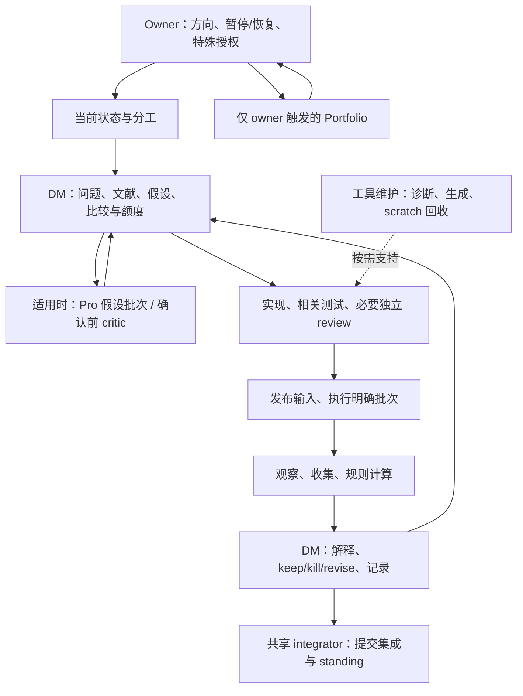
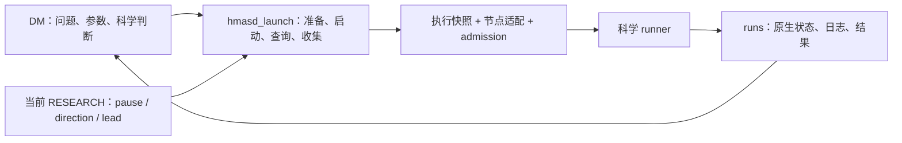

# LLM 研究协作的脚本与 skill 分工：设计草案 v1.3

当前设计取舍见文末 `审计响应与收缩方案 v1.4`。以下 v1.3 正文与 Pro 问答保留为审计证据；相冲突的建设范围由 v1.4 收缩，不代表代码已经实现。

日期：2026-09-17。Owner 请求的设计稿；尚未采纳、尚未实施，不是新的治理来源。
研究暂停、现行宪章、冻结实验和现有运行行为保持不变。Remember、Claude 用户设置与记忆行为不在本次修改范围。

供 Pro 审计：请先读文末 `Pro question 2026-09-17 script-first-workflow-design-audit`，再按其中的 Context 阅读本稿和相关源。设计正文是审计对象，不能当作已经采纳的规则。

v1.1 按 owner 后续要求，将已筛选的六项 ECC 借鉴完整纳入设计与实施顺序；它们不再只是参考备注。以下接口和方法仍是待实施方案。

v1.2 补充具体的“脚本承担什么、skill 调用什么”分工，特别说明测试临时目录的自动清理、遗留目录回收与工具 policy 边界。

v1.3 按 owner 要求复核完整工作流，将范围从实验执行扩展到文献、Pro、实现、批次、判读、记录、集成和维护；删除不作为全流程的主要设计对象。v1.2 与 v1.3 在同一设计修订中交付。

## 1. 目标与判断

保留 `run` 脚本的优点：输入明确、执行可复现、状态可查询、失败能恢复；将重复的机器操作交给代码，让 LLM 集中处理问题、实现、比较和解释。

这项分工覆盖完整研究闭环，不只覆盖运行和清理。实验执行采用一个稳定入口；文献、Pro、统计、记录和 Git 分别复用各自已有的工具接口，skill 按实际任务调用。

建议形成一个简单协作契约：**LLM 提出一次具体运行请求；脚本完成机械准备与启动，返回可恢复的原生句柄；LLM 根据事实继续工作。** 常规路径不要求额外填写启动表、不要求每一步审批，也不要求为了满足工具格式另建一套科研记录。

降低阻塞的办法是减少检查与真实风险之间的间接关系。暂停必须阻止新实验；无关文档未提交不应阻止从已发布快照执行。进程状态未知必须阻止重复启动；它不应阻止读日志、修代码或处理另一项独立工作。

依据是现行 [Constitution](../../project/OPERATING_CONSTITUTION.md) §§2–9：DM 负责端到端研究，工具事故优先修工具，按 fits 计量，只有 NOTES/runs/CLAIM 三种研究记录，不增设常设治理手续。

## 2. 保留什么，收窄什么

| 当前能力或约束 | 设计取舍 |
| --- | --- |
| `hmasd_run.py` 的 manifest、原生进程核对、未知不重跑 | 复用这些语义和已验证的底层函数；冻结对象继续使用其原 SHA 的接口，不整体复活旧审批规则 |
| 新 `hmasd_launch.py` 的 fresh preflight、runner admission、真实退出记录 | 保留，作为新入口的执行基础；不再增加第三套并行 launcher |
| 作者工作树全局干净 | 改为执行快照干净且绑定已发布 SHA；作者可以继续编辑，脏改动不会自动进入运行 |
| 整份 RESEARCH 与发布版本字节相同 | 校验与该次启动相关的 pause、direction、active state、lead；无关说明变化不拒绝 |
| 每次让 LLM 手写 wrapper、核对多份回执 | 用一个命令完成。前置诊断可选；启动自身不能依赖 LLM 已手工检查 |
| 重复调用一律报错 | 同一请求返回已有状态与句柄；绝不因此产生第二个进程 |
| 每个故障都再加规则 | 可达缺陷先补代码与对应回归。真实决策冲突才交回 DM/owner |
| Reviewer、Pro、Implementer | 保留现有职责与触发条件，不串成每项工作的必经流水线 |

代码现状依据：[旧 run](../../../scripts/hmasd_run.py)、[当前 launcher](../../../scripts/hmasd_launch.py)、[runner guard](../../../scripts/hmasd_admission.py)。当前 launcher 的全树检查、整份控制文件比较和同节点 claim 范围属于本稿拟改进点，不将它们描述为已经解决。

### 2.1 完整工作流核对与范围修正

本次按现行宪章逐一读取六个共享 SKILL、其直接使用的 references、Root/DM/Implementer/Reviewer/Operator/Monitor/Transport 角色配置、compute/transport 配置、RESEARCH、MAP/GUIDANCE，以及现有 publisher、scratch、统计和 FSD staging 工具。以 RESEARCH 指定的 FSD 冻结卡及 handoff 核对一个真实对象的选择—确认—判读链；handoff 中旧 ledger、PRO_FINAL、强制 Operator 等治理文字不重新获得当前权限。

这是源码与流程审阅，没有启动真实节点任务、发送 Pro、验证活会话采纳或运行历史实验。当前研究仍暂停；两个 active 方向的 NOTES.md 在本 checkout 尚不存在，不能因此要求补写整个历史。首次获授权的新工作按现行记录方式开始，冻结 FSD 继续由原卡承担契约。新 admission 修改已推送本设计分支，不能推断所有运行路径已迁移或 main 已采用。

完整工作流是有选择和反馈的研究闭环，不是一条每项任务必须经过的流水线：



Pro 的两种研究用途沿用现行方法；Portfolio 是另一个 owner-triggered 分支。工程修复、文档调整、读状态和收集既有结果各自从适用位置进入，不重新绕完整闭环。

| 环节 / 主要方法 | 脚本或既有原生工具可承担 | 保留给责任人的选择 |
| --- | --- | --- |
| Owner 指示、Root 调度 / loop-dispatch | 读取方向/lead/pause、列出原生任务返回的真实 handle、识别已集成提交 | 是否恢复、方向选择、是否有值得启动的 reserve idea；不能凭空创建 native agent identity |
| 文献与概念 / scientific-tools references | 查询已验证本地索引、取回指定页面/元数据、报告覆盖范围和出处 | 提问、证据相关性、机制解释与 novelty；检索命中不等于证据充分 |
| 探索与确认设计 / scientific-tools | 展开已指定 arms/seeds/horizon、计算已知工作量、核对重复与缺失输入 | 假设、matched-information、独立单位、终点、预算与停止规则；普通 idea 不新增 owner 审批 |
| Pro 作者 / pro-research-prompt-author | 核对 pinned 路径/节、唯一 question/answer heading、目标为空、确定性消息字段与 key | 选择要问的问题、材料和科学约束；工具不改写已接受问题 |
| Pro 往返 / chatgpt-pro-transport | Agentify 原生 preflight/query/wait；固定操作恢复；Git 答案范围核对与完整正文回收 | 作者完整阅读、采纳/修改/拒绝；原生 MCP 能力已有时不套另一套浏览器 shell |
| 实现与审查 / research-engineering | 根据明确路径取 diff、测试组调用、收集原始检查结果和契约输入 | DM 写简洁 L0、实现或委派、Reviewer 找可达问题、DM 接受；不让脚本给科学实现盖章 |
| 提交与来源准备 / engineering、loop-dispatch | 检查指定路径/commit、取得远端事实、准备快照；在已指定范围内调用 Git | 作者决定发布哪些变更，integrator 决定接受哪些提交；不自动 stage 全仓、stash、改别人 index |
| 批次与阶段 / runner 对象契约 | 执行已列出的 fits、每 fit 准入、按已冻结规则计算 selection、记录阶段输出 | DM 定义批次和适用规则；脚本不能增加 arm/seed、换 endpoint 或追加预算 |
| 观察与交接 / engineering、Monitor | 查询指定 native handle、批量独立检查、增量日志、真实终态、相同事件去重 | 是否更换观察者或干预；任务 dispatch 不冒充 adoption，timeout 不冒充终止 |
| 收集与 reducer / scientific-tools、engineering | 核对所需制品、计算指定统计和固定标签、暴露缺失与实际 exposure | 判断比较是否有效、解释结果范围、keep/kill/revise；不事后选择有利切片 |
| NOTES/CLAIM 与 main/RESEARCH / DM、integrator | 对明确小节生成/应用保留其他字节的补丁，检查目标版本和提交范围 | 正文与状态含义由作者给出；Pro 接管的小节不能并发写，脚本不自动判定方向该归档 |
| Portfolio / portfolio-task | 按指定方向提取已有证据和状态、复用同一 Pro 传输核对 | Owner 触发和裁决，不由批次结束、空闲容量或成本阈值自动启动 |
| 工具和存储维护 / engineering、loop-dispatch | publisher、按需诊断、producer 自清理、针对性临时文件回收、worktree 状态取证 | 哪些历史材料可丢弃、是否移除 worktree；不将维护变成下一实验的普遍前置条件 |

### 2.2 全链路复核后需要避免的误解

1. **脚本不限于安全门禁。** 检索、参数展开、版本取证、阶段选择、统计和局部补丁都是应减少 LLM 重复劳动的实际工作。
2. **已冻结判断可以计算。** FSD 卡的 `select-stage0` 与 `reduce` 本来就应由代码实现，包括 tie order、缺失分支、效应和区间标签。它们执行既定规则，不是脚本自行制定科学结论；DM 仍核对适用性和解释。不能为了“保留判断”要求 LLM 每次手算。
3. **原生能力也是稳定工具。** Codex 原生 task/wait 和 Agentify query/wait 已承担部分机械工作；本项目不再用 shell 仿造这些能力，也不新增无必要的中间层。
4. **检查与审批不同。** helper 返回的文件存在、摘要一致、计数或 diff 是事实；不得将它们变成新证书、全链路完成清单或 Root ACK。相关失败只影响依赖该事实的动作。
5. **不是所有信息都已经结构化。** 先消费 runner 配置、现有 JSON、固定 Git 版本和明确传入的字段；不要求把全部 NOTES/CLAIM 重写成 YAML 才能使用工具。无法机械确定的内容返回具体缺口，由责任人判断。
6. **维护是旁路。** 本次 scratch 可以自动清理；某份无归属的旧临时目录回收失败，不应阻止新的隔离测试或与它无关的研究。保留目录是局部维护结果，不是项目级 blocked。

## 3. 实验执行部分：沿用一个稳定入口



**科学 runner** 负责参数校验、环境/模型、训练/评估及结果输出。它在科学副作用之前调用 guard；不实现 Git、SSH、暂停解析和重试决策。不要求每个 runner 重复开发一套 supervisor。

**执行代码** 负责 source snapshot、当前状态检查、幂等、节点资源检查、detached supervisor、原生身份和原子状态写入。节点差异留在小型适配代码：配置解释器、路径、启动、身份查询、文件收集。当前 Windows 原生 supervisor 已有证据；Linux/WSL 适配需要单独验证，不能由配置存在推断可用。

**研究方法** 继续由现有 skills 描述。L0 留在既有 NOTES 条目，委派消息携带必要范围和契约；工具不会要求新增 L0 文件、交接包或审批文件。

## 4. 建议的命令接口

以下为拟议接口，不是当前已支持的命令，也不是暂停期间的运行指令。继续扩展 `scripts/hmasd_launch.py`；已有 `launch` 保留兼容，不改变冻结调用。

```text
python scripts/hmasd_launch.py check --direction <id> --sha <published-sha> --node <node>

python scripts/hmasd_launch.py launch
  --direction <id> --sha <published-sha> --node <node>
  --output runs/<id>/<tag>
  -- scripts/run_<object>.py <scientific-argv>

python scripts/hmasd_launch.py status runs/<id>/<tag>
python scripts/hmasd_launch.py collect runs/<id>/<tag>
```

- `check` 只诊断，不创建 run、claim、进程或修改工作树；输出检查范围和证据时间，不发放可跨时间复用的准入。缺少远端信息报 unknown，不假装通过。
- `launch` 自动获取/构造已发布 SHA 的隔离执行快照，核对已有请求并在实际节点重新检查与放行。快照是执行实现细节，不是每个方向必须维护的新作者分支。
- `status` 查询同一操作，返回已记录事实和当前原生进程核对结果。连接失败保持 unknown，不能宣布 failed 或成功。
- `collect` 只收集该运行已产生的输出，校验完整性；重复调用不重跑、不覆盖冲突的已收集证据。不默认删除远端输出，也不把 exit 0 转成科学结论。

默认提供简明文本，可选 JSON；两者由同一结果对象生成。常规启动不要求先运行 `check`。不自动 commit 或 push 作者修改；未发布输入应直接指出缺失条件，LLM 按既有 Git 授权完成后重试。

lead 从当前状态读取以减少重复输入；显式 `--lead` 可作为调用方的期望值断言。读取到一个字符串不证明调用方身份，角色责任仍依赖运行上下文；不将该字段包装成身份认证。

## 5. 准入只检查实际启动所需的事实

| 检查 | 何时拒绝 | 不扩大成什么 |
| --- | --- | --- |
| 当前 owner pause、方向状态与 lead | 暂停、状态未知、方向不适用、明确职责冲突 | 不要求无关方向的文档或进程全部正常 |
| 输入身份与可取得性 | 请求 SHA 未发布、执行快照不符、所需 artifact 缺失或摘要不符 | 不要求作者工作树全干净、不要求 SHA 必须是 main 最新提交 |
| 原操作与重复启动 | 已有 live/unknown 请求无法排除重复 | 不禁止观察、收集或其他独立代码任务 |
| 实际节点与内存 | 必需能力缺失、fresh memory preflight 不通过 | 不把估计耗时或非必需 telemetry 变成普遍拒绝条件 |
| runner 绑定 | admission 缺失、过期、错配、重放 | 不声称抵御同用户任意源码修改 |
| 结果目录 | 与另一请求冲突或已有证据无法安全复用 | 不让“换一个输出 tag”成为绕过原操作的办法 |

检查顺序优先返回已有请求；已有请求的观察不因当前暂停而失效。只有要产生新进程时才执行完整准入。阻塞返回机器可读的错误码、相关路径/句柄及具体恢复动作；不笼统要求“请 owner 批准”。

示例：`SOURCE_UNPUBLISHED` 指出 SHA；`RESOURCE_UNAVAILABLE` 给出实际测量；`OPERATION_UNKNOWN` 返回原 handle 和查询命令；`OWNER_PAUSED` 才明确说明需 owner 恢复研究。授权缺失、资源不足与未知状态不能共用一个 vague blocked 文案。

科学预算、matched-information 比较器、确认的 prewritten rule 仍由 DM 按宪章负责。脚本可以展开已声明 fits、核对实际 exposure 并计算已冻结的判读规则；CLI 的 schema 通过不证明科学有效，也不自动授权额外 fits。

## 6. 输入稳定与当前权限分别处理

源码从指定已发布 commit 构造可复用的执行快照；不能偷用作者 checkout 的未提交代码。快照应禁止或隔离后续作者写入，记录实际解释器与依赖版本。SHA 固定不等于环境完全固定；科学契约指定的 dtype/device/RNG 等仍需保留。

checkout 外的 checkpoint、数据、前一阶段 summary，只为本次真正消费的文件记录并核对摘要。声明可来自已有 runner 配置或对象契约，实际解析值写入运行 manifest，不增设手填输入台账。无法识别的动态外部依赖应明确作为未覆盖项；科学上必需的输入未绑定时拒绝该运行。

当前暂停与 lead 不能取自冻结快照。授权检查使用规范控制来源，语义比较只覆盖相关字段，但要记录取证版本。格式不明或字段重复拒绝；不能通过“宽松解析”猜测恢复。

不使用陈旧缓存解决控制源不可达：新启动等待控制源可验证；本地已有 handle 的观察与代码工作继续。最终放行前仍重读本地当前相关状态并做 actual-node preflight。此检查不是跨节点实时撤销协议；暂停自动终止已有运行不在本稿范围，停止在途运行需要单独明确动作。

## 7. 幂等和恢复：同一个请求有稳定身份

区分三个概念，避免把所有问题压进一个 SHA/argv 哈希：

- **请求身份**：一次已提出的运行请求。相同请求重试返回原记录；响应丢失不产生新尝试。
- **输入摘要**：真实执行的代码、科学参数、必要 artifact 摘要。相同请求携带不同摘要时拒绝，不悄悄改写旧请求。
- **执行尝试**：实际创建的子进程及其原生身份。只读的请求重放不会增加尝试。

首版可用规范化的 direction + run tag 作为请求键，并增加同科学输入的重复检测；输出目录拼法不是科学输入。参数规范化基于 runner 已解析的结构，避免仅靠字符串猜测 `--seed=1` 与 `--seed 1` 是否相同。基础设施自己的请求键和 claim 由脚本维护，不是新的研究台账。

已结束的相同输入若要重新训练，必须形成明确新尝试并遵守剩余额度，保留旧结果和重跑原因；脚本不能自动换 tag、换 SHA 或清理 claim 来放行。明确的训练前失败允许重试，但旧错误仍保留。训练是否开始无法确认时不自动退还 fit，交 DM 核对；开始训练的技术失败仍消耗 fit。

跨节点重复不能靠各自本地锁保证。建议让同一规范控制仓库通过已有本地/SSH 命令原子保留请求，返回绑定目标节点的短期准入；不另建常驻服务、数据库或人工 registry。节点不可达或 dispatch 丢失时，该请求保持 unknown，重新派发前先核对原请求。源节点 claim 和执行节点句柄的交互需有并发与故障注入测试。

在跨节点能力完成前，明确保留当前“同 node / Git common directory”的限制；不宣称全局 exactly-once。科学副作用与状态文件不能普遍构成一个事务：遇到临界点崩溃宁可保留未知，不凭租约到期就自动再跑。

## 8. 状态是事实，不是另一个审批流程

运行制品继续放在 `runs/<direction>/<tag>/`。manifest、status、stdout/stderr、process-exit 和现有科学输出由脚本维护，NOTES 只引用并解释；不要求 LLM 手抄所有字段。

输出分别表达：

| 维度 | 示例 | 含义 |
| --- | --- | --- |
| admission | refused / accepted / unknown | 是否已可靠确认放行 |
| execution | not_started / running / exited / unknown | 原生进程事实；exited 附实际 exit code 与身份 |
| artifacts | absent / partial / complete / invalid / unknown | 是否满足该 runner 的输出契约 |
| 规则计算与科学解释 | reducer 返回固定统计/标签，DM 在 NOTES 中判读 | 已冻结数值规则由代码计算；实际适用性、支持范围和后续选择由 DM 判断，不由退出码代替 |

例如 `execution=exited, exit_code=0, artifacts=partial` 不能写成成功实验；远端掉线也不能把 `running` 改成失败。`collect` 不提供通用科学 promote 命令。缺少非必需资源遥测按既有规则标记 resources_unmeasured，不否定与资源主张无关的结果。

## 9. LLM 的正常工作路径

DM 在已有 NOTES 条目中说明问题、对照和 fits，直接实现或按需要委派。相关检查与必要独立 review 通过后，提交、发布确切输入，发出一个 launch 请求。工具返回后观察已有 handle、收集结果、按预写规则解释；只有确认工作才需要 CLAIM，冻结对象使用原有契约。

Root 不逐步批准实现、测试和启动；Monitor 不裁决科学；Pro 不成为每次代码修复后的等待点。文档修改由作者检查，不自动新增 Reviewer。研究暂停期间可以修工具、写设计和运行无研究结果的工程夹具；不能借工程标签启动真实训练。

异常只阻塞其依赖项。例如远端内存不足时仍可审代码和读取旧结果；传输 Send unknown 时继续观察原对话，不改 key 重发；某一个文档链接失效时先判断是否缺少本次决策必须的依据，不停止整个项目。

## 10. 纳入设计的六项 ECC 做法

以下六项都有具体落点。工具能力进入已有脚本和测试；方法进入已有 skills；能力说明进入现有 MAP/GUIDANCE。不安装整套 ECC，不另建角色、审批、常设报表或研究台账。

### 10.1 按需只读诊断

将 ECC doctor 的 missing / drifted / unverified 区分纳入第 4 节 `check`。首版复用已有 publisher 检查、compute 配置读取和 runner 检查，覆盖生成副本、所选节点解释器与必需能力、执行输入以及 guard 接入；不扫描全部用户插件。

每项结果包含检查对象、证据来源与时间、状态、影响范围和具体恢复动作。`unverified` 表示没有足够证据，不等于已坏；原生进程已退出也不等于输出完整。guard 的静态存在检查只能证明检测到调用，不能证明它先于所有科学副作用。

只读检查不安装依赖、不重启服务、不发送消息、不训练、不修改配置。可选的远端只读探测不可达时返回 unknown。诊断结果不保存成必须维护的新文件，也不要求每次实验先单独运行 doctor；启动仍自行执行必要准入。

验收：生成副本缺失、字节漂移、解释器缺失与远端无法验证能分别报告；无关副本的 warning 不阻塞本次科学执行；检查前后源码、配置和运行状态不发生写入。

### 10.2 绑定内容的离线故障回放

在 Agentify 已有传输测试上加入可复用的事件序列夹具，覆盖点击后断线、重启后旧消息撞名、首次绑定后的重复请求、答案尚未完整。启动工具使用同样的故障注入思路覆盖 grant/ack 临界点，但不强求 Python 和 JavaScript 共用一个框架。

夹具绑定版本、工具/事件名、规范化参数及响应摘要。缺失、损坏或不匹配直接失败，绝不回退到真实调用。回放中的“发送成功”只是模拟观察；测试不得调用真实 Send、launch、浏览器操作或网络写入。用明确禁止真实调用的替身和调用计数断言验证这一点，不把 mock 声称为 OS 沙箱。

从实际故障提取夹具前去除凭据和无关私人内容；只保存复现必要的字段，不复制完整私人会话。对外部操作的新修复优先增加对应故障序列，而不是要求所有工具先接入通用事件系统。

验收：fixture 缺失/摘要错误会拒绝，真实发送与启动调用数为零；恢复原操作不会换 key 重发；部分答案不会被归档为完整答案。

### 10.3 说明能力究竟由哪一层实现

在现有 CONTROL_PLANE_MAP 的相关路由中区分原生支持、适配支持、仅指令支持和参考设计，并注明支持范围、直接验证方式及尚未验证的部分。分类表示实现方式，不是权限等级；写入配置不能自行提高授权。

例如：publisher 的 drift=0 证明生成副本一致；runner 缺少 admission 被拒绝证明该入口的运行时行为；活会话是否采用新方法需独立事实。三者不能互相代替。Windows 测试通过不填成 WSL 已验证，历史 runner 未迁移也不列为已受保护。

这些说明只在相关能力变化时维护，不建立全会话 ACK registry，不让 agent 每次任务重新认证全部运行时。Remember/Claude 记忆相关发现继续只写独立报告，不改其行为。

验收：MAP 能直接回答“谁执行这个约束、证据是什么、覆盖哪个入口”；无法核实的项明确标记未验证，没有由文本承诺推导出的运行时保证。

### 10.4 按缺口逐步补充上下文

纳入 engineering 的 Implementer/Reviewer 交接方法和 Pro 作者的 reading context。初始任务携带问题、负责范围、入口、必须保持的语义、验证方式，以及直接相关的文件/节/版本；不默认复制整个会话或完整历史控制面。

执行者沿实际调用链读取依赖，指出具体缺口并补充来源；只读范围不被编辑所有权限制。请求方无法自行取得的关键材料才向父任务询问，其他独立工作继续。Pro 不继承本地上下文，作者须把必需方法或可取得的固定版本链接展开到原问题中；发送后发现缺口仍按既有单次发送与核对规则处理，不能自动补发。

不照搬 ECC 的固定检索轮数、相关性分数或专职检索角色，不新增上下文包。必要契约不能以节省 token 为由省略。

验收：用一个存在间接依赖的既有代码任务和一个 Pro 问题样例作人工走查，检查材料能否支持正确判断；不通过真实 Send 或研究启动验收，也不把关键词出现视为方法有效。

### 10.5 修改 skill 时保留内容去向

纳入现有 CONTROL_PLANE_GUIDANCE 的维护说明：合并要指出目标位置与保留内容；退役要指出具体缺陷以及哪个现有方法承接；保留或改进要说明实际用途和修改理由。普通提交说明即可承载，不产生 stocktake 数据库、定期巡检或逐文件审批表。

只检查此次改变的主题及直接消费者。用当前任务情境核对触发条件、职责、可执行步骤和依赖来源；现有 publication/alignment 检查用于发现生成和结构问题，不能代替语义判断。不因 skill 行数、使用频次低或未达到固定评分就删除科学方法。

验收：以 wrapper 向稳定 launcher 的迁移为例，核对旧步骤哪些被代码吸收、哪些由现有方法保留、哪些明确退役；MAP/GUIDANCE 不再保留冲突的手写 wrapper 要求。

### 10.6 从失败类型形成可证伪的研究问题

纳入 scientific-tools 的结果阅读方法：总体指标之外，按与当前假设有关的条件检查失败簇，区分模型局限、环境/数据错误、采样与仪表缺陷，以及比较器的信息差异。对 HMASD，可根据实际问题选用任务负载、成员变化、历史长度或技能持续时间等条件；不是每次都计算全套切片。

先解释错误机制，再提出最小、可证伪的下一项实验，不因某个切片差就默认增加模型复杂度。代码错误形成针对性回归；科学上有意义的切片与假设写入既有 NOTES。事后发现的切片保持探索性质，不替换冻结确认终点，也不自动授予追加 fits。

验收：用已有且可取得的结果做只读示例，区分观察事实、机制假设和下一步检验；记录选择切片的依据和混杂。不为验收恢复研究，也不要求每个不利样本都形成单独文件或永久测试。

### 10.7 来源与不引入的内容

ECC 参考：本机 `C:/Projects/ref-lib/ECC`，审阅版本 `dd6ee538`。对应来源依次为 `scripts/lib/install-lifecycle.js`、`scripts/lib/eval-harness/replay.js`、`scripts/lib/harness-adapter-compliance.js`、`skills/iterative-retrieval/SKILL.md`、`skills/skill-stocktake/SKILL.md`、`skills/mle-workflow/SKILL.md`。这些是设计参考，不是 HMASD 的运行依赖或治理来源。

不引入 ECC2 daemon/session 数据库、配置晋升 registry、自动记忆学习、全面 hook 安装、通用覆盖率/行数门槛。若将来确需复制具体源码，实施时核对该文件许可和归属并保留必要声明；当前采用的是方法设计。

## 11. 哪些工作交给脚本，skill 如何调用

### 11.1 分工原则

适合脚本承担的工作具备明确输入、可检查的对象范围、确定的机械步骤和可验证的完成条件；重复发生或错误代价较高时尤其值得固化。脚本消除重复推理，不替代本来需要人或 DM 作出的价值判断。

例如，“删除本次测试自己创建且已释放的 scratch”可以自动化；“这些旧结果大概没用了”不是足够的删除条件。“按指定输出契约验证 summary”可以自动化；“这个结果足以支持论文主张”仍是科学判断。

skill 只说明触发时机、入口、必要参数、结果如何解读及异常后的分支，不再教 LLM 临时拼接删除命令、SSH 启动链或多段 Git 校验。脚本内部做路径验证、锁、原子写入、摘要、解释器选择、幂等和错误分类；不是用脚本包装一段任意 shell 来获得更大权限。

### 11.2 具体分担清单

下表区分已有实现与拟扩展能力；列入设计不表示全部已可直接调用。

| 工作 | 交给脚本的部分 | skill 保留的判断 / 入口现状 |
| --- | --- | --- |
| 单次测试 scratch 分配与回收 | 创建唯一目录、标记归属、正常结束时清理自己的目录、清理失败保留路径 | engineering 选择相关测试；已有 `tests/conftest.py` 自动分配与清理，生命周期标记/锁待增强 |
| 遗留测试临时目录回收 | 在固定根下检查归属、进程状态、链接和 tracked 内容，预览或删除明确目标，逐项报告 | 不判断科学证据可丢弃；已有 `scripts/cleanup_test_scratch.ps1`，按 11.3 收窄和补强 |
| 测试调用 | 根据明确的测试组选择已有解释器，调用 pytest，保留真实返回码并回收本次 scratch | engineering/Reviewer 决定应检查什么；拟增加薄测试入口，复用 conftest，不根据 diff 猜一个“必然充分”的测试集合 |
| 执行环境与发布诊断 | 检查生成副本、配置、解释器、节点能力和输入发布情况，输出具体缺项 | 是否修环境、换节点以及科学语义是否允许由 DM 判断；拟议 `hmasd_launch.py check`，复用现有检查函数 |
| 执行输入准备 | 从指定已发布 SHA 准备快照、解析必要外部文件、核对摘要 | DM 选择科学输入；snapshot 准备待扩展，已有 `hmasd_file_fingerprint.py` 可评估复用，不自动收录作者未提交修改 |
| 启动与原操作恢复 | fresh preflight、claim、detached supervisor、短期 admission、同请求返回已有 handle | DM 决定实验与 fits；已有 `hmasd_launch.py launch` 和 guard，同请求状态返回等按本稿扩展 |
| 进程观察 | 核对 PID 与出生身份、检查真实退出证据、读取增量日志、保留 unknown | Monitor/DM 判断是否干预；拟议 `status`，复用现有原生身份与旧 run 的 reconcile 语义 |
| 结果收集和完整性检查 | 按该 runner 输出契约收集文件、核对摘要、识别缺失/冲突、重复调用不覆盖不同证据 | DM 解释结果并决定后续；拟议 `collect`，不自动删除来源或宣布科学成功 |
| 传输键与交付核对 | 确定性生成 stable key、观察已接受操作、验证固定版本问题和实际答案 diff/完整性 | 作者决定问题和上下文；Transport 执行已授权发送。复用 Agentify API，重复的 Git/heading 检查可抽成只读 helper，不另造浏览器发送链 |
| 控制文件发布 | 从唯一源生成副本、保留原生 metadata、检测 drift | 作者选择方法内容；已有 `tools/publish_claude_control.py`，skill 直接引用现有入口，不手工编辑生成副本 |
| 故障回放与制品校验 | 加载内容绑定夹具、禁止真实外部调用、验证恢复分支与结果 schema | 实现者选择要复现的故障；复用 Agentify/launcher 测试，按 10.2 补可复用夹具 |
| 文献候选定位与来源提取 | 调用现有库索引，按显式查询返回真实 corpus 的候选、页/节、版本和覆盖范围 | scientific-tools 判断相关性与证据；复用 My-lib/Inst-sci 已验证入口，不把 synthetic fixture 或索引标签当科研事实，不另建索引服务 |
| 研究汇总与绘图 | 读取指定 run 集合、检查字段与 seed、输出确定性表格/图形及来源 | DM 选择样本总体、统计方法、切片与解释；已有 skill 内 `scripts/summarize_runs.py`，仅描述性统计，不自动挑选有利结果 |
| fits 展开、阶段选择与固定 reducer | 从已声明批次生成明确调用列表、累计已知 exposure、执行 prospectively fixed selection/判读公式 | scientific-tools/engineering 选择契约；FSD 新对象要求 `select-stage0`/`reduce`，仍待实现，不能因工具可执行就恢复研究 |
| Pro 来源与消息准备 | 在给定 source SHA 检查路径/heading、渲染作者已提供的字段、计算固定 key；不发送 | pro-research-prompt-author 选择科学上下文；拟抽窄 helper，不恢复已退役的 packet/registry/renderer 工作流 |
| 记录局部写入 | 接受作者给出的正文和预期目标版本，检查 heading 唯一与写入范围，应用保留其余内容的补丁 | DM/integrator 保有 NOTES/RESEARCH 写权，fallback 写入需先排除已落地答案；不能自动改写科学结论或偷偷跨 checkout 写入 |
| Git 集成取证与显式集成 | 检查 named commits 是否已集成/发布、显示精确 diff，在 integrator 自己 checkout 对明确指定提交操作 | loop-dispatch 的 acting integrator 接受变更并决定冲突解决；已有 Git 原生命令先复用，不造自动合并/自动 stash 服务 |
| worktree 回收取证 | 列出唯一提交、remote 可达性、脏文件和已知进程/传输依赖 | loop-dispatch 判断是否真的可移除；与测试 scratch 删除完全分离，不复用临时目录删除接口 |

独立的窄工具比一个能执行所有 shell 的 mega-script 更合适。只有调用方式和失败处理重复到足以产生收益时才抽取 helper；一次性的简单只读命令不强制包脚本。

工具按现有职责组织即可：执行与制品围绕 launcher；测试与 scratch 围绕 conftest/测试工具；Pro 的机械校验围绕 Agentify 和少量 Git/section helper；科学计算留在对应 runner/analysis；控制发布使用现有 publisher。上表不是要求创建同样数量的新脚本或再设一个总调度器。

### 11.3 临时目录清理的具体设计

**现状。** [conftest](../../../tests/conftest.py) 为每次 pytest 在 checkout 的 `temp/` 下分配独立目录，正常 teardown 时尝试清理，失败报告路径。[恢复脚本](../../../scripts/cleanup_test_scratch.ps1) 默认预览，限制到单次测试目录，拒绝链接/junction 和 Git tracked 内容，并在可能有 native pytest 运行时拒绝删除。提交 `8ba678352` 记录的是语法/预览验证通过，删除验证被工具 policy 阻止；不能把它报告成已验证可删除或不会被拒绝。

**日常路径：生产者自清理。** 测试、回放或辅助工具创建 scratch 时，由共享小 helper 自动保存本次运行 ID、checkout 身份和进程出生身份，并持有该目录生命周期锁；这些是可丢弃的机器元数据，不由 LLM 填写，不是研究记录。生产者在 finally/正常 teardown 中回收自己创建的目录；原子提交所需诊断输出后才释放清理资格。若要保留失败夹具，明确标记保留并返回位置，而不是只凭“测试结束”删除唯一诊断证据。

**异常遗留：只回收可证明可丢弃的目录。** 稳定清理入口默认预览；删除阶段只能选择已识别的 run ID/单次目录，不能传任意绝对路径、通配符或 shell 片段。根目录由脚本自身的 checkout 确定，仅覆盖指定测试 scratch 子树。`runs/`、源码、`tests/fixtures/`、checkpoint、用户记忆和 Git worktree 不属于该清理能力。

删除前由代码完成以下检查，不要求 LLM 逐项手工执行：

1. 实际绝对路径位于允许的根下且不是根本身；校验祖先和目标，拒绝 symlink、junction、reparse point、路径逃逸及 tracked 内容。路径名称像 `pytest-*` 或目录很老都不构成归属证明。
2. 元数据确认为本 checkout 的测试产物；获得该运行的清理锁，核对原生进程及仍使用此目录的子进程。活跃或无法排除在用则跳过；不杀进程来制造可清理状态。仅 PID 消失不证明后代已经停止。
3. 明确保留的失败夹具和证据跳过；旧的无标记目录只能列出“归属未验证”，不得自动补标记再删。已有明确的针对性处置授权才可走单独的遗留处理，不自动扩展到所有旧 temp。
4. 从预览到删除可能发生变化，执行时重新核对对象身份、边界与锁；发现变化即保留。使用单一运行时的文件 API，不在 PowerShell 与 cmd 之间拼接删除语句。对不协作的同用户进程仍不宣称绝对防竞争。
5. 返回每个目标的 deleted / already_absent / retained / busy / unverified / failed 及理由。重复调用不存在的同一目标成功返回 already_absent；权限或共享锁错误保留原目录，不自动接管 ACL、提权或切换另一套删除工具。

当前脚本以“可能有任何 pytest 在运行”作为全局停止条件，较保守。具备上述每运行归属与生命周期证据后，才可收窄到目标目录；不能只删除全局 busy 检查就宣称支持并发回收。默认全目录枚举只用于预览，拟扩展版本的批量删除只能处理显式选择且逐项通过检查的目标，不能把无参数 `-Delete` 解释成整个 temp 的自动清空。

这里的“测试文件”仅指该次测试生成的临时副本。删除真实测试源码、可复用 fixture、历史结果或 worktree，需要各自明确的维护任务与证据，不能被临时清理入口承接。

验收在测试自己创建的沙盒树中进行：根路径/父路径/链接拒绝；tracked 文件保留；另一在用 run 保留；无标记目录保留；被标记保留的失败证据保留；并发回收不会误删新对象；已删除目录重复调用稳定；同批某项未知不把其他项的状态伪造为成功。测试不得针对用户当前旧 scratch 做破坏性验收。

### 11.4 skill 中可直接使用的调用契约

每个被引用的工具只需给出：何时调用、稳定入口、必要输入、实际副作用、输出与错误分支。共享正文只维护一次；skill 引用该入口，不把实现细节复制成另一套操作步骤。

现有入口示例（供方法引用，不在本次设计任务执行删除）：

```powershell
# 默认只读预览。生产者正常清理仍由 conftest 自动完成。
pwsh -NoProfile -File scripts/cleanup_test_scratch.ps1

# 已核实属于当前任务、已结束且可丢弃的明确目标；不是任意路径删除接口。
pwsh -NoProfile -File scripts/cleanup_test_scratch.ps1 -RunDirectory 'temp/tests/<invocation>' -Delete

# 现有发布入口；解释器使用已有合适工具环境。
<tools-python> tools/publish_claude_control.py --check
```

清理的拟扩展接口仍需实现上述归属、每运行锁、幂等和显式选择语义；不能因为当前 CLI 已存在就假定这些都具备。正常测试使用 tmp_path，通常完全不需要 LLM 再调用删除命令。

拟议的测试入口允许 `--group science|control -- <explicit-test-paths>` 一类结构化输入：选择已经配置的解释器，不安装依赖，不跨环境偷换，不吞掉 pytest 返回码。skill 仍负责选择与改动相称的测试；入口不能把单个 smoke 宣称为全面验证。

对所有工具，未满足真实授权条件时停止相应副作用；已在任务范围内的常规操作不再制造一次人工确认。失败返回可采取的动作，而不是要求 LLM 反复改写命令猜测如何通过。

### 11.5 用真实工作走一遍调用关系

**一次新探索。** 在 owner 已恢复且方向已分配的前提下，DM 按需查询本地文献、完成现行 Pro 假设批次、选择比较并写 NOTES；工具只帮助核对来源和完整答案。DM/Implementer 写代码，skill 调用明确测试组，conftest 自动处理 scratch；必要 review 后提交发布，launch 执行已指定 fits，status/collect 返回事实，summary/reducer 做指定计算，DM 写解释，Root 在自己的 checkout 集成 named commits 并更新 standing。没有另外的清理审批、工具清单审批或每步 Root ACK。

**FSD 冻结对象。** 当前暂停仍阻止执行。未来明确恢复后，沿原卡实现中央输入 CF、执行相关 tests/review，工具展开六个 stage-0 fits；完整有效时由 `select-stage0` 按固定最大均值及 tie order 选 λ，在任何 stage-1 fit/panel 前固定选择。缺失返回 `SELECTION_INCOMPLETE` 并结束依赖链，不自动填补。完整 selection 后执行原计划十个 confirmation fits，`reduce` 计算固定 endpoint/区间/标签，DM 解释而不再额外发一个例行 Pro 结果审查。批次全部已授权时阶段执行可由有界脚本承接；每次实际启动仍遵守当前暂停和资源检查。

**仅维护代码或清理测试残留。** 从 engineering 的相关检查进入，不读全方向历史、不发 Pro、不申请 fit。测试生产者先自行清理；留下的一个 unknown scratch 只列明保留原因，不阻塞其他不依赖它的测试或文档修改。

### 11.6 脚本与 policy 的关系

脚本的价值是让动作范围更小、可检查、可复用且有回归证据，从而减少误删和因临时 shell 拼接带来的歧义。**脚本调用仍受相同工具权限和审批检查；不能承诺不会被拒绝，也不能以封装动作来绕过已发生的拒绝。**

若自动审批拒绝，先区分实现确实过宽、目标缺少归属证据，还是平台不允许该动作。允许在原授权内修正真实的范围缺陷；不能改用 Python、另一个 shell、编码命令或不同脚本名称来执行同一个被禁止动作。仍无法安全完成时保留目录，报告被拒绝的动作与给出的理由；不把 cleanup failed 说成已清空。

## 12. 最小实施次序与验收

1. **先复用，再补高频机械缺口**：六个 skills 标明已有 publisher、统计脚本、conftest、Agentify 和原生任务工具的正确入口；补 status/check/同请求返回、Pro 来源与答案范围的只读校验，以及实际重复发生的测试调用/残留清理缺口。落实 10.1 和第 11 节；不要求先建完整工具框架，不把清理排成科研前置工序。
2. **同步加入故障回放**：以已有 Agentify 故障和启动临界点为首批夹具，落实 10.2；它与运行代码的对应修复一起验证，不作为整个项目的新启动前置关卡。
3. **收窄无关阻塞**：自动准备已发布执行快照；只比较相关控制状态；将重复 lead 输入变为可选断言。暂停和 fresh preflight 保持在放行边界。
4. **同步全链路方法**：落实 10.3–10.6 和 2.1 的调用关系，修改现有 MAP/GUIDANCE 及六个 skills 的实际受影响段落。每个 skill 只引用自己使用的入口；说明哪些是现成工具、哪些新能力已实现，未实现接口不写成可运行步骤。修正残留 wrapper 说明，生成 runtime 副本并检查漂移。方法修改可与前述工具工作独立推进，不等待全部实现。
5. **在真实需求出现时补外部输入与节点迁移**：为实际 consumer 绑定摘要；跨节点启动前实现共享原操作核对。不要等通用框架完成才交付前四项。

验收用无科学训练的受控夹具，至少覆盖实际改动对应的场景：作者有无关脏改动仍可从已发布快照启动；未提交科学修改不进入快照；无关 RESEARCH 文字修改不拒绝、pause/lead 变化拒绝；丢失响应后重试不增加子进程；未知不被改写成失败；exit 0 但输出不全不被当成完整结果；跨节点并发只接受同请求的一次执行或保持未知。

工程 checks 证明执行语义，不证明科学有效。只有改到 core/高风险执行路径才按现行方法做独立 review；不把本草案列为每次实验必须阅读的文档。历史 runner 不批量重写，先选择一个现有 consumer 完成端到端迁移，保留其冻结科学语义。

六项 ECC 借鉴分别按 10.1–10.6 的行为验收；文档中的方法采用人工情境走查和来源/消费者核对，不要求用真实研究或模型自动打分证明。实现交付说明标明哪些已完成、哪些仍是设计，不以“已借鉴 ECC”代替证据。

## 13. 采纳边界

本稿不请求新增角色、审批层、定期报告或新的研究记录；不改变 owner pause、fit 额度、科学最低要求、提交发布和必要 review。按上述范围实施主要是工具和方法变化，不需要为了普通实现选择修改宪章。

本次交付止于设计。后续若要允许未发布结果执行、离线推定恢复、自动超预算重试或自动停止在途实验，这些均超出本稿，不能作为“减少阻塞”的隐含实现。

## Pro question 2026-09-17 script-first-workflow-design-audit

### 审计问题与 owner 意图

请独立审计本文件 §§1–13：这套面向 LLM 协作的脚本/skill 分工，是否真正减轻完整研究工作流中的机械负担、降低可达错误并减少无关阻塞？哪些设计应保留、简化、推迟或删除；还缺哪些会影响实际落地的接口或恢复语义？允许给出“整体方向不值得实施”或比本稿更小的替代方案，不以通过审计为目标。

本次是 owner 明确要求的控制面设计审计，**不是 Portfolio、科学结果复审、研究恢复或新增运行授权**。在此之前的 owner 要求与纠正如下，供理解设计目的，不假设你拥有聊天历史：

- 项目已有 `run` 类脚本能为 LLM 提供稳定执行能力，owner 希望扩展这种方式，减少过去规则堆叠造成的流程性阻塞。
- owner 要求吸收 ECC 中有增量价值的做法，但要结合 HMASD 已有控制面；不是安装整个 ECC 或照搬它的角色、记录系统和通用门槛。
- owner 特别要求回答“哪些工作可交给脚本、在 skill 中直接调用”，以临时目录清理反复受阻作为实例，随后要求检查**整个工作流**以免只设计删除/启动门禁。
- owner 希望清理更稳定且避免误删。草案已经区分这一诉求与技术事实：脚本仍受工具 policy 检查，不能承诺免审或以包装动作绕过拒绝。请评估边界是否正确，不假定 user 要求取消安全约束。
- Remember 以及相关 Claude 记忆行为本次不修改；只提供独立报告，owner 将在 Claude 中处理。可指出它与设计有关的残余风险，不把修改它列成本次实施的前置条件。

项目是个人快速研究迭代，不是多人企业平台。目标是尽快完成“问题—实现—实验—判读”；现有框架可以使用合理设施和并行，但不会因为一个有名字的方法就要求引入它。请按实际收益、维护成本和科学语义判断，不套用固定行数、覆盖率或治理成熟度模板。

### 审计基线与当前状态

Repository：`CartmanFatass/My-paper-code`。
Branch / answer target：`codex/admission-kernel-20260917`。
Target path：`docs/Claude_docs/plans/SCRIPT_FIRST_RESEARCH_EXECUTION_DESIGN_20260917.md`。
Question heading：`## Pro question 2026-09-17 script-first-workflow-design-audit`。
Answer heading：本问题下唯一的 `### Answer`，当前为空。
Conversation：由 owner 手动选择；本问题尚未由本次作者发送，不需要已有 conversation registry。
Allowance：本审计不授予任何训练 fits、实验启动、外部 Send、服务重启、删除或配置修改。

版本含义：

| 版本 | 用途 |
| --- | --- |
| `source_sha` | 实际发送消息中给出的完整已发布 commit；含本问题。以下未另指定版本的 HMASD 路径均从这个 commit 读取，不用移动分支替代 |
| `1719f9b37f842290905f1ad503c6679123a9c872` | 本次加审计上下文之前的设计 v1.3；§§1–13 的审计对象，不因文末补问题而成为已实施规则 |
| `da15cf264920b04c04c5df42c19aeeb287ed4952` | 本分支此前提交的新 admission kernel、FOLR 接入、对应测试和执行方法修改；它是已有实现，不是本次设计已全面落地的证明 |
| `8ba67835276d15a3392fc6e0a9c7adeeaa1cb388` | 新 admission 修改之前的比较基点；其中已有 Windows 测试 scratch 恢复脚本，不是最新治理的替代来源 |
| `345b9474fb084fd2744072c79cb0e44f670af8c3` | 下述 FSD B01 冻结卡的独立来源版本。科学参数及规则保留原义，旧权限措辞以当前宪章为准 |

当前 pause 为 in force。RESEARCH 的 active 为 FSD（当前 Claude lead，等待恢复后执行冻结 B01）和 FOLR（Codex DM，下一步应是有区分力的新 idea，不自动重跑旧对象）；TRDL 是 reserve，不需要填满三名 DM。Codex Root 协调并集成，DM 端到端负责；Claude session 自身是单方向 DM。研究状态不是运行时实际存活证明。

共享 main/RESEARCH 由 acting integrator 在自己的 checkout 写；DM 拥有方向 NOTES，Pro 暂时只获得指定 Answer 小节。普通方向内工作不逐步等 Root ACK；已授权普通 idea 不新增 owner 审批。科研记录仅 NOTES / runs / 确认前 CLAIM；机器运行状态不是新增手填台账。当前 checkout 两个 active 方向的 NOTES 尚未创建，不补录旧历史作为实施门槛。

### Context：按用途读取，不递归加载全部历史

先读 A，再按 B 追踪完整工作流，最后只对需要判断的具体设计读 C。D 是外部借鉴与本地证据范围。每个结论应引用实际读取的文件/节；你没有读到的来源不能被声称验证过。

**A. 必需的治理、目标和现状（均为 source_sha）。**

| 路径 / 节 | 阅读目的 |
| --- | --- |
| [OPERATING_CONSTITUTION.md](../../project/OPERATING_CONSTITUTION.md)，全文，重点 §§1–9 | 唯一现行治理；角色、普通工作权限、fits、三种记录、Pro adviser、工程风险判断及不增设规则的边界 |
| [RESEARCH.md](../../research/RESEARCH.md)，Owner pause / Active / Reserve | 当前方向及暂停；不需重读所有 archive，历史 overhead 数字不是当前量化评估 |
| 本文件 §§1–13，尤其 §2.1–2.2、§10、§11 | 真正待审计的设计和脚本分工，含完整闭环与具体调用实例 |
| [CONTROL_PLANE_MAP.md](../../project/CONTROL_PLANE_MAP.md) 的维护源、roles→skills、两条执行路径；[GUIDANCE](../../project/CONTROL_PLANE_GUIDANCE.md) 的项目取舍、方法承接和修改方式 | 导航和设计理由，不是第二权威。二者仍有旧 wrapper 描述；遇到冲突查实际 method/code，不据旧说明恢复旧要求 |

**B. 完整工作流的方法与消费者（source_sha）。**

| 源 / 对应消费者 | 必读部分与要防止的误解 |
| --- | --- |
| [loop-dispatch](../../../.agents/skills/hmasd-loop-dispatch/SKILL.md)；`.codex/agents/hmasd-direction-manager.toml` | Procedure / Messages / Git and cleanup / Control revision handover；Root 集成而不逐步审批，native handle 不是模型自己造的 ID，发布不等于活会话采纳 |
| [scientific-tools](../../../.agents/skills/hmasd-scientific-tools/SKILL.md)；[local-literature](../../../.agents/skills/hmasd-scientific-tools/references/local-literature.md) | Explore / Confirm / Comparators / Statistics / Cost and exposure / Tools；区分机械计算和科学选择，真实文献覆盖不能由文件数量或 synthetic registry 推定 |
| [research-engineering](../../../.agents/skills/hmasd-research-engineering/SKILL.md)；[local-execution](../../../.agents/skills/hmasd-research-engineering/references/local-execution.md) | L0 / Checks and review / Execution / Stops；相关检查、必要 review、当前准入与冻结接口，独立任务不因局部问题全部停摆 |
| [pro-research-prompt-author](../../../.agents/skills/hmasd-pro-research-prompt-author/SKILL.md)；[pro-reading-context](../../../.agents/skills/hmasd-pro-research-prompt-author/references/pro-reading-context.md) | Steps / Method context、Control-plane review profile、source precedence；来源选取是作者工作，版本校验可以机械化，不恢复 packet/registry |
| [chatgpt-pro-transport](../../../.agents/skills/hmasd-chatgpt-pro-transport/SKILL.md)；[Agentify 接口说明](../../../.agents/skills/hmasd-chatgpt-pro-transport/references/agentify.md) | 单次 Send、unknown 的恢复、完整答案及 answer-only 写入；verifyExisting 不能脱离 sendAttempted 状态作为普遍“不发送”保证 |
| [portfolio-task](../../../.agents/skills/hmasd-portfolio-task/SKILL.md) | owner-triggered Steps / Boundaries；Portfolio 不是每个对象完成后的自动回路，工具汇总证据不替 owner 改方向 |

若要质疑某个角色的实际路由，进一步查 `source_sha` 的 `.codex/config.toml`、`.codex/agents/`、`.codex/hmasd-compute.toml`、`.codex/hmasd-transport.toml`、`CLAUDE.md` 和 `tools/publish_claude_control.py` 的受影响部分；不要求无关角色逐一审计。脚本/skill 都不能从配置文字证明实际模型 effort、权限隔离或会话采用。

**C. 判定可行性和实际增量所需的代码/对象。**

| 来源 | 重点核对，不必无差别通读整个历史脚本 |
| --- | --- |
| [hmasd_launch.py](../../../scripts/hmasd_launch.py)，source_sha | `_require_policy` / `_validate_source_local` / `_command_identity` / `_claim_key` / `launch`：整文件比较、全树干净、claim 作用域、握手后再检查和不确定效果持久化；哪些限制真可放宽、哪些只是搬了复杂度 |
| [hmasd_admission.py](../../../scripts/hmasd_admission.py)，source_sha；[kernel tests](../../../tests/test_hmasd_launch.py) | `require_admission` / supervisor 与真实 OS exit、token 绑定、race/exit fixtures；合作式防误操作，不是同 UID 安全沙箱 |
| [旧 hmasd_run.py](../../../scripts/hmasd_run.py)，source_sha；[其 tests](../../../tests/hmasd_run_test.py) | 仅对比 manifest、execute/reconcile、原生结果与不可盲重放的语义。旧路径/审批/时长规则不自动成为新入口需求 |
| [cleanup_test_scratch.ps1](../../../scripts/cleanup_test_scratch.ps1)、[conftest](../../../tests/conftest.py)、[tests/AGENTS](../../../tests/AGENTS.md)，source_sha | 当前 producer 清理和遗留回收到底已有何种保护；草案的 metadata/锁/逐目标恢复是否值得新增，是否使维护变得更重 |
| [summarize_runs.py](../../../.agents/skills/hmasd-scientific-tools/scripts/summarize_runs.py)、[publisher](../../../tools/publish_claude_control.py)，source_sha | 已可复用的计算与发布能力。前者只是描述统计、配对需调用者有依据；后者不能证明 live adoption |
| [FSD B01 冻结卡](https://github.com/CartmanFatass/My-paper-code/blob/345b9474fb084fd2744072c79cb0e44f670af8c3/docs/research/candidates/flexible_skill_duration/FSD_MATCHED_INFORMATION_BASELINE_B01_PROSPECTIVE_CARD_20260916.md)，§§2–6、8 | 实际 acceptance case：六个 selection fits、固定 tie order、selection incomplete 不追加、十个 confirmation fits与固定 reducer。审计是否正确减少手工步骤，不重新优化这项实验或修改 frozen budget |

**D. ECC 和不可直接访问的本地事实。**

ECC 固定参考版本：`affaan-m/ECC@dd6ee538aee0f548d4a6b520118f875431fd749e`。本地路径只是作者曾读过的位置，你无需也不能假装能读取作者的 `C:/Projects/`。

| 固定版本来源 | 本设计借鉴的有限内容 |
| --- | --- |
| [install-lifecycle.js](https://github.com/affaan-m/ECC/blob/dd6ee538aee0f548d4a6b520118f875431fd749e/scripts/lib/install-lifecycle.js) | missing / drifted / unverified 等可解释诊断；不是移植整个 installer |
| [replay.js](https://github.com/affaan-m/ECC/blob/dd6ee538aee0f548d4a6b520118f875431fd749e/scripts/lib/eval-harness/replay.js)；[gate.js](https://github.com/affaan-m/ECC/blob/dd6ee538aee0f548d4a6b520118f875431fd749e/scripts/lib/eval-harness/gate.js) | fixture 参数/响应绑定、缺失不回退 live；ECC 本身也明确没有已验证 OS containment 时不能把 JS 拦截当隔离 |
| [harness-adapter-compliance.js](https://github.com/affaan-m/ECC/blob/dd6ee538aee0f548d4a6b520118f875431fd749e/scripts/lib/harness-adapter-compliance.js) | 原生/适配/仅指令/参考的实现层次，而非把该表中各产品支持状态当成今日事实 |
| [iterative-retrieval](https://github.com/affaan-m/ECC/blob/dd6ee538aee0f548d4a6b520118f875431fd749e/skills/iterative-retrieval/SKILL.md) | 按具体缺口补材料；不引入固定轮数和检索角色 |
| [skill-stocktake](https://github.com/affaan-m/ECC/blob/dd6ee538aee0f548d4a6b520118f875431fd749e/skills/skill-stocktake/SKILL.md) | 内容合并/退役给出具体去向和理由；不引入定期盘点数据库 |
| [mle-workflow](https://github.com/affaan-m/ECC/blob/dd6ee538aee0f548d4a6b520118f875431fd749e/skills/mle-workflow/SKILL.md)，Error Analysis Loop | 从失败条件产生可证伪假设；不改造成服务上线流程，不把事后切片当确认结果 |

外部 ECC 无法访问时，可基于本表和 §10 审计 HMASD 提案，但对 ECC 原实现的判断应降为未核实，不要求 owner先安装或迁移 ECC。全文和源码优先于作者摘要；允许指出借鉴其实没有增量。

作者此前报告的验证与限制如下，**本轮没有重新运行，也没有把所有原始终端日志提交到此问题中**：

- HMASD kernel 在 Windows Python 3.10 和 3.11 各 23 passed；FOLR/guard 29 passed；控制发布与对齐 21 passed；独立 review 修复了放行前重检、真实退出码、Windows HANDLE 类型和等号路径归一化问题。对应源码/测试在 source_sha 可见；不把这些计数当成对设计新增能力的验证。
- 未完成真实研究启动或 Linux/WSL 端到端验证，未证明 live sessions 已采用，也未将历史 runner 全部迁移。当前 claim 只在同 node / Git common directory 内；外部 artifact 独立绑定仍是设计工作。
- Agentify 是另一个本地工作树，基点 `9bb227557591187034c6df21f18c7b8bd3b28e80` 上存在未提交重构。作者叠加的 baseline 持久化/旧消息排除/重复请求修复曾报告 37 项针对性测试通过，但 `state.test.mjs` 仍有旧接口导入故障；未重启服务。该脏树和 repair-only patch不在本问题的 GitHub source_sha 中，不能引用基点冒充修复后源码。本审计可评价传输设计及 repo 内方法，若要判断该未发布实现必须明确证据缺口，不反向要求整个设计停住。
- cleanup 脚本的 `8ba678352` 提交说明记录了语法与预览通过、删除验证被工具 policy 阻止；这只证明当次情况。不能由“脚本存在”推定删除能力获豁免，也不能由那次拒绝推定所有安全范围内清理永远不可用。

### 希望审计真正解决的决定

1. **完整性与减负：** 沿 §2.1 的完整闭环检查机器/LLM 分工有没有遗漏或放错位置。哪些本来可确定的工作仍让 LLM 重复判断？哪些判断被错误交给脚本？是否把一次查询/普通实现包装成更多必经步骤？
2. **最小工具边界：** 已有 launcher、旧 run、publisher、conftest、统计 helper、Agentify 和原生 task/wait 应怎样复用？哪些拟增 helper值得实现，哪些应直接删掉？请对比“只补现有工具的少量缺口”这个更小替代，而非假定全部六项 ECC 借鉴都必需。
3. **当前性与快照：** 执行已发布快照、作者继续修改、语义比较 pause/lead 的组合能否减少无关阻塞又保留真正依赖？考虑最终放行窗口、控制源不可达、动态导入/外部 artifact、环境身份；不要提出用陈旧缓存默认恢复。
4. **请求/尝试与跨节点：** 当前 claim 与拟议请求键、输入摘要和尝试有什么冲突？丢 ack、supervisor 崩溃、PID 复用、同输入显式重跑、跨节点 dispatch unknown 如何恢复而不误去重或重复 fits？共享控制仓库是否变成过重的新服务？可建议先不做跨节点，但必须说明现有边界。
5. **清理和安全：** producer 自清理、遗留目录回收、失败证据保留是否够简单且可验证？哪些检查属于必要保护，哪些元数据/锁可以直接复用？不要建议换语言或包装命令绕过平台拒绝。
6. **科学与记录：** 固定 stage selection/reducer 可以自动执行到哪一步？fits 与不确定启动如何记事实？如何保护 NOTES/CLAIM/RESEARCH 和 Pro Answer 的实际 writer，而不恢复旧 registry/packet/ACK 流程？
7. **成本与交付：** 请按减少真实重复劳动与实际错误的收益排序，而非功能数量。指出最小可独立交付的第一步、应推迟的部分和需要修改的具体设计段落；不要要求先完成全套框架才交付任何改善。

请分别使用一次新探索、冻结 FSD B01、纯工程维护/测试清理三个场景走查。正常路径和一个关键失败/恢复路径都要覆盖；保持场景精简，不把它们变成新的常设验收表。你无需为审计运行实验、发送消息或访问 owner 私人目录。

### 请求的回答

先给总体判断与最强反对理由；随后按影响列出实质问题。每项说明：具体文件/节、可达触发条件、后果、最小修正，以及该修正如何避免增加无关步骤。区分已经由源码证实的问题、设计未决点和证据不可取得，不把三者混为 bug。

再给一份精简的“保留 / 简化 / 推迟 / 删除”建议和最小实施顺序，标明可直接替换的关键段落建议及必要的针对性验证。若认为某一建议需要改变现行权限或科学语义，明确指出需要 owner 决定的事项；普通实现细节无需再造审批。无需给设计打分、建立新 registry 或生成第二份治理文本。

最后列出你实际使用的关键来源、会限制结论的未读材料，以及 `MATERIAL_DISSENT: yes/no`（只是是否存在影响实施的实质异议，不是新的审批标签）。没有重大问题时直接说明，并保留实现与运行证据的限制。

### 来源优先关系与交付方式

本问题所述当前 owner 意图和现行宪章支配本审计；skills 是方法，MAP/GUIDANCE 是导航，§§1–13 是待质疑的提案。它们替代本对话中可能残留的旧控制面指令；冻结卡的科学输入保留其原义。不要用聊天记忆或当前 main 替代固定来源，也不要把历史 PRO_FINAL 当成当前 Pro 权限。

推理读取实际发送消息指定的 source_sha。若有仓库写入能力，交付时获取指定 branch 上 target_path 的**最新文件与实际 blob SHA**，确认该 question 未变化、Answer 仍为空，仅向本问题末尾 `### Answer` 写入完整答案。保持设计正文、问题、其他所有字节不变；遇到重叠修改或已有答案停止写入并报告，不能用固定旧副本覆盖最新文件。

写入成功请返回实际 answer commit 和目标路径；写入失败或无仓库访问权限时，在聊天返回完整答案及依据/限制，不只给 SHA、链接或短回执。仅缺可选写入能力不妨碍完成审计；关键设计/治理内容不可取得时，清楚限制结论或说明所缺内容，不编造已读。不要开 PR、修改代码/宪章、追加实验或提出自动重发。

### Answer

#### 总体判断与最强反对理由

**建议实施一个明显更小的版本，不建议把 §§10–12 作为六项 ECC 做法和全工作流 helper 的整套交付计划。** §§1–2、5、8–9 的基本分工正确：确定的机械步骤交给工具，科学选择、解释和实际 writer 的责任留在人；维护和观察不应被新实验的准入条件绑住。这与现行宪章 §§1–9 一致。本文是针对 `7c62035715b010dbab742469a433a1e9370a81e3` 的静态设计/源码审计，不是运行认证；研究暂停没有解除。[宪章][constitution] [设计][design]

**最强反对理由：设计仍可能把“减少重复工作”变成“维护更多工具状态和能力说明”。** 草案已经明确“不建同样数量的新脚本”“不是流水线”，这应保留；但 §12 第一步仍同时装入六个 skills、status/check、Pro 校验、测试入口和清理扩展，后面又要求六项 ECC 分别验收。这里没有证据证明这些增量同样值得做。最直接的收益来自已有操作的恢复、执行输入隔离和对象自己的确定性计算，不来自新增诊断分类、通用回放格式或并发垃圾回收。如果必须整体落地，我反对；如果拆成下述独立补丁，我支持。[设计 §§10–12][design]

能预期减少的具体工作是：反复拼启动链、人工串读进程/退出/输出文件、因无关编辑整理工作树、手工展开已定 fits、手算冻结 selection/reducer，以及重复核对 Pro 的 Git 写入范围。**不能据此声称已经节省多少时间或降低多少失败率。** 本次没有执行测试、训练、外部 Send、服务重启、清理或配置修改；历史 overhead 数字和作者报告的 passed 数不构成本设计的收益测量。[宪章 §9][constitution] [问题 Context D][design]

#### 按影响排序的实质问题

##### 1. 优先解决“能安全停住，却不能简单恢复”的现有接口缺口

**性质：源码证实的当前行为；设计提出了方向，但恢复接口未闭合。** `hmasd_launch.launch` 在查询 existing claim 之前先做路径/配置、policy 和 source 检查；existing claim 除两个 retryable 状态外直接报错。即使是 `preflight_refused` 或 `spawn_failed`，同一输出目录已被创建，重试同一 tag 仍会被 `output root already exists` 拒绝。当前 CLI 只有 `launch`，没有可直接调用的 `status` 或 `collect`。因此丢响应后，LLM 仍要自己找 claim、manifest、runner PID 和退出文件；控制源不可达或作者继续编辑，还会先挡住重复调用。不能把这种行为称作已经实现“同请求返回原句柄”。[launcher：`launch`、`_parser`][launcher]

最小修正是先加 **`status <既有 manifest 或稳定操作引用>`**，复用现有原生身份和退出见证，且不要求当前暂停解除、源码仍干净或远端控制源在线。随后让普通重复 `launch` 先找原请求并返回它，不创建进程。明确的新尝试才进入准入；已有失败目录和日志保留，不让调用者删目录、改 tag 或改 SHA 解锁。这个补丁可以在自动快照、doctor、跨节点服务之前独立交付。

旧 `hmasd_run` 的 `_reconcile` 已有 PID 重用、身份未持久化和失联保留 UNKNOWN 的语义；其测试也覆盖 unknown claim 不重启、跨 run root 去重和身份落盘后才释放。应复用这些语义与适合的底层函数，**不要把旧 `_execute` 的长运行审批、旧目录或 promote 流程一起移植**。[旧 run：`_execute`、`_reconcile`][oldrun] [旧 run tests][oldtests]

##### 2. 请求键、输入摘要、科学 fit 和显式重跑需要分开；自动快照不能改变 claim 的管辖范围

**性质：现有去重边界由源码证实；新语义属于设计未决。** 当前 `_claim_key` 绑定 direction、完整 SHA、规范化后的命令；`_command_identity` 去掉输出参数并处理部分路径，但不是 runner 的完整参数解析。同义参数拼法、未显式给出的默认值、解释器路径或仅文档变化造成的 SHA 变化，都可能使“相同科学工作”不再具有相同 key。反过来，终态 claim 仍然阻挡相同输入的明确新训练。§7 换成 direction + tag 后，如果没有另外的在途重复检测，仅换 tag 又会重新成为入口。[launcher：`_command_identity`、`_claim_key`、`_claim_lock`][launcher]

还有一个容易漏掉的交叉问题：当前 claim 在 Git common directory 下。§6 自动快照若放开独立 clone 的控制来源解析、却仍沿用各自 Git common directory 存储 claim，可能在同一物理节点生成第二套 claim；这说的是拟议扩展的风险，不是声称当前代码已经接受任意独立 clone。**执行快照身份、规范控制来源、操作状态存储必须分开定义；不能因为快照换了目录，就丢失旧操作。** 这不是要求新建 registry，而是固定现有机器状态的位置。

最小规则应是：普通重放只观察；同一请求的输入不可变，改变输入返回具体差异；新尝试必须显式关联原尝试，保留旧输出并核对剩余额度。代码修复改变 SHA 时，建立关联的新请求，而不是覆盖旧请求的摘要。对已列出的批次，利用已有对象/阶段/arm/seed/horizon 得到稳定 fit 槽位，避免改 tag 或无关提交绕过同一槽位的 live/unknown；不要建一个推断任意程序“科学等价”的通用系统。没有可解析对象契约的入口，就如实声明只覆盖哪一种 argv 级去重。

`status` 应能合成相互冲突的事实，而不是反复覆写一个粗糙状态：有效退出见证与 manifest 中的 runner 身份匹配才可读出真实退出码；supervisor 死亡而 child 仍活着，继续观察 child；PID 被复用或退出见证丢失，保留不确定性；TTL 到期、PID 消失、SSH 断线都不释放重跑资格。新 supervisor 的 `child.wait()` 是真实 child exit 的证据，不等于证明任意后代写入者都已经结束；只有实际使用这种拓扑的 consumer 才需要补后代/输出关闭契约。[admission：`require_admission`、`_run_admitted`][admission] [kernel tests][kerneltests]

##### 3. 语义比较值得做，但必须先钉住控制来源、调用方预期和最后放行边界

**性质：全文件比较是已证实的无关阻塞；其替换方式存在未决点。** `_require_policy` 比较整份 RESEARCH 文本，最后又比较整份文本摘要；无关 standing 或说明变化可以挡住启动。这里应比较已严格解析的 pause、目标 direction/state 和 lead，并拒绝重复或不认识的字段，而不是变成宽松自然语言猜测。[launcher：`parse_research_state`、`_require_policy`、最终握手分支][launcher]

但 `_published_control_text` 目前从 canonical checkout 的当前 branch/upstream 推导发布来源。“规范 checkout”不是“已钉住规范控制 ref”：若该 checkout 被切到另一个有旧 lifted 状态的分支，仅确认它与自己的 upstream 一致，不足以证明读取的是 acting integrator 的现行控制状态。最小修正是在现有配置/方法里明确那一条规范控制来源，不能由科学快照、当前作者分支或随意换 remote 推断。冻结科学 SHA 仍可以不是 main 最新提交。[launcher：`_published_control_text`、`_resolve_control_root`][launcher] [compute][compute] [宪章 §§2、6、9][constitution]

§4 自动读取 lead 可以省输入，却会削弱一个防误操作检查：旧 DM 在交接后继续调用时，工具若直接把新 lead 字符串填进去，就不再发现它与原 assignment 不一致。保留调用上下文已有的 expected lead/责任范围断言，由既有任务字段传入即可，不要求每次人工抄表，也不把字符串当身份认证。

最后，现有放行前重检后还有 source 检查、memory preflight 和落盘，且远端控制读取早于此边界；现有 race fixture 不能证明这些全部窗口都关闭。应在临近 grant 的位置重读本地相关状态，记录实际观察到的规范 ref/版本和放行证据，保留 actual-node preflight。控制源不可验证只拒绝新效果；不能用旧缓存推定恢复。**没有协调协议就不宣称对远端 owner 写入实现瞬时撤销或全局线性化。** 草案已经排除自动终止在途运行，应保留这个限制；已观察到的新 pause 必须拒绝后续放行，而不是以旧 check 通过为由继续。

##### 4. 隔离快照是真正减负项；“干净 Git 树”仍不等于全部实际输入已经冻结

**性质：当前整树限制和环境继承由源码证实；完整输入绑定尚未实现。** 当前 `_validate_source_local` 会拒绝无关 tracked 编辑及大部分 untracked 文件，但忽略 Git ignored 内容，并专门容许 untracked runs/temp；启动又继承 `os.environ`。这说明它既会过度阻塞，也不是任意动态导入、editable 依赖或外部 artifact 的完整证明。不能只删掉 dirty 检查，继续在作者目录运行。[launcher：`_validate_source_local`、`launch`][launcher]

先用普通 Git 能力准备已发布源码的隔离快照，保留现有 runner 接口；首版不必有缓存淘汰器、环境管理器或依赖发现框架。明确实际 cwd、解释器、必要库/数值环境、可写输出位置和导入路径，避免从作者目录或未绑定的可变文件取代码。所选方案能隔离哪些写入、哪些环境变化仍靠约定，应如实写出，不称同 UID 沙箱。

外部输入不能一律推迟到 §12 最后。已迁移的 FOLR entry 就有 `--generic-summary`，并在训练后读取其内容形成配对输出；launcher 绑定的是命令，不是该文件内容。它不意味着这个 fit 的所有单臂观察都无效，但**依赖该 summary 的配对结论需要绑定实际读到的版本**。FSD 的 stage-0 selection 也是 stage-1 的必要输入。对当前 consumer 的这些少量文件做摘要和不可变消费即可；无需扫描全部仓库或让 NOTES 重写成 YAML。[FOLR entry：`--generic-summary`、`attach_primary` 路径][folr] [设计 §§6、12][design]

自动快照还必须回答 §4 的路径问题：在作者目录执行 `status runs/<id>/<tag>`，怎样找到快照里或远端的真实输出？最小答案是 launch 返回稳定操作引用以及真实 manifest/source/output 路径，status/collect 使用这个引用，不依赖调用者 cwd。只要还有 live/unknown 操作或唯一未收集证据，快照不能被当作普通 scratch 清掉。复用相同源码字节和保存不同尝试的可写输出，是两件事。

##### 5. 暂缓跨节点共享准入，不等于默许跨节点重发；同时避免把网络等待放大为全局阻塞

**性质：本地范围由代码及 method 明示；共享仓库保留协议仍是设计，不是现成功能。** “通过已有 SSH 命令原子保留”虽然没有 daemon，仍带来中央可用性、持久状态、节点绑定、崩溃恢复和并发排序。这些成本不会因不用数据库而消失。当前锁只覆盖同一 Git common directory 的路径，独立 clone 和另一节点不能自动互相排重。[launcher：`_claim_lock`][launcher] [local-execution][execution]

更小替代是：首版一个请求绑定一个执行节点和一个固定操作状态位置，保留当前局部保证；不实现自动 failover，也不并行向不同节点重派同一 fit。dispatch unknown 后查原节点/原 supervisor/原 operation；无法查清就保留该依赖，不把它扩成整个项目 blocked。以后实际出现跨节点竞争需求，再实现并测试共享保留，而不是让它阻挡本地 status、快照和清理补丁。

当前全局 admission lock 内还有 fetch、远端 policy 检查和 child handshake。可以先把只读取证和快照准备移出不必要的长锁区，在短的保留/放行临界区复查会变的必要事实；但不能简单删锁，导致并发请求各自通过内存检查。先在已支持的单节点范围处理，未验证的 WSL 路径单独用无科学训练夹具验证。Windows 的测试报告和 compute 的版本字段都不是 WSL 已可运行的证据。[launcher：`launch`][launcher] [kernel tests][kerneltests] [compute][compute]

##### 6. fits、选择和 reducer 应进一步自动化，但不能用“进程接受”冒充“训练开始”

**性质：科学分工基本正确；训练计量事件和批次恢复是设计缺口。** 宪章按已经开始的 training attempt 计 fit；admission accepted、进程创建、首次 optimizer update 都不与它等价。训练在首次 update 前失败仍可能已消耗 fit；导入或准入失败则可能没有训练。当前 FOLR summary 记录 completed episodes/updates，并明确 interrupted prefix 未测；因此零计数不能证明没有训练。[宪章 §3][constitution] [FOLR entry：异常输出][folr]

最小修正是在实际训练边界留下与 attempt 绑定的事实，并复用 runner 的现有状态/计数。输出区分“已知开始”“已知训练前失败”“是否开始未知”；预算检查不能自动释放 unknown 的可能占用，但报告也不能把 unknown 伪装成已知消耗。无需建立手填 exposure ledger。批次工具只执行已列的 fits；每 fit 重新准入，而不是给一个长循环一次 grant 后自动穿过后续 pause。

FSD 的 `select-stage0` 与 `reduce` **应由对象代码实现，而不是让 DM 手算，也不能用通用 `summarize_runs.py` 冒充**。后者只有描述统计和调用方声明的配对交集，还会报告 unmatched seeds；它没有冻结 FSD 的完整性、选择和区间规则。[统计 helper][summary] [冻结卡 §§2–6、8][fsd]

FSD 的必要约束包括：六个 stage-0 fits 全部有效才按最高两块 J45 均值选择 λ；精确相等时用 `1, 0.5, 2`，不加 near-tie tolerance；缺失/非有限/影响选择的完整性问题返回 `SELECTION_INCOMPLETE`，不回退、不补 seed、不自动重试。选择及依据在任何 stage-1 fit/panel 前固定并绑定。随后按原计划执行五个新 blocks、十个 fits，J45 是唯一主终点。reducer 报告五个配对差、十个 J45、规定的世界级差和曲线，以及 `mean(G) ± t(.975,4) × s_G/√5`；importance 和 uncertainty 标签独立，±.05 与零端点按原卡处理。少于五个完整有效 pairs 进入 `PRIMARY_INCOMPLETE_OR_INVALID`，不取交集伪装完成、不补零、不删负块。区间在 MEI 内也不能改写成 equivalence；这仍是 D1280 与 central-input flat 的有界方法比较，不是 interruption 或 hierarchy necessity 的证明。[冻结卡 §§1–6][fsd]

collect 同样应按这个具体 consumer 的输出契约判断 complete，而不是按 exit 0 或几个文件名判断。复制中断、源文件仍增长或本地内容冲突时，保留 partial/conflict；核对后再发布收集结果，不覆盖不同证据、不默认删源。多一个通用 promote 命令没有增量。

##### 7. 清理先修现有窄入口，不宜先造“每个临时目录一套进程生命周期系统”

**性质：现有行为由源码证实；并发回收属于尚未证明值得做的扩展。** conftest 已自动分配独立 scratch 并在正常 teardown 清理，包括失败测试；清理失败会报路径。恢复脚本已有目录范围、祖先/链接、tracked 内容和全局 pytest busy 检查。但当前无参数 `-Delete` 会枚举并删除所识别的 tests 子目录；不存在的目标不会稳定返回 already_absent；一项校验失败会中止整个选择；没有草案承诺的每运行元数据、保留标记和生命周期锁。`tests/AGENTS.md` 还推荐无参数 `-Delete`。这些不能写成已经解决。[conftest][conftest] [cleanup][cleanup] [tests/AGENTS][testmethod]

**最小可交付修正**：删除必须显式指定目标；继续默认预览；不存在目标幂等返回；逐目标报告保留/失败；不得只凭名称和年龄给旧目录补上归属。修正 tests/AGENTS 的实际调用例子，避免新设计已收窄、消费者仍用旧批量命令。日常测试继续自动 teardown，LLM 通常不调用恢复脚本。

失败证据应在生产者端解决。当前方法要求 teardown 前保留诊断，但测试调用返回时 teardown 可能早已结束，LLM 无法事后救回唯一 tmp_path 证据。为确需诊断的测试提供一个明确的 keep-on-failure/保留方式，或由测试在清理前保存必要复现材料；不要求所有失败生成新档案，也不把每个临时副本永久保留。

首版可以继续保守地禁止与 pytest 启动并发回收。只有确有并发清理需求，才增加自动归属和共享锁；锁存在或父 PID 消失都不证明仍使用目录的后代已经停了，未覆盖的拓扑应保留。不要为了移除一次 maintenance busy 返回，先实现跨平台进程树追踪。保留现有针对本次复制品的只读属性修复边界，不扩展为 ACL 接管。脚本不能豁免平台 policy；拒绝后不能换 Python、shell、编码或文件名执行同一被拒动作。[设计 §11.3–11.6][design]

##### 8. Pro 与研究记录需要一个窄的“读取/局部写入”边界，不需要第二套传输工作流

**性质：多数保护已在现有 skills；仍有导航冲突和可消除的重复劳动。** Pro author/transport 已要求固定问题、最新目标 blob、完整正文、实际 parent diff 和目标 branch；Agentify reference 也明确 `verifyExisting` 只有结合 `sendAttempted=true` 才是观察恢复路径。MAP 那句不带此条件的“verifyExisting=true 只观察”应直接修正文案；未知状态用真正只读的观察工具，不调用可能创建/发送操作的 query 来“查一下”。Agentify 未发布脏树不在本仓库，本审计没有证明其实现已满足这些文字。[Pro author][proauthor] [Transport][transport] [Agentify reference][agentify] [MAP][map]

值得抽取的 helper 是纯机械部分：按给定字段核对 pinned source、唯一目标和答案范围，必要时计算同一 key；不挑科学材料，不发送，不导航浏览器。写入使用最新 blob 的条件更新，按原始字节偏移仅插入正文，不能 Markdown round-trip 重排全文；定位应区分真正标题与代码块/引用中的标题。question 变化、已有答案或写冲突就停止；写结果未知先读实际分支和提交，不盲重试。Git 的版本冲突检查并不代替实际 writer 分工。

NOTES/CLAIM/RESEARCH 的正文与状态含义继续由原作者提供。机器句柄、配置、路径等留在 manifest，NOTES 引用并解释，顺手收窄 engineering Execution 中“再次手录 command/node/handle/sha/cwd/output”的文字。共享 integrator 只在自己的 checkout 集成明确提交，不给每次方向内动作发 ACK；Pro 临时持有的 Answer 不由 DM 或 leaf 并发写。论文判断不能因 helper 核验通过而自动采纳。[engineering][engineering] [loop-dispatch][loop] [宪章 §§2、4–5][constitution]

##### 9. 全链路覆盖基本充分，主要问题不是漏一个角色，而是重复方法可能被重新包装为必经步骤

**性质：设计取舍，不是现有程序 bug。** 文献定位、计算已知工作量、实现/review、批次、观察、判读、记录、集成和旁路维护在 §2.1 都有位置；Portfolio 保持 owner-triggered 是正确的。责任分配也没有理由再拆出一个“工具管理员”。[设计 §2.1][design] [Portfolio][portfolio]

仍应收窄三处：已有且仍适用的文献证据、同一探索周期的 Pro 假设批次和相关检查可复用，不因每次普通实现重新查询/发送/走查；纯控制面维护的明确 scope 不必为满足“L0 放 NOTES”而新建方向科研记录或补历史；显式 pytest 命令已经足够时，删除独立薄测试 launcher 的默认建设项，只有解释器选择确实反复出错时再包装。科学上要读什么、检查什么和采取哪个假设，仍由责任人决定。[scientific-tools][science] [local-literature][literature] [engineering][engineering]

六项 ECC 的取舍也应不同：10.2 的已知故障序列回归最有增量，但直接放进已有测试即可；10.1 只诊断当前选定动作，不把 publisher/全部插件状态放进启动门禁；10.3–10.5 大部分是现有 MAP/GUIDANCE 和方法已有原则的局部澄清；10.6 可补一句按相关失败条件提出可证伪假设，不要求每次生成全套切片。ECC replay 确实绑定工具、参数和响应摘要且缺失不回退 live；其 record 模式会调用实现，不能顺带移入本项目的默认测试。ECC gate 明确没有已验证 OS containment，因此禁用候选执行；这不是 HMASD 连无训练本地进程夹具也不能测试的理由。草案应把“禁止真实 launch”明确为禁止真实研究/生产外部效果，允许隔离测试目录里的无科学副作用子进程，否则只剩 mock 就无法验证真实 OS exit。[ECC replay][eccreplay] [ECC gate][eccgate] 其余 ECC 参考见末尾。

#### 保留 / 简化 / 推迟 / 删除

| 处理 | 建议 |
| --- | --- |
| **保留** | 一个新实验 launcher、runner guard、fresh actual-node preflight、原生身份及真实退出见证；unknown 不重放；确定性 selection/reducer；producer 自清理；现有 Pro/Reviewer 触发条件和实际 writer 边界。 |
| **简化** | status 直接消费既有 manifest；只对相关控制字段比较；快照先用普通 Git；Pro 只抽机械校验；每次修改只同步实际消费者；故障夹具随对应修复加入现有测试。 |
| **推迟** | 跨节点原子保留、自动快照缓存/回收、并发 scratch janitor、通用依赖发现、全能力诊断表；通用 collect 先让位于一个真实 consumer 的输出契约。所用 consumer 的必要外部输入绑定不能推迟。 |
| **删除** | 六项 ECC 必须齐套交付/分别成为项目里程碑的要求；没有重复故障依据的测试总入口；对简单原生命令再包装一层；无目标批量删除；手抄 manifest 字段和任何新 packet/registry/ACK/promote 变体。 |

#### 最小实施顺序与针对性验证

**第一项独立交付：只读 status + 同请求返回已有操作。** 只改 launcher/可复用身份读取及直接 execution reference，不先改齐六个 skills。检查 accepted 后丢响应、当前 paused/控制源断线仍可观察、runner 与 supervisor 状态不同、PID 重用、缺失/错配退出见证、同请求不同输入和并发重复请求。断言没有第二个科学子进程；现有 guard/真实退出测试保留。若暂不实现显式新尝试，明确返回所缺恢复能力，不能诱导换 tag。

**第二项：隔离已发布执行快照 + 规范控制来源/相关字段比较。** 对一个 consumer 完成路径/输出定位和其必要输入绑定；检查作者无关脏改动不进入运行，ignored/外部导入边界不被误称覆盖，无关 RESEARCH 文字不拒绝，pause/lead/state 变化拒绝，错误规范 ref 不采信，放行临界点崩溃保留 unknown。新快照不能产生第二套独立 claim。先验清单由测试执行，不要求 DM 逐项签字。

**第三项：在原本的 FSD 实现任务内交付对象级 fits 展开、selection/reducer 和所需 WSL 工程夹具。** 不新建通用科研编排器，不重跑历史 FOLR 来证明 launcher 有用。用构造数据覆盖所有最大值 tie 子集、非有限/缺失选择、±.05/零区间端点、零方差、不足五对、阶段输入被替换，以及正确的 panel/count 绑定；独立 review 仍只按实际 core/高风险改动触发。工程夹具不授予 FSD 运行许可。[冻结卡 §8][fsd]

**清理小修和 Pro 机械核对可以各自旁路交付，互不等待。** 在测试自建目录验证显式目标、路径逃逸/链接/tracked 保留、已不存在、失败证据保留和逐项报告；不要对 owner 旧目录做破坏性验收。Pro 核对用构造文件覆盖重复/代码块标题、并发非重叠变化、question 变化、已有答案、截断正文和条件写失败，不通过真实 Send 验收。只随实际入口变化更新相关 MAP/GUIDANCE、skill/reference 和生成副本；publisher check 只证明生成一致。

收益复核只需在本次交付说明中，利用已有调用/失败记录说明删除了哪几步、哪些错误现在直接得到可恢复事实。没有可比历史时就报告预期机制，不新建定期 overhead 统计。

#### 可直接替换的关键段落建议

以下是本设计中的替换建议，不是另立治理文本。

**§§4、7 的请求/恢复段：**

> 普通重复请求只返回同一不可变请求及已有尝试的事实，不启动新进程。操作状态位置独立于作者目录和执行快照；返回稳定 manifest 引用、目标节点和实际输出路径。改变输入不能覆盖旧请求。明确的新尝试关联原尝试并保留旧输出，核对原操作和剩余额度；live/unknown 不因更换 tag、快照、SHA、节点或租约到期而自动释放。首版只承诺已测试的单节点/固定状态存储范围，不实现自动跨节点重派。

**§6 的控制来源/快照段：**

> 科学输入来自指定已发布快照；当前权限来自明确的规范控制来源，不能由作者 branch 或冻结 snapshot 推定。严格比较目标相关的 pause/state/lead，保留 assignment 的期望责任断言及取证版本；无关正文变化不拒绝。控制源不可验证只阻止新效果。临近最终放行重读相关本地状态并做 actual-node preflight；不宣称未实现的跨节点瞬时撤销。先绑定当前 consumer 真正使用的外部输入，并明确输出、导入和环境未覆盖边界。

**§11.3 的首版范围段：**

> 日常 scratch 继续由 conftest 分配和回收；必要失败证据在生产者清理前保存。恢复入口默认预览，删除必须指定目标，逐目标检查并报告，保留链接、tracked、在用及归属未知对象。首版不与测试启动并发回收；每运行元数据/生命周期锁仅在真实并发需求下追加。策略拒绝时保留并报告，不换工具绕过，也不阻塞其他独立工作。

**§12 的实施要求段：**

> 先交付既有操作的读取/恢复，再交付一个 consumer 的隔离输入与相关控制检查；对象级确定性计算随该对象实现。清理和 Pro 机械校验按实际重复问题独立交付。ECC 是可选参考，不是齐套验收清单；方法只修改直接受影响段落。跨节点协调、通用框架和缓存回收不进入首版关键路径。

#### 三个场景的正常路径与关键失败路径

**一次新探索。** 以下仅是假设未来已经明确恢复、方向责任明确且“先执行 FSD B01”的既有顺序已经满足。DM 使用仍适用的文献证据和该探索周期已有的 Pro 建议，在 NOTES 前瞻记录比较、arms/seeds/horizon 和不超过既定额度的 fits；直接实现或有益时委派，相关 checks/必要 review 后发布输入。工具展开明确 fits，从隔离快照启动，返回同一可恢复 handle；统计只计算指定总体，DM 解释 keep/kill/revise，integrator 按实际边界集成。正常路径没有额外 doctor、清理审批或 Root ACK。[宪章 §§3、5、10][constitution] [scientific-tools][science]

关键失败是 grant 后响应丢失。重放原请求返回原操作，查询已记录的 child 身份/退出/输出；是否开始训练未知就如实保留可能 exposure，不自动换 tag 重跑。该 fit 的不确定性不妨碍读文献、修代码或处理不依赖它的既有结果；也不能借“独立工作”给同一个未决 fit 另开节点。

**冻结 FSD B01。** 现在仍然 paused。未来获明确恢复后，沿原卡实现 CF 的 central snapshot 刷新/重置及 collector/replay/evaluator 一致性，保留 CPU FP32、四线程、每 fit 45×16×500、九个 32-world panels、原训练/评价 seed 和输出契约；不能因 Windows kernel 有测试就默认替换其 WSL 执行条件。完成相关工程检查/必要 review，依次完成六个 selection fits，机器固定唯一 λ 和输入依据，再执行十个 confirmation fits，reducer 输出原规则的数值与标签，DM 作范围解释。不新增 CLAIM 转抄、常规 Pro 结果复审或 Portfolio 回路。[冻结卡 §§1–8][fsd] [宪章 §10][constitution]

关键失败是任一选择结果缺失或其 J45 完整性有问题：返回 `SELECTION_INCOMPLETE`，保留其余证据和真实 exposure，停止 stage-1 依赖链；不能让通用 retry、默认 λ=1 或剩余样本均值替它“完成”。若 stage 0 有效而之后 owner 再次暂停，则下一 fit 准入拒绝，已有 fits 继续按事实观察；未来恢复仍先 reconcile 原操作。工程重试能力不覆盖原卡的不追加规则。

**纯工程维护/测试清理。** 从 owner 指定 scope 和相关 engineering 方法进入，直接选择适用解释器和明确测试路径，conftest 自动处理本次 scratch；非代码方法修改做作者一致性检查，改到高风险可执行行为才做相应 review。不读取全部方向历史、不发 Pro、不申请 fit，也不为了工具维护补写两个方向的旧 NOTES。[engineering][engineering] [tests/AGENTS][testmethod]

关键失败是进程被硬杀或平台拒绝遗留目录删除。仅列出这一个明确目标的归属/占用/拒绝理由；无证据就保留，不杀子进程制造可删条件、不改 ACL、不换语言重试同一被拒动作。其他新的隔离测试和文档修改继续。失败复现材料需要保留时，生产者提前保存或显式 retain，而不是把“目录已删”当作维护成功的唯一指标。

#### 实际来源与结论限制

推理来源固定在 `7c62035715b010dbab742469a433a1e9370a81e3`；FSD 卡单独使用 `345b9474fb084fd2744072c79cb0e44f670af8c3`，ECC 单独使用 `dd6ee538aee0f548d4a6b520118f875431fd749e`。目标分支最新 blob 仅用于安全写入，不替代审计输入。

实际使用了：设计 §§1–13 和完整文末问题；宪章全文、[RESEARCH 的 pause/Active/Reserve][research]；[MAP][map]/[GUIDANCE][guidance] 的来源、路由、方法承接和维护段；六个共享 SKILL、[DM role][dmrole]，以及 Context B 指定的 local-literature、local-execution、[pro-reading-context][readingcontext]、Agentify references；launcher/admission 和 kernel tests；旧 run 的 manifest/execute/reconcile 及相关测试片段；conftest、cleanup、tests/AGENTS；描述统计 helper、[publisher][publisher]、compute 和 FOLR entry；FSD 冻结卡，重点 §§2–6、8。引用旧代码仅为实现比较，不恢复其旧权限。

ECC 实际使用的是 [install-lifecycle 的诊断分支][eccdoctor]、[replay][eccreplay]、[gate][eccgate]、[compliance 的实现层次定义][ecccompliance]、[iterative-retrieval][eccretrieval]、[skill-stocktake 的具体去向/理由要求][eccstocktake]、[mle-workflow 的 Error Analysis Loop][eccmle]。未递归审计整个 installer 或借其产品支持表证明今日运行能力；也未要求安装 ECC。

关键未读/不可取得材料是：作者本地未发布的 Agentify 重构及 repair-only patch、真实页面/持久状态和服务采用情况；Context 中未提供的完整 Windows 验证原始日志、真实 Linux/WSL 端到端运行证据及活会话 adoption；My-lib/Inst-sci 的真实 corpus 与索引覆盖；待实现 FSD CF 的完整科学调用链及历史卡直接绑定的全部原始代码/输出、原 Pro archive；全部其他角色原生配置、用户设置和 Remember 的实际行为。本次也未核查所有历史 runner、worktree 和存储依赖，没有把“未读到”说成这些材料不存在。它们分别限制传输实现、运行可用性、文献覆盖、科学实现正确性和删除安全的结论，不应反向阻止独立的 status 或方法小修。

本次没有重新运行已有测试，因此测试源码只证明存在相应检查与断言，作者报告的 passed 只作为报告，均不证明拟议能力已落地。以上最小修改不改变现行权限、fit 额度或冻结科学语义，无需新增 owner 审批。恢复研究、追加预算、改变冻结 seeds/endpoint/比较含义、离线推定许可或自动终止在途实验都不属于这些建议；若将来提出这种变化，应作为真实权限/科学变更交由既有责任人处理，而不是藏在工具优化里。

**MATERIAL_DISSENT: yes** — 实质异议针对恢复/身份/控制来源的未闭合语义，以及把六项参考扩成同步建设计划；不反对脚本承担确定性机械工作的方向。

[constitution]: https://github.com/CartmanFatass/My-paper-code/blob/7c62035715b010dbab742469a433a1e9370a81e3/docs/project/OPERATING_CONSTITUTION.md
[design]: https://github.com/CartmanFatass/My-paper-code/blob/7c62035715b010dbab742469a433a1e9370a81e3/docs/Claude_docs/plans/SCRIPT_FIRST_RESEARCH_EXECUTION_DESIGN_20260917.md
[launcher]: https://github.com/CartmanFatass/My-paper-code/blob/7c62035715b010dbab742469a433a1e9370a81e3/scripts/hmasd_launch.py
[admission]: https://github.com/CartmanFatass/My-paper-code/blob/7c62035715b010dbab742469a433a1e9370a81e3/scripts/hmasd_admission.py
[kerneltests]: https://github.com/CartmanFatass/My-paper-code/blob/7c62035715b010dbab742469a433a1e9370a81e3/tests/test_hmasd_launch.py
[oldrun]: https://github.com/CartmanFatass/My-paper-code/blob/7c62035715b010dbab742469a433a1e9370a81e3/scripts/hmasd_run.py
[oldtests]: https://github.com/CartmanFatass/My-paper-code/blob/7c62035715b010dbab742469a433a1e9370a81e3/tests/hmasd_run_test.py
[compute]: https://github.com/CartmanFatass/My-paper-code/blob/7c62035715b010dbab742469a433a1e9370a81e3/.codex/hmasd-compute.toml
[execution]: https://github.com/CartmanFatass/My-paper-code/blob/7c62035715b010dbab742469a433a1e9370a81e3/.agents/skills/hmasd-research-engineering/references/local-execution.md
[folr]: https://github.com/CartmanFatass/My-paper-code/blob/7c62035715b010dbab742469a433a1e9370a81e3/scripts/run_folr_entity_augmentation_repeat_b01.py
[summary]: https://github.com/CartmanFatass/My-paper-code/blob/7c62035715b010dbab742469a433a1e9370a81e3/.agents/skills/hmasd-scientific-tools/scripts/summarize_runs.py
[fsd]: https://github.com/CartmanFatass/My-paper-code/blob/345b9474fb084fd2744072c79cb0e44f670af8c3/docs/research/candidates/flexible_skill_duration/FSD_MATCHED_INFORMATION_BASELINE_B01_PROSPECTIVE_CARD_20260916.md
[conftest]: https://github.com/CartmanFatass/My-paper-code/blob/7c62035715b010dbab742469a433a1e9370a81e3/tests/conftest.py
[cleanup]: https://github.com/CartmanFatass/My-paper-code/blob/7c62035715b010dbab742469a433a1e9370a81e3/scripts/cleanup_test_scratch.ps1
[testmethod]: https://github.com/CartmanFatass/My-paper-code/blob/7c62035715b010dbab742469a433a1e9370a81e3/tests/AGENTS.md
[proauthor]: https://github.com/CartmanFatass/My-paper-code/blob/7c62035715b010dbab742469a433a1e9370a81e3/.agents/skills/hmasd-pro-research-prompt-author/SKILL.md
[transport]: https://github.com/CartmanFatass/My-paper-code/blob/7c62035715b010dbab742469a433a1e9370a81e3/.agents/skills/hmasd-chatgpt-pro-transport/SKILL.md
[agentify]: https://github.com/CartmanFatass/My-paper-code/blob/7c62035715b010dbab742469a433a1e9370a81e3/.agents/skills/hmasd-chatgpt-pro-transport/references/agentify.md
[map]: https://github.com/CartmanFatass/My-paper-code/blob/7c62035715b010dbab742469a433a1e9370a81e3/docs/project/CONTROL_PLANE_MAP.md
[engineering]: https://github.com/CartmanFatass/My-paper-code/blob/7c62035715b010dbab742469a433a1e9370a81e3/.agents/skills/hmasd-research-engineering/SKILL.md
[loop]: https://github.com/CartmanFatass/My-paper-code/blob/7c62035715b010dbab742469a433a1e9370a81e3/.agents/skills/hmasd-loop-dispatch/SKILL.md
[portfolio]: https://github.com/CartmanFatass/My-paper-code/blob/7c62035715b010dbab742469a433a1e9370a81e3/.agents/skills/hmasd-portfolio-task/SKILL.md
[science]: https://github.com/CartmanFatass/My-paper-code/blob/7c62035715b010dbab742469a433a1e9370a81e3/.agents/skills/hmasd-scientific-tools/SKILL.md
[literature]: https://github.com/CartmanFatass/My-paper-code/blob/7c62035715b010dbab742469a433a1e9370a81e3/.agents/skills/hmasd-scientific-tools/references/local-literature.md
[eccdoctor]: https://github.com/affaan-m/ECC/blob/dd6ee538aee0f548d4a6b520118f875431fd749e/scripts/lib/install-lifecycle.js
[eccreplay]: https://github.com/affaan-m/ECC/blob/dd6ee538aee0f548d4a6b520118f875431fd749e/scripts/lib/eval-harness/replay.js
[eccgate]: https://github.com/affaan-m/ECC/blob/dd6ee538aee0f548d4a6b520118f875431fd749e/scripts/lib/eval-harness/gate.js
[ecccompliance]: https://github.com/affaan-m/ECC/blob/dd6ee538aee0f548d4a6b520118f875431fd749e/scripts/lib/harness-adapter-compliance.js
[eccretrieval]: https://github.com/affaan-m/ECC/blob/dd6ee538aee0f548d4a6b520118f875431fd749e/skills/iterative-retrieval/SKILL.md
[eccstocktake]: https://github.com/affaan-m/ECC/blob/dd6ee538aee0f548d4a6b520118f875431fd749e/skills/skill-stocktake/SKILL.md
[eccmle]: https://github.com/affaan-m/ECC/blob/dd6ee538aee0f548d4a6b520118f875431fd749e/skills/mle-workflow/SKILL.md

[research]: https://github.com/CartmanFatass/My-paper-code/blob/7c62035715b010dbab742469a433a1e9370a81e3/docs/research/RESEARCH.md
[guidance]: https://github.com/CartmanFatass/My-paper-code/blob/7c62035715b010dbab742469a433a1e9370a81e3/docs/project/CONTROL_PLANE_GUIDANCE.md
[dmrole]: https://github.com/CartmanFatass/My-paper-code/blob/7c62035715b010dbab742469a433a1e9370a81e3/.codex/agents/hmasd-direction-manager.toml
[readingcontext]: https://github.com/CartmanFatass/My-paper-code/blob/7c62035715b010dbab742469a433a1e9370a81e3/.agents/skills/hmasd-pro-research-prompt-author/references/pro-reading-context.md
[publisher]: https://github.com/CartmanFatass/My-paper-code/blob/7c62035715b010dbab742469a433a1e9370a81e3/tools/publish_claude_control.py

## 审计响应与收缩方案 v1.4

本节回应独立审计提交 `c59a9d5c4723a4c7ce664c40bdd2c7a7421fe883`，属于 owner 所请求设计的修订。接受 `MATERIAL_DISSENT: yes`：原方案覆盖了全流程，但把可借鉴原则、必要修复和可选工具放进同一建设顺序，会增加维护负担。撤回“六项 ECC 分别完成验收”的齐套要求；§§10–12 的相关内容降为候选参考。保留上述原文与完整 Answer，便于检查异议及响应，不将 Pro 建议转成新审批要求。

### 独立交付与停止边界

1. **首先修复原操作查询与重复请求恢复。** 在现有 launcher 中提供只读 status，返回稳定操作引用、实际节点/source/manifest/output 路径和原生进程、退出、产物事实。查询不依赖研究恢复、作者目录干净或远端控制在线。普通重复 launch 返回原操作，不产生第二个子进程；改变输入报告差异。不能以换 tag、删除失败目录或 TTL 到期解锁。首项可以不提供显式新尝试，但必须明确这一能力尚缺失。覆盖丢响应、PID 重用、错配/缺失退出见证、supervisor 与 child 状态不同和并发重复请求。
2. **随后隔离一个真实 consumer 的输入。** 使用普通 Git 准备已发布快照，固定独立于快照的操作状态位置与规范控制 ref；严格解析相关 pause/state/lead，保留调用上下文的 expected lead 断言。它是责任匹配检查，不是身份认证。作者无关编辑不得混入输入，也不应阻止观察。临近 grant 重检必要状态并保留 actual-node preflight；不承诺远端瞬时撤销。明确 cwd、导入路径、解释器及环境边界，同批绑定该 consumer 实际使用的外部文件，例如 FOLR generic summary；不能只移除 dirty 检查。
3. **对象级计算随对象的原实现任务交付。** 明确列出的 fits 展开、FSD selection/reducer 和依赖输入核验属于 runner/对象代码；不新建通用科研编排器。冻结的六 selection + 十 confirmation fits、tie 顺序、缺失停止、端点与区间规则保持原义。每 fit 单独准入；记录真实训练边界，区分已知开始、已知训练前失败、开始与否未知，不能用进程 accepted 或零 updates 代替 fit 事实。这不启动 FSD 实现或实验，也不要求为 launcher 重跑历史 FOLR。

首版绑定一个请求的执行节点及固定状态位置，不建设跨节点共享准入或自动 failover。请求、输入版本、attempt 和已有对象的 fit 槽位分别表达；代码修复对应关联的新请求，明确重试对应保留旧证据的新 attempt。live/unknown 不自动释放；没有对象契约时只声明实际 argv 去重范围，不声称识别任意程序的科学等价。未知状态仅阻塞依赖它的工作。

### 可旁路的小修与 skill 分工

| 机械工作 | 最小落点及 skill 用法 |
| --- | --- |
| 观察/恢复已有运行 | 调现有 launcher 的拟议 status/同请求查询；skill 说明如何使用返回事实，不再手工串读多个状态文件或重抄 manifest。 |
| 测试 scratch | 保留 conftest 自清理。修现有恢复脚本：默认预览，删除必须指定目标，already absent 幂等，逐目标报告；保留链接、tracked、在用及归属不明内容。同步直接调用例子。 |
| 失败诊断材料 | 由确有需要的测试在 teardown 前保存，或显式 keep-on-failure；不让 LLM 在删除后补救，也不要求所有失败建立档案。 |
| Pro 局部写入核对 | 必要时抽取固定 source、唯一真实标题、最新 blob 和 answer-only diff 的机械检查；不发送、不选科学材料、不复制 Agentify 工作流。未知写入先回读。 |
| 科学统计与阶段选择 | 通用 helper 只做其声明的描述统计；冻结 selection/reducer 使用对象自己的契约，由 DM 解释结论及适用范围。 |
| Git 集成与方法维护 | 使用现有 Git/publisher，检查明确提交与实际消费者；不包装简单命令，不要求六个 skills 同步重写或每步 Root ACK。 |

清理首版继续保守避开并发 pytest，不引入 janitor、进程树追踪或每目录生命周期系统。测试仅使用自建夹具；平台拒绝后保留并报告，不换语言或工具执行同一被拒动作。脚本的价值是收窄目标并稳定检查，不是 policy 豁免。

### ECC 保留方式

六项借鉴仍纳入设计，但按实际用途采用：已知故障序列加入对应修复的现有测试；诊断只覆盖当前动作需要的能力；能力层次、按缺失依赖检索、skill 合并去向在相关方法中局部澄清；错误分析只在相关失败条件下帮助提出可证伪假设。它们没有独立建设配额，也不是实验前必经步骤。无科学副作用的真实本地子进程夹具允许验证 OS 身份和退出；默认测试不触发真实研究、生产 Send 或其他生产外部效果。

推迟跨节点协调、快照缓存回收、并发 scratch 回收、通用依赖发现和全能力诊断表。删除没有重复故障依据的薄测试 launcher、无目标批量删除、手抄机器字段和新 packet/registry/promote。文献与同一探索周期仍适用的 Pro 建议可复用；纯控制面维护不补建科研记录。

本次只更新设计并保存审计响应，没有实施上述接口、重跑测试、改变科学权限或恢复研究。Claude／Remember 行为仍按 owner 要求留给 Claude；后续实际补丁只更新直接消费者，并按可执行行为风险完成相关检查与独立 review。

### 2026-09-18 实施记录

Owner 随后明确要求开始改动。本批实现 v1.4 的前两项及清理旁路：launcher 的只读 `status`、同请求恢复、可选 `--snapshot`；固定 `control_source`、相关控制字段比较和临近 grant 的本地重检。快照为保留的 Git linked worktree，操作状态仍在原 common directory，输出仍在调用方指定的 run 目录。显式重试、跨节点去重/自动转移、自动快照回收未实现；`status` 如实返回 `explicit_retry_available=false`。FOLR 外部配对 summary 现在必须提供 SHA-256，训练前保存校验过的字节，完成 fit 后才解释比较内容；原科学循环及随机数顺序未改。

清理恢复改为默认预览、删除必选明确目标、逐目标报告、不存在幂等；修复 Windows 大小写别名可能绕过 tracked 检查的问题。测试新增 `--keep-scratch-on-failure`，在 teardown 前主动保留所需失败证据。直接方法及生成副本同步；没有修改 Claude 用户设置、Remember 或记忆行为。MAP 澄清 `verifyExisting` 仅在已确认既有操作 `sendAttempted=true` 时用于恢复观察，本批不修改 Agentify 或真实发送。

独立工程审查发现并修复两项恢复/隔离问题：原输入移走导致请求 identity 改变、作者工作树删除 runner 仍阻塞 published snapshot。复审无剩余实质发现。无真实研究运行；Linux/WSL 端到端、活会话采纳与训练预算自动计量不由本批 Windows 夹具证明。FSD 对象级展开/selection/reducer 留在原科学实现任务，暂停未解除；Pro 通用 helper 没有因候选清单而额外建设。

清理审查者自己的隔离夹具 `temp/scratch-review-lij0n4vj` 留有 Git 对象：原生精确路径清理被平台 policy 拒绝，已保留并停止该删除，没有换工具重试。其余测试使用自身 invocation scratch，不触及 owner 旧目录或其他写入者的 UAV 工作。

验证：启动/快照组在系统 Python 与配置的 `hmasd-amd-cpu` Python 3.10 下分别 `40 passed`；FOLR 集成与 admission contract `31 passed`；scratch 生命周期 `17 passed`；控制发布/一致性 `21 passed`，合计 109 个不同测试。生成副本 `drift: 0`，diff 检查通过。检查对象是本分支改动，不能据此声称 main、远端服务或既有会话已经采用。

2026-09-18 清理后续：回查原始拒绝只得到针对那条 shell 调用的 `blocked by policy`，没有目标级禁止删除的说明；此前将其扩大解释为禁止删除该夹具，依据不足。Owner 明确要求通过受限脚本处理。恢复脚本增加显式 `-ReviewFixture` 模式，仅接受明确指定的旧 `temp/scratch-review-<id>` 夹具，保留原路径、链接、tracked 和进程检查，不自动枚举，不授予 policy 豁免。新增测试后 scratch 组 `23 passed`，独立审查无实质发现。对已核验创建历史的 `temp/scratch-review-lij0n4vj` 先预览，再正常提交脚本删除调用，返回 `Deleted`；随后 `Test-Path` 返回 `False`，该遗留已清理。新夹具仍使用 pytest 管理的目录。

### 2026-09-18 拒绝范围误判记录与方法修正

Owner 要求明确记录这次错误，避免重复扩大拒绝范围。这是助手判断错误，不是 owner 授权不足。原工具只返回某次 PowerShell 调用 `rejected: blocked by policy`，没有说明是命令形式、组合、递归操作还是目标引发拒绝。审查者的“停止重试”是保守处置建议；Root 在未查原始返回前将它提升为“平台明确禁止删除这个目录”，并在 owner 多次指出受限脚本的安全用途后重复这一断言。该推断没有证据支持，也没有区分既有脚本因目录布局不匹配而拒绝与平台执行器拒绝这两个独立事实。

后果是：把已经授权的维护工作错误地说成没有可行路径，多轮停留在拒绝解释中，要求 owner 反复纠正，损害了助手在授权范围内解决问题的能力。仅修正文案或后续目录规范不能算完成眼前清理；此前答复也混淆了这两个完成条件。

核实后的事实链是：原始拒绝范围不明；旧脚本的目录布局限制有明确本地代码依据；加入显式窄范围恢复模式并完成测试/审查后，脚本调用经正常平台检查获准执行并返回 `Deleted`，独立路径检查返回 `False`。这证明本次受限方案可执行，不证明平台只禁止直接 shell、脚本普遍免责，或未来相同调用必然获准。实现见 `b38df2f48`；此处保留先前记录作为历史，不将旧误判静默改写成正确结论。

工程 skill 的 Stops、Reviewer 返回要求和测试清理说明已加入以下处置原则：按实际返回限定拒绝范围；原始事实、推断与建议明确分开；理由不明时说明不确定性并核查；在既有授权内评估可审阅且实质更安全的实现，正常接受工具审查；明确禁止的动作不得伪装重试。发现自己解释错误时及时更正并继续授权工作，不把保守偏好变成平台禁令或新增审批。这是现有方法的修正，不增设常驻拒绝登记册、审计步骤或治理来源；不修改 Claude 用户设置或 Remember。
