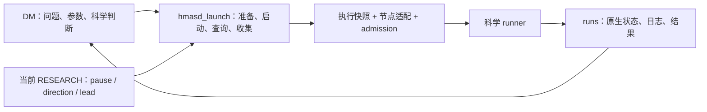

# 用稳定脚本支持 LLM 研究协作：设计草案 v1

日期：2026-09-17。Owner 请求的设计稿；尚未采纳、尚未实施，不是新的治理来源。
研究暂停、现行宪章、冻结实验和现有运行行为保持不变。Remember、Claude 用户设置与记忆行为不在本次修改范围。

## 1. 目标与判断

保留 `run` 脚本的优点：输入明确、执行可复现、状态可查询、失败能恢复；将重复的机器操作交给代码，让 LLM 集中处理问题、实现、比较和解释。

建议形成一个简单协作契约：**LLM 提出一次具体运行请求；脚本完成机械准备与启动，返回可恢复的原生句柄；LLM 根据事实继续工作。** 常规路径不要求额外填写启动表、不要求每一步审批，也不要求为了满足工具格式另建一套科研记录。

降低阻塞的办法是减少检查与真实风险之间的间接关系。暂停必须阻止新实验；无关文档未提交不应阻止从已发布快照执行。进程状态未知必须阻止重复启动；它不应阻止读日志、修代码或处理另一项独立工作。

依据是现行 [Constitution](../../project/OPERATING_CONSTITUTION.md) §§2–9：DM 负责端到端研究，工具事故优先修工具，按 fits 计量，只有 NOTES/runs/CLAIM 三种研究记录，不增设常设治理手续。

## 2. 保留什么，收窄什么

| 当前能力或约束 | 设计取舍 |
| --- | --- |
| `hmasd_run.py` 的 manifest、原生进程核对、未知不重跑 | 复用这些语义和已验证的底层函数；冻结对象继续使用其原 SHA 的接口，不整体复活旧审批规则 |
| 新 `hmasd_launch.py` 的 fresh preflight、runner admission、真实退出记录 | 保留，作为新入口的执行基础；不再增加第三套并行 launcher |
| 作者工作树全局干净 | 改为执行快照干净且绑定已发布 SHA；作者可以继续编辑，脏改动不会自动进入运行 |
| 整份 RESEARCH 与发布版本字节相同 | 校验与该次启动相关的 pause、direction、active state、lead；无关说明变化不拒绝 |
| 每次让 LLM 手写 wrapper、核对多份回执 | 用一个命令完成。前置诊断可选；启动自身不能依赖 LLM 已手工检查 |
| 重复调用一律报错 | 同一请求返回已有状态与句柄；绝不因此产生第二个进程 |
| 每个故障都再加规则 | 可达缺陷先补代码与对应回归。真实决策冲突才交回 DM/owner |
| Reviewer、Pro、Implementer | 保留现有职责与触发条件，不串成每项工作的必经流水线 |

代码现状依据：[旧 run](../../../scripts/hmasd_run.py)、[当前 launcher](../../../scripts/hmasd_launch.py)、[runner guard](../../../scripts/hmasd_admission.py)。当前 launcher 的全树检查、整份控制文件比较和同节点 claim 范围属于本稿拟改进点，不将它们描述为已经解决。

## 3. 三个实现部分，只有一个日常入口



**科学 runner** 负责参数校验、环境/模型、训练/评估及结果输出。它在科学副作用之前调用 guard；不实现 Git、SSH、暂停解析和重试决策。不要求每个 runner 重复开发一套 supervisor。

**执行代码** 负责 source snapshot、当前状态检查、幂等、节点资源检查、detached supervisor、原生身份和原子状态写入。节点差异留在小型适配代码：配置解释器、路径、启动、身份查询、文件收集。当前 Windows 原生 supervisor 已有证据；Linux/WSL 适配需要单独验证，不能由配置存在推断可用。

**研究方法** 继续由现有 skills 描述。L0 留在既有 NOTES 条目，委派消息携带必要范围和契约；工具不会要求新增 L0 文件、交接包或审批文件。

## 4. 建议的命令接口

以下为拟议接口，不是当前已支持的命令，也不是暂停期间的运行指令。继续扩展 `scripts/hmasd_launch.py`；已有 `launch` 保留兼容，不改变冻结调用。

```text
python scripts/hmasd_launch.py check --direction <id> --sha <published-sha> --node <node>

python scripts/hmasd_launch.py launch
  --direction <id> --sha <published-sha> --node <node>
  --output runs/<id>/<tag>
  -- scripts/run_<object>.py <scientific-argv>

python scripts/hmasd_launch.py status runs/<id>/<tag>
python scripts/hmasd_launch.py collect runs/<id>/<tag>
```

- `check` 只诊断，不创建 run、claim、进程或修改工作树；输出检查范围和证据时间，不发放可跨时间复用的准入。缺少远端信息报 unknown，不假装通过。
- `launch` 自动获取/构造已发布 SHA 的隔离执行快照，核对已有请求并在实际节点重新检查与放行。快照是执行实现细节，不是每个方向必须维护的新作者分支。
- `status` 查询同一操作，返回已记录事实和当前原生进程核对结果。连接失败保持 unknown，不能宣布 failed 或成功。
- `collect` 只收集该运行已产生的输出，校验完整性；重复调用不重跑、不覆盖冲突的已收集证据。不默认删除远端输出，也不把 exit 0 转成科学结论。

默认提供简明文本，可选 JSON；两者由同一结果对象生成。常规启动不要求先运行 `check`。不自动 commit 或 push 作者修改；未发布输入应直接指出缺失条件，LLM 按既有 Git 授权完成后重试。

lead 从当前状态读取以减少重复输入；显式 `--lead` 可作为调用方的期望值断言。读取到一个字符串不证明调用方身份，角色责任仍依赖运行上下文；不将该字段包装成身份认证。

## 5. 准入只检查实际启动所需的事实

| 检查 | 何时拒绝 | 不扩大成什么 |
| --- | --- | --- |
| 当前 owner pause、方向状态与 lead | 暂停、状态未知、方向不适用、明确职责冲突 | 不要求无关方向的文档或进程全部正常 |
| 输入身份与可取得性 | 请求 SHA 未发布、执行快照不符、所需 artifact 缺失或摘要不符 | 不要求作者工作树全干净、不要求 SHA 必须是 main 最新提交 |
| 原操作与重复启动 | 已有 live/unknown 请求无法排除重复 | 不禁止观察、收集或其他独立代码任务 |
| 实际节点与内存 | 必需能力缺失、fresh memory preflight 不通过 | 不把估计耗时或非必需 telemetry 变成普遍拒绝条件 |
| runner 绑定 | admission 缺失、过期、错配、重放 | 不声称抵御同用户任意源码修改 |
| 结果目录 | 与另一请求冲突或已有证据无法安全复用 | 不让“换一个输出 tag”成为绕过原操作的办法 |

检查顺序优先返回已有请求；已有请求的观察不因当前暂停而失效。只有要产生新进程时才执行完整准入。阻塞返回机器可读的错误码、相关路径/句柄及具体恢复动作；不笼统要求“请 owner 批准”。

示例：`SOURCE_UNPUBLISHED` 指出 SHA；`RESOURCE_UNAVAILABLE` 给出实际测量；`OPERATION_UNKNOWN` 返回原 handle 和查询命令；`OWNER_PAUSED` 才明确说明需 owner 恢复研究。授权缺失、资源不足与未知状态不能共用一个 vague blocked 文案。

科学预算、matched-information 比较器、确认的 prewritten rule 仍由 DM 按宪章负责。CLI 的 schema 通过不证明科学有效，也不自动授权额外 fits。

## 6. 输入稳定与当前权限分别处理

源码从指定已发布 commit 构造可复用的执行快照；不能偷用作者 checkout 的未提交代码。快照应禁止或隔离后续作者写入，记录实际解释器与依赖版本。SHA 固定不等于环境完全固定；科学契约指定的 dtype/device/RNG 等仍需保留。

checkout 外的 checkpoint、数据、前一阶段 summary，只为本次真正消费的文件记录并核对摘要。声明可来自已有 runner 配置或对象契约，实际解析值写入运行 manifest，不增设手填输入台账。无法识别的动态外部依赖应明确作为未覆盖项；科学上必需的输入未绑定时拒绝该运行。

当前暂停与 lead 不能取自冻结快照。授权检查使用规范控制来源，语义比较只覆盖相关字段，但要记录取证版本。格式不明或字段重复拒绝；不能通过“宽松解析”猜测恢复。

不使用陈旧缓存解决控制源不可达：新启动等待控制源可验证；本地已有 handle 的观察与代码工作继续。最终放行前仍重读本地当前相关状态并做 actual-node preflight。此检查不是跨节点实时撤销协议；暂停自动终止已有运行不在本稿范围，停止在途运行需要单独明确动作。

## 7. 幂等和恢复：同一个请求有稳定身份

区分三个概念，避免把所有问题压进一个 SHA/argv 哈希：

- **请求身份**：一次已提出的运行请求。相同请求重试返回原记录；响应丢失不产生新尝试。
- **输入摘要**：真实执行的代码、科学参数、必要 artifact 摘要。相同请求携带不同摘要时拒绝，不悄悄改写旧请求。
- **执行尝试**：实际创建的子进程及其原生身份。只读的请求重放不会增加尝试。

首版可用规范化的 direction + run tag 作为请求键，并增加同科学输入的重复检测；输出目录拼法不是科学输入。参数规范化基于 runner 已解析的结构，避免仅靠字符串猜测 `--seed=1` 与 `--seed 1` 是否相同。基础设施自己的请求键和 claim 由脚本维护，不是新的研究台账。

已结束的相同输入若要重新训练，必须形成明确新尝试并遵守剩余额度，保留旧结果和重跑原因；脚本不能自动换 tag、换 SHA 或清理 claim 来放行。明确的训练前失败允许重试，但旧错误仍保留。训练是否开始无法确认时不自动退还 fit，交 DM 核对；开始训练的技术失败仍消耗 fit。

跨节点重复不能靠各自本地锁保证。建议让同一规范控制仓库通过已有本地/SSH 命令原子保留请求，返回绑定目标节点的短期准入；不另建常驻服务、数据库或人工 registry。节点不可达或 dispatch 丢失时，该请求保持 unknown，重新派发前先核对原请求。源节点 claim 和执行节点句柄的交互需有并发与故障注入测试。

在跨节点能力完成前，明确保留当前“同 node / Git common directory”的限制；不宣称全局 exactly-once。科学副作用与状态文件不能普遍构成一个事务：遇到临界点崩溃宁可保留未知，不凭租约到期就自动再跑。

## 8. 状态是事实，不是另一个审批流程

运行制品继续放在 `runs/<direction>/<tag>/`。manifest、status、stdout/stderr、process-exit 和现有科学输出由脚本维护，NOTES 只引用并解释；不要求 LLM 手抄所有字段。

输出分别表达：

| 维度 | 示例 | 含义 |
| --- | --- | --- |
| admission | refused / accepted / unknown | 是否已可靠确认放行 |
| execution | not_started / running / exited / unknown | 原生进程事实；exited 附实际 exit code 与身份 |
| artifacts | absent / partial / complete / invalid / unknown | 是否满足该 runner 的输出契约 |
| 科学解释 | DM 在 NOTES 中判读 | 正面、负面、不确定或技术失败，不由退出码代替 |

例如 `execution=exited, exit_code=0, artifacts=partial` 不能写成成功实验；远端掉线也不能把 `running` 改成失败。`collect` 不提供通用科学 promote 命令。缺少非必需资源遥测按既有规则标记 resources_unmeasured，不否定与资源主张无关的结果。

## 9. LLM 的正常工作路径

DM 在已有 NOTES 条目中说明问题、对照和 fits，直接实现或按需要委派。相关检查与必要独立 review 通过后，提交、发布确切输入，发出一个 launch 请求。工具返回后观察已有 handle、收集结果、按预写规则解释；只有确认工作才需要 CLAIM，冻结对象使用原有契约。

Root 不逐步批准实现、测试和启动；Monitor 不裁决科学；Pro 不成为每次代码修复后的等待点。文档修改由作者检查，不自动新增 Reviewer。研究暂停期间可以修工具、写设计和运行无研究结果的工程夹具；不能借工程标签启动真实训练。

异常只阻塞其依赖项。例如远端内存不足时仍可审代码和读取旧结果；传输 Send unknown 时继续观察原对话，不改 key 重发；某一个文档链接失效时先判断是否缺少本次决策必须的依据，不停止整个项目。

## 10. ECC 的借鉴范围

借鉴 `doctor` 的 missing/drifted/unverified 分类、回放 fixture 的内容绑定与无真实调用、跨运行时适配对“指令/原生能力”的区分。将它们用于已有工具的诊断、测试和说明，不引入完整 ECC 控制面。

首次实现只做运行相关的按需 `check/status`，不扫描所有插件或自动修改用户设置。需要比较真实故障序列时再扩充回放夹具，不为所有工具先造统一框架。Remember 和 Claude 记忆调整仍仅交付独立报告。

ECC 参考：本机 `C:/Projects/ref-lib/ECC`，审阅版本 `dd6ee538`；相关源为 `scripts/lib/install-lifecycle.js`、`scripts/lib/eval-harness/replay.js`、`scripts/lib/harness-adapter-compliance.js`。这些是设计参考，不是 HMASD 的运行依赖或治理来源。

## 11. 最小实施次序与验收

1. **先补观察和可恢复返回**：基于现有 manifest/原生身份实现 status；同请求重试返回原 handle；错误给出具体恢复动作。这一步不放宽准入。
2. **收窄无关阻塞**：自动准备已发布执行快照；只比较相关控制状态；将重复 lead 输入变为可选断言。暂停和 fresh preflight 保持在放行边界。
3. **在真实需求出现时补外部输入与节点迁移**：为实际 consumer 绑定摘要；跨节点启动前实现共享原操作核对。不要等通用框架完成才改善前两步。
4. **同步方法与说明**：正常操作只描述一个启动命令和观察路径。修正 CONTROL_PLANE_GUIDANCE 中残留的手写 PowerShell wrapper 说明，生成 runtime 副本并检查漂移。

验收用无科学训练的受控夹具，至少覆盖实际改动对应的场景：作者有无关脏改动仍可从已发布快照启动；未提交科学修改不进入快照；无关 RESEARCH 文字修改不拒绝、pause/lead 变化拒绝；丢失响应后重试不增加子进程；未知不被改写成失败；exit 0 但输出不全不被当成完整结果；跨节点并发只接受同请求的一次执行或保持未知。

工程 checks 证明执行语义，不证明科学有效。只有改到 core/高风险执行路径才按现行方法做独立 review；不把本草案列为每次实验必须阅读的文档。历史 runner 不批量重写，先选择一个现有 consumer 完成端到端迁移，保留其冻结科学语义。

## 12. 采纳边界

本稿不请求新增角色、审批层、定期报告或新的研究记录；不改变 owner pause、fit 额度、科学最低要求、提交发布和必要 review。按上述范围实施主要是工具和方法变化，不需要为了普通实现选择修改宪章。

本次交付止于设计。后续若要允许未发布结果执行、离线推定恢复、自动超预算重试或自动停止在途实验，这些均超出本稿，不能作为“减少阻塞”的隐含实现。
