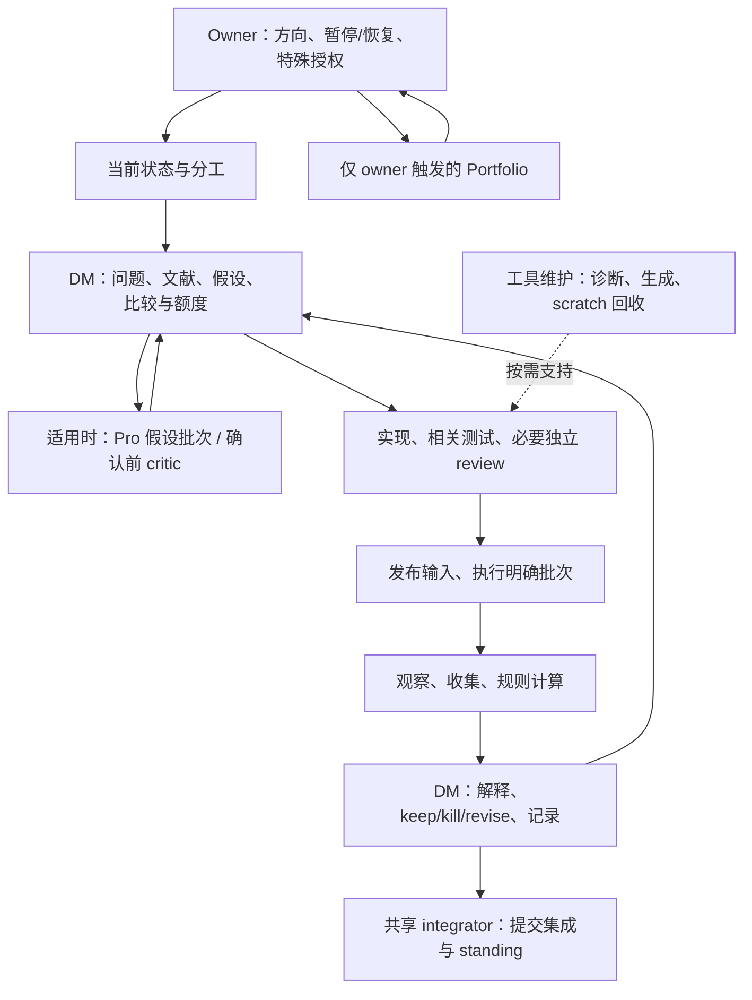
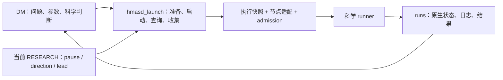

# LLM 研究协作的脚本与 skill 分工：设计草案 v1.3

日期：2026-09-17。Owner 请求的设计稿；尚未采纳、尚未实施，不是新的治理来源。
研究暂停、现行宪章、冻结实验和现有运行行为保持不变。Remember、Claude 用户设置与记忆行为不在本次修改范围。

v1.1 按 owner 后续要求，将已筛选的六项 ECC 借鉴完整纳入设计与实施顺序；它们不再只是参考备注。以下接口和方法仍是待实施方案。

v1.2 补充具体的“脚本承担什么、skill 调用什么”分工，特别说明测试临时目录的自动清理、遗留目录回收与工具 policy 边界。

v1.3 按 owner 要求复核完整工作流，将范围从实验执行扩展到文献、Pro、实现、批次、判读、记录、集成和维护；删除不作为全流程的主要设计对象。v1.2 与 v1.3 在同一设计修订中交付。

## 1. 目标与判断

保留 `run` 脚本的优点：输入明确、执行可复现、状态可查询、失败能恢复；将重复的机器操作交给代码，让 LLM 集中处理问题、实现、比较和解释。

这项分工覆盖完整研究闭环，不只覆盖运行和清理。实验执行采用一个稳定入口；文献、Pro、统计、记录和 Git 分别复用各自已有的工具接口，skill 按实际任务调用。

建议形成一个简单协作契约：**LLM 提出一次具体运行请求；脚本完成机械准备与启动，返回可恢复的原生句柄；LLM 根据事实继续工作。** 常规路径不要求额外填写启动表、不要求每一步审批，也不要求为了满足工具格式另建一套科研记录。

降低阻塞的办法是减少检查与真实风险之间的间接关系。暂停必须阻止新实验；无关文档未提交不应阻止从已发布快照执行。进程状态未知必须阻止重复启动；它不应阻止读日志、修代码或处理另一项独立工作。

依据是现行 [Constitution](../../project/OPERATING_CONSTITUTION.md) §§2–9：DM 负责端到端研究，工具事故优先修工具，按 fits 计量，只有 NOTES/runs/CLAIM 三种研究记录，不增设常设治理手续。

## 2. 保留什么，收窄什么

| 当前能力或约束 | 设计取舍 |
| --- | --- |
| `hmasd_run.py` 的 manifest、原生进程核对、未知不重跑 | 复用这些语义和已验证的底层函数；冻结对象继续使用其原 SHA 的接口，不整体复活旧审批规则 |
| 新 `hmasd_launch.py` 的 fresh preflight、runner admission、真实退出记录 | 保留，作为新入口的执行基础；不再增加第三套并行 launcher |
| 作者工作树全局干净 | 改为执行快照干净且绑定已发布 SHA；作者可以继续编辑，脏改动不会自动进入运行 |
| 整份 RESEARCH 与发布版本字节相同 | 校验与该次启动相关的 pause、direction、active state、lead；无关说明变化不拒绝 |
| 每次让 LLM 手写 wrapper、核对多份回执 | 用一个命令完成。前置诊断可选；启动自身不能依赖 LLM 已手工检查 |
| 重复调用一律报错 | 同一请求返回已有状态与句柄；绝不因此产生第二个进程 |
| 每个故障都再加规则 | 可达缺陷先补代码与对应回归。真实决策冲突才交回 DM/owner |
| Reviewer、Pro、Implementer | 保留现有职责与触发条件，不串成每项工作的必经流水线 |

代码现状依据：[旧 run](../../../scripts/hmasd_run.py)、[当前 launcher](../../../scripts/hmasd_launch.py)、[runner guard](../../../scripts/hmasd_admission.py)。当前 launcher 的全树检查、整份控制文件比较和同节点 claim 范围属于本稿拟改进点，不将它们描述为已经解决。

### 2.1 完整工作流核对与范围修正

本次按现行宪章逐一读取六个共享 SKILL、其直接使用的 references、Root/DM/Implementer/Reviewer/Operator/Monitor/Transport 角色配置、compute/transport 配置、RESEARCH、MAP/GUIDANCE，以及现有 publisher、scratch、统计和 FSD staging 工具。以 RESEARCH 指定的 FSD 冻结卡及 handoff 核对一个真实对象的选择—确认—判读链；handoff 中旧 ledger、PRO_FINAL、强制 Operator 等治理文字不重新获得当前权限。

这是源码与流程审阅，没有启动真实节点任务、发送 Pro、验证活会话采纳或运行历史实验。当前研究仍暂停；两个 active 方向的 NOTES.md 在本 checkout 尚不存在，不能因此要求补写整个历史。首次获授权的新工作按现行记录方式开始，冻结 FSD 继续由原卡承担契约。新 admission 修改已推送本设计分支，不能推断所有运行路径已迁移或 main 已采用。

完整工作流是有选择和反馈的研究闭环，不是一条每项任务必须经过的流水线：



Pro 的两种研究用途沿用现行方法；Portfolio 是另一个 owner-triggered 分支。工程修复、文档调整、读状态和收集既有结果各自从适用位置进入，不重新绕完整闭环。

| 环节 / 主要方法 | 脚本或既有原生工具可承担 | 保留给责任人的选择 |
| --- | --- | --- |
| Owner 指示、Root 调度 / loop-dispatch | 读取方向/lead/pause、列出原生任务返回的真实 handle、识别已集成提交 | 是否恢复、方向选择、是否有值得启动的 reserve idea；不能凭空创建 native agent identity |
| 文献与概念 / scientific-tools references | 查询已验证本地索引、取回指定页面/元数据、报告覆盖范围和出处 | 提问、证据相关性、机制解释与 novelty；检索命中不等于证据充分 |
| 探索与确认设计 / scientific-tools | 展开已指定 arms/seeds/horizon、计算已知工作量、核对重复与缺失输入 | 假设、matched-information、独立单位、终点、预算与停止规则；普通 idea 不新增 owner 审批 |
| Pro 作者 / pro-research-prompt-author | 核对 pinned 路径/节、唯一 question/answer heading、目标为空、确定性消息字段与 key | 选择要问的问题、材料和科学约束；工具不改写已接受问题 |
| Pro 往返 / chatgpt-pro-transport | Agentify 原生 preflight/query/wait；固定操作恢复；Git 答案范围核对与完整正文回收 | 作者完整阅读、采纳/修改/拒绝；原生 MCP 能力已有时不套另一套浏览器 shell |
| 实现与审查 / research-engineering | 根据明确路径取 diff、测试组调用、收集原始检查结果和契约输入 | DM 写简洁 L0、实现或委派、Reviewer 找可达问题、DM 接受；不让脚本给科学实现盖章 |
| 提交与来源准备 / engineering、loop-dispatch | 检查指定路径/commit、取得远端事实、准备快照；在已指定范围内调用 Git | 作者决定发布哪些变更，integrator 决定接受哪些提交；不自动 stage 全仓、stash、改别人 index |
| 批次与阶段 / runner 对象契约 | 执行已列出的 fits、每 fit 准入、按已冻结规则计算 selection、记录阶段输出 | DM 定义批次和适用规则；脚本不能增加 arm/seed、换 endpoint 或追加预算 |
| 观察与交接 / engineering、Monitor | 查询指定 native handle、批量独立检查、增量日志、真实终态、相同事件去重 | 是否更换观察者或干预；任务 dispatch 不冒充 adoption，timeout 不冒充终止 |
| 收集与 reducer / scientific-tools、engineering | 核对所需制品、计算指定统计和固定标签、暴露缺失与实际 exposure | 判断比较是否有效、解释结果范围、keep/kill/revise；不事后选择有利切片 |
| NOTES/CLAIM 与 main/RESEARCH / DM、integrator | 对明确小节生成/应用保留其他字节的补丁，检查目标版本和提交范围 | 正文与状态含义由作者给出；Pro 接管的小节不能并发写，脚本不自动判定方向该归档 |
| Portfolio / portfolio-task | 按指定方向提取已有证据和状态、复用同一 Pro 传输核对 | Owner 触发和裁决，不由批次结束、空闲容量或成本阈值自动启动 |
| 工具和存储维护 / engineering、loop-dispatch | publisher、按需诊断、producer 自清理、针对性临时文件回收、worktree 状态取证 | 哪些历史材料可丢弃、是否移除 worktree；不将维护变成下一实验的普遍前置条件 |

### 2.2 全链路复核后需要避免的误解

1. **脚本不限于安全门禁。** 检索、参数展开、版本取证、阶段选择、统计和局部补丁都是应减少 LLM 重复劳动的实际工作。
2. **已冻结判断可以计算。** FSD 卡的 `select-stage0` 与 `reduce` 本来就应由代码实现，包括 tie order、缺失分支、效应和区间标签。它们执行既定规则，不是脚本自行制定科学结论；DM 仍核对适用性和解释。不能为了“保留判断”要求 LLM 每次手算。
3. **原生能力也是稳定工具。** Codex 原生 task/wait 和 Agentify query/wait 已承担部分机械工作；本项目不再用 shell 仿造这些能力，也不新增无必要的中间层。
4. **检查与审批不同。** helper 返回的文件存在、摘要一致、计数或 diff 是事实；不得将它们变成新证书、全链路完成清单或 Root ACK。相关失败只影响依赖该事实的动作。
5. **不是所有信息都已经结构化。** 先消费 runner 配置、现有 JSON、固定 Git 版本和明确传入的字段；不要求把全部 NOTES/CLAIM 重写成 YAML 才能使用工具。无法机械确定的内容返回具体缺口，由责任人判断。
6. **维护是旁路。** 本次 scratch 可以自动清理；某份无归属的旧临时目录回收失败，不应阻止新的隔离测试或与它无关的研究。保留目录是局部维护结果，不是项目级 blocked。

## 3. 实验执行部分：沿用一个稳定入口



**科学 runner** 负责参数校验、环境/模型、训练/评估及结果输出。它在科学副作用之前调用 guard；不实现 Git、SSH、暂停解析和重试决策。不要求每个 runner 重复开发一套 supervisor。

**执行代码** 负责 source snapshot、当前状态检查、幂等、节点资源检查、detached supervisor、原生身份和原子状态写入。节点差异留在小型适配代码：配置解释器、路径、启动、身份查询、文件收集。当前 Windows 原生 supervisor 已有证据；Linux/WSL 适配需要单独验证，不能由配置存在推断可用。

**研究方法** 继续由现有 skills 描述。L0 留在既有 NOTES 条目，委派消息携带必要范围和契约；工具不会要求新增 L0 文件、交接包或审批文件。

## 4. 建议的命令接口

以下为拟议接口，不是当前已支持的命令，也不是暂停期间的运行指令。继续扩展 `scripts/hmasd_launch.py`；已有 `launch` 保留兼容，不改变冻结调用。

```text
python scripts/hmasd_launch.py check --direction <id> --sha <published-sha> --node <node>

python scripts/hmasd_launch.py launch
  --direction <id> --sha <published-sha> --node <node>
  --output runs/<id>/<tag>
  -- scripts/run_<object>.py <scientific-argv>

python scripts/hmasd_launch.py status runs/<id>/<tag>
python scripts/hmasd_launch.py collect runs/<id>/<tag>
```

- `check` 只诊断，不创建 run、claim、进程或修改工作树；输出检查范围和证据时间，不发放可跨时间复用的准入。缺少远端信息报 unknown，不假装通过。
- `launch` 自动获取/构造已发布 SHA 的隔离执行快照，核对已有请求并在实际节点重新检查与放行。快照是执行实现细节，不是每个方向必须维护的新作者分支。
- `status` 查询同一操作，返回已记录事实和当前原生进程核对结果。连接失败保持 unknown，不能宣布 failed 或成功。
- `collect` 只收集该运行已产生的输出，校验完整性；重复调用不重跑、不覆盖冲突的已收集证据。不默认删除远端输出，也不把 exit 0 转成科学结论。

默认提供简明文本，可选 JSON；两者由同一结果对象生成。常规启动不要求先运行 `check`。不自动 commit 或 push 作者修改；未发布输入应直接指出缺失条件，LLM 按既有 Git 授权完成后重试。

lead 从当前状态读取以减少重复输入；显式 `--lead` 可作为调用方的期望值断言。读取到一个字符串不证明调用方身份，角色责任仍依赖运行上下文；不将该字段包装成身份认证。

## 5. 准入只检查实际启动所需的事实

| 检查 | 何时拒绝 | 不扩大成什么 |
| --- | --- | --- |
| 当前 owner pause、方向状态与 lead | 暂停、状态未知、方向不适用、明确职责冲突 | 不要求无关方向的文档或进程全部正常 |
| 输入身份与可取得性 | 请求 SHA 未发布、执行快照不符、所需 artifact 缺失或摘要不符 | 不要求作者工作树全干净、不要求 SHA 必须是 main 最新提交 |
| 原操作与重复启动 | 已有 live/unknown 请求无法排除重复 | 不禁止观察、收集或其他独立代码任务 |
| 实际节点与内存 | 必需能力缺失、fresh memory preflight 不通过 | 不把估计耗时或非必需 telemetry 变成普遍拒绝条件 |
| runner 绑定 | admission 缺失、过期、错配、重放 | 不声称抵御同用户任意源码修改 |
| 结果目录 | 与另一请求冲突或已有证据无法安全复用 | 不让“换一个输出 tag”成为绕过原操作的办法 |

检查顺序优先返回已有请求；已有请求的观察不因当前暂停而失效。只有要产生新进程时才执行完整准入。阻塞返回机器可读的错误码、相关路径/句柄及具体恢复动作；不笼统要求“请 owner 批准”。

示例：`SOURCE_UNPUBLISHED` 指出 SHA；`RESOURCE_UNAVAILABLE` 给出实际测量；`OPERATION_UNKNOWN` 返回原 handle 和查询命令；`OWNER_PAUSED` 才明确说明需 owner 恢复研究。授权缺失、资源不足与未知状态不能共用一个 vague blocked 文案。

科学预算、matched-information 比较器、确认的 prewritten rule 仍由 DM 按宪章负责。脚本可以展开已声明 fits、核对实际 exposure 并计算已冻结的判读规则；CLI 的 schema 通过不证明科学有效，也不自动授权额外 fits。

## 6. 输入稳定与当前权限分别处理

源码从指定已发布 commit 构造可复用的执行快照；不能偷用作者 checkout 的未提交代码。快照应禁止或隔离后续作者写入，记录实际解释器与依赖版本。SHA 固定不等于环境完全固定；科学契约指定的 dtype/device/RNG 等仍需保留。

checkout 外的 checkpoint、数据、前一阶段 summary，只为本次真正消费的文件记录并核对摘要。声明可来自已有 runner 配置或对象契约，实际解析值写入运行 manifest，不增设手填输入台账。无法识别的动态外部依赖应明确作为未覆盖项；科学上必需的输入未绑定时拒绝该运行。

当前暂停与 lead 不能取自冻结快照。授权检查使用规范控制来源，语义比较只覆盖相关字段，但要记录取证版本。格式不明或字段重复拒绝；不能通过“宽松解析”猜测恢复。

不使用陈旧缓存解决控制源不可达：新启动等待控制源可验证；本地已有 handle 的观察与代码工作继续。最终放行前仍重读本地当前相关状态并做 actual-node preflight。此检查不是跨节点实时撤销协议；暂停自动终止已有运行不在本稿范围，停止在途运行需要单独明确动作。

## 7. 幂等和恢复：同一个请求有稳定身份

区分三个概念，避免把所有问题压进一个 SHA/argv 哈希：

- **请求身份**：一次已提出的运行请求。相同请求重试返回原记录；响应丢失不产生新尝试。
- **输入摘要**：真实执行的代码、科学参数、必要 artifact 摘要。相同请求携带不同摘要时拒绝，不悄悄改写旧请求。
- **执行尝试**：实际创建的子进程及其原生身份。只读的请求重放不会增加尝试。

首版可用规范化的 direction + run tag 作为请求键，并增加同科学输入的重复检测；输出目录拼法不是科学输入。参数规范化基于 runner 已解析的结构，避免仅靠字符串猜测 `--seed=1` 与 `--seed 1` 是否相同。基础设施自己的请求键和 claim 由脚本维护，不是新的研究台账。

已结束的相同输入若要重新训练，必须形成明确新尝试并遵守剩余额度，保留旧结果和重跑原因；脚本不能自动换 tag、换 SHA 或清理 claim 来放行。明确的训练前失败允许重试，但旧错误仍保留。训练是否开始无法确认时不自动退还 fit，交 DM 核对；开始训练的技术失败仍消耗 fit。

跨节点重复不能靠各自本地锁保证。建议让同一规范控制仓库通过已有本地/SSH 命令原子保留请求，返回绑定目标节点的短期准入；不另建常驻服务、数据库或人工 registry。节点不可达或 dispatch 丢失时，该请求保持 unknown，重新派发前先核对原请求。源节点 claim 和执行节点句柄的交互需有并发与故障注入测试。

在跨节点能力完成前，明确保留当前“同 node / Git common directory”的限制；不宣称全局 exactly-once。科学副作用与状态文件不能普遍构成一个事务：遇到临界点崩溃宁可保留未知，不凭租约到期就自动再跑。

## 8. 状态是事实，不是另一个审批流程

运行制品继续放在 `runs/<direction>/<tag>/`。manifest、status、stdout/stderr、process-exit 和现有科学输出由脚本维护，NOTES 只引用并解释；不要求 LLM 手抄所有字段。

输出分别表达：

| 维度 | 示例 | 含义 |
| --- | --- | --- |
| admission | refused / accepted / unknown | 是否已可靠确认放行 |
| execution | not_started / running / exited / unknown | 原生进程事实；exited 附实际 exit code 与身份 |
| artifacts | absent / partial / complete / invalid / unknown | 是否满足该 runner 的输出契约 |
| 规则计算与科学解释 | reducer 返回固定统计/标签，DM 在 NOTES 中判读 | 已冻结数值规则由代码计算；实际适用性、支持范围和后续选择由 DM 判断，不由退出码代替 |

例如 `execution=exited, exit_code=0, artifacts=partial` 不能写成成功实验；远端掉线也不能把 `running` 改成失败。`collect` 不提供通用科学 promote 命令。缺少非必需资源遥测按既有规则标记 resources_unmeasured，不否定与资源主张无关的结果。

## 9. LLM 的正常工作路径

DM 在已有 NOTES 条目中说明问题、对照和 fits，直接实现或按需要委派。相关检查与必要独立 review 通过后，提交、发布确切输入，发出一个 launch 请求。工具返回后观察已有 handle、收集结果、按预写规则解释；只有确认工作才需要 CLAIM，冻结对象使用原有契约。

Root 不逐步批准实现、测试和启动；Monitor 不裁决科学；Pro 不成为每次代码修复后的等待点。文档修改由作者检查，不自动新增 Reviewer。研究暂停期间可以修工具、写设计和运行无研究结果的工程夹具；不能借工程标签启动真实训练。

异常只阻塞其依赖项。例如远端内存不足时仍可审代码和读取旧结果；传输 Send unknown 时继续观察原对话，不改 key 重发；某一个文档链接失效时先判断是否缺少本次决策必须的依据，不停止整个项目。

## 10. 纳入设计的六项 ECC 做法

以下六项都有具体落点。工具能力进入已有脚本和测试；方法进入已有 skills；能力说明进入现有 MAP/GUIDANCE。不安装整套 ECC，不另建角色、审批、常设报表或研究台账。

### 10.1 按需只读诊断

将 ECC doctor 的 missing / drifted / unverified 区分纳入第 4 节 `check`。首版复用已有 publisher 检查、compute 配置读取和 runner 检查，覆盖生成副本、所选节点解释器与必需能力、执行输入以及 guard 接入；不扫描全部用户插件。

每项结果包含检查对象、证据来源与时间、状态、影响范围和具体恢复动作。`unverified` 表示没有足够证据，不等于已坏；原生进程已退出也不等于输出完整。guard 的静态存在检查只能证明检测到调用，不能证明它先于所有科学副作用。

只读检查不安装依赖、不重启服务、不发送消息、不训练、不修改配置。可选的远端只读探测不可达时返回 unknown。诊断结果不保存成必须维护的新文件，也不要求每次实验先单独运行 doctor；启动仍自行执行必要准入。

验收：生成副本缺失、字节漂移、解释器缺失与远端无法验证能分别报告；无关副本的 warning 不阻塞本次科学执行；检查前后源码、配置和运行状态不发生写入。

### 10.2 绑定内容的离线故障回放

在 Agentify 已有传输测试上加入可复用的事件序列夹具，覆盖点击后断线、重启后旧消息撞名、首次绑定后的重复请求、答案尚未完整。启动工具使用同样的故障注入思路覆盖 grant/ack 临界点，但不强求 Python 和 JavaScript 共用一个框架。

夹具绑定版本、工具/事件名、规范化参数及响应摘要。缺失、损坏或不匹配直接失败，绝不回退到真实调用。回放中的“发送成功”只是模拟观察；测试不得调用真实 Send、launch、浏览器操作或网络写入。用明确禁止真实调用的替身和调用计数断言验证这一点，不把 mock 声称为 OS 沙箱。

从实际故障提取夹具前去除凭据和无关私人内容；只保存复现必要的字段，不复制完整私人会话。对外部操作的新修复优先增加对应故障序列，而不是要求所有工具先接入通用事件系统。

验收：fixture 缺失/摘要错误会拒绝，真实发送与启动调用数为零；恢复原操作不会换 key 重发；部分答案不会被归档为完整答案。

### 10.3 说明能力究竟由哪一层实现

在现有 CONTROL_PLANE_MAP 的相关路由中区分原生支持、适配支持、仅指令支持和参考设计，并注明支持范围、直接验证方式及尚未验证的部分。分类表示实现方式，不是权限等级；写入配置不能自行提高授权。

例如：publisher 的 drift=0 证明生成副本一致；runner 缺少 admission 被拒绝证明该入口的运行时行为；活会话是否采用新方法需独立事实。三者不能互相代替。Windows 测试通过不填成 WSL 已验证，历史 runner 未迁移也不列为已受保护。

这些说明只在相关能力变化时维护，不建立全会话 ACK registry，不让 agent 每次任务重新认证全部运行时。Remember/Claude 记忆相关发现继续只写独立报告，不改其行为。

验收：MAP 能直接回答“谁执行这个约束、证据是什么、覆盖哪个入口”；无法核实的项明确标记未验证，没有由文本承诺推导出的运行时保证。

### 10.4 按缺口逐步补充上下文

纳入 engineering 的 Implementer/Reviewer 交接方法和 Pro 作者的 reading context。初始任务携带问题、负责范围、入口、必须保持的语义、验证方式，以及直接相关的文件/节/版本；不默认复制整个会话或完整历史控制面。

执行者沿实际调用链读取依赖，指出具体缺口并补充来源；只读范围不被编辑所有权限制。请求方无法自行取得的关键材料才向父任务询问，其他独立工作继续。Pro 不继承本地上下文，作者须把必需方法或可取得的固定版本链接展开到原问题中；发送后发现缺口仍按既有单次发送与核对规则处理，不能自动补发。

不照搬 ECC 的固定检索轮数、相关性分数或专职检索角色，不新增上下文包。必要契约不能以节省 token 为由省略。

验收：用一个存在间接依赖的既有代码任务和一个 Pro 问题样例作人工走查，检查材料能否支持正确判断；不通过真实 Send 或研究启动验收，也不把关键词出现视为方法有效。

### 10.5 修改 skill 时保留内容去向

纳入现有 CONTROL_PLANE_GUIDANCE 的维护说明：合并要指出目标位置与保留内容；退役要指出具体缺陷以及哪个现有方法承接；保留或改进要说明实际用途和修改理由。普通提交说明即可承载，不产生 stocktake 数据库、定期巡检或逐文件审批表。

只检查此次改变的主题及直接消费者。用当前任务情境核对触发条件、职责、可执行步骤和依赖来源；现有 publication/alignment 检查用于发现生成和结构问题，不能代替语义判断。不因 skill 行数、使用频次低或未达到固定评分就删除科学方法。

验收：以 wrapper 向稳定 launcher 的迁移为例，核对旧步骤哪些被代码吸收、哪些由现有方法保留、哪些明确退役；MAP/GUIDANCE 不再保留冲突的手写 wrapper 要求。

### 10.6 从失败类型形成可证伪的研究问题

纳入 scientific-tools 的结果阅读方法：总体指标之外，按与当前假设有关的条件检查失败簇，区分模型局限、环境/数据错误、采样与仪表缺陷，以及比较器的信息差异。对 HMASD，可根据实际问题选用任务负载、成员变化、历史长度或技能持续时间等条件；不是每次都计算全套切片。

先解释错误机制，再提出最小、可证伪的下一项实验，不因某个切片差就默认增加模型复杂度。代码错误形成针对性回归；科学上有意义的切片与假设写入既有 NOTES。事后发现的切片保持探索性质，不替换冻结确认终点，也不自动授予追加 fits。

验收：用已有且可取得的结果做只读示例，区分观察事实、机制假设和下一步检验；记录选择切片的依据和混杂。不为验收恢复研究，也不要求每个不利样本都形成单独文件或永久测试。

### 10.7 来源与不引入的内容

ECC 参考：本机 `C:/Projects/ref-lib/ECC`，审阅版本 `dd6ee538`。对应来源依次为 `scripts/lib/install-lifecycle.js`、`scripts/lib/eval-harness/replay.js`、`scripts/lib/harness-adapter-compliance.js`、`skills/iterative-retrieval/SKILL.md`、`skills/skill-stocktake/SKILL.md`、`skills/mle-workflow/SKILL.md`。这些是设计参考，不是 HMASD 的运行依赖或治理来源。

不引入 ECC2 daemon/session 数据库、配置晋升 registry、自动记忆学习、全面 hook 安装、通用覆盖率/行数门槛。若将来确需复制具体源码，实施时核对该文件许可和归属并保留必要声明；当前采用的是方法设计。

## 11. 哪些工作交给脚本，skill 如何调用

### 11.1 分工原则

适合脚本承担的工作具备明确输入、可检查的对象范围、确定的机械步骤和可验证的完成条件；重复发生或错误代价较高时尤其值得固化。脚本消除重复推理，不替代本来需要人或 DM 作出的价值判断。

例如，“删除本次测试自己创建且已释放的 scratch”可以自动化；“这些旧结果大概没用了”不是足够的删除条件。“按指定输出契约验证 summary”可以自动化；“这个结果足以支持论文主张”仍是科学判断。

skill 只说明触发时机、入口、必要参数、结果如何解读及异常后的分支，不再教 LLM 临时拼接删除命令、SSH 启动链或多段 Git 校验。脚本内部做路径验证、锁、原子写入、摘要、解释器选择、幂等和错误分类；不是用脚本包装一段任意 shell 来获得更大权限。

### 11.2 具体分担清单

下表区分已有实现与拟扩展能力；列入设计不表示全部已可直接调用。

| 工作 | 交给脚本的部分 | skill 保留的判断 / 入口现状 |
| --- | --- | --- |
| 单次测试 scratch 分配与回收 | 创建唯一目录、标记归属、正常结束时清理自己的目录、清理失败保留路径 | engineering 选择相关测试；已有 `tests/conftest.py` 自动分配与清理，生命周期标记/锁待增强 |
| 遗留测试临时目录回收 | 在固定根下检查归属、进程状态、链接和 tracked 内容，预览或删除明确目标，逐项报告 | 不判断科学证据可丢弃；已有 `scripts/cleanup_test_scratch.ps1`，按 11.3 收窄和补强 |
| 测试调用 | 根据明确的测试组选择已有解释器，调用 pytest，保留真实返回码并回收本次 scratch | engineering/Reviewer 决定应检查什么；拟增加薄测试入口，复用 conftest，不根据 diff 猜一个“必然充分”的测试集合 |
| 执行环境与发布诊断 | 检查生成副本、配置、解释器、节点能力和输入发布情况，输出具体缺项 | 是否修环境、换节点以及科学语义是否允许由 DM 判断；拟议 `hmasd_launch.py check`，复用现有检查函数 |
| 执行输入准备 | 从指定已发布 SHA 准备快照、解析必要外部文件、核对摘要 | DM 选择科学输入；snapshot 准备待扩展，已有 `hmasd_file_fingerprint.py` 可评估复用，不自动收录作者未提交修改 |
| 启动与原操作恢复 | fresh preflight、claim、detached supervisor、短期 admission、同请求返回已有 handle | DM 决定实验与 fits；已有 `hmasd_launch.py launch` 和 guard，同请求状态返回等按本稿扩展 |
| 进程观察 | 核对 PID 与出生身份、检查真实退出证据、读取增量日志、保留 unknown | Monitor/DM 判断是否干预；拟议 `status`，复用现有原生身份与旧 run 的 reconcile 语义 |
| 结果收集和完整性检查 | 按该 runner 输出契约收集文件、核对摘要、识别缺失/冲突、重复调用不覆盖不同证据 | DM 解释结果并决定后续；拟议 `collect`，不自动删除来源或宣布科学成功 |
| 传输键与交付核对 | 确定性生成 stable key、观察已接受操作、验证固定版本问题和实际答案 diff/完整性 | 作者决定问题和上下文；Transport 执行已授权发送。复用 Agentify API，重复的 Git/heading 检查可抽成只读 helper，不另造浏览器发送链 |
| 控制文件发布 | 从唯一源生成副本、保留原生 metadata、检测 drift | 作者选择方法内容；已有 `tools/publish_claude_control.py`，skill 直接引用现有入口，不手工编辑生成副本 |
| 故障回放与制品校验 | 加载内容绑定夹具、禁止真实外部调用、验证恢复分支与结果 schema | 实现者选择要复现的故障；复用 Agentify/launcher 测试，按 10.2 补可复用夹具 |
| 文献候选定位与来源提取 | 调用现有库索引，按显式查询返回真实 corpus 的候选、页/节、版本和覆盖范围 | scientific-tools 判断相关性与证据；复用 My-lib/Inst-sci 已验证入口，不把 synthetic fixture 或索引标签当科研事实，不另建索引服务 |
| 研究汇总与绘图 | 读取指定 run 集合、检查字段与 seed、输出确定性表格/图形及来源 | DM 选择样本总体、统计方法、切片与解释；已有 skill 内 `scripts/summarize_runs.py`，仅描述性统计，不自动挑选有利结果 |
| fits 展开、阶段选择与固定 reducer | 从已声明批次生成明确调用列表、累计已知 exposure、执行 prospectively fixed selection/判读公式 | scientific-tools/engineering 选择契约；FSD 新对象要求 `select-stage0`/`reduce`，仍待实现，不能因工具可执行就恢复研究 |
| Pro 来源与消息准备 | 在给定 source SHA 检查路径/heading、渲染作者已提供的字段、计算固定 key；不发送 | pro-research-prompt-author 选择科学上下文；拟抽窄 helper，不恢复已退役的 packet/registry/renderer 工作流 |
| 记录局部写入 | 接受作者给出的正文和预期目标版本，检查 heading 唯一与写入范围，应用保留其余内容的补丁 | DM/integrator 保有 NOTES/RESEARCH 写权，fallback 写入需先排除已落地答案；不能自动改写科学结论或偷偷跨 checkout 写入 |
| Git 集成取证与显式集成 | 检查 named commits 是否已集成/发布、显示精确 diff，在 integrator 自己 checkout 对明确指定提交操作 | loop-dispatch 的 acting integrator 接受变更并决定冲突解决；已有 Git 原生命令先复用，不造自动合并/自动 stash 服务 |
| worktree 回收取证 | 列出唯一提交、remote 可达性、脏文件和已知进程/传输依赖 | loop-dispatch 判断是否真的可移除；与测试 scratch 删除完全分离，不复用临时目录删除接口 |

独立的窄工具比一个能执行所有 shell 的 mega-script 更合适。只有调用方式和失败处理重复到足以产生收益时才抽取 helper；一次性的简单只读命令不强制包脚本。

工具按现有职责组织即可：执行与制品围绕 launcher；测试与 scratch 围绕 conftest/测试工具；Pro 的机械校验围绕 Agentify 和少量 Git/section helper；科学计算留在对应 runner/analysis；控制发布使用现有 publisher。上表不是要求创建同样数量的新脚本或再设一个总调度器。

### 11.3 临时目录清理的具体设计

**现状。** [conftest](../../../tests/conftest.py) 为每次 pytest 在 checkout 的 `temp/` 下分配独立目录，正常 teardown 时尝试清理，失败报告路径。[恢复脚本](../../../scripts/cleanup_test_scratch.ps1) 默认预览，限制到单次测试目录，拒绝链接/junction 和 Git tracked 内容，并在可能有 native pytest 运行时拒绝删除。提交 `8ba678352` 记录的是语法/预览验证通过，删除验证被工具 policy 阻止；不能把它报告成已验证可删除或不会被拒绝。

**日常路径：生产者自清理。** 测试、回放或辅助工具创建 scratch 时，由共享小 helper 自动保存本次运行 ID、checkout 身份和进程出生身份，并持有该目录生命周期锁；这些是可丢弃的机器元数据，不由 LLM 填写，不是研究记录。生产者在 finally/正常 teardown 中回收自己创建的目录；原子提交所需诊断输出后才释放清理资格。若要保留失败夹具，明确标记保留并返回位置，而不是只凭“测试结束”删除唯一诊断证据。

**异常遗留：只回收可证明可丢弃的目录。** 稳定清理入口默认预览；删除阶段只能选择已识别的 run ID/单次目录，不能传任意绝对路径、通配符或 shell 片段。根目录由脚本自身的 checkout 确定，仅覆盖指定测试 scratch 子树。`runs/`、源码、`tests/fixtures/`、checkpoint、用户记忆和 Git worktree 不属于该清理能力。

删除前由代码完成以下检查，不要求 LLM 逐项手工执行：

1. 实际绝对路径位于允许的根下且不是根本身；校验祖先和目标，拒绝 symlink、junction、reparse point、路径逃逸及 tracked 内容。路径名称像 `pytest-*` 或目录很老都不构成归属证明。
2. 元数据确认为本 checkout 的测试产物；获得该运行的清理锁，核对原生进程及仍使用此目录的子进程。活跃或无法排除在用则跳过；不杀进程来制造可清理状态。仅 PID 消失不证明后代已经停止。
3. 明确保留的失败夹具和证据跳过；旧的无标记目录只能列出“归属未验证”，不得自动补标记再删。已有明确的针对性处置授权才可走单独的遗留处理，不自动扩展到所有旧 temp。
4. 从预览到删除可能发生变化，执行时重新核对对象身份、边界与锁；发现变化即保留。使用单一运行时的文件 API，不在 PowerShell 与 cmd 之间拼接删除语句。对不协作的同用户进程仍不宣称绝对防竞争。
5. 返回每个目标的 deleted / already_absent / retained / busy / unverified / failed 及理由。重复调用不存在的同一目标成功返回 already_absent；权限或共享锁错误保留原目录，不自动接管 ACL、提权或切换另一套删除工具。

当前脚本以“可能有任何 pytest 在运行”作为全局停止条件，较保守。具备上述每运行归属与生命周期证据后，才可收窄到目标目录；不能只删除全局 busy 检查就宣称支持并发回收。默认全目录枚举只用于预览，拟扩展版本的批量删除只能处理显式选择且逐项通过检查的目标，不能把无参数 `-Delete` 解释成整个 temp 的自动清空。

这里的“测试文件”仅指该次测试生成的临时副本。删除真实测试源码、可复用 fixture、历史结果或 worktree，需要各自明确的维护任务与证据，不能被临时清理入口承接。

验收在测试自己创建的沙盒树中进行：根路径/父路径/链接拒绝；tracked 文件保留；另一在用 run 保留；无标记目录保留；被标记保留的失败证据保留；并发回收不会误删新对象；已删除目录重复调用稳定；同批某项未知不把其他项的状态伪造为成功。测试不得针对用户当前旧 scratch 做破坏性验收。

### 11.4 skill 中可直接使用的调用契约

每个被引用的工具只需给出：何时调用、稳定入口、必要输入、实际副作用、输出与错误分支。共享正文只维护一次；skill 引用该入口，不把实现细节复制成另一套操作步骤。

现有入口示例（供方法引用，不在本次设计任务执行删除）：

```powershell
# 默认只读预览。生产者正常清理仍由 conftest 自动完成。
pwsh -NoProfile -File scripts/cleanup_test_scratch.ps1

# 已核实属于当前任务、已结束且可丢弃的明确目标；不是任意路径删除接口。
pwsh -NoProfile -File scripts/cleanup_test_scratch.ps1 -RunDirectory 'temp/tests/<invocation>' -Delete

# 现有发布入口；解释器使用已有合适工具环境。
<tools-python> tools/publish_claude_control.py --check
```

清理的拟扩展接口仍需实现上述归属、每运行锁、幂等和显式选择语义；不能因为当前 CLI 已存在就假定这些都具备。正常测试使用 tmp_path，通常完全不需要 LLM 再调用删除命令。

拟议的测试入口允许 `--group science|control -- <explicit-test-paths>` 一类结构化输入：选择已经配置的解释器，不安装依赖，不跨环境偷换，不吞掉 pytest 返回码。skill 仍负责选择与改动相称的测试；入口不能把单个 smoke 宣称为全面验证。

对所有工具，未满足真实授权条件时停止相应副作用；已在任务范围内的常规操作不再制造一次人工确认。失败返回可采取的动作，而不是要求 LLM 反复改写命令猜测如何通过。

### 11.5 用真实工作走一遍调用关系

**一次新探索。** 在 owner 已恢复且方向已分配的前提下，DM 按需查询本地文献、完成现行 Pro 假设批次、选择比较并写 NOTES；工具只帮助核对来源和完整答案。DM/Implementer 写代码，skill 调用明确测试组，conftest 自动处理 scratch；必要 review 后提交发布，launch 执行已指定 fits，status/collect 返回事实，summary/reducer 做指定计算，DM 写解释，Root 在自己的 checkout 集成 named commits 并更新 standing。没有另外的清理审批、工具清单审批或每步 Root ACK。

**FSD 冻结对象。** 当前暂停仍阻止执行。未来明确恢复后，沿原卡实现中央输入 CF、执行相关 tests/review，工具展开六个 stage-0 fits；完整有效时由 `select-stage0` 按固定最大均值及 tie order 选 λ，在任何 stage-1 fit/panel 前固定选择。缺失返回 `SELECTION_INCOMPLETE` 并结束依赖链，不自动填补。完整 selection 后执行原计划十个 confirmation fits，`reduce` 计算固定 endpoint/区间/标签，DM 解释而不再额外发一个例行 Pro 结果审查。批次全部已授权时阶段执行可由有界脚本承接；每次实际启动仍遵守当前暂停和资源检查。

**仅维护代码或清理测试残留。** 从 engineering 的相关检查进入，不读全方向历史、不发 Pro、不申请 fit。测试生产者先自行清理；留下的一个 unknown scratch 只列明保留原因，不阻塞其他不依赖它的测试或文档修改。

### 11.6 脚本与 policy 的关系

脚本的价值是让动作范围更小、可检查、可复用且有回归证据，从而减少误删和因临时 shell 拼接带来的歧义。**脚本调用仍受相同工具权限和审批检查；不能承诺不会被拒绝，也不能以封装动作来绕过已发生的拒绝。**

若自动审批拒绝，先区分实现确实过宽、目标缺少归属证据，还是平台不允许该动作。允许在原授权内修正真实的范围缺陷；不能改用 Python、另一个 shell、编码命令或不同脚本名称来执行同一个被禁止动作。仍无法安全完成时保留目录，报告被拒绝的动作与给出的理由；不把 cleanup failed 说成已清空。

## 12. 最小实施次序与验收

1. **先复用，再补高频机械缺口**：六个 skills 标明已有 publisher、统计脚本、conftest、Agentify 和原生任务工具的正确入口；补 status/check/同请求返回、Pro 来源与答案范围的只读校验，以及实际重复发生的测试调用/残留清理缺口。落实 10.1 和第 11 节；不要求先建完整工具框架，不把清理排成科研前置工序。
2. **同步加入故障回放**：以已有 Agentify 故障和启动临界点为首批夹具，落实 10.2；它与运行代码的对应修复一起验证，不作为整个项目的新启动前置关卡。
3. **收窄无关阻塞**：自动准备已发布执行快照；只比较相关控制状态；将重复 lead 输入变为可选断言。暂停和 fresh preflight 保持在放行边界。
4. **同步全链路方法**：落实 10.3–10.6 和 2.1 的调用关系，修改现有 MAP/GUIDANCE 及六个 skills 的实际受影响段落。每个 skill 只引用自己使用的入口；说明哪些是现成工具、哪些新能力已实现，未实现接口不写成可运行步骤。修正残留 wrapper 说明，生成 runtime 副本并检查漂移。方法修改可与前述工具工作独立推进，不等待全部实现。
5. **在真实需求出现时补外部输入与节点迁移**：为实际 consumer 绑定摘要；跨节点启动前实现共享原操作核对。不要等通用框架完成才交付前四项。

验收用无科学训练的受控夹具，至少覆盖实际改动对应的场景：作者有无关脏改动仍可从已发布快照启动；未提交科学修改不进入快照；无关 RESEARCH 文字修改不拒绝、pause/lead 变化拒绝；丢失响应后重试不增加子进程；未知不被改写成失败；exit 0 但输出不全不被当成完整结果；跨节点并发只接受同请求的一次执行或保持未知。

工程 checks 证明执行语义，不证明科学有效。只有改到 core/高风险执行路径才按现行方法做独立 review；不把本草案列为每次实验必须阅读的文档。历史 runner 不批量重写，先选择一个现有 consumer 完成端到端迁移，保留其冻结科学语义。

六项 ECC 借鉴分别按 10.1–10.6 的行为验收；文档中的方法采用人工情境走查和来源/消费者核对，不要求用真实研究或模型自动打分证明。实现交付说明标明哪些已完成、哪些仍是设计，不以“已借鉴 ECC”代替证据。

## 13. 采纳边界

本稿不请求新增角色、审批层、定期报告或新的研究记录；不改变 owner pause、fit 额度、科学最低要求、提交发布和必要 review。按上述范围实施主要是工具和方法变化，不需要为了普通实现选择修改宪章。

本次交付止于设计。后续若要允许未发布结果执行、离线推定恢复、自动超预算重试或自动停止在途实验，这些均超出本稿，不能作为“减少阻塞”的隐含实现。
