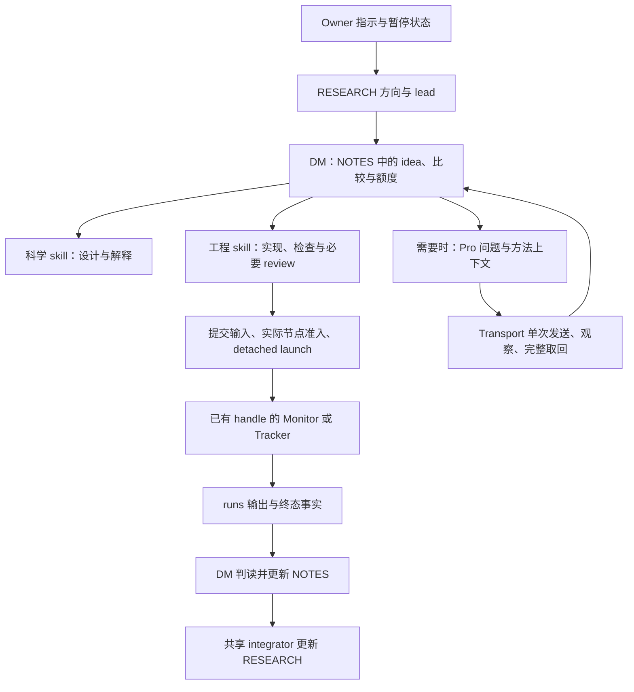

# HMASD 控制面使用与维护说明

这是 owner 请求的解释性手册，与 [MAP](CONTROL_PLANE_MAP.md) 配合使用。它解释现有机制，
不是第二份治理文本、实验记录类型、审批清单或每个任务的必读材料。
当前 owner 指示与 [OPERATING_CONSTITUTION](OPERATING_CONSTITUTION.md) 决定权限；
方法的维护源是 skills，实际角色与机器参数以配置为准。手册与这些来源不一致时修正手册，
不要依据手册扩展任务、增加 gate 或覆盖冻结实验。

项目定位是个人快速研究迭代。控制面有用与否，首先看它是否帮助更快完成“想法、实现、
实验、判读”；不要按多人协作组织或生产服务设计它。Git 的提交、分支和可恢复的已知可用版本
承担核心代码的版本稳定与回退，具体改动做相称的正确性检查，不再另建一套证明版本可靠的手续。
角色只是减轻上下文与等待负担的工具，使用它们不应自动产生交接文件或逐步审批。

后续修改优先修工具、澄清方法或删除重复步骤。一次故障不自动产生永久禁令、登记项或强制审阅。
绑定只服务于具体实验含义和真实在途操作；流程名称、工具、会话和历史习惯不构成永久绑定。
这些取舍可在实际改动中直接落实，不需要另填合规表或发起控制面改造项目。

## 设计理由，以及与此前 Pro 修整的关系

先前 [迁移计划](CONTROL_PLANE_MIGRATION_PLAN_20260916.md) §§2–4 提出：短入口、角色只保留自身职责、
完整通用方法进入自包含 skills、数据与规则分离、旧 spec 退出日常权威、Pro 显式接收适用方法。
§3 还要求完整提炼相关规范，区分原义搬迁、明确退役和未来语义变化；不是把规范压短就算迁移完成。

后来的 [Pro constitution 修订稿（固定 cb65da12d）](https://github.com/CartmanFatass/My-paper-code/blob/cb65da12d89c304b9eed86cb3e5903f0e9569562/docs/Claude_docs/plans/OPERATING_CONSTITUTION_DRAFT_20260916.md)
§§1、4–8、10 与 [owner 采纳记录](../Claude_docs/changes/2026-09-16-constitution-adoption.md)
确立目前治理结构。现行 Constitution 的采用与修订来源见其开头，不能把历史计划当作另一份现行规则。

| 原则/变化 | 当前含义 |
| --- | --- |
| 单一治理来源、任务方法自包含、按需加载 | 与前次修整原则一致。AGENTS 导航，角色管责任，skills 提供方法；不能要求普通任务沿多层历史索引拼义务 |
| 简化手续，保留科学判断 | 与 Pro 修订一致。探索可以粗糙、单种子；确认需要适合主张的推断。更多表格不自动增加可信度，减少文件也不证明方法完整 |
| DM 端到端负责；Root 不逐步审批 | 与两轮修整方向一致。Pro 提建议、Reviewer 返回发现，不能替代 DM 的判断或 owner 的方向选择 |
| Pro 最终裁决、周额度、旧记录系统 | 后来经 owner 采纳有意替换为 adviser、per-idea fits、NOTES/runs/CLAIM；这些不是本次要恢复的遗漏 |
| runtime 分工、Implementer、工程数字配额 | owner 后续明确修订：Codex Root/DM、Claude session DM、可用 Implementer，以及取消工程行数/时长配额。不是与 Pro 原稿逐字一致，也不是擅自遗漏 |
| 设施选择、阅读范围与非代码审阅 | owner 后续同意以需求、成本、科学语义和维护负担判断技术选择，允许合理复用及依赖阅读；普通非代码改动由作者自检，不自动增加 Reviewer 轮次 |
| 冻结实验与暂停 | 两轮均保留。方法迁移不重写旧 seeds、endpoint、输出契约，不触发 Send、实验恢复或重跑 |

这次发现的是“原则得到保留，若干方法没有完整承接”。MAP 已存在但侧重路由；缺少解释和
内容对应关系是维护上的缺口，不能据此证明它是所有遗漏的唯一原因。

## 文件如何分工

| 要回答的问题 | 维护源/入口 | 使用方式 |
| --- | --- | --- |
| 谁能决定、什么额度、暂停是否生效？ | [Constitution](OPERATING_CONSTITUTION.md)、owner 当前指示 | 治理；不在其他文件维护平行版本 |
| 当前推进哪个方向、由谁负责？ | [RESEARCH](../research/RESEARCH.md) | 当前状态与证据导航；状态不解除暂停 |
| 会话从哪里进入？ | [AGENTS](../../AGENTS.md)、[CLAUDE](../../CLAUDE.md)、就近 AGENTS | 短入口；具体代码任务读取适用目录说明 |
| 角色负责什么、使用哪个方法？ | [.codex/config.toml](../../.codex/config.toml)、[角色源](../../.codex/agents)、[Claude 原生角色](../../.claude/agents) | Codex 注册与角色正文；Claude frontmatter 的 model/tools 独立维护 |
| 任务怎么做？ | [.agents/skills](../../.agents/skills) | 六个共享方法，按任务选取；不是每次全读 |
| 方法如何到 Claude？ | [publisher](../../tools/publish_claude_control.py) → [.claude/skills](../../.claude/skills)、Claude role bodies | 确定性复制与 runtime 适配；生成正文不手改 |
| 节点、解释器、supervisor/provider 在哪里？ | [compute](../../.codex/hmasd-compute.toml)、[transport](../../.codex/hmasd-transport.toml) | 部署参数；配置不是授权或运行事实 |
| 问题、观察与原始证据在哪里？ | 方向 NOTES、CLAIM、runs；冻结对象的原来源 | 每个对象的事实与约定，不是通用手册 |
| 方法为什么如此、旧结论如何得出？ | 历史 specs、foundation、Claude_docs、Git 固定版本 | 按问题取证；不复活历史权限和记录流程 |

skills 的描述用于发现，正文在任务使用时读取，references 只在相关时读取。
Codex 子角色获得自身角色配置，不意味着 Root 主会话已经加载同一正文。
Claude 导入 AGENTS，研究 session 使用生成的 research-hub；它不是又一名 Root。
Pro 是外部会话，不继承本地 skills：问题作者在现有问题段内提供适用方法摘录或固定版本的具体节。
具体选读见 [Pro reading context](../../.agents/skills/hmasd-pro-research-prompt-author/references/pro-reading-context.md)：
Portfolio、假设批次、确认前 review、owner 明确要求的控制面 review 分别选择材料。
作者把具体文件/节/版本和用途展开到原问题的 Context 中，并在实际发送消息中说明先读这些来源、
现行治理替代冲突的旧聊天规则、冻结输入保持原义。Pro 在回答中引用实际采用的依据，说明关键未读材料；
缺失材料只限制依赖它的结论，不产生新审批或自动补发。Transport 原样发送，作者负责判断来源是否适用。

## 一项研究如何经过控制面



图表示职责与数据流，不要求每个 idea 顺序走遍每个节点。暂停时没有科研启动路径；
确认才增加 CLAIM；Portfolio 仅在 owner 触发时使用 RESEARCH 内的 review section。
科学设计和结果解释属于 DM；Implementer 返回实现与 checks；Reviewer 返回可达问题；
Monitor/Transport 返回事实，不据此增加实验、裁决科学或扩展额度。

Codex Root 集成共享 main/RESEARCH，方向 lead 拥有自己的 NOTES；Claude 仅在无 acting Root
或明确交接后承担共享集成。Pro 临时写指定 answer subsection，不能覆盖整个旧版本文件。
启动/发送是否被接受不确定时核对原操作；修改控制面不是再次启动/发送的理由。

角色限制只分配当前任务的责任，不是整个系统的能力黑名单。Root 可以做共享控制面修复、
读取相关证据并完成 owner 指定分析；Implementer 可以跟进间接依赖、测试和数据契约，
阅读范围不受编辑路径限制。无变化时安静等待，遇到用户询问或具体不确定性仍可查询必要状态。

## 方法内容由谁承接

这里是导航，不复制完整方法。修改某一主题时，读对应 skill 的实际段落及其受影响消费者。

| 主题 | 当前维护位置 | 主要消费者与修改风险 |
| --- | --- | --- |
| 因果链、动态成员身份/历史、实际学习链 | [scientific-tools](../../.agents/skills/hmasd-scientific-tools/SKILL.md) Explore；[engineering](../../.agents/skills/hmasd-research-engineering/SKILL.md) Core versus experimental 的 summary | DM、Critic、runner；删掉描述可能让采样/更新事实或成员混淆不再被检查 |
| 确认的总体、选择/停止协议、效应与等效判断 | scientific-tools Confirm / Statistics | DM、Pro critic、CLAIM 作者；“报告不确定性”不能替代区间与主张的实际对应关系 |
| matched information、package/component、headroom | scientific-tools Comparators | DM、Pro、Portfolio；结果名称与比较器的实际信息权利必须对应 |
| 完整工作量、exposure、性能口径 | scientific-tools Cost；engineering Runtime notes | 设计者、实现者、Reviewer；fits 小不代表嵌套工作小，微基准快不代表完整训练快 |
| batching、数值复现、checker/diagnostics、watchdog | engineering Checks / Runtime notes | Implementer、Reviewer、DM；加速要保留科学含义，工程估计不能冒充科学终点 |
| 文献、基础概念、现有分析工具 | scientific-tools Tools 及其 references/scripts | 只在相关问题需要时读取；摘要不能替代原始证据，工具不自动增加独立样本 |
| 将方法传给 Pro | [pro author](../../.agents/skills/hmasd-pro-research-prompt-author/SKILL.md) Method context | 方向作者与 Portfolio；只复制方法文件而不传阅读目标，外部 adviser 不会自动得到它 |
| 反证、完整代价、最小投资、可逆性 | [Portfolio](../../.agents/skills/hmasd-portfolio-task/SKILL.md) Steps | owner-triggered 方向选择；删 packet 不应删决策依据 |
| 暂停、共享写入、运行中修订采纳 | [loop-dispatch](../../.agents/skills/hmasd-loop-dispatch/SKILL.md) | Root/共享 integrator；源码发布不等于活跃会话重载 |
| Send、原操作核对、完整答案与 fallback | [Transport](../../.agents/skills/hmasd-chatgpt-pro-transport/SKILL.md) | Transport/Claude session；恢复观察与重复发送是不同动作 |

## 修改时怎样避免遗漏

先判断改变的是权限、方法、部署参数、实验数据还是生成适配，再改相应维护源。
例如 batch 方法改 engineering；机器地址改 compute；seed/endpoint 属于对象约定；
权限变化不能靠在 skill 或本手册中悄悄加一句实现。

工程选择按用途判断：现有工具、合理抽象、并行、校验、恢复和 profiling 都是可用手段，
不因名称自动拒绝，也不要求 L0 事先逐项列举每个 helper。新增设施的收益应足以承担复杂度；
范围内的正常实现选择自行处理，真正改变研究额度、冻结语义或外部效果权限才涉及原决策边界。
这不授权盲重试或修改进行中实验的科学终点。

对本次真正删改的内容，区分三种情况：**原义搬迁**（新位置在哪里）、**明确退役**
（哪项 owner 选择替代了它）、**语义改变**（行为和适用范围如何变化）。这是审查 diff 的思路，
可直接写在提交说明或已有对比中，不要求新表格、迁移台账或逐次记录文件。
找不到新承接位置、也没有明确删除理由时，保留为待核对差异，不把“旧文件仍在”算作承接，
也不把每个差异都认定为无意遗漏。

沿实际链条核对：维护源 → 角色/skill 触发 → publisher 适配 → 生成副本 → 实际读者。
特别检查 Pro 是否收到方法、Implementer 是否收到所需契约、Reviewer 是否能独立看到依据。
对于活跃会话，在安全边界通过既有返回路径说明实际采用的版本；不能凭文件生成成功宣称全体已重载。
无需每个 fit 重读全套方法，也不建立 ACK registry。

验证随变更选取：

- 内容修改：用真实任务情境检查是否仍能正确判断；只匹配关键词的测试不能证明方法保留。
- 共享方法或角色源修改：运行 publisher，再用 `--check` 检查漂移；检查实际 diff 是否仅有预期输出。
- publisher/可执行路由修改：运行现有 publication/alignment 测试；core 或高风险可执行行为改动按 engineering 方法独立审查。
- 非代码说明、skills 正文、导航/手册修改：作者检查链接、事实、意图、来源与消费者一致性；不自动派发 Reviewer，不启动实验或发送 Pro 作为验收。可执行配置的行为变化按实际风险判断，不能仅凭扩展名归为文档。

在仓库根目录，现有 3.11 工具环境可执行：

```powershell
& 'C:/Users/fires/.conda/envs/hmasd-science-tools/python.exe' tools/publish_claude_control.py
& 'C:/Users/fires/.conda/envs/hmasd-science-tools/python.exe' tools/publish_claude_control.py --check
```

这是当前本机的开发命令，解释器事实见 CLAUDE/compute；不用于覆盖科学运行环境。
`drift: 0` 只说明生成副本一致，不证明科学方法完整、Claude effective effort/权限生效，
也不证明任何运行中会话采纳。只随入口或职责变化更新 MAP 与本手册的相关段落，
不要为每个实验产生控制面文书。
