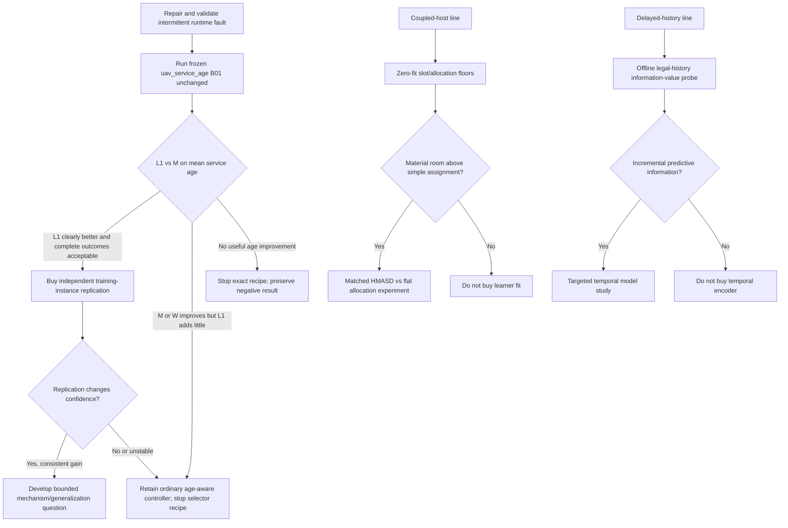

# Owner-supplied completed Deep Research report — historical source

This is the complete report supplied by the owner on2026-09-30 from
`C:\Users\fires\Downloads\deep-research-report.md` (64620 bytes;
SHA256 `4afd91dccdbbfdf322672039cafd48c0150740b1d89282923525af51fe5a029d`).
Its observed repository cutoff is `a46d9087299bb50b23ca02f2baea1d11d54f325d`.
The original text below is preserved verbatim, including opaque citation tokens and
original main-branch links. Those tokens alone do not supply independently readable evidence.
This completed external advice is evidence, not current operating authority or an adopted plan.
Root's current review and disposition live in [RESEARCH.md](../../RESEARCH.md).

---

# Decision-Oriented Literature and Artifact Review of “My paper code”

## Executive summary

I inspected the connected GitHub repository `CartmanFatass/My-paper-code` at the current `main` state. The latest commit I observed is `a46d9087299bb50b23ca02f2baea1d11d54f325d`, committed at **2026-09-30 05:12 UTC**, which is **September 29, 2026 at 22:12 PDT**. Its message is “Record owner-requested runtime repair and unlaunched study dependency.” The immediately preceding commit, `dd6cdf780031ac42b5b7097b76456f04a89c4b4d`, implements the currently selected cumulative-service-age study. fileciteturn24file0L1-L2 fileciteturn25file0L1-L2

The repository is no longer primarily a generic HMASD implementation. Its current research practice is an extensive experimental portfolio around **hierarchical/cooperative MARL for UAV service, delayed information, temporal abstraction, learned versus ordinary control, coordination structure, and service continuity**. The root README still describes the HMASD lineage—high-level transformer skill coordination, team and individual skills, and low-level skill discovery—but the repository itself says that current scientific status lives in `docs/research/RESEARCH.md`, not the legacy README. fileciteturn3file0L1-L6 fileciteturn32file0L1-L6

### Bottom-line decisions

**The highest-priority action is to run the already-frozen `uav_service_age` B01 experiment unchanged once the intermittent CPython/runtime problem is genuinely repaired.** The experiment is already unusually well specified: one training instance, 512 H256 training episodes, 448 evaluation episodes, 64 fresh paired evaluation worlds, seven programs (`L0/L1/M/W/O/G/S2`), a prospective cumulative service-age objective, a causal 635-dimensional feature specification, and a deterministic reader that will replay the saved PPO updates. No scientific result has yet been accepted. Changing the architecture, adding another paper-inspired module, changing features, or adding a pilot before this run would now confound a prospectively frozen experiment. fileciteturn29file0L1-L6 fileciteturn34file0L1-L2 fileciteturn24file0L1-L2

**The literature strongly supports the choice of cumulative age as a consequential temporal metric, but it does not make the repo's “service age” identical to classical Age of Information.** Classical AoI measures staleness of received status information; this experiment measures ticks since each user was actually served. AoI work is therefore most useful here for objective structure, scheduling baselines, and reasoning about long gaps—not for importing optimality claims. Tripathi and Modiano's Whittle-index result, for example, relies on a much more decomposable scheduling model than the repository's moving, interference-coupled, delayed-commitment UAV system. citeturn3academia36turn3search0turn6academia24

**If B01 shows that ordinary W/M age-aware planning improves substantially but learned L1 does not improve over M, retain the ordinary controller and stop the current learned-selector recipe.** That outcome would be scientifically useful: it would establish that the *objective and planning representation* were consequential without establishing a finite-learning increment. This interpretation is consistent with the repository's current methodology, which explicitly says that being matched by a simple competent alternative is a reason to stop an innovation package rather than to automatically buy extra seeds or architecture changes. fileciteturn34file0L1-L2 fileciteturn50file0L1-L2

**If L1 clearly improves over M on age and retains acceptable complete-task outcomes, the next purchase should be an independent training instance, not a more elaborate model.** The current experiment itself explicitly says that one fit cannot establish training-population superiority. A second independent training unit would therefore resolve a more important uncertainty than adding temporal attention, graph encoders, distributional critics, or more complicated hierarchical machinery. fileciteturn29file0L1-L6 fileciteturn35file0L1-L6

**For the separate coupled-host/coordination line, the best next research object is structured allocation with strong zero-fit ordinary floors, not another unrestricted continuous-control learner.** The connected artifacts show that a target-level SET learner reached only `0.357105` mean hold-out backhauled coverage after 360,000 training steps, below the recorded `0.365` random-target floor, while issuing far targets about 91.4% of the time and changing targets every decision. The notebook therefore correctly reframes the next question around conflict-free assignment to competent planner slots. This is strongly aligned with current work on sparse action-dependent coordination and adaptive coordination graphs. fileciteturn39file0L1-L2 fileciteturn47file0L1-L6 citeturn5search3turn5search1

**For delayed information and history, do an offline information-value test before purchasing another learned-history controller.** The repository already has a negative full-control local-history result, while recent MARL work such as CAIC and TIGER-MARL shows that delay-aware future intent and temporal interaction structure can matter—but only when there is exploitable temporal information. The cheapest differentiating experiment is therefore to ask whether lawful historical features predict future service/age or decision residuals *after conditioning on the current legal feature vector*. If they do not, a larger temporal encoder has weak justification; if they do, a targeted temporal representation study becomes defensible. fileciteturn27file0L1-L2 citeturn4search3turn5search0

The resulting research flow is:



This ordering is an inference from the repository evidence and the cited literature, rather than a claim that any one external method has already been shown to work in this UAV environment. fileciteturn34file0L1-L2 citeturn4search3turn5search0turn5search3

## Repository state and experimental evidence

### Research architecture and lineage

The legacy root description identifies the repository as an implementation/research codebase for **Hierarchical Multi-Agent Skill Discovery (HMASD)** in UAV base-station scenarios. HMASD combines a high-level transformer-based coordinator that assigns team and individual skills with lower-level skill-conditioned policies and discriminators; the project also has a separate process-core route and many research-candidate packages under `experiments/candidates/`. fileciteturn3file0L1-L6 fileciteturn32file0L1-L6 The underlying HMASD paper itself introduces team and individual skill discovery plus sequential transformer assignment to address sparse-reward multi-agent coordination. citeturn4search4

The main configuration still exposes this lineage directly: six team skills, six individual skills, a fixed skill period `k=10`, 256-dimensional hidden/embedding layers, two transformer encoder and decoder layers, eight heads, recurrent low-level components, PPO with `γ=0.99`, GAE `λ=0.95`, clipping `0.2`, and 15 PPO epochs. It also contains experimental switches for D2 interruption, variable horizon windows, learned termination, HA-CTSE compact representations, central-snapshot flat actors, team codes, and switching penalties. fileciteturn33file0L1-L6

The HA-CTSE design documents go further and propose three epistemically distinct timescales: continuous **recognition**, slow synchronized **team commitment**, and faster/asynchronous **individual response**. Crucially, that design document explicitly distinguishes experimentally supported pieces from locally validated but untested pieces and from theory/intended-only components; heterogeneous-tempo validity hazards and the claimed advantage of asynchronous lifetimes remain unconfirmed in the design's own status statement. fileciteturn43file0L1-L6

That distinction matters for publication strategy. The current repository is strongest where it has complete matched experiments and ordinary comparators; it is weaker where architectural narratives outrun behavioral evidence. That is why I would treat HA-CTSE as a **candidate research program**, not yet as the evidence-backed central contribution.

### Current selected study

The current Root-selected question is:

> Can finite experience reduce cumulative native service age beyond competent lawful ordinary control under the same delayed commitment?

The selected objective resets each user's age to zero when actual service occurs and increments it by one on each unserved tick. The primary objective is the average age over 50 users and 256 ticks; the experiment also retains per-user age, service gaps, never-served counts, the older fixed-window obligation metric `F`, native `J`, service, quality, zero-service tails, travel, transmitter exposure, and compute cost. The repository is explicit that this is a new prospective research criterion—not a physical deadline guarantee, energy model, or worst-user guarantee. fileciteturn29file0L1-L6

The legal information contract is unusually important. On the N5/U50/3 dB/c10 host, reports are quantized and delayed by two ticks, plans commit for four ticks, and neither the actor nor critic receives evaluator-only actual-service acknowledgements. `L` chooses between two competent plans: `O`, the retained age-ordering controller, and `W`, a predicted cumulative-age controller; `M` makes the same choice using an ordinary predicted-cost rule. Evaluation contains `L0`, trained/final `L1`, `M`, `W`, `O`, `G`, and `S2` on the same 64 fresh worlds. fileciteturn29file0L1-L6

The prospective protocol is already frozen: 512 H256 training episodes, then 448 evaluation episodes, for **960 episodes / 245,760 native steps**, with training seeds `29311000..29311511`, evaluation seeds `29312000..29312063`, one network initialization seed, fixed choice streams, and no automatic second fit. The primary exploratory contrast is paired `L1 − M` mean age, where a negative value is favorable. fileciteturn34file0L1-L2

The implementation is likewise concrete. The actor and critic are separate one-hidden-layer 64-unit tanh networks; PPO uses a clipped surrogate, entropy coefficient `0.01`, clipping `0.2`, Adam at `3e-4`, four 64-row epochs per episode, finite undiscounted return-to-go (`γ=1` for this finite reward construction), and no advantage whitening. The frozen feature vector contains exactly **635 float32 features**, including quantized map information, positions, commands, causal model ages, unknown flags, timing information, and O/W candidate summaries; actual service ages and evaluator hindsight are deliberately excluded. fileciteturn34file0L1-L2 fileciteturn25file0L1-L2

The implementation was subjected to focused scheduler, feature, learner, integration, collector, and reader tests, with 640 native fixture steps and **zero scientific result fits**. An independent engineering reviewer found no material engineering defect. The result batch itself remains unexecuted. fileciteturn25file0L1-L2

The immediate blocker is technical rather than scientific: the `wsl_4070` environment has had recurring intermittent CPython failures. The latest commit explicitly assigns Root to isolate interpreter/native-extension/host causes and states that passing imports or transient checks must not be presented as a root-cause repair. The service-age experiment has no accepted worker/result operation yet. fileciteturn24file0L1-L2

Relevant repository links:

- [`RESEARCH.md`, active/current-plan region](https://github.com/CartmanFatass/My-paper-code/blob/main/docs/research/RESEARCH.md#L1284-L1335)
- [`RESEARCH.md`, current cumulative-service-age plan](https://github.com/CartmanFatass/My-paper-code/blob/main/docs/research/RESEARCH.md#L1590-L1645)
- [`uav_service_age/NOTES.md`, prospective B01 contract](https://github.com/CartmanFatass/My-paper-code/blob/main/docs/research/candidates/uav_service_age/NOTES.md#L1-L190)
- [`uav_service_age/NOTES.md`, implementation freeze](https://github.com/CartmanFatass/My-paper-code/blob/main/docs/research/candidates/uav_service_age/NOTES.md#L190-L300)
- [`uav_service_age/b01/metrics.py`](https://github.com/CartmanFatass/My-paper-code/blob/main/experiments/candidates/uav_service_age/b01/metrics.py)

### Why service age was selected

The immediate empirical motivation is strong. In the preceding registered-service experiment, controller `G` improved native `J`, average served users per tick, and path length relative to `O`, yet it also lost seven additional periodic user-window obligations and increased the episode maximum service gap by about 21.6 ticks. The completed review records means of `F=199.96875`, `J=.322071`, service `18.6073`, and maximum gap `50.7031` for O versus `F=199.859375`, `J=.403068`, service `24.342224`, and maximum gap `72.3125` for G. In other words, aggregate service and native reward did not protect temporal continuity. fileciteturn30file0L1-L2

That is precisely the situation in which an age-style objective is informative: a long unserved segment incurs a superlinear cumulative penalty because its per-tick age grows throughout the gap. The repository's `metrics.py` reconstructs actual ages from the 50-user contact matrix and reports mean age `A`, age sum, per-user mean age, maximum user mean age, 95th percentile age, terminal age, plus all paired differences across the seven policies. fileciteturn35file0L1-L6

There is an important statistical limitation already acknowledged in the code: evaluation worlds are paired conditional units, but there is only **one training instance**. The reader labels the primary contrast `L1-M:A; negative is favorable` and explicitly scopes inference to paired world variation rather than training-population variation. fileciteturn35file0L1-L6

### Other live scientific evidence

The portfolio contains many completed negative or conditional results rather than a single steadily improving architecture. That is a strength of the evidence base.

`uav_registered_service` retained G as a service/travel tradeoff but not as a loss-free replacement for O. `uav_fleet_transmission` found large positive effects from transmitter management at N8 but an adverse H6 effect at N4, demonstrating that actuator utility depends strongly on fleet configuration. `uav_local_history` found one own-initialization positive training instance but all 96 `L1-C` world comparisons lost on J/service, so the from-scratch history-controller recipe was stopped without concluding that history is universally useless. `tail_return_distributional_learning` similarly ended its fixed distributional-critic recipe after the scalar-tail comparison was stronger on the observed training units. fileciteturn27file0L1-L2

The repository's methodological conclusion is therefore sensible: a failed package does not establish a general impossibility, but neither does it automatically justify another optimizer/feature/seed repair. The current research method explicitly asks whether a successful experiment would produce a reusable scientific contribution and whether the proposed intervention beats the strongest simple explanation or ordinary controller. fileciteturn50file0L1-L2

The separate coupled-host line provides an especially useful artifact-level lesson. It constructed a six-UAV relay environment with an explicit backhauled-service reward and ordinary planner references, then tested flat/HMASD-type learning packages. One target-level SET experiment completed 360,000 host steps, but its deterministic hold-out backhauled coverage was `0.357105`, below the recorded random-target floor around `0.365`; its `far_target_fraction` was `0.91427` and target-change rate was `1.0`. The direction's own reading is that it learned behavior close to the wandering target floor rather than a useful relay/hold strategy. fileciteturn39file0L1-L2 fileciteturn47file0L1-L6

This makes **structured assignment/anti-coordination** a more attractive next question than simply increasing continuous-control capacity. The successor notebook explicitly proposes planner-slot allocation with random-slot, sticky-random, held-permutation, nearest-unclaimed, and planner-slot zero-fit references before buying a learned comparison. fileciteturn39file0L1-L2

### Repository process artifacts, issues, and PRs

There are currently **no open pull requests** according to the connected GitHub API. fileciteturn41file0L1-L12 Recent scientific work is therefore being recorded predominantly as direct commits and append-only research notes rather than waiting in PR review.

Some open issues are stale relative to `RESEARCH.md`. For example, older issues still describe FSD, tail-distributional learning, or other directions as proposed/live even though the current research index has since moved several of them to reserve or completed states. I would therefore treat `RESEARCH.md` plus each candidate's latest `NOTES.md` as authoritative for scientific standing, and use issues as historical discussion artifacts rather than a current task board. fileciteturn21file0L1-L2

Merged PR #28 is representative of the repository's scientific style: it records that a better ordinary controller initialization improved final controllers, while the subsequent learned command-reuse package failed its primary retention comparison. It preserves contrary secondary outcomes rather than converting them into a rescue story. fileciteturn48file0L1-L2

### Data and result artifacts

The repository contains substantial run artifacts rather than only prose summaries. For example, the registered-service B02 run directory contains configurations, admission records, raw/reader outputs, a roughly 1.2 MB `summary.json`, a roughly 458 KB `reading.json`, duplicate-summary checks, and process/observer records. fileciteturn45file0L1-L2 The coupled-host SET-T run contains checkpoint-panel JSON files for rollouts 0, 15, 30, 45, hold-out panels, matching tables, and launch provenance. fileciteturn46file0L1-L2

The GitHub connector can enumerate and read textual portions of these artifacts, but very large JSON and binary NPZ/raw arrays are not always returned in full in one connector response. I therefore verified selected concrete result files and the repository's independently generated readers/summaries, but I did **not** re-run the numerical readers or exhaustively decode every binary raw episode in this review. That is one of the access limitations listed at the end.

## Literature and artifact review

The following twelve papers are the strongest literature bridges I found for the current portfolio. I prioritize original proceedings, preprints, and author implementations. “Failure mode” below means **failure mode when adapting the idea to this repository**, not necessarily a flaw claimed by the original authors.

| Primary source | What it contributes, assumptions, and repo-facing failure mode | Concrete adaptation to this repo |
|---|---|---|
| **Yang et al., 2023 — “Hierarchical Multi-Agent Skill Discovery.” NeurIPS 2023.** [Paper](https://proceedings.neurips.cc/paper_files/paper/2023/hash/c276c3303c0723c83a43b95a44a1fcbf-Abstract-Conference.html) citeturn4search4 | This is the project's direct algorithmic ancestor. HMASD learns both team and individual skills, using a high-level transformer for sequential skill assignment and low-level skill discovery, and is motivated by sparse-reward multi-agent tasks. Its key assumption for this repo is that the latent skill hierarchy matches consequential temporal/coordination structure. The repo's own results show the failure mode: a hierarchy can be expressive yet still fail to add value over a matched flat or ordinary controller when the task's useful decision structure is simpler than the learned abstraction. citeturn4search4 fileciteturn43file0L1-L6 | **Prototype:** on the coupled planner-slot task, compare the existing HMASD sequential assignment head against the matched-information flat categorical SET policy, with exactly the same slot menu, world stream, exposure, executor, and ordinary assignment floors. This isolates whether sequential skill/action dependence helps anti-coordination rather than asking HMASD to rediscover low-level flight. Effort: **medium** because most infrastructure exists. |
| **Chen, Lan & Aggarwal, 2025 — “Variational Offline Multi-agent Skill Discovery.” IJCAI 2025.** [Paper](https://www.ijcai.org/proceedings/2025/538) / [official code](https://github.com/LucasCJYSDL/VOMASD) citeturn8search8 | VO-MASD learns subgroup- and temporal-level abstractions from offline trajectories and includes a dynamic grouping mechanism intended to identify latent interacting subgroups. This directly addresses a weakness in a fixed team/individual split: useful UAV roles may involve transient relay/service subgroups rather than one whole-team code plus independent individual codes. It assumes the offline data contain repeatable interaction structure with enough support to identify groups. In this repo, it will fail as a useful investment if the learned grouping does not predict complete-task outcomes or if a trivial geometry/assignment rule explains the same grouping. citeturn8search8 | **Prototype:** do **not** train a new policy first. Run its grouping idea offline on retained coupled-host or service trajectories and test whether inferred groups predict future backhauled service, service-age reduction, or relay occupancy beyond current state/geometry. Compare to simple graph clustering by radio connectivity. Only buy policy integration if the grouping has incremental predictive value. Effort: **medium**, informative value **high** for HA-CTSE subgroup claims. |
| **Bacon, Harb & Precup, 2017 — “The Option-Critic Architecture.” AAAI.** [Paper](https://ojs.aaai.org/index.php/AAAI/article/view/10916) citeturn4search0 | Option-Critic jointly learns intra-option policies, option termination conditions, and the policy over options without hand-provided subgoals. It is the seminal reference for the repo's learned-termination/variable-duration ideas and means that “learn skill termination” by itself cannot be a novelty claim. Its assumptions are those of temporally extended RL and useful return gradients for termination; deep/shared-parameter implementations also make clean component attribution difficult. A repo-facing failure is that variable duration may merely change optimization dynamics while producing no meaningful service/coordination benefit. citeturn4search0turn4search5 | **Prototype:** only after a fixed-k policy demonstrates a competent skill-mediated capability, freeze the low-level policy and add a minimal binary “continue/terminate” head over the existing `k=10` skill. Compare against fixed `k∈{5,10}` controls with equal information and compute accounting. The first question should be “does termination change a task consequence?” rather than “can the head learn varied durations?” Effort: **medium**. |
| **Yu et al., 2022 — “The Surprising Effectiveness of PPO in Cooperative Multi-Agent Games.” NeurIPS.** [Paper](https://proceedings.neurips.cc/paper_files/paper/2022/hash/9c1535a02f0ce079433344e14d910597-Abstract-Datasets_and_Benchmarks.html) / [official MAPPO code](https://github.com/marlbenchmark/on-policy) citeturn4search2turn8search0 | The paper shows that carefully implemented PPO/MAPPO is a very strong cooperative-MARL baseline across several standard testbeds, and the official code emphasizes rollout length, PPO epochs, minibatches, clipping, and parameter sharing as consequential implementation details. For this repo that matters more than another exotic baseline: many claimed hierarchical increments should first survive a well-matched flat PPO control. The failure mode is unfair attribution when hierarchy and optimization/exposure differ simultaneously. citeturn4search2turn8search0 | **Prototype:** make the matched flat SET/MAPPO arm a compulsory attribution control for any new HMASD/HA-CTSE mechanism whose action/information interface can be flattened. Reuse the repo's existing central-snapshot flat actor where appropriate. Effort: **low–medium** because infrastructure already exists; informative value **very high**. |
| **Tripathi & Modiano, 2019 — “A Whittle Index Approach to Minimizing Functions of Age of Information.”** [Preprint](https://arxiv.org/abs/1908.10438) citeturn3academia36 | This paper studies time-average nondecreasing functions of age and derives a low-complexity Whittle-index scheduler; in a two-source reliable-channel special case the index policy is exactly optimal, and the paper develops structural reasons for good performance more broadly. It is valuable here because `uav_service_age` needs a strong **ordinary age-aware comparator**, not because the theorem transfers. The repo violates the clean restless-bandit decomposition through UAV motion, interference, multi-user simultaneous service, delayed commitments, and coupled candidate trajectories. citeturn3academia36 | **Prototype:** create a **zero-fit diagnostic baseline** on saved/legal model states that ranks users by an age-index surrogate while keeping the existing physical planner and legal information fixed. Do not add it to the already-frozen B01 panel. Use it only after B01 to ask whether O/W leave obvious scheduling headroom in a simplified fixed-geometry or frozen-candidate slice. Effort: **low**; informative value **medium/high**. |
| **Ndiaye, Bergou & El Hammouti, 2023/2024 — “Age-of-Information in UAV-assisted Networks: a Decentralized Multi-Agent Optimization.”** [Preprint](https://arxiv.org/abs/2312.15778) citeturn6academia24 | This is one of the closest application papers: it jointly treats UAV trajectories and device selection under weighted AoI, formulates a mixed-integer nonlinear problem, and decomposes the problem into decentralized MARL rewards. Reported decentralized performance is near the centralized implementation with lower communication overhead in their setting. Its key mismatch is semantic: their AoI concerns packet freshness, whereas this repo's age is time since native user service, and the repo has its own interference, commitment, and delayed-information physics. citeturn6academia24 | **Prototype:** compare the repo's global mean-age reward with a decomposed per-user/per-UAV age contribution **offline first**. Test whether the decomposition preserves candidate ranking on existing O/W decisions. If not, distributed reward decomposition is likely to alter the scientific question; if yes, it could support future decentralized age control. Effort: **low** offline, **high** if turned into a learner. |
| **Li et al., 2026 — “CAIC: Congestion-Aware Intent Communication for Multi-Agent Reinforcement Learning.” UAI.** [Paper](https://proceedings.mlr.press/v337/li26h.html) citeturn4search3 | CAIC explicitly models delayed shared-channel communication and uses future-trajectory intent representations, asynchronous attention, and adaptive communication frequency. Its most relevant empirical observation for this repo is that stale messages can be worse than no communication in tested scenarios. The repo currently has a deterministic two-tick delivery/four-tick commitment structure rather than CAIC's queueing channel, so importing its architecture wholesale would be poorly matched. The useful hypothesis is narrower: **predictive intent may remain useful when delayed state messages have decayed in value**. citeturn4search3 | **Prototype:** take one existing delayed-message direction and construct a zero/new-fit ablation with the same channel: current message, no message, and a compact lawful predicted-next-plan/trajectory message generated from information available at send time. Evaluate under the existing delay with no adaptive bandwidth mechanism first. Effort: **medium**; informative value **high** only if current message content is limiting. |
| **Gupta et al., 2026 — “TIGER-MARL.” L4DC.** [Paper](https://proceedings.mlr.press/v331/gupta26a.html) / [official code](https://github.com/Nikunj-Gupta/tiger-marl) citeturn5search0turn7academia48 | TIGER constructs temporal graphs linking current and historical interactions and uses temporal attention to produce time-aware agent embeddings. It is directly relevant to `uav_local_history`, delayed reports, roster changes, and evolving relay/service relations. But the repo already has evidence that merely giving a from-scratch learner more history does not guarantee value. The critical assumption should therefore be tested first: historical interaction structure must contain incremental information about future service or coordination after conditioning on the current legal state. citeturn5search0 fileciteturn27file0L1-L2 | **Prototype:** offline supervised information-value test: predict next 4–16 ticks' service-age increment or backhaul loss from (a) current legal features and (b) current + temporal graph/history features. Use held-out worlds. A significant and stable out-of-sample improvement is the gate for any new temporal-policy fit. Effort: **low–medium**; informative value **very high**. |
| **Ding, Tang & Jing, 2026 — “Sparse Action-Dependent Policy Iteration under Coordination Structures.” UAI.** [Paper](https://proceedings.mlr.press/v337/ding26a.html) citeturn5search3 | This paper formalizes action-dependency graphs so each agent's action can condition on a sparse subset of other agents' actions rather than every preceding action, and gives structural optimality/convergence results under coordination-graph conditions plus a deep-MARL extension. This is especially relevant to HMASD's autoregressive skill assignment and the current planner-slot question. Its theory assumes a coordination structure that need not hold in the UAV physics, so it should be used as a design lens rather than imported as an optimality result. citeturn5search3 | **Prototype:** use the six-slot relay assignment task. Compute pairwise marginal loss from slot conflicts/relay-server incompatibilities using the ordinary planner, create a sparse dependency graph, then compare independent SET assignment, full autoregressive HMASD assignment, and sparse ordered assignment. Start with **zero-fit exhaustive/ordinary assignment evidence**. Effort: **low for graph diagnosis, medium/high for learned sparse policy**; informative value **very high**. |
| **Peng et al., 2026 — “TACTIC: Task-Aware Sparse Coordination Graphs for Multi-Task MARL.” ICML.** [Paper](https://proceedings.mlr.press/v306/peng26f.html) citeturn5search1 | TACTIC learns discrete task-semantic trajectory classes using a VQ-VAE, conditions sparse coordination graphs on those classes, and separates task recognition from control with a frozen predictor. The idea maps naturally onto HA-CTSE's distinction between recognizing the situation and sampling team intent. Its risk in this repo is that a single static service scenario may not contain stable, reusable task classes—making the representation an expensive relabeling of geometry or time. citeturn5search1 fileciteturn43file0L1-L6 | **Prototype:** cluster existing trajectories into semantic regimes *without policy retraining*, then test whether cluster identity predicts which ordinary controller (O/G/S2, planner allocation, etc.) wins on held-out worlds. Compare against simple features such as user density, backhaul geometry, age quantiles, and clock. Only if semantic classes beat simple predictors should a task-conditioned policy be purchased. Effort: **medium**. |
| **Yalcinkaya et al., 2026 — “Automata-Conditioned Cooperative Multi-Agent Reinforcement Learning.” ICML.** [Paper](https://proceedings.mlr.press/v306/yalcinkaya26a.html) / [official code](https://github.com/rad-dfa/acc-marl) citeturn6search0turn7search1 | ACC-MARL represents cooperative temporal objectives with automata, uses their state to condition decentralized policies, and exploits value functions for task assignment. This is highly relevant to a repo containing periodic obligations, service windows, return/charging obligations, delayed commitments, and other explicitly temporal contracts. The main danger is privileged information: an automaton state is only legitimate if it can be updated from information available to the acting policy. Also, the selected service-age objective is continuous accumulated cost, not naturally a finite task automaton, so forcing it into an automaton may discard useful structure. citeturn6search0turn7search1 | **Prototype:** apply automaton conditioning first to a genuinely discrete temporal contract—e.g. periodic service obligation or reserve/return phases—not B01's continuous age objective. Compare a hand-coded legal automaton-state feature against a recurrent policy with the same observables and an ordinary finite-state controller. Effort: **medium**; informative value **high** for temporal-contract directions. |
| **Hu et al., 2021 — “Off-Belief Learning.” ICML.** [Paper](https://proceedings.mlr.press/v139/hu21c.html) citeturn6search12 | OBL addresses cooperative policies that overfit self-play conventions and then fail with independently trained partners. It reasons under a fixed past-action policy and can produce “grounded” policies that do not rely on arbitrary behavioral conventions. This is relevant to the repo's partner/controller-composition and cross-policy results, where a learned response that works with one fixed partner may not recur with another. Its assumptions and Hanabi-style convention problem are not identical to homogeneous UAV control, so the immediate value is an evaluation principle rather than an algorithm import. citeturn6search12 | **Prototype:** construct a cross-play matrix among independently trained HMASD/SET instances and retained ordinary controllers on a fixed matched panel. Measure whether the learned coordinator's gain survives partner substitution. Only after demonstrating a convention/partner-generalization problem should OBL-like training be considered. Effort: **low** if checkpoints exist; informative value **high** for coordination-generalization claims. |

A few themes recur across these papers.

First, **strong simple baselines are a scientific requirement, not just engineering hygiene**. MAPPO shows how far carefully implemented flat PPO can go; the AoI literature supplies structured schedulers; Ding et al. supplies a way to think about sparse action dependencies; and ACC-MARL supplies explicit temporal state when the contract actually has such structure. citeturn4search2turn3academia36turn5search3turn6search0

Second, the recent literature does **not** point to “add a bigger transformer” as the next generic answer. CAIC's value comes from matching the representation to delay; TIGER's from matching it to temporal interaction structure; TACTIC's from task-dependent coordination structure; VO-MASD's from subgroup structure. The correct research question is whether those structures are observably present and consequential in the repo's lawful state—not whether the corresponding module can be attached. citeturn4search3turn5search0turn5search1turn8search8

Third, the repository's own negative results make this literature more useful, not less. They tell you where to use the papers as **hypothesis generators and diagnostic gates** rather than as automatic implementation prescriptions.

## Decision matrix and recommended experiments

The following recommendations distinguish work that should occur **now** from work that becomes justified only after a particular observation. “Informative value” means expected ability to change a research investment decision, not expected probability of a positive result.

| Repo need | Evidence and most relevant literature | Recommended next experiment | Effort | Expected informative value | Decision rule |
|---|---|---|---|---|---|
| Establish whether finite learning adds anything to cumulative service-age control | B01 is already frozen and engineered; G/O evidence establishes a real mismatch between throughput/J and temporal gaps. AoI literature says age objectives capture a distinct temporal cost. fileciteturn30file0L1-L2 citeturn3academia36turn6academia24 | **Run B01 unchanged after runtime repair.** No new architecture, feature, paper-inspired baseline, or extra fit beforehand. | Medium/high compute already budgeted | **Very high** | L1 vs M is primary. If learned increment is weak while W/M is useful, retain ordinary capability and stop this learned recipe. |
| Determine whether any positive L1 result is robust to training randomness | One fit cannot support training-population inference by the repo's own declaration. fileciteturn35file0L1-L6 | If B01 produces a consequential L1 increment, repeat the **same frozen recipe** with a genuinely independent initialization/training world stream before architecture expansion. | Medium/high | **Very high** | Buy only if first-fit magnitude and complete-task tradeoff are large enough that confirmation would alter the program. |
| Determine whether ordinary age scheduling leaves obvious headroom | W/M/O already give competent structured references; Whittle-index AoI work provides another simple structural lens but its optimality assumptions do not transfer. citeturn3academia36 | After B01, run a zero-fit/frozen-geometry age-index analysis on the same legal modeled ages. | Low | High | If it changes candidate ordering materially and consistently, formulate a fair ordinary controller; otherwise stop. |
| Determine whether legal temporal history is worth modeling | `uav_local_history` full-control recipe underperformed; TIGER says temporal interaction graphs can help when temporal dependencies matter. fileciteturn27file0L1-L2 citeturn5search0 | Offline held-out prediction: current legal state vs current+history for future age increment/service loss/decision residual. | Low–medium | **Very high** | Require stable held-out incremental predictive value before any policy fit. |
| Determine whether delayed communication needs predictive intent | Current tasks include delayed reports/messages; CAIC shows stale messages can be harmful and future-intent encoding can help under delay. citeturn4search3 | Fixed-channel three-way comparison: no message vs existing message vs lawful predicted-intent message. Do not introduce queue-adaptive bandwidth simultaneously. | Medium | High | Continue only if intent adds complete-task value beyond both controls without unacceptable compute/service tails. |
| Build a clean hierarchical coordination test | Coupled-host SET-T failed to exceed the random-target floor and learned frequent far-target wandering. The next notebook already points toward slot allocation. fileciteturn47file0L1-L6 fileciteturn39file0L1-L2 | First run zero-fit slot floors and quantify assignment/anti-coordination headroom. If room is material, matched HMASD sequential assignment vs flat SET over the same fixed slots. | Low gate, then medium | **Very high** | No fit unless competent planner allocation materially exceeds simple sticky/held/random assignments. |
| Determine whether sparse action dependencies, not full autoregression, explain hierarchy value | HMASD sequential assignment is dense/order-based; Ding et al. provides an explicit sparse dependency formalism. citeturn5search3 | Estimate pairwise slot/role interaction graph from ordinary counterfactuals. Only after H-vs-SET signal, test sparse dependency head. | Low diagnostic; medium implementation | Medium/high | Do not implement unless full autoregressive H already shows value or diagnostics show clear sparse interactions. |
| Determine whether subgroup skill discovery is justified | HA-CTSE has a recognition/grouping narrative but intended-only components remain. VO-MASD offers offline subgroup discovery. fileciteturn43file0L1-L6 citeturn8search8 | Offline subgroup discovery on saved interactions; compare against geometry/radio graph clusters in predicting outcomes. | Medium | High | Policy integration only if learned grouping adds predictive information beyond simple structure. |
| Determine whether learned termination is worth revisiting | Option-Critic establishes the basic mechanism; repo already contains horizon/termination switches but lacks the required heterogeneous-tempo positive evidence. citeturn4search0 fileciteturn43file0L1-L6 | First construct/identify a task where two timescales are consequential and fixed-k baseline is competent. Then add one minimal termination head. | Medium/high | Medium | No termination study on a task where duration is not already shown to matter. |
| Determine whether coordination gains generalize across partners/checkpoints | Repo has partner/controller-composition non-recurrence; OBL warns against self-play conventions. citeturn6search12 | Cross-play matrix over independently trained checkpoints and retained ordinary policies. | Low | High | If gains vanish under partner substitution, study convention robustness; otherwise do not. |

A crucial recommendation is **not to combine these experiments**. For example, a new learned termination mechanism plus TIGER temporal graphs plus a TACTIC task code plus new communication would produce a potentially stronger package but almost no decision-oriented scientific attribution. The repository's own methodological revisions explicitly caution against changing multiple information/representation/training relationships and then inferring a single cause. fileciteturn27file0L1-L2

### Suggested investment order

The order I would use is:

**First:** runtime repair → frozen service-age B01.

**Second:** interpret B01 before buying anything else in that direction.

**Third:** in parallel only where resources are genuinely independent, finish the coupled-host **zero-fit assignment floors**; purchase a learned allocation experiment only if those floors demonstrate consequential headroom.

**Fourth:** run the offline history-information probe. This is cheap relative to another full MARL fit and directly tells you whether TIGER/CAIC-style temporal representation has something to exploit.

**Fifth:** only after one of those produces a clear structural signal should you choose among variable termination, subgroup skills, sparse dependencies, temporal graphs, predictive communication, or automaton conditioning.

That sequence maximizes information about *which research mechanism deserves compute*, rather than maximizing the number of implemented mechanisms.

## Prototype protocols and analysis code

### Frozen service-age evaluation protocol

The current B01 reader already contains most of the correct protocol, so I would **not replace it**. The following is the interpretation protocol I recommend around it.

The unit of the primary paired environmental comparison is the **world**, not the user or tick. The primary estimand remains

\[
\Delta_A =
\frac{1}{64}\sum_{w=1}^{64}
\left(A_{\mathrm{L1},w}-A_{\mathrm{M},w}\right),
\]

with negative favorable. This exactly matches the declared reader. fileciteturn35file0L1-L6

Report, without selecting worlds after seeing results:

| Quantity | Purpose |
|---|---|
| Mean paired `L1-M` age difference | Frozen primary effect |
| Descriptive paired t95 interval | Existing reader convention |
| 64 individual differences | Detect concentration in a few worlds |
| Positive/negative/zero sign counts | Directional robustness |
| Median, p10, p90, min, max | Tail shape |
| `max_user_mean_age`, `age_p95`, max gap | Fairness/continuity consequences |
| F, J, service, quality | Preserve previous contract outcomes |
| zero-service steps / longest zero run | Severe service tail |
| path, transmitter exposure | Physical/resource consequence proxies |
| scheduler and total CPU/wall | Deployment cost |

Those are already substantially represented in `metrics.py`. fileciteturn35file0L1-L6

Do **not** reinterpret a t95 interval that excludes zero across worlds as proof of training-population superiority: the trained L1 policy is still one training instance. Likewise, do not invent a post-result physical noninferiority tolerance for F, gaps, or transmitter exposure; the repository explicitly states that no owner-supplied physical exchange rate or waiting deadline exists. fileciteturn29file0L1-L6

A useful supplemental paired sign-flip analysis, without changing the frozen primary, is:

```python
from __future__ import annotations

import numpy as np


def paired_sign_flip_test(
    left: np.ndarray,
    right: np.ndarray,
    *,
    favorable: str = "lower",
    n_resamples: int = 100_000,
    seed: int = 20260929,
) -> dict[str, float]:
    """
    Descriptive randomization check for an already-frozen paired comparison.

    This is supplemental only. It does NOT turn one trained policy instance
    into training-population evidence.
    """
    left = np.asarray(left, dtype=np.float64)
    right = np.asarray(right, dtype=np.float64)

    if left.shape != right.shape or left.ndim != 1:
        raise ValueError("left/right must be same-length 1D arrays")
    if len(left) == 0 or not np.isfinite(left).all() or not np.isfinite(right).all():
        raise ValueError("finite paired observations required")

    diff = left - right
    observed = float(diff.mean())

    rng = np.random.default_rng(seed)
    signs = rng.choice((-1.0, 1.0), size=(n_resamples, len(diff)))
    null_means = (signs * diff).mean(axis=1)

    if favorable == "lower":
        p_one_sided = (np.count_nonzero(null_means <= observed) + 1) / (n_resamples + 1)
    elif favorable == "higher":
        p_one_sided = (np.count_nonzero(null_means >= observed) + 1) / (n_resamples + 1)
    else:
        raise ValueError("favorable must be 'lower' or 'higher'")

    return {
        "mean_difference": observed,
        "median_difference": float(np.median(diff)),
        "negative_fraction": float(np.mean(diff < 0)),
        "positive_fraction": float(np.mean(diff > 0)),
        "p_one_sided_sign_flip": float(p_one_sided),
    }


# Example after loading the 64 paired B01 rows:
# result = paired_sign_flip_test(L1_age, M_age, favorable="lower")
```

This does not replace the declared t-interval. Its value is diagnostic: it reveals whether the conclusion is unusually dependent on distributional assumptions while keeping the world pairing intact.

### Minimal ordinary age-index prototype

A Whittle-index theorem does not transfer to this simulator, but an **age-index-inspired ordinary comparator** can be tested cheaply after B01. Tripathi and Modiano's structural insight is that age and age-cost growth can define scheduling priorities under suitable decomposable assumptions. citeturn3academia36

A minimal priority function could be tested on **frozen candidate plans**, without controlling UAV physics directly:

```python
from __future__ import annotations

import numpy as np


def triangular_future_age(age: np.ndarray, horizon: int) -> np.ndarray:
    """
    Cost if a user remains unserved for `horizon` additional ticks.

    For starting age a:
        (a+1) + ... + (a+horizon)
    """
    age = np.asarray(age, dtype=np.float64)
    if horizon < 0:
        raise ValueError("horizon must be non-negative")
    return horizon * age + horizon * (horizon + 1) / 2.0


def candidate_age_score(
    current_model_age: np.ndarray,
    predicted_contact: np.ndarray,
    *,
    horizon: int = 4,
) -> float:
    """
    Score a candidate plan using only lawful/model-based information.

    predicted_contact[t, u] is the model's prediction that user u is served
    at candidate-relative tick t. Lower returned score is better.

    Important: use MODEL/PREDICTED contacts here, never evaluator-only actual
    service or hindsight-completed histories.
    """
    age = np.asarray(current_model_age, dtype=np.int64).copy()
    contact = np.asarray(predicted_contact, dtype=bool)

    if contact.shape != (horizon, len(age)):
        raise ValueError("predicted_contact has wrong shape")

    cumulative = 0.0
    for t in range(horizon):
        age = np.where(contact[t], 0, age + 1)
        cumulative += float(age.sum())

    return cumulative / (len(age) * horizon)
```

The repo's W controller is already substantially more sophisticated than this—it predicts cumulative age throughout its search. The purpose of this script is therefore **not** to propose yet another B01 arm. It is to test, after B01, whether a very simple age-cost rule already reproduces most W/M candidate rankings. If it does, the scientific story should emphasize ordinary age-aware planning rather than learned foresight.

### Offline temporal-information gate

Before implementing TIGER-MARL, a GRU, or another retained-history policy, test whether legal history contains incremental signal. TIGER's core claim is useful only if historical interaction structure genuinely improves relevant prediction. citeturn5search0

The cleanest protocol is:

1. Use only causal features that would be legal at decision time.
2. Split **by world**, not randomly by row, to avoid trajectory leakage.
3. Define a consequential target such as next-four-tick age increment, service loss, max-gap growth, or whether W will outperform O over the upcoming committed block.
4. Fit the same small model to current-state features and current+history features.
5. Compare held-out loss across multiple disjoint world folds.
6. Compare the history gain against trivial temporal features such as current age, current clock, prior action, and last-model-update time.

A dependency-light ridge implementation is:

```python
from __future__ import annotations

import numpy as np


def ridge_fit(X: np.ndarray, y: np.ndarray, alpha: float = 1.0) -> np.ndarray:
    X = np.asarray(X, dtype=np.float64)
    y = np.asarray(y, dtype=np.float64)

    if X.ndim != 2 or y.ndim != 1 or len(X) != len(y):
        raise ValueError("bad X/y shapes")

    X1 = np.column_stack([np.ones(len(X)), X])
    reg = np.eye(X1.shape[1]) * alpha
    reg[0, 0] = 0.0  # do not regularize intercept

    return np.linalg.solve(X1.T @ X1 + reg, X1.T @ y)


def ridge_predict(X: np.ndarray, beta: np.ndarray) -> np.ndarray:
    X = np.asarray(X, dtype=np.float64)
    X1 = np.column_stack([np.ones(len(X)), X])
    return X1 @ beta


def heldout_mse(
    X_train: np.ndarray,
    y_train: np.ndarray,
    X_test: np.ndarray,
    y_test: np.ndarray,
    *,
    alpha: float = 1.0,
) -> float:
    beta = ridge_fit(X_train, y_train, alpha=alpha)
    pred = ridge_predict(X_test, beta)
    return float(np.mean((pred - y_test) ** 2))


# Example:
# mse_now = heldout_mse(X_now_train, y_train, X_now_test, y_test)
# mse_hist = heldout_mse(X_hist_train, y_train, X_hist_test, y_test)
# relative_gain = (mse_now - mse_hist) / mse_now
```

The decisive observation is not “history model loss decreased on training data.” It is **stable held-out-world incremental prediction after conditioning on current legal information**. If that effect is absent, the repo has little reason to purchase a more complicated temporal policy merely because recent literature has one.

### Coupled-host allocation protocol

The coupled-host evidence suggests that flight execution itself creates much of the gain: random long-lived targets are already far better than random per-step velocities, while the learned target-level SET policy mostly converged toward the wandering target floor. fileciteturn39file0L1-L2

The next experiment should therefore separate:

\[
\text{executor value}
\quad+\quad
\text{assignment value}
\quad+\quad
\text{learned coordination value}.
\]

A clean zero-fit panel is:

| Controller | What it isolates |
|---|---|
| Random target every macro decision | Go-to executor alone |
| Sticky random slots | Reduced churn |
| Held random permutation | Conflict-free assignment without optimization |
| Nearest unclaimed slot | Simple geometry-aware assignment |
| Hungarian/min-cost assignment | Strong ordinary assignment |
| Full planner slots | Ordinary upper reference within chosen menu |
| Learned flat SET-slot | Independent learned allocation |
| HMASD-slot | Sequential/action-dependent learned allocation |

Only if the gap between simple assignment and planner assignment is consequential should a learning fit be purchased. That matches the repository's current proposed successor logic and also creates a direct empirical bridge to Ding et al.'s action-dependency graph work. fileciteturn39file0L1-L2 citeturn5search3

If HMASD beats flat SET, a subsequent diagnostic can estimate pairwise slot dependencies from ordinary counterfactuals:

\[
I_{ij}
=
V(a_i,a_j)
-
V(a_i,\bar a_j)
-
V(\bar a_i,a_j)
+
V(\bar a_i,\bar a_j).
\]

Large, reproducible pair interactions provide a concrete reason for a dependency-aware coordinator. Near-zero interactions would weaken a claim that sequential coordination, rather than ordinary role assignment or optimization, caused the gain.

## Gaps, unresolved choices, and source index

### What is unresolved

**There is no accepted result for the currently selected `uav_service_age` study.** The code and protocol are ready, but the actual 960-episode batch has not been launched/accepted because of the shared runtime problem. Any statement that “learning improves service age” or “ordinary age planning is sufficient” would therefore be premature. fileciteturn24file0L1-L2

**The CPython failure is not diagnosed.** Previous work experienced unknown-opcode/SystemError/SIGSEGV-style failures in some long-running experiments, and the current Root task explicitly requires evidence isolating interpreter, native-extension, or host causes rather than treating successful imports as repair. fileciteturn24file0L1-L2

**There is no application-supplied service-age tolerance.** Mean age is a prospective research objective; there is no owner-supplied physical waiting deadline or exchange rate between age, native J, energy, F, service, and compute. A result with better mean age but worse worst-user gaps or transmission cost must therefore be reported as a tradeoff rather than forced into a post hoc “acceptable/unacceptable” binary. fileciteturn29file0L1-L6

**The role of learning versus good ordinary structure remains the central scientific uncertainty.** Across the repo, several ordinary controllers have captured gains that initially looked like learning opportunities, while some learned packages show instance-level capabilities without robustly beating ordinary alternatives. The selected B01 is designed appropriately because L is evaluated against M, W, O, G, and S2 rather than a weak random baseline. fileciteturn27file0L1-L2

**HA-CTSE's full causal story is not established.** The design itself lists some components as “theory/intended only” and says the heterogeneous-tempo async-lifetime claim has zero confirmatory reads. Option-Critic also makes clear that learned termination is established prior art, so any future contribution must be the specific multi-agent information/coordination consequence, not the existence of a termination head. fileciteturn43file0L1-L6 citeturn4search0

**The coupled-host line has not established a competent learned coordination substrate.** The most recent inspected target-level SET result is below its random-target activation floor, and the notes therefore move toward structured slot allocation rather than another unconstrained continuous-control fit. fileciteturn47file0L1-L6 fileciteturn39file0L1-L2

**Some open GitHub issues do not reflect the latest scientific standing.** There are no open PRs, and current direction status should be read from `RESEARCH.md` and latest candidate notes rather than assuming an open issue remains active. fileciteturn41file0L1-L12 fileciteturn21file0L1-L2

### Access and evidence limitations

I inspected the current README/project map, main research index, current selected study and implementation, design documentation, configurations, candidate notebooks, run directories, selected raw JSON results, issues, PR state, and recent commits through the GitHub connector. The repository's run data are large: individual result directories contain hundreds-of-kilobytes to megabytes of JSON and, in some directions, raw/binary arrays. The connector can enumerate these files and read selected textual regions, but it does not conveniently stream every large binary/raw artifact into one review. fileciteturn45file0L1-L2 fileciteturn46file0L1-L2

Accordingly, I relied on three evidence layers: selected raw result JSON where readable, the repository's deterministic complete readers and summaries, and the append-only scientific interpretations that record source/result identities. I did not independently execute the repo's readers, replay saved PPO optimizer states, or recompute all native physics from NPZ arrays. Those are the main unverified artifact-level steps in this report.

I also did not treat historical design documents as current authority when `RESEARCH.md` explicitly supersedes them. The project map itself states that current directions/ownership belong in `RESEARCH.md` and that historical maps/design material can be unmaintained. fileciteturn32file0L1-L6

### High-value repository links

| Artifact | Why it matters |
|---|---|
| [`README.md`](https://github.com/CartmanFatass/My-paper-code/blob/main/README.md) | Legacy HMASD overview and original entry points. fileciteturn3file0L1-L6 |
| [`docs/project/PROJECT_MAP.md`](https://github.com/CartmanFatass/My-paper-code/blob/main/docs/project/PROJECT_MAP.md) | Current source/layout routing and authority map. fileciteturn32file0L1-L6 |
| [`docs/research/RESEARCH.md`](https://github.com/CartmanFatass/My-paper-code/blob/main/docs/research/RESEARCH.md) | Authoritative portfolio status and current plan. fileciteturn27file0L1-L2 |
| [`uav_service_age/NOTES.md`](https://github.com/CartmanFatass/My-paper-code/blob/main/docs/research/candidates/uav_service_age/NOTES.md) | Exact prospective service-age hypothesis, seeds, protocol, implementation freeze, and interpretation limits. fileciteturn34file0L1-L2 |
| [`uav_service_age/b01/metrics.py`](https://github.com/CartmanFatass/My-paper-code/blob/main/experiments/candidates/uav_service_age/b01/metrics.py) | Actual age construction and complete paired evaluation metrics. fileciteturn35file0L1-L6 |
| [`RESEARCH-cumulative-service-age-selection.md`](https://github.com/CartmanFatass/My-paper-code/blob/main/docs/research/archive/2026-09-30/RESEARCH-cumulative-service-age-selection.md) | G/N evidence and decision path that produced B01. fileciteturn30file0L1-L2 |
| [`ALGORITHM_DESCRIPTION_v6.md`](https://github.com/CartmanFatass/My-paper-code/blob/main/docs/research/designs/ALGORITHM_DESCRIPTION_v6.md) | HA-CTSE architecture plus unusually useful implemented/untested/intended status distinctions. fileciteturn43file0L1-L6 |
| [`coupled_host_joint_skills_stage1/NOTES.md`](https://github.com/CartmanFatass/My-paper-code/blob/main/docs/research/candidates/coupled_host_joint_skills_stage1/NOTES.md) | Coupled-relay host, learner comparisons, negative target-level result, and successor allocation logic. fileciteturn37file0L1-L2 fileciteturn39file0L1-L2 |
| [`b02 SET-T hold-out panel`](https://github.com/CartmanFatass/My-paper-code/blob/main/runs/coupled_host_joint_skills_stage1/b02_fit_SETT_932201_a01/panel_45_holdout_deterministic.json) | Direct result artifact showing `.357105` backhauled coverage and the target-use counters. fileciteturn47file0L1-L6 |
| [`configs/config_1.py`](https://github.com/CartmanFatass/My-paper-code/blob/main/configs/config_1.py) | Current HMASD/PPO and experimental termination/HA-CTSE switches. fileciteturn33file0L1-L6 |
| [Merged PR #28](https://github.com/CartmanFatass/My-paper-code/pull/28) | Example of an ordinary-controller improvement followed by an adverse learned-reuse result and disciplined stopping decision. fileciteturn48file0L1-L2 |

### Overall research judgment

The repository's strongest prospective contribution is currently **not** “a larger hierarchical MARL architecture.” It is a disciplined sequence of questions about **when finite learning adds complete-task value beyond strong lawful ordinary control under delayed, coupled UAV dynamics**. The newly selected service-age objective is a particularly good test because it is motivated by an observed failure of fixed-window and average-service metrics to protect temporal continuity, and because the new experiment compares learning against multiple competent ordinary policies rather than against a weak floor. fileciteturn30file0L1-L2 fileciteturn34file0L1-L2

The literature suggests three promising *future* scientific axes—temporal information, structured action dependence, and explicit temporal-task structure—but the repo already contains enough negative evidence to justify gating each one with a cheap structural test. CAIC/TIGER justify asking whether lawful history and predictive intent contain incremental information; Ding/TACTIC/VO-MASD justify asking whether sparse or subgroup coordination structure is actually present; Option-Critic and ACC-MARL justify temporal abstraction only when the task's temporal structure is consequential and legally observable. citeturn4search3turn5search0turn5search3turn5search1turn8search8turn4search0turn6search0

The decision I would make from the evidence available on **September 29, 2026 PDT** is therefore: **repair the runtime, execute the frozen cumulative-service-age study exactly as declared, and let that result decide whether the next dollar goes to replication, ordinary age-aware control, or stopping the selector recipe. In the independent coupled-host line, gate any further learning through strong assignment floors. For history/delay, buy information-value evidence before buying another neural architecture.** That path makes the next experiments maximally capable of changing your scientific beliefs rather than merely expanding the codebase.