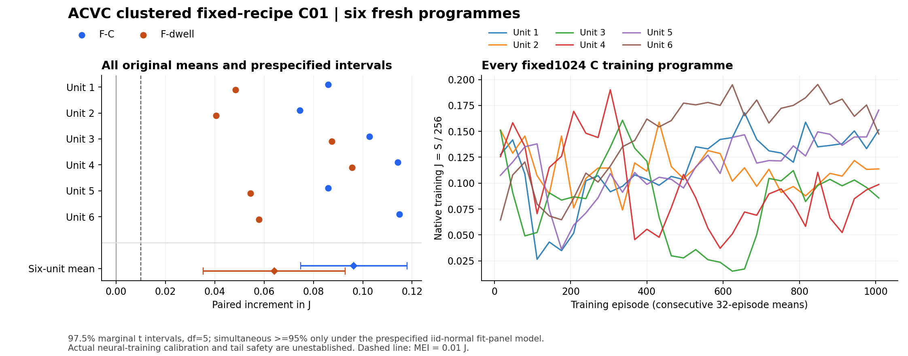

# ACVC fixed-recipe clustered C01 — E0 result evidence

**All six preselected originals are technically complete. Frozen reading: JOINT_ABOVE_MEI.** The result is provisional single-task C-BENCH inference qualified by the prospective iid-normal complete-fit-panel working model. Actual neural-training calibration is unestablished. Full independent scientific review and DM response belong to the [intake](ACVC_CLUSTER_FIXED_RECIPE_C01_INTAKE_20260914.md); initial E0 publication precedes that response.

Native source: 6e8d1b8946e1b2eb0e4207cbc9cc9d006ad2abda. The [card](ACVC_CLUSTER_FIXED_RECIPE_C01_SCIENCE_CARD_20260914.md) and [first draw](ACVC_CLUSTER_FIXED_RECIPE_C01_PROSPECTIVE_FACTS_20260914.json) were frozen at cc7913a2920a49e15b918def066935e0e95cb334 before implementation or learning. [Complete compact analysis](evidence/cluster_fixed_recipe_c01_20260914/INTAKE_ANALYSIS.json) retains every training J, paired vector, sign identity, exposure and native resource. All original raw records and checkpoints remain hash-preserved in the [execution/manifest records](evidence/cluster_fixed_recipe_c01_20260914/EXECUTION_FACTS.json).

## Prespecified expected increments

Each unit averages64 paired J(F)-J(Q) values. The six complete fit-panel means have equal weight, sample SD with ddof1, and SE=SD/sqrt6. Critical t(.9875,df5)=3.1633814497486235. Two97.5% two-sided marginal intervals give at least95% simultaneous coverage only under the stated iid-normal working model for fit-panel means. Shared F dependence is allowed by Bonferroni. Finite-panel noise is already included in unit variance; none is removed or added again. Zero variance would yield no interval, and missing units would yield no six-unit inference. No alternate interval or extra sampling was selected.

| Primary | Mean J | Between-unit SD | Fit-panel SE | Lower J | Upper J | Reading |
| --- | --- | --- | --- | --- | --- | --- |
| F-C | 0.096377354920 | 0.016687023073 | 0.006812448643 | 0.074826981257 | 0.117927728584 | ABOVE_MEI |
| F-dwell | 0.064088940259 | 0.022233338857 | 0.009076722580 | 0.035375804426 | 0.092802076092 | ABOVE_MEI |

Both unrounded lower bounds must be strictly>.01J for joint success. A technically valid complete result consumes this frozen C regardless of polarity or precision; non-pass is not equivalence or universal failure. No survivor, missing-as-zero or replacement occurred.

## Every unit and absolute final arms

| Unit | m / q | C mean J | F mean J | Own-dwell mean J | F-C mean J | F-dwell mean J |
| --- | --- | --- | --- | --- | --- | --- |
| 1 | 13783 / 22845 | 0.153827441568 | 0.239879804951 | 0.191451473547 | 0.086052363383 | 0.048428331404 |
| 2 | 17291 / 22568 | 0.107443793202 | 0.181925426821 | 0.141306982222 | 0.074481633620 | 0.040618444599 |
| 3 | 14179 / 21574 | 0.071917085565 | 0.174649959698 | 0.087233702892 | 0.102732874133 | 0.087416256806 |
| 4 | 13325 / 26056 | 0.063243095491 | 0.177486006797 | 0.081770596621 | 0.114242911306 | 0.095715410176 |
| 5 | 11751 / 28453 | 0.165554704375 | 0.251532436845 | 0.197074142448 | 0.085977732469 | 0.054458294397 |
| 6 | 17639 / 20217 | 0.163512397501 | 0.278289012112 | 0.220392107940 | 0.114776614611 | 0.057896904172 |

Equal-unit descriptive absolute means: C=0.120916419617J, F=0.217293774537J, dwell=0.153204834278J. Descriptive dwell-C=0.032288414661J. J=S/256, so multiply by256 for native team episode sum. Absolute attained endpoints do not establish optimality, tuned generic-baseline competence or improvement over an unmeasured initial-return panel.

## All conditional panels and adverse worlds

| Unit | Contrast | Mean J | Panel SD | Conditional SE | Negative / positive / zero | Minimum J | Maximum J |
| --- | --- | --- | --- | --- | --- | --- | --- |
| 1 | F-C | 0.086052363383 | 0.090293362080 | 0.011286670260 | 11 / 53 / 0 | -0.144286152878 | 0.267305088811 |
| 1 | F-dwell | 0.048428331404 | 0.080460843830 | 0.010057605479 | 16 / 48 / 0 | -0.149130332897 | 0.249438912463 |
| 1 | dwell-C | 0.037624031980 | 0.073179506066 | 0.009147438258 | 13 / 51 / 0 | -0.267121510439 | 0.188942616358 |
| 2 | F-C | 0.074481633620 | 0.073442316070 | 0.009180289509 | 10 / 54 / 0 | -0.075848307949 | 0.303373594989 |
| 2 | F-dwell | 0.040618444599 | 0.068158799317 | 0.008519849915 | 13 / 51 / 0 | -0.147204395061 | 0.229433401231 |
| 2 | dwell-C | 0.033863189021 | 0.055866150616 | 0.006983268827 | 16 / 48 / 0 | -0.093850199277 | 0.152654068454 |
| 3 | F-C | 0.102732874133 | 0.052626177227 | 0.006578272153 | 1 / 63 / 0 | -0.073096793619 | 0.265465541371 |
| 3 | F-dwell | 0.087416256806 | 0.051658585846 | 0.006457323231 | 1 / 63 / 0 | -0.100499729790 | 0.198944341771 |
| 3 | dwell-C | 0.015316617327 | 0.021677862054 | 0.002709732757 | 14 / 50 / 0 | -0.037432096421 | 0.096042558407 |
| 4 | F-C | 0.114242911306 | 0.075065686424 | 0.009383210803 | 1 / 63 / 0 | -0.045306311380 | 0.301731873825 |
| 4 | F-dwell | 0.095715410176 | 0.068502898981 | 0.008562862373 | 2 / 62 / 0 | -0.060651742991 | 0.239700191467 |
| 4 | dwell-C | 0.018527501130 | 0.048059443972 | 0.006007430497 | 14 / 50 / 0 | -0.148161125204 | 0.184798527042 |
| 5 | F-C | 0.085977732469 | 0.071236313514 | 0.008904539189 | 6 / 58 / 0 | -0.089757897306 | 0.328884248767 |
| 5 | F-dwell | 0.054458294397 | 0.075811946560 | 0.009476493320 | 14 / 50 / 0 | -0.134384764895 | 0.294186075922 |
| 5 | dwell-C | 0.031519438072 | 0.070976450209 | 0.008872056276 | 16 / 48 / 0 | -0.161743835058 | 0.194262976855 |
| 6 | F-C | 0.114776614611 | 0.069709342864 | 0.008713667858 | 1 / 63 / 0 | -0.015205390843 | 0.281040665843 |
| 6 | F-dwell | 0.057896904172 | 0.063632227242 | 0.007954028405 | 10 / 54 / 0 | -0.099089182258 | 0.225818200454 |
| 6 | dwell-C | 0.056879710439 | 0.060099779871 | 0.007512472484 | 11 / 53 / 0 | -0.055136456744 | 0.178638802873 |

Every64-value vector and exact adverse/favorable/zero episode identity remains in INTAKE_ANALYSIS and per-unit UNIT_FACTS. Descriptive nested-panel totals: F-C: 30/384 negative, worst -0.144286152878J; F-dwell: 56/384 negative, worst -0.149130332897J; dwell-C: 84/384 negative, worst -0.267121510439J. These counts are not384 independent training units or an iid-world safety sample; no binomial inference was added. Mean support does not certify tails, universal dwell safety or default deployment.

## Actual learning, private interventions and resource accounting

| Unit | Actor displacement | Critic displacement | Recurrent displacement | F / dwell interventions | Wall s | User / system CPU s | Peak RSS KiB |
| --- | --- | --- | --- | --- | --- | --- | --- |
| 1 | 3.170381069183 | 8.874244689941 | 2.592262983322 | 4633 / 3592 | 292.52 | 291.55 / 1.0 | 550228 |
| 2 | 3.495371341705 | 7.846082210541 | 2.865682125092 | 4243 / 3162 | 287.56 | 287.79 / 0.78 | 553480 |
| 3 | 5.358722209930 | 8.201784133911 | 4.485427856445 | 11063 / 3859 | 286.1 | 285.72 / 0.33 | 549552 |
| 4 | 5.378230571747 | 6.581456661224 | 4.463607788086 | 7636 / 1819 | 285.93 | 284.4 / 0.31 | 556932 |
| 5 | 2.936838865280 | 9.354605674744 | 2.309646844864 | 4876 / 3529 | 287.53 | 287.62 / 0.52 | 553288 |
| 6 | 2.544660329819 | 10.351178169250 | 1.983640432358 | 6562 / 4996 | 293.45 | 292.07 / 0.64 | 553164 |

Each original has1024 ordered training episodes,512 two-episode rollouts,2048 persistent Adam/backward updates and three final64-world panels. All1216episode+2048update rows per unit are complete, correctly addressed and finite. Totals:6144train+1152eval=7296episode rows,12288updates,1572864train+294912eval=1867776team ticks,6fresh fits/final checkpoints,18loads,24constructors. Positive actor/critic/recurrent displacements document actual updating, not competence calibration. Full training curves and update records are retained; figure bins are consecutive32-episode display means only.

Five-UAV/fifty-clustered-user H256, native S/J, GRU64, training-only critic, CPU FP32/declared threads1 and all inherited optimizer/loss/RNG consumers remain unchanged. Each fit starts in a fresh process; C,F,dwell separately load its final checkpoint and evolve private recurrent/history/proposal/environment states. Matched exogenous addresses do not impose matched trajectories, trigger counts or dose. C bypass incidence is unmeasured. Complete-package effects do not isolate retrace/history causes.

Native summed wall=1733.090000000000s; summed user/system CPU=1729.150000000000 / 3.580000000000s, aggregate CPU=1732.730000000000s. Native cost per complete fit-panel=288.848333333333s; maximum per-unit peakRSS=556932KiB. Local first dispatch→last observed terminal=3054.763358000000s includes collection/publication/observation latency; it is not summed native wall or CPU. The native reference1777.8s and plans500/unit,3000native,4800support,7800combined remain DM estimates. Focused pytest command wall8.513s measures only one support subset. Cumulative support/provider/agent/lifetime cost remains UNKNOWN, without resetting history or claiming total-plan compliance.

Every adjacent physical/effective-memory admission passed4GiB; every native invocation exited0 within the1800s full-Python timeout inside1860s backstop. No watchdog interruption, scientific retry, seventh fit or endpoint change occurred. [Independent engineering findings and accepted repairs](evidence/cluster_fixed_recipe_c01_20260914/ENGINEERING_REVIEW.json) preserve publication-boundary/CPU defects found before launch, exact repairs and original tests. Creator-owned cleanup rejections remain explicit in [engineering_check.txt](evidence/cluster_fixed_recipe_c01_20260914/engineering_check.txt), without a bypass or scientific invalidation.

## Original preservation and recorded-data verification

| Unit | Archive bytes | Archive SHA256 | Manifest |
| --- | --- | --- | --- |
| 1 | 559717 | a716ecb1afb48fe764d20ce5ad6ef4e6842ed813e2e7eabed066fe94fb8405aa | [original files](evidence/cluster_fixed_recipe_c01_20260914/unit_01/NATIVE_ARCHIVE_MANIFEST.json) |
| 2 | 560565 | 2d028c5a9cf53bf5c85176ba2f1665c73fc9de4796886ac187a673ab074601be | [original files](evidence/cluster_fixed_recipe_c01_20260914/unit_02/NATIVE_ARCHIVE_MANIFEST.json) |
| 3 | 562142 | 708ff37a84ef33aa263ce0073cf7390eab7dba1c0408088fd9cd3f97deb23c4d | [original files](evidence/cluster_fixed_recipe_c01_20260914/unit_03/NATIVE_ARCHIVE_MANIFEST.json) |
| 4 | 561829 | cdd8619c934e9f779fb2ff8eb7b1ac758325ce77464615f9faff3e69e007ae42 | [original files](evidence/cluster_fixed_recipe_c01_20260914/unit_04/NATIVE_ARCHIVE_MANIFEST.json) |
| 5 | 560724 | 1d3fb343bf83c2909be6f327b950bd73b9200a5584f1d6c4b4c046fd812947cc | [original files](evidence/cluster_fixed_recipe_c01_20260914/unit_05/NATIVE_ARCHIVE_MANIFEST.json) |
| 6 | 559917 | c6a6c935535fab477dfc1017a755361550a5a92aa5e85c2c18993fadbd2f10db | [original files](evidence/cluster_fixed_recipe_c01_20260914/unit_06/NATIVE_ARCHIVE_MANIFEST.json) |

Each archive contains8native+6supervisor files, including its original checkpoint. Thirteen original text blobs per unit are published byte-identically; checkpoints remain in the verified retained archive and collected data. The fixed source reducer reads all six complete originals. Independent NumPy mean/SD/SE/interval calculations agree with stdlib reductions within1e-14, and all numeric record trees are finite. The duplicate full-record output and exact reduction command/digest are in INTAKE_ANALYSIS. Intake loads recorded data only, never a model; scientific invocations added=0. Remote reclamation is claimed only by an actual cleanup receipt.

## Forecasts and scientific limits

| Forecast | Probability | Actual | Binary Brier |
| --- | --- | --- | --- |
| F-C | 0.8 | True | 0.040000000000 |
| F-dwell | 0.6 | True | 0.160000000000 |
| joint | 0.55 | True | 0.202500000000 |
| all_six_complete | 0.9 | True | 0.010000000000 |

Interval forecasts were conditional on complete six-unit data; completeness was separate. Owner prediction: not taken (unattended). Judgmental forecasts are not computed power or calibration evidence.

The population is the product of prospectively independent uniform M=10000..19999 and Q=20000..29999 through the fixed clustered1024 learner/private64-world mapping. Twelve first OS-backed calls were sampled with replacement, retained before subsequent checks, without rejection or redraw. Index identifies a unit even if seed values repeat. Independence uses that law and fresh process state, not just different labels. Usual seeded-PRNG interpretation and the iid-normal fit-panel working model remain assumptions; actual neural-training calibration is unestablished.

Three old512 clustered programmes, longer-C and paired512/1024 evidence informed recipe selection and remain outside these six fresh units. Prior paired attenuation coexisted with positive later F increments and stronger attained controls; no duration-causal or pooled inference follows. Failed learned gates, both train-through-F DOWNs and the stopped uncertain/delayed family remain contrary history. The consumed uniform five-fit C01 retains its different population and model qualification. Tuned same-information baseline/oracle headroom is absent; .01J is this card’s MEI, not a measured optimality gap. No default/safety,component causality,transfer or formal-UAV claim follows.

The selected fixed-recipe expectation question is now empirically addressed under its stated qualifications. Full scientific response and the next development/retention judgment remain DM work; Portfolio owns final direction lifecycle. Neither another fit nor PARK is automatically selected by this result.

Native closeout at19:20:29.668364Z is now complete: all84 original files/six local archives were freshly verified, and the exact remote execution worktree, six supervisors and staging copies are absent. [Actual cleanup receipt](evidence/cluster_fixed_recipe_c01_20260914/REMOTE_CLEANUP.json). Local original checkpoints/archives remain; creator-owned rejected test cleanup remains a separate limitation.
