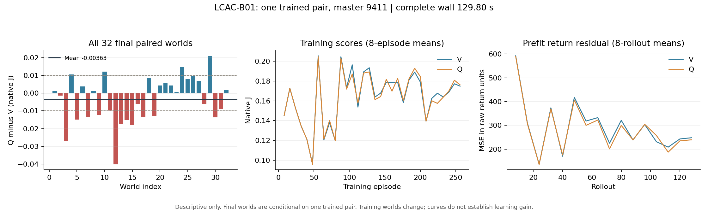

# LCAC-B01 result evidence — master9411

## Frozen rule and observed result

One complete native B/EXPLORE matched training pair, V then Q, at source 133218a8e08c29e833b4d549ffd48f00b204bf2e; [frozen card](LCAC_B01_SCIENCE_CARD_20260914.md) at22260a8e3a5b352412e34b25a779f299ab781f54. Every final panel row is retained. Primary is mean of all32 paired final J_Q−J_V, J=native team-reward sum/256.

The card's rule is: delta>.01 supports considering bounded independent-training follow-up, not stable superiority or isolated credit; inclusive[-.01,.01] is a small/uncertain observation, not equivalence; delta<−.01 is adverse for this object, not universal counterfactual failure. Any sign may motivate a specifically justified next object or PARK, considering absolute competence, costs and defects.

Observed **delta=-0.003626428416 J: WITHIN_MEI**. V mean=0.180680770130; Q mean=0.177054341714. Paired-world descriptive SD=0.013188138801, range[-0.040214995010,0.021082304497],16 negative and16 positive differences. No training-population interval, equivalence or stable-superiority claim follows. These32 worlds are conditional on one trained pair, not32 training replicates. DM's low-confidence small-positive prediction missed the observed sign; owner prediction was not taken (unattended).

## Exposure and integrity

[Raw summary](evidence/b01_seed9411/raw/summary.json), [episode rows](evidence/b01_seed9411/raw/episodes.jsonl), [rollouts](evidence/b01_seed9411/raw/rollouts.jsonl) and [independent intake arithmetic](evidence/b01_seed9411/ANALYSIS.json) agree:

- Per arm256 training/32 final episodes,73,728 native ticks (65,536 train/8,192 final),368,640 separate agent-uniform draws,128 two-episode rollouts,512 Adam calls; one constructor/reset and288 explicit resets.
- Pair576 episodes,147,456 native ticks,737,280 action draws and1,024 Adam calls.
- Q old-baseline2,293,760 rows; V old-baseline65,536 rows; factual critic fit262,144 rows/arm. No counterfactual environment call, intermediate evaluation, extra seed or retry.
- All576 episode IDs, H256, declared reset/action seeds, reward-to-J units and all256 four-epoch rollout records checked; all32 differences recomputed. Separate actor/critic movement is nonzero in every rollout.
- Final checkpoints [V](evidence/b01_seed9411/raw/final_V.pt) and [Q](evidence/b01_seed9411/raw/final_Q.pt), logs and admissions are preserved byte-for-byte with remote/local SHA256 equality in [collection manifest](evidence/b01_seed9411/COLLECTION.json). These are the one final checkpoint per arm.

Scientific-tools run summarizer receives exactly two arm rows with independent-training identifier9411: [input](evidence/b01_seed9411/RUN_SCORES.csv), [output](evidence/b01_seed9411/RUN_SUMMARY.json). Paired run count is1; no episode rows are passed as independent seeds. Collection/analysis used no new native invocation.

## Learning and claim limits

V actor relative displacement0.175213/critic0.525791; Q actor0.176046/critic0.522030. All128 rollouts in each arm moved actor and critic: the scalar learner was not accidentally frozen. V prefit residual mean averaged over first/last16 rollouts fell15.8241→2.1540; MSE450.9445→245.4137. Q mean15.7300→2.1480; MSE448.0668→237.0473. Changing-rollout residuals do not prove convergence, tuned competence, calibrated unchosen-action Q values or variance reduction.

Last-epoch entropy V1.93839/Q1.93951 remains near log(7)=1.94591. First/last32 training-score means are0.15125/0.17120 for V and0.15125/0.17252 for Q; worlds and policies change, so this descriptive shift is not an evaluation estimate of learning gain. No diagnosis of underfit is forced from raw MSE alone.

The finite package comparison includes Q's4,480 extra parameters and factual-Q extrapolation. Similar curves and the near-zero mean cannot establish equal algorithms or ineffective causal credit. No credit/variance isolation was run. Prior continuous-action scores, optimality, tuned headroom and other directions are outside this estimand.

## Complete cost and execution

Configured wsl_4070, CPU FP32/thread1, detached exact-source checkout, one accepted agent-task handle lcac-b01-s9411-133218a8-20260914. Fresh actual-node admission passed immediately before entry. Native Monitor /root/lcac_b01_monitor delivered event MONITOR_TERMINAL-LCAC_B01_9411-20260914T030928Z; supervisor finished0, tmux inactive, runner complete=true.

Outer GNU time covers the entire Python runner through imports, collection, learning, checkpoint/final-panel/summary publication and process exit: **129.80s wall,569,916KiB peak RSS (556.559MiB)**. This is process peak, not simultaneous process-tree memory; no CPU-work claim. V body61.8005s/Q body63.7314s. Shared setup0.7313s is separate, and3.5365s between in-process summary-start and enclosing total remains shared startup/publication/exit overhead. Arm-body clocks are not complete-arm cost or a stable Q/V speed comparison.

Prospective900s/arm and1800s/pair were DM plans, not frozen scientific endpoints; no extension or premature stop occurred. Known pytest durations14.77s, initial remote checkout preparation5.547s, remote focused-check SSH3.266s, changed-check/preparation SSH9.312s, collection/hash transfer4.688s remain scoped support observations, not disjoint quantities to sum blindly. Full support/provider/lifetime cost is UNKNOWN. Implementation/review and synthetic checks consumed zero native scientific exposure.

## DM intake route

DM accepts a technically complete, scientifically interpretable B/EXPLORE observation at this ceiling. [DM intake](LCAC_B01_INTAKE_20260914.md) records the independent result-review question and actual next decision; [Chinese owner brief](../../portfolio/owner/briefs/learned_counterfactual_agent_credit/2026-09-14_LCAC_B01.md).

## All final worlds

| Episode | V J | Q J | Q−V |
| --- | ---: | ---: | ---: |
| 0 | 0.122237985 | 0.123476572 | +0.001238587 |
| 1 | 0.172075302 | 0.170637795 | -0.001437506 |
| 2 | 0.222482684 | 0.195431720 | -0.027050964 |
| 3 | 0.158039693 | 0.168597338 | +0.010557645 |
| 4 | 0.202179458 | 0.187252383 | -0.014927075 |
| 5 | 0.117885969 | 0.121736237 | +0.003850268 |
| 6 | 0.185493657 | 0.172153569 | -0.013340088 |
| 7 | 0.241718733 | 0.242769290 | +0.001050557 |
| 8 | 0.199032251 | 0.186844546 | -0.012187706 |
| 9 | 0.196749202 | 0.208847881 | +0.012098679 |
| 10 | 0.245513840 | 0.235859282 | -0.009654558 |
| 11 | 0.248760658 | 0.208545663 | -0.040214995 |
| 12 | 0.155610058 | 0.138317469 | -0.017292589 |
| 13 | 0.107623798 | 0.092333157 | -0.015290641 |
| 14 | 0.119475096 | 0.101508156 | -0.017966940 |
| 15 | 0.196840698 | 0.190592589 | -0.006248109 |
| 16 | 0.195082488 | 0.181787829 | -0.013294659 |
| 17 | 0.140922195 | 0.149266754 | +0.008344559 |
| 18 | 0.232357551 | 0.219421791 | -0.012935759 |
| 19 | 0.234556512 | 0.238873771 | +0.004317259 |
| 20 | 0.199923569 | 0.205612578 | +0.005689010 |
| 21 | 0.100593358 | 0.104934334 | +0.004340976 |
| 22 | 0.200153065 | 0.200965184 | +0.000812119 |
| 23 | 0.363180740 | 0.377885115 | +0.014704375 |
| 24 | 0.135049125 | 0.143033584 | +0.007984459 |
| 25 | 0.132648315 | 0.142185153 | +0.009536839 |
| 26 | 0.177307004 | 0.184158847 | +0.006851843 |
| 27 | 0.126341220 | 0.120239884 | -0.006101336 |
| 28 | 0.140455898 | 0.161538202 | +0.021082304 |
| 29 | 0.148730441 | 0.135147539 | -0.013582902 |
| 30 | 0.140250076 | 0.131452221 | -0.008797855 |
| 31 | 0.222514009 | 0.224332503 | +0.001818494 |
