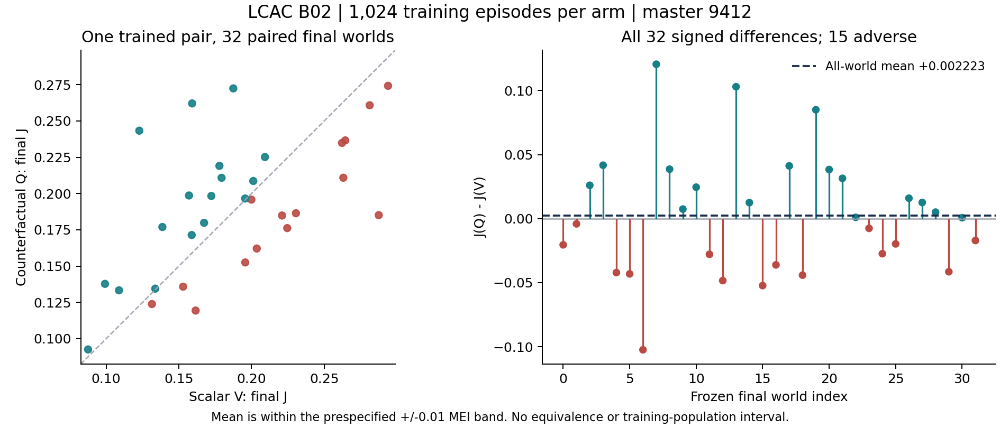

# LCAC-B02 result evidence — master 9412

## Frozen rule and observed result

One complete native B/EXPLORE matched training pair at source 25ea4d61c0e1f2484da77f4bc1851e17cdc8eb4a, with the [1024/32 card](LCAC_B02_SCIENCE_CARD_20260914.md) frozen at 2242a4d601c7fee4ef8cc367653f4e28f0607598. The algorithms, information, native task and per-update settings match B01; intentional changes are the new master, training endpoint, disjoint final reset offset and object metadata.

Primary is the mean of ALL 32 paired final J_Q−J_V, J = native team-reward sum / 256. Observed **delta = +0.002222628212 J: WITHIN_MEI**, using the unchanged inclusive [-0.01,+0.01] rule. V mean 0.188445707853; Q mean 0.190668336065. All 15 negative and 17 positive differences remain; descriptive SD 0.046965825987, range [-0.102406984831,+0.120542425867]. DM's low-confidence WITHIN_MEI prediction matches the categorical outcome; sign was not forecast. Owner prediction not taken (unattended); clean-boundary reviews returned no instructions.

This is one trained pair at this endpoint, with 32 conditional final worlds. It does not establish equivalence, reliable superiority, a training-population interval, causal credit or variance reduction. The small mean coexists with substantial signed variation; the average does not imply uniform effects across worlds. No exclusions or post hoc subgroup claim.

## Exposure and integrity

[Summary](evidence/b02_seed9412/raw/summary.json), [all episode rows](evidence/b02_seed9412/raw/episodes.jsonl), [all rollout rows](evidence/b02_seed9412/raw/rollouts.jsonl) and [offline arithmetic](evidence/b02_seed9412/ANALYSIS.json) agree:

- Per arm: 1,024 training + 32 final episodes; 270,336 native ticks (262,144 train / 8,192 final); 1,351,680 separate agent-uniform draws; 512 two-episode rollouts; 2,048 Adam calls; one constructor/reset and 1,056 explicit resets.
- Pair: 2,112 episodes, 540,672 native ticks, 2,703,360 draws, 4,096 Adam calls.
- Q old-baseline 9,175,040 rows; V old-baseline 262,144 rows; factual critic fitting 1,048,576 rows per arm.
- All episode IDs, H256, reward-to-J units and action/reset seeds checked, including disjoint training reset seeds 941201000–941202023 and final seeds 941203000–941203031. All 1,024 rollout records have four epochs. All 32 signed differences recomputed exactly.
- [Eight-file collection](evidence/b02_seed9412/COLLECTION.json) verifies remote/local SHA256 equality for both final models, rows, summary, admission, outer timing and supervisor log. Safe CPU weights_only checkpoint readback checks finite tensors, exact source/card/object/seed/config/offset metadata and actor 35,159 / V critic 34,177 / Q critic 38,657 parameters.
- No native pilot, intermediate evaluation, selected checkpoint, extra seed, retry, new fit or counterfactual environment call occurred.

[Run summarizer input](evidence/b02_seed9412/RUN_SCORES.csv) has exactly two arm rows and one independent trained-pair identifier 9412; [output](evidence/b02_seed9412/RUN_SUMMARY.json) gives paired n=1. Its difference of separately averaged scores agrees to floating arithmetic with the mean of paired differences. B01's 256 endpoint is not pooled into this 1024 group.

## Learning and limits

Actor/critic parameters moved in all 512 rollouts of each arm. V relative actor/critic displacement = 0.392027 / 1.205021; Q = 0.408103 / 1.211930. Both learners executed substantial updates; movement alone does not establish tuned competence.

First/last 16-rollout mean factual prefit residuals: V 14.1500→3.4403 and Q 14.0807→1.7545. Corresponding MSE: V 352.5882→165.1290 and Q 350.7100→80.2790. Last rollout MSE remains V 416.5729 / Q 180.5029. These changing-policy/world factual residuals do not assess marginalized baselines, unchosen-action calibration, gradient variance or convergence.

Last-epoch entropy is V 1.82944 / Q 1.93651, versus log(7)=1.94591. Both actor preclip norms stay below 0.5 (maxima 0.066779 / 0.066764); V critic norms always exceed 0.5 (minimum 0.687902), while Q minimum is 0.210537. These are retained diagnostics, not proof that a clip or entropy setting is a defect. No optimizer/clip/normalization repair follows from them.

First/last 32 training-score means: V 0.13856→0.19754 and Q 0.13856→0.16384. Training worlds and policies change; this is not a matched evaluation estimate of learning gain or evidence selecting a checkpoint.

B01 at master 9411 / 256 gave delta −0.00362643 and B02 gives +0.00222263. Each observed average is within the same MEI band, but there is only one trained pair at each endpoint. Changed training and final randomness prevents causal attribution to training duration. Neither two exploratory means nor the change in descriptive world SD establishes stable parity, inefficacy or a duration interaction. Package differences include Q's extra 4,480 parameters and its factual-fit extrapolation.

## Cost and completed execution

Handle lcac-b02-s9412-25ea4d61-20260914 on wsl_4070, CPU FP32 / one thread, exact detached source. Fresh admission passed with effective available 15,631,114,240 bytes against 4,294,967,296. Monitor event LCAC_B02_9412_20260914-terminal-20260914T041432Z and DM direct status read agree: finished, exit 0, PID 3655108, tmux inactive, complete=true; native monitor active_set empty.

Enclosing GNU time records **443.91 seconds wall and 570,212 KiB peak RSS (556.848 MiB)**. It includes imports, setup, training, final evaluation, checkpoints/summary and process exit. V body 210.374751 s; Q body 222.511341 s; shared setup 0.679633 s. The remaining 10.343961 s is unassigned startup/publication/exit, not a complete per-arm cost or isolated Q overhead estimate. CPU/process-tree work remains unmeasured. The 600 s plan was an estimate; the frozen scientific endpoint completed without extension.

Known focused support: 2.76 s pytest nested within 11.515 s SSH/setup; collection/hash transfer 5.602431 s; safe checkpoint read 0.009129 s. Overlapping scopes are not summed. Complete support, model-provider cost and direction lifetime cost remain UNKNOWN.

Completed B01+B02 native execution, kept as separate objects: 2,688 episodes; 688,128 native ticks; 5,120 Adam calls; 11,468,800 Q-baseline rows; 2,621,440 total factual-fit rows. Whole-run wall sum 573.71 s; this is a sum of two disjoint runner processes, not study elapsed, CPU work or total research cost. Peak RSS maximum is 556.848 MiB, not a sum.

## Intake and next action

DM accepts this complete, limited B/EXPLORE observation. [Intake](LCAC_B02_INTAKE_20260914.md#full-independent-review-and-actual-dm-decision) records the completed independent review and substantive DM response: narrowly select one unchanged1024/32 B03 pair, master9413, over immediate PARK. The prior working PARK preference was never applied. [Chinese owner brief](../../portfolio/owner/briefs/learned_counterfactual_agent_credit/2026-09-14_LCAC_B02.md).

## All final worlds

| Episode | V J | Q J | Q−V |
| --- | ---: | ---: | ---: |
| 0 | 0.281313084 | 0.260845464 | -0.020467621 |
| 1 | 0.199911307 | 0.195826417 | -0.004084891 |
| 2 | 0.172339094 | 0.198352382 | +0.026013289 |
| 3 | 0.156981778 | 0.198667195 | +0.041685417 |
| 4 | 0.161537086 | 0.119393230 | -0.042143857 |
| 5 | 0.195673265 | 0.152542950 | -0.043130315 |
| 6 | 0.287537334 | 0.185130349 | -0.102406985 |
| 7 | 0.122785220 | 0.243327646 | +0.120542426 |
| 8 | 0.099170367 | 0.137780162 | +0.038609796 |
| 9 | 0.201210195 | 0.208655078 | +0.007444882 |
| 10 | 0.108812564 | 0.133345124 | +0.024532560 |
| 11 | 0.264498173 | 0.236626958 | -0.027871215 |
| 12 | 0.224584068 | 0.176193117 | -0.048390951 |
| 13 | 0.159130857 | 0.262104589 | +0.102973732 |
| 14 | 0.167347487 | 0.179823395 | +0.012475908 |
| 15 | 0.263182389 | 0.210895428 | -0.052286961 |
| 16 | 0.221006811 | 0.184884537 | -0.036122274 |
| 17 | 0.177905390 | 0.219070430 | +0.041165040 |
| 18 | 0.230559871 | 0.186426101 | -0.044133770 |
| 19 | 0.187462056 | 0.272442648 | +0.084980591 |
| 20 | 0.138675434 | 0.176969711 | +0.038294277 |
| 21 | 0.179394647 | 0.210850786 | +0.031456138 |
| 22 | 0.195618728 | 0.196607287 | +0.000988558 |
| 23 | 0.131475763 | 0.123880178 | -0.007595585 |
| 24 | 0.262268522 | 0.234887947 | -0.027380575 |
| 25 | 0.293953696 | 0.274225302 | -0.019728394 |
| 26 | 0.209245841 | 0.225163927 | +0.015918086 |
| 27 | 0.158843185 | 0.171438379 | +0.012595194 |
| 28 | 0.087520702 | 0.092581659 | +0.005060957 |
| 29 | 0.203622106 | 0.162136576 | -0.041485531 |
| 30 | 0.133761640 | 0.134475775 | +0.000714135 |
| 31 | 0.152933989 | 0.135836028 | -0.017097961 |
