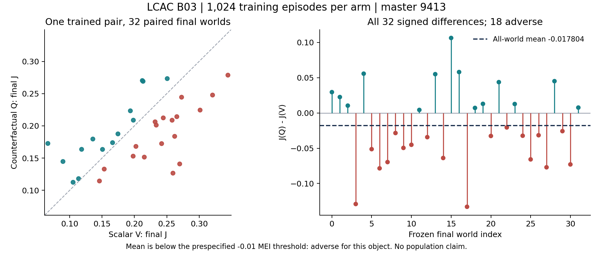

# LCAC-B03 result evidence — master9413

## Frozen result and prediction

The [new independent1024/32 card](LCAC_B03_SCIENCE_CARD_20260914.md), frozen at4db0277c51af20fee1516ae82a1f2b988ac5ee74, ran unchanged at source81fec5e1b3a2cee810029f0cd30713a0ea64fce3. Primary is mean of ALL32 paired final J_Q−J_V, J=unchanged native reward sum/256.

**Q−V=−0.017804409335 J: ADVERSE**, below the predeclared−0.01 threshold. V mean0.206599115202, Q mean0.188794705867. There are18 adverse and14 favorable worlds; descriptive SD0.055318436342, range[−0.132984481148,+0.106356693366]. Preserve every signed row; neither positive-world selection nor pooling changes this object's primary.

DM's low-confidence WITHIN_MEI categorical prediction was wrong. Owner prediction not taken (unattended); no owner reviews were pending at intake. This one pair does not establish stable inferiority, ineffective counterfactual credit, a population interval or universal method failure.

## Complete exposure and integrity

[Raw summary](evidence/b03_seed9413/raw/summary.json), [episodes](evidence/b03_seed9413/raw/episodes.jsonl), [rollouts](evidence/b03_seed9413/raw/rollouts.jsonl), [offline arithmetic](evidence/b03_seed9413/ANALYSIS.json) and [checkpoint readback](evidence/b03_seed9413/CHECKPOINT_READBACK.json) agree:

- Per arm1024 training/32 final episodes,H256;270336 native ticks,1351680 separate uniform draws,512 rollouts,2048 Adam calls; one constructor/reset and1056 explicit resets.
- Pair2112 episodes,540672 native ticks,2703360 draws,4096 Adam. Q old-baseline9175040 rows; V baseline262144; factual-fit1048576 rows/arm.
- All2112 episode IDs, horizon/reward-to-J units and declared reset/action seeds verified. Training resets941301000–941302023 and finals941303000–941303031 are disjoint. All1024 rollout records contain four epochs; all32 differences recomputed.
- All eight model/data/receipt files match remote/local SHA256 in [collection](evidence/b03_seed9413/COLLECTION.json). Safe weights_only CPU readback confirms exact object/card/source/seed/offset/config and finite tensors: actor35159 parameters, V critic34177/Q critic38657.
- No extra seed, native pilot, intermediate evaluation, selected checkpoint, scientific retry, counterfactual environment call or unplanned fit.

## Learning and diagnostic limits

Actor and critic moved in all512 rollouts per arm. V relative actor/critic displacement0.383672/1.197687; Q0.409876/1.076300. Both learned parameters, but this alone is not evidence of useful policy improvement, tuned competence or convergence.

First/last16-rollout average factual residual mean: V16.6879→5.4453; Q16.5977→5.4525. MSE V483.8941→251.0197; Q481.0942→242.3970. Last rollout MSE V332.2947/Q304.0898. These are evolving-world/policy factual residuals, not unchosen-action calibration, marginalized baseline error or gradient variance.

Last-epoch entropy V1.90722/Q1.91759, log7≈1.94591. Actor preclip maxima0.067673/0.085978 are below0.5; critic minima0.106325/0.177001 are below0.5. This differs from B02's every-epoch V critic clipping but does not identify an optimizer defect or a stable mechanism. Norm clipping remains distinct from PPO ratio clipping.

First/last32 training-score means V0.16358→0.21602, Q0.16360→0.20561. Changing worlds and policies prevent interpreting these as controlled evaluation learning gains. No clip/normalization/entropy repair is selected from these diagnostics.

## Same-endpoint descriptive context

[Run summary](evidence/b03_seed9413/RUN_SUMMARY.json) treats B03 as one trained pair. [Same-endpoint input](evidence/b03_seed9413/SAME_ENDPOINT_RUN_SCORES.csv) contains FOUR arm rows, masters9412/9413, and [summary](evidence/b03_seed9413/SAME_ENDPOINT_RUN_SUMMARY.json) contains TWO independent complete procedures:

| Object/master | Training per arm | V J | Q J | Q−V | Frozen reading |
| --- | ---: | ---: | ---: | ---: | --- |
| B02/9412 |1024|0.188445708|0.190668336|+0.002222628|WITHIN_MEI|
| B03/9413 |1024|0.206599115|0.188794706|−0.017804409|ADVERSE|

Descriptive mean of these two pair differences−0.007790890562; between-pair sample SD0.014161254056. No interval, stable parity or population sign is inferred from n=2. This context does not reclassify B03 as within-MEI or replace its primary. New master changes training and final randomness together, so observed differences do not isolate training variance. B01's256 endpoint remains outside this group.

## Execution and complete cost

One detached wsl_4070 CPU FP32/thread1 handle lcac-b03-s9413-81fec5e1-20260914; launch04:55:14Z, terminal event at05:03:32Z. Fresh actual-node admission passed. Supervisor finished0/tmux inactive, raw summary complete=true. Monitor's early adoption-only final was resumed on the SAME child; terminal facts arrived in native final. Its stale last-observation fields were reconciled to DM's direct finished0 receipt. Final active_set/pending_notices empty and delivery SENT.

Enclosing GNU time: **498.62s wall**,573156KiB peak process RSS (559.723MiB), exit0. This includes imports/setup/training/final evaluation/model-summary publication/exit. The monitor's498-second duration is rounded, and later supervisor uptime is not runner wall. V body233.715847s/Q body251.003444s; shared setup0.744965s; unassigned startup/publication/exit13.155251s. None is an isolated Q overhead estimate or complete per-arm cost.600s was a plan, not a kill threshold; exposure completed unchanged.

Known support: binding check0.312714s, remote preparation7.933751s, launch SSH0.419605s, transfer/hash4.490810s, safe checkpoint read0.008531s; these are scoped observations, not total research work. CPU and complete support/provider/lifetime cost remain UNKNOWN.

[Completed cumulative execution](evidence/b03_seed9413/CUMULATIVE_EXECUTION.json): B01+B02+B03 total4800 episodes,1228800 native ticks,6144000 draws,9216 Adam calls,20643840 Q-baseline rows,4718592 factual-fit rows. Whole-run wall sum1072.33s, maximum single-process peak559.723MiB. This sum is not study elapsed, CPU work, a cross-budget pooled efficacy result or total research cost.

## DM decision and evidence handoff

DM accepts this technically complete adverse B/EXPLORE observation, with limits above. [Intake](LCAC_B03_INTAKE_20260914.md) records actual PARK selection and review coverage; [Chinese brief](../../portfolio/owner/briefs/learned_counterfactual_agent_credit/2026-09-14_LCAC_B03.md); [PARK knowledge/reopening record](PARK.md). No new experiment or Pro request is selected.

## All final worlds

| Episode | V J | Q J | Q−V |
| --- | ---: | ---: | ---: |
| 0 | 0.193744387 | 0.223299738 | +0.029555351 |
| 1 | 0.250694340 | 0.273284402 | +0.022590061 |
| 2 | 0.198350773 | 0.208764651 | +0.010413878 |
| 3 | 0.269933805 | 0.140851254 | -0.129082551 |
| 4 | 0.213346226 | 0.269072402 | +0.055726176 |
| 5 | 0.265516525 | 0.214238780 | -0.051277745 |
| 6 | 0.262186681 | 0.183709963 | -0.078476718 |
| 7 | 0.242027179 | 0.172400148 | -0.069627031 |
| 8 | 0.272859809 | 0.244425350 | -0.028434459 |
| 9 | 0.258225610 | 0.208704426 | -0.049521184 |
| 10 | 0.198039854 | 0.152926628 | -0.045113226 |
| 11 | 0.113723687 | 0.118054497 | +0.004330810 |
| 12 | 0.202342770 | 0.168078359 | -0.034264411 |
| 13 | 0.089613384 | 0.144643778 | +0.055030393 |
| 14 | 0.215284889 | 0.151443068 | -0.063841820 |
| 15 | 0.066301287 | 0.172657981 | +0.106356693 |
| 16 | 0.212224088 | 0.270257121 | +0.058033033 |
| 17 | 0.259548716 | 0.126564235 | -0.132984481 |
| 18 | 0.105243691 | 0.112409944 | +0.007166254 |
| 19 | 0.174564622 | 0.187496794 | +0.012932173 |
| 20 | 0.233714841 | 0.201112882 | -0.032601959 |
| 21 | 0.135789164 | 0.179525662 | +0.043736498 |
| 22 | 0.153363292 | 0.132864628 | -0.020498664 |
| 23 | 0.150708689 | 0.163424975 | +0.012716286 |
| 24 | 0.244599659 | 0.212329638 | -0.032270020 |
| 25 | 0.344456838 | 0.278656612 | -0.065800226 |
| 26 | 0.145972873 | 0.114405801 | -0.031567072 |
| 27 | 0.301452209 | 0.224433838 | -0.077018371 |
| 28 | 0.118427210 | 0.163541384 | +0.045114174 |
| 29 | 0.231964769 | 0.206204380 | -0.025760389 |
| 30 | 0.320711085 | 0.247761827 | -0.072949257 |
| 31 | 0.166238735 | 0.173885440 | +0.007646705 |
