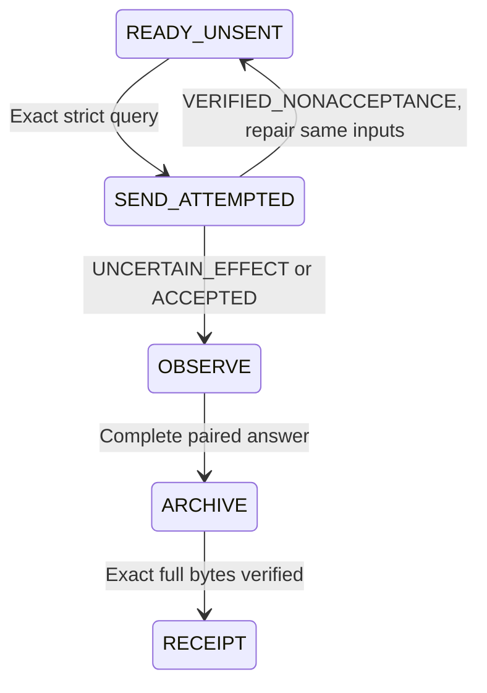

# MGTAP Transport workflow engineering acceptance

## Assignment and L0

Root assigned the full Transport redesign on 2026-09-12: one exact handoff/manifest
preflight, one explicit Send or no Send, same-request bounded observation/archive,
and one direct native receipt. The owner specifically requested screenshot/CUA
state sampling and fixtures for verified nonacceptance, uncertain effect and
accepted effect. This is engineering work; MGTAP science, lifecycle and empirical
allocation are unchanged.

- Deliverable: the minimal current native workflow, focused behavioral tests,
  independent external-effect review and one exact MGTAP live exercise if still unsent.
- Ownership: DM `/root/dm_mgtap_resume`, checkout
  `C:/Projects/HMASD-worktrees/dm-n5-continue-20260904`, branch `codex/mgtap`.
  Owned edits are Transport skill/scripts/references, its role and adjacent route
  docs, focused `tests/skills`/fixture files and this evidence record. Agentify's
  implementation is a read-only dependency; Root integrates shared control changes.
- Protected semantics: original HANDOFF/TASK/prompt bytes, Portfolio conversation,
  one immutable operation identity, single writer, full immutable response and
  distinction between receipt and scientific answer. Historical IDs remain provenance;
  the current native parent/operator are recorded separately.
- Acceptance: exact frozen legacy and current-native inputs, route ownership,
  provider/Pro and protected-tab checks, failed preflight recovery, uncertain/accepted
  observation without Send, archive hash/size/conflict and one native receipt.
  Engineering Scope §7.3 requires independent Reviewer coverage of external effects.
- Budget/stop: only short control-plane fixtures and validator checks, using system
  Python 3.11+ and existing Node; all scratch under invocation-owned `temp/` and
  removed after preserving diagnostics. No scientific compute, new request or
  empirical implementation. An external Send is only the already authorized exact
  MGTAP request after demonstrable nonacceptance and repaired readiness.

Scope §4: none. No service, scheduler, transport relay or new scientific gate.

## Baseline evidence

At clean starting revision `766b72b89`, the immutable request at
`9929beb6eb699b94603a1dfd5d200363e5802ed1` fails the existing validator with
`Transport singleton config must be schema 1, singleton, and active` under current
`dm_native` configuration. Independent Reviewer reproduced this without browser writes.
Existing receipt helpers use the historical parent and cannot represent the assigned
native recovery parent while preserving original metadata.

The actual strict operation `19ca18f5-1683-418c-b204-e03873309af7` failed
`TAB_KEY_MISMATCH` before Send: `sendAttempted=false`, no user/assistant IDs and no
archive. The repaired dedicated tab is keyed `portfolio:cross_direction`; one
non-sending strict preflight verified Latest/Pro. This is verified nonacceptance,
not an uncertain Send. Historical registry parent metadata also differs from the
frozen handoff; the discrepancy must be retained alongside the current native route.

The CUA inspection of the same Portfolio URL showed an empty composer and `6 Pro`
with historical receipt content. A screenshot cannot prove that this particular
request was never accepted; exact request/operation evidence supplies that fact.
The Agentify DOM sample also labelled sidebar titles containing “Continue” as
generation controls. Only controls in the current response/composer count for the
page reading. The CUA inspection tab was closed after the screenshot.

## State transitions and why each step remains

1. One immutable preflight protects the actual request, model, target and single writer.
   The page sample supplies visible facts; the registry and operation supply hidden identity
   and effect history. Failed pre-Send checks do not require another parent authorization.
2. One effect branch prevents duplicate external effects while permitting an unchanged,
   demonstrably unsent request to proceed after a real repair. Workflow bookkeeping alone
   is not evidence of an external click. Retained acceptance history remains controlling.
3. Bounded observation plus the existing strict completion test protects the paired complete
   answer. Exact full-file archival keeps a short delivery receipt distinct from science.
4. One current-parent native receipt makes that archive available for author intake.
   Frozen historical routes and any earlier receipt remain intact.

Removed from the ordinary loop: repeated DOM/account/identity inventories; separate model-menu
confirmation after a successful strict preflight; repeated parent release questions after known
pre-Send failure; an extra operator stability loop; unchanged status broadcasts; Root/app-task
receipt forwarding and ACK loops. None changes binding, external-effect or archive conclusions
once the corresponding evidence exists. First-binding retains its existing explicit Agentify
route; the new recovery helper explicitly handles existing-conversation GitHub handoffs only.

## Validation and independent review

System Python 3.11 and existing Node v24.18.0; no dependencies installed. Commands use
`python -B -m pytest -q -p no:cacheprovider --basetemp <owned temp/tests invocation> <paths>`.

| Focus | Result |
| --- | --- |
| New workflow + existing native transport + send recovery | 90 passed, 3.58 s |
| Existing transport, conversation binding, prompt author, round reset compatibility | 158 passed, 3.83 s |
| Final workflow after independent-review corrections | 49 passed, 3.38 s |
| Role TOML parsing and `git diff --check` | Passed |

The real Agentify `runReviewQuery` dependency was imported from
`C:/Projects/agentify-desktop/review-transport.mjs`, SHA-256
`71a5c377315be9fb3a4de8cf4cff4cdf913bdd6f114b2e5b0e46a47ea4647a86`.
The dry-run uses the exact committed MGTAP prompt; browser/controller effects and all state/output
paths are test fixtures. It reproduces TAB_KEY_MISMATCH/false, repairs the tab while retaining
the operation, records one mocked Send, then observes and archives. A separate crash-after-attempt
fixture observes the same operation without another Send. Exact archive hash/size/conflict,
unknown-operation refusal and immutable input conflict are checked. These tests do not establish
live provider behavior and spend zero scientific invocations.

The screenshot fixture and explicit interpretation are
`tests/fixtures/native_transport/page-ready.png` and `page-ready.json`. SHA-256:
`1a26fb1cb814c69278bb02ee4f1d144d09640d294cc363b80ff280ddd270510a`.
Both DM and independent Reviewer inspected the image. It is an annotated human reading,
not an automated pixel classifier; negative page/model/key/protection cases mutate its
interpreted facts. The actual pre-Send operation receipt is preserved in `mgtap-presend.json`.

Independent Astra/high Reviewer `/root/dm_mgtap_resume/rv_ah_transport` found and the DM repaired:
accepted legacy history ignored by Send classification; generation key lost on successor;
same conversation claimable by another node; newer mirror-only effects overwritten; and a
helper boundary that incorrectly implied first-binding support. Each has a regression. The
Reviewer completed correction review with no remaining material finding and independently
reproduced the repaired boundaries. DM accepts this bounded existing-conversation workflow;
live provider behavior is the separate next exercise. Self-review is not independent review.

The first test invocation found slash-root Git-path handling on Windows; this was repaired.
Its temp parent was missing, producing fixture setup errors; subsequent invocations created
the parent explicitly. Routine failures are engineering facts, not scientific evidence.

## Cleanup and live continuation

Runtime automatic approval review rejected the combined test/cleanup command, then separately
rejected exact-path `Remove-Item -LiteralPath .../temp/tests/mgtap-transport-redesign-02 -Recurse -Force`
after the resolved target was verified. No bypass was attempted. Retained owned directories under
this checkout's `temp/tests/`: `mgtap-transport-redesign-02`, `mgtap-transport-compatibility-01`,
`mgtap-transport-final-01`, `mgtap-transport-review-01`, `mgtap-transport-review-02`.
The failed initial `mgtap-transport-redesign-01` directory does not exist. The original screenshot
scratch under main's `temp/directions/metric_ground_transport_allocation/transport-redesign-20260912`
is also retained; the necessary image is now committed as a fixture. Cleanup remains a concrete
runtime restriction, not a scientific or Send prerequisite.

Live continuation is separate from repair acceptance. The native child will reuse the original
MGTAP HANDOFF and operation after final review/publication, reconcile current effects once,
and take its unique branch. No new performance observation or Portfolio decision has formed
in this engineering work; MGTAP remains ACTIVE and fresh cap/cost fields remain unassigned/unknown.

## 2026-09-13 visibility follow-up and live effect

Root relayed the owner's added requirement: before ending a bounded assignment at completion,
a material conflict or no-current-work/ACTIVE, send one direct native action message containing
assignment, status, evidence/commit and next step. The skill, role and sibling communication
instructions now state this. Nonarchive boundary messages no longer require a completed answer;
they preserve the request's existing effect state and earlier return history. Unchanged waits
produce no message. Active Pro generation is ongoing work, not a terminal prerequisite merely
because several bounded calls time out.

Focused follow-up coverage: 56 workflow tests passed in 4.03 s. It covers nonarchive actionable
messages, current direct destination, unchanged-wait silence, old receipt deduplication, delivering
a historical pending receipt without changing a newer one, and refusing a second COMPLETE answer
across an intervening conflict. Independent Reviewer found the latter two edge cases; DM repaired
them and the Reviewer independently replayed both corrected cases with no material finding. DM
accepts this visibility follow-up. Additional retained scratch: `mgtap-transport-boundary-01`
and `mgtap-transport-boundary-review-01`, under the same recorded cleanup restriction.

The actual live preflight passed at `NATIVE_PREFLIGHT.json` under main's existing runtime archive
`temp/sessions/hmasd-chatgpt-pro-transport/archive/portfolio/2026-09-12-mgtap-unequal-exposure-investment-01/`.
The unchanged operation `19ca18f5-1683-418c-b204-e03873309af7` made one Send attempt, then strict
Agentify returned `USER_MESSAGE_CONTENT_MISMATCH`. Persisted `sendAttempted=true`/click count 1
means UNCERTAIN_EFFECT, permanently observation-only while acceptance remains possible. The
dedicated tab displayed the exact conversation, empty composer and active Stop answering.
No paired current provider IDs or full response was yet available at this record boundary.
The original mismatch and subsequent bounded observations remain in
`AGENTIFY_OPERATION_19ca18f5-1683-418c-b204-e03873309af7_FINAL_OBSERVATION.json` and
`..._IMPASSE_OBSERVATION.json`. Those filenames are historical operator labels; active generation
was not accepted as a terminal impasse. The DM resumed the same child's non-sending observation
and sent Root one action update. No second Send, new idempotency key, scientific invocation or
Portfolio decision was created. Full-response intake remains the dependent outstanding work.
