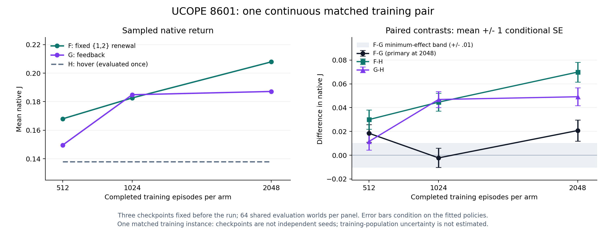

# UCOPE continuous short fixed renewal B01 /8601 — E0 result evidence

## 1. Object, frozen question and accepted execution

**VALID COMPLETE / UP**, **B/EXPLORE**, one matched continuous training
instance **8601**. The [card §§1–7](UCOPE_UAV_SHORT_FIXED_RENEWAL_CONTINUOUS_B01_SCIENCE_CARD_20260909.md)
was frozen at **66ddec1278e0e170644ee14b155fbd0292b04e57**. Each raw F/G arm
trained2048 episodes continuously; evaluations at512/1024/2048 used64 common
worlds each, with H evaluated once on those same64 worlds. The final2048
**F−G** is primary, **MEI absolute0.01 J**. No checkpoint was selected after
seeing output. F kept its frozen whole duration head and half-{1,2} law;
G had every-step feedback; both used raw targets/None value moments.

Exactly one scientific invocation used source
**8a2e20630c6d68f7faed1c54a39ffc792b922fc6** after Root source acceptance and
integration. Prelaunch binding **5535b65657e6ca2bf1c135dc2f8641493505f5ac**,
launch/dispatch **dfad434f7f76bb21ea9b206f69bf6b65ec822166**, CM terminal
collection **fbd3b7973c55999caff23d4b3cf608b3f6b94dcb** are published.
See [CM execution evidence §§1–4](UCOPE_UAV_SHORT_FIXED_RENEWAL_CONTINUOUS_B01_8601_EXECUTION_EVIDENCE_20260909.md)
for literal command, source readback, admission, supervisor and collection.

Node **hmasd-wsl-node**, CPU FP32/one Torch thread; detached exact-source cwd
`/home/wu/hmasd-worktrees/ucope-uav-short-fixed-renewal-continuous-b01-8601-20260909`.
The identically named agent-task handle/PID3072579 finished **exit0**, tmux
inactive, exit **2026-09-09T22:23:14Z**. Root confirmed independent Monitor
ownership and resumed the original CM at terminal. DM did not repeat remote
observation, learner/evaluation execution or the accepted test suite.

## 2. Reading rule applied verbatim

Card§5: **“UP: Delta_2048 > +0.01”** gives **“Preliminary favorable
short-renewal package evidence after the allocated training budget on this
one fitted pair.”**

Card§5 completeness: **“Final F/G completeness governs the primary; full
allocation completion also requires both full training histories, all three
scheduled panels and H.”** Both are satisfied. Final
**Delta_2048=+0.020735036726797745**, conditional evaluation SE
**0.00894880856314393**: **0.010735036726797745 above +0.01**.
Its64 paired worlds have37 positive,27 negative and0 zero differences.
The UP reading uses this fixed unrounded point, not an interval or a selected
earlier checkpoint. Conditional SE is not training-population uncertainty.

## 3. Full fixed curve and all hover comparisons

`J = reward_sum / 256`, using the native summed team reward. All448 evaluation
returns and all nine64-element contrast vectors are retained in the
[durable summary](UCOPE_UAV_SHORT_FIXED_RENEWAL_CONTINUOUS_B01_8601_RESULT_SUMMARY_20260909.json).
H appears once in the raw episodes and is paired with every checkpoint.

| Training episodes per arm | F mean J | G mean J | Shared H mean J | F−G point reading |
| ---: | ---: | ---: | ---: | --- |
| 512 | 0.16799601048515983 | 0.14957995565113114 | 0.13801805969093345 | UP |
| 1024 | 0.18260954227229373 | 0.18486340413648633 | 0.13801805969093345 | WITHIN |
| 2048 | 0.20788322088908806 | 0.18714818416229032 | 0.13801805969093345 | UP — primary |

| Training episodes | Contrast | Mean | Conditional SE | Positive / negative / zero |
| ---: | --- | ---: | ---: | --- |
| 512 | F−G | +0.018416054834028712 | 0.007422104542138038 | 41 / 23 / 0 |
| 512 | F−H | +0.029977950794226403 | 0.008168973740658562 | 46 / 18 / 0 |
| 512 | G−H | +0.011561895960197691 | 0.007330204722034588 | 41 / 23 / 0 |
| 1024 | F−G | −0.0022538618641926057 | 0.008083059000563988 | 30 / 34 / 0 |
| 1024 | F−H | +0.044591482581360295 | 0.0075641964239017145 | 51 / 13 / 0 |
| 1024 | G−H | +0.046845344445552904 | 0.006735532405683681 | 55 / 9 / 0 |
| 2048 | F−G | +0.020735036726797745 | 0.00894880856314393 | 37 / 27 / 0 |
| 2048 | F−H | +0.06986516119815461 | 0.008284091075112146 | 53 / 11 / 0 |
| 2048 | G−H | +0.049130124471356874 | 0.00755670795650168 | 53 / 11 / 0 |

[Vector figure](UCOPE_UAV_SHORT_FIXED_RENEWAL_CONTINUOUS_B01_8601_CURVE_20260909.svg).
Connections show the three scheduled measurements, not a fitted smooth curve.
Across512→2048, F's observed mean rises **0.03988721040392823** and G's rises
**0.03756822851115918**. G has most of its observed gain by1024, where its
point slightly exceeds F; F's final gain restores an above-MEI F−G point.
The final gap is0.0023189818927690335 higher than the512 gap. These are
within-history descriptive changes with checkpoint-private evaluation action
draws, not independent learning replications or a general monotonicity claim.

## 4. Exposure, conformance and complete cost

Both real fits completed2048 training episodes/1024 rollouts/4096 Adam calls.
Total **4096 training episodes,1048576 training native steps,2048 rollouts,
8192 Adam calls,448 evaluation episodes,114688 evaluation steps**:
**1163264 native steps**,4544 explicit resets and two constructor resets.
No diagnostic frames, partial episode steps or additional scientific invocation
occurred. Every rollout has four finite epoch records. Training and evaluation
reset domains are disjoint; all checkpoint/episode labels match the card.

F/G each have66311 trainable parameters; F total68553 includes2242 frozen
duration parameters. The hidden head remains randomly initialized/nonzero,
its final66 parameters zero, and the full head's measured displacement is0
at all checkpoints. Common actor displacement is F4.000129699707031 and
G3.3026249408721924; relative to initial norm,0.3234258009963046 and
0.26702987079898766. Critic displacement is F13.240640640258789 and
G13.132360458374023. Every checkpoint's evaluation parameter displacement is0;
checkpoints retain finite CPU FP32 tensors and null value moments. This
establishes learner exposure and the frozen-head boundary, not effect attribution.

F records1750018 training and164036 evaluation renewals. Under the fixed work
law, **6×1750018 + 2×164036 = 10828180 head rows**, or
**23908621440 dense MACs** at2208 per row. This is computed algorithm work,
not measured hardware execution time. The counts are inside the prospective
8110080–16220160-row range; no search or added trajectory sweep occurred.

Fresh actual-node admission at **2026-09-09T22:01:44.584920Z** passed physical
and effective availability **15624527872 bytes**, minimum4294967296.
**Whole invocation1289.50s**, peak RSS **562340KiB /549.16015625MiB**.
Internal F wall712.5588719120133s, G/H/publication576.5732727329596s;
pair1289.1321471499978s is nested inside the measured outer chain through exit.
The entire outer chain is below even the1800s arm cap and below3600s whole;
unpartitioned wrapper/startup/exit overhead cannot overturn either arm check.
Serial study elapsed critical path and summed invocation wall are1289.50s.
**Aggregate CPU remains resources_unmeasured**; no CPU utilization inference
follows from wall/RSS/admission. No card cap or engineering§5 budget was breached.

Implementation has249 new non-test lines, with13 accepted focused cases using
10.0388972s outer support. They were reused. DM's recorded-byte arithmetic,
existing run-summary tool and Matplotlib plot create no new environment,
optimizer or evaluation exposure. No new runtime machinery was introduced.

## 5. Receipts, arithmetic and prediction scoring

Raw evidence root:
`temp/directions/ucope/exp/ucope-uav-short-fixed-renewal-continuous-b01-8601-20260909/`.
CM verified six scientific and seven supervisor files against remote bytes,
exact source/head and wrapper. DM read those receipts and inspected the primary
inputs,448 evaluation rows within4544 total rows,2048 rollout rows, all vector
means/signs, labels/counts and terminal/admission facts. Models/tests/trajectories
were not replayed. The recorded data, source conformance and scientific reading
remain distinct evidence layers.

DM calculations are in
`temp/directions/ucope/analysis/continuous-8601-intake-20260909/`:
`dm_analysis.json`, `curve.csv`, final-only `run_endpoints.csv`, `run_summary.json`
and plot source/receipt. All J values,vectors,means and signs match published
data. Local recomputation of512 G−H conditional SE differs by
8.673617379884035e−19; retain the published native SE, with no interpretation
change or extra precision check. The approved run-summary tool receives only
the two final F/G fitted means, paired by8601; each has n1 and sample SD null.
H and the three checkpoints are not additional training samples.

| Prospective event | Probability | Observed value | Event occurred | Brier loss |
| --- | ---: | ---: | --- | ---: |
| Final F−G >0.01 | 0.55 | +0.020735036726797745 | yes | 0.2025 |
| Final F−H >0 | 0.40 | +0.06986516119815461 | yes | 0.3600 |
| Mean G2048−mean G512 >0 | 0.65 | +0.03756822851115918 | yes | 0.1225 |

Mean Brier **0.2283333333333333**. All three events occurred; the second was
assigned less than50% probability, so this is not three certain/correct binary
predictions or evidence of calibration. Owner prediction **not taken
(unattended)**. Earlier forecasts and results are not rescored or pooled.

## 6. Bounded conclusion and next owner

The owner-selected final budget yields a favorable fixed-renewal package point
with separate F and G hover gains on this instance. The1024 WITHIN point and
37/64 final favorable F−G worlds limit any uniform-advantage reading. This
does not establish stable superiority, tuned generic-feedback competence,
pure duration causality, paid-information value, general sample efficiency,
headroom or deployment benefit. Earlier P84/P85/8501 hover losses and native
primary readings remain unchanged; the current evaluation worlds are different.

The [DM intake §§6–10](UCOPE_UAV_SHORT_FIXED_RENEWAL_CONTINUOUS_B01_8601_INTAKE_20260909.md#6-scientific-intake-of-the-completed-8601-result)
accepts VALID COMPLETE/UP and recommends one **separately allocated independent
same-recipe pair** as the next discriminator. Current allowance ends with no
new card, master, invocation or automatic successor. Root owns acceptance,
integration, later capacity/allocation and remote closeout. This B object has
no C-style consumption state. The [Chinese owner brief](../../portfolio/owner/briefs/ucope/2026-09-09_UCOPE_UAV_SHORT_FIXED_RENEWAL_CONTINUOUS_B01_8601.md)
summarizes the result and recommendation.
