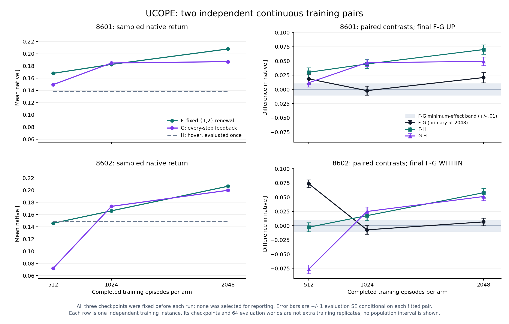

# UCOPE continuous short fixed renewal B01 /8602 — E0 result evidence

## 1. Frozen object and accepted execution

**VALID COMPLETE / WITHIN**, **B/EXPLORE**, fresh matched continuous training
instance **8602**. The [standalone card §§1–7](UCOPE_UAV_SHORT_FIXED_RENEWAL_CONTINUOUS_B01_8602_SCIENCE_CARD_20260909.md)
was frozen at **a052560c281c90ae798d7c122a2beb2534947f54**. Raw F/G each trained
2048 episodes continuously, with the fixed512/1024/2048×64 evaluation panels
and H64 once on common worlds. F used the frozen whole duration head and
half-{1,2} law; G used every-step sampled feedback. Final2048 **F−G** alone
is primary, **MEI absolute0.01 J**. No checkpoint or episode was selected.

Accepted source **d2d72c11e55294a33f38bda83e6e99c8f5c1fb83**, prelaunch
binding39b285197, accepted launchdc7f05380 and DM source acceptance426b15404
precede output. [CM terminal collection](UCOPE_UAV_SHORT_FIXED_RENEWAL_CONTINUOUS_B01_8602_EXECUTION_EVIDENCE_20260909.md#4-terminal-collection-and-technical-acceptance)
is **19ff3df822dadb88d4cca929d7fa5fcde78a1400**, integrated by Root as5cf8d048f.
Only the new seed/card wiring changed from8601's accepted computation.

One detached handle
`ucope-uav-short-fixed-renewal-continuous-b01-8602-20260909` ran on
**hmasd-wsl-node, CPU FP32, one Torch thread**, source-bound cwd
`/home/wu/hmasd-worktrees/ucope-uav-short-fixed-renewal-continuous-b01-8602-20260909`.
Supervisor PID3081306 finished **exit0**, tmux inactive, at
**2026-09-09T23:36:28Z**. Root confirmed Monitor adoption23:14:34.5855514Z
and terminal observation23:38:00.4545121Z, then resumed the original CM.
The receipt's mistaken caller label was reconciled by exact source/handle;
it did not change the run or its attribution. DM made no extra scientific,
test, checkpoint-loading or remote observation call.

## 2. Reading rule applied verbatim and DM checks

Card§5: **“WITHIN: −0.01 ≤ Delta_2048 ≤ +0.01”**, meaning
**“No demonstrated point gain at the selected scale on this new pair; not equivalence.”**

Its completeness rule is **“Final F/G completeness governs the primary; full
allocation completion requires both complete training histories, all scheduled
panels and H.”** Both requirements are met. Final
**Delta_2048=+0.0066306049391794825**, conditional evaluation SE
**0.0066248912599555865**. Distance from +0.01 is
**−0.0033693950608205177**; from −0.01 it is **+0.016630604939179484**.
There are **34 positive /30 negative /0 zero** paired worlds.
The earlier512 UP and8601 UP do not replace this primary.

DM read the card against CM's complete result, accepted source/review/check
receipts, collection readback, native summary and episode/rollout bytes.
Read-only stdlib arithmetic checked4544 episode rows/2048 rollouts, declared
reset/checkpoint identities, four finite epochs per rollout, all448 evaluation
`J=reward_sum/256` values, all nine64-element paired vectors, means, sign counts
and conditional SEs. The native `statistics.mean` aggregation is preserved;
all question-relevant recomputations match publication. All losses and their
episode IDs survive in the [durable summary](UCOPE_UAV_SHORT_FIXED_RENEWAL_CONTINUOUS_B01_8602_RESULT_SUMMARY_20260909.json).
CM's accepted checkpoint/FP32/frozen-head and remote/local hash checks are
used without repeating tensor loading, tests or the evaluator.

Analysis scripts and receipts are under
`temp/directions/ucope/analysis/continuous-8602-intake-20260909/`.
The approved run-summary tool receives only four final fitted endpoint rows:
F/G from8601 and8602, explicitly paired. H and intermediate checkpoints are
excluded from its independent-training-unit input.

## 3. Every fixed8602 panel and adverse episode

| Training episodes per arm | F mean J | G mean J | Shared H mean J | F−G point reading |
| ---: | ---: | ---: | ---: | --- |
| 512 | 0.14575930862934477 | 0.07197399707783055 | 0.14846869338166654 | UP |
| 1024 | 0.16606518960530867 | 0.17336344035610146 | 0.14846869338166654 | WITHIN |
| 2048 | 0.206288737653928 | 0.1996581327147485 | 0.14846869338166654 | WITHIN — primary |

| Training episodes | Contrast | Mean | Conditional evaluation SE | Positive / negative / zero |
| ---: | --- | ---: | ---: | --- |
| 512 | F−G | +0.07378531155151424 | 0.00694163410294064 | 60 /4 /0 |
| 512 | F−H | −0.0027093847523217726 | 0.007959872931401825 | 32 /32 /0 |
| 512 | G−H | −0.07649469630383601 | 0.007691773362561017 | 7 /57 /0 |
| 1024 | F−G | −0.0072982507507928125 | 0.007639445465862543 | 29 /35 /0 |
| 1024 | F−H | +0.017596496223642108 | 0.008546944672379661 | 35 /29 /0 |
| 1024 | G−H | +0.02489474697443492 | 0.007939034907531457 | 39 /25 /0 |
| 2048 | F−G | +0.0066306049391794825 | 0.0066248912599555865 | 34 /30 /0 |
| 2048 | F−H | +0.05782004427226144 | 0.007593430999618951 | 54 /10 /0 |
| 2048 | G−H | +0.051189439333081954 | 0.0072608765922136465 | 51 /13 /0 |

Every evaluation return J is positive; the smallest is G512 episode63,
**0.006035767859098099**. Adverse episodes above mean negative **paired
differences**, not negative absolute reward. Full raw J vectors, each negative
contrast's episode IDs and minima/maxima are retained. Final mean gains over
H therefore coexist with10 F−H losses and13 G−H losses; F's mean advantage
over G coexists with30 losses. No unfavorable world was discarded.

F's mean grows **0.06052942902458322** from512 to2048; G grows
**0.12768413563691794**, including **0.10138944327827092** by1024.
The F−G point shrinks **0.06715470661233476** across that span. Its large
early advantage was accompanied by both hover losses; the final policies
both beat hover on average but their point difference is below MEI.
This is a finite within-history budget pattern, with distinct checkpoint
evaluation action draws; it does not establish general sample efficiency,
convergence, or that additional budget must always favor G.

## 4. Two independent training instances, kept separate

[Vector figure](UCOPE_UAV_SHORT_FIXED_RENEWAL_CONTINUOUS_B01_8602_TWO_RUN_CURVES_20260909.svg).
All scheduled panels are shown on common axes, with ±1 **conditional
evaluation** SE. Lines connect measurements, not fitted smooth curves.

| Instance | Final F−G | Conditional SE | Reading | Final F−H | Final G−H |
| --- | ---: | ---: | --- | ---: | ---: |
| 8601 | +0.020735036726797745 | 0.00894880856314393 | UP | +0.06986516119815461 | +0.049130124471356874 |
| 8602 | +0.0066306049391794825 | 0.0066248912599555865 | WITHIN | +0.05782004427226144 | +0.051189439333081954 |

The accepted[8601 full result](UCOPE_UAV_SHORT_FIXED_RENEWAL_CONTINUOUS_B01_8601_RESULT_EVIDENCE_20260909.md)
retains UP/WITHIN/UP across512/1024/2048;8602 is UP/WITHIN/WITHIN.
Both have a negative1024 F−G point, but8601's final gap is slightly larger
than its512 gap. Only8602 shows the large endpoint shrinkage. All8601/8602
curves and means are also preserved in the new summary without pooling worlds.

For the two **native per-instance** final F−G values, descriptive mean is
**+0.013682820832988614**, sample SD **0.009973339361807972**, range
**+0.0066306049391794825 to+0.020735036726797745**. Both signs are favorable;
only one exceeds0.01. This outcome-informed two-instance summary is neither
a new success rule nor an upgrade of8602 to UP. The approved endpoint tool
subtracts already-aggregated means and yields8602+0.006630604939179496,
an immaterial1.4e−17 arithmetic-order difference; native rule values remain.

Fresh initialization, optimizer, training/evaluation streams and disjoint
declared address blocks support two actual independent training histories;
the labels alone would not. Within each history F/G initialization and world
seeds were intentionally paired. Its three checkpoints share one trajectory,
and64 evaluation worlds quantify conditional evaluation variation. Two-run
SD also includes finite evaluation noise; it is not an established training-
population variance or uncertainty interval.8602 was allocated after seeing
8601, so the combined display is explicitly adaptive/descriptive. No stable
superiority, equivalence or stable harm follows.

## 5. Exposure, implementation conformance and costs

Both fits completed2048 training episodes/1024 rollouts/4096 Adam calls.
Total **1048576 training native steps +114688 evaluation steps =1163264**;
**8192 Adam calls**,4096 training episodes,448 evaluations,2048 rollouts,
4544 explicit resets and two constructor resets. Partial steps and diagnostic
frames are0; all panels/fit-completeness fields are true and limits empty.

Each F/G fit has66311 movable actor/critic parameters; F's total68553 includes
the2242 frozen duration head. Its random2176 hidden parameters stay nonzero,
the66 final parameters stay zero, and every panel shows0 whole-head
displacement. All evaluation group displacements are0 and value moments
remain null. Final common actor displacements are F3.6803054809570312
(relative0.2990359602853519) and G3.5657284259796143
(relative0.28972622775387474). Critic displacements are13.03197956085205 and
11.364330291748047. CM verified finite CPU FP32 checkpoints. These facts
establish real exposure and preserved boundaries, not which component caused
return. Equal training steps/Adam counts are not equal compute.

F has1750256 training and164073 evaluation renewals,956486 selected d2,
zero d4,3615 horizon-censored holds and952871 suppressed decisions. Declared
head work is **6×1750256+2×164073=10829682 rows**, or
**23911937856 dense MACs** at2208 per row, inside the prospective range.
This is computed algorithm work, not observed hardware utilization.

Actual-node admission at **2026-09-09T23:13:38.810832Z** passed physical and
effective memory **15220748288 bytes**, floor4294967296. Complete outer wall
is **1370.01s**; peak RSS **563676KiB /550.46484375MiB**. Internal F is
**795.9866928830161s**, G/H/publication **573.6564748900128s**, pair
**1369.64316998102s**. The whole outer chain is below even the1800s arm cap
and below3600s whole, so unpartitioned startup/exit overhead cannot reverse
either arm check. **No cap or engineering-scope breach.** Engineering scope§4
additions are none. New narrow wiring check2.86791s, cumulative continuous-
directory checks12.9068072s, remain below300s; no unchanged suite was repeated.

The two accepted/valid continuous pairs cost **2659.51s summed invocation
wall**, **1329.755s per valid pair** in this named window, with2326528 native
steps/16384 Adam calls/896 evaluations.8602 alone is one serial invocation
with1370.01s critical path; summed wall over both excludes the inter-run gap,
authoring and separately recorded supporting work. This is not an all-history
cost total or controlled efficiency comparison. Actual8602/reference8601
wall ratio is1.0624350523458705, not a future runtime guarantee.
**Aggregate CPU is resources_unmeasured**; measured wall/RSS/admission remain valid.

## 6. Prediction scoring, bounded interpretation and next discriminator

| Prospective8602 event | Probability | Observed event | Brier loss |
| --- | ---: | --- | ---: |
| Final F−G>0.01 | 0.60 | False | 0.36 |
| Final F−H>0 | 0.65 | True | 0.1225 |
| G2048 mean>G512 mean | 0.70 | True | 0.09 |

Mean Brier **0.19083333333333333**. Owner prediction **not taken
(unattended)**. The first forecast's event failed; the favorable final sign
does not satisfy it.8601's separate three-event record remains mean Brier
0.2283333333333333, with all events occurring and itsP0.40 hover event a
favorable surprise. Neither tiny set establishes forecast calibration.

**Strongest support:** both final fits outperform H on average in both
independent instances, and F−G is positive in both. **Strongest contradiction
to a uniform useful F−G gain:**8602's final WITHIN, both1024 negative points,
8602's early hover losses and30/64 adverse final F−G worlds. Above-MEI
recurrence was not observed. Earlier short-budget gains and losses remain.

The surviving explanation includes finite optimization/trajectory variation,
action holding, changed renewal/credit exposure and partner co-adaptation.
This comparison does not isolate pure duration, information cost or learned
termination. H is not an upper, and a tuned same-information headroom record
is still absent. One mixed recurrence does not close the family or invalidate
8601's valid UP observation.

DM recommends ending the allocated unchanged sequence here and, **if a new
comparison is separately allocated**, testing whether learned short-duration
T adds final native value over the same fixed F while retaining feedback G
and H. That question can distinguish a learned timing package from a useful
fixed law; another unchanged pair mainly refines repeatability. No third
pair, successor card/master/source, extra evaluation or Pro request is created.
The [full intake§9](UCOPE_UAV_SHORT_FIXED_RENEWAL_CONTINUOUS_B01_8602_INTAKE_20260909.md#9-decisions-this-completed-intake-produces)
records the options, historical learned-{1,4} contradiction, known work and
unknown T timing. It is object-tier advice, with no C/family/recast or
Portfolio disposition. **Recasts1** remains.

## 7. Receipts and clean boundary

CM's collection record preserves matching remote/local SHA256s for six
scientific and seven supervisor files, exact wrapper/source and clean
detached source. The durable summary retains these hashes. Raw collected
bytes remain under `temp/directions/ucope/exp/` at the named handle.

Root accepted the[scoped closeout](../../../../temp/directions/ucope/analysis/8602-closeout-20260909/CLOSEOUT.md):
report SHA256`0dc72e5000c2829db5f1c6beae322fed1bc42223aa00f2859049326b9fe3a907`;
12238350-byte2216-member full archive SHA256
`7f8291b1b1ca807e3eab26d8dee21a3c21c89a0b3fc73b74924ce6dd7c61efa4`;
2176189-byte28-member local-collection ZIP SHA256
`03d4b75a1d9908febf1476bf70df737d70c5f8204f7e074b997df90d43e7d369`.
Verified preservation preceded removal of exact remote cwd/supervisor/wrapper/
sourcepack; disk/worktree-registry/PID/tmux absence and source recovery ref
are confirmed. Local raw evidence and this live DM analysis remain intact.

The previously reported automatic-review rejection of completed test-scratch
`Remove-Item` remains separate: `exec_command CreateProcess: blocked by policy`,
before effect. Original CM owns that excluded scratch; no bypass or retry.
No scientific or scoped remote-closeout work remains for this allocation.
The[Chinese brief](../../portfolio/owner/briefs/ucope/2026-09-09_UCOPE_UAV_SHORT_FIXED_RENEWAL_CONTINUOUS_B01_8602.md)
and full intake record the owner-facing result and decisions.
