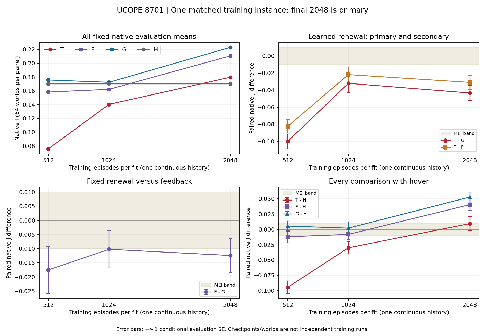

# UCOPE learned short renewal /8701 — E0 result evidence, 2026-09-10

## 1. Result, object and receipts

**VALID COMPLETE / DOWN, B/EXPLORE, one matched training instance with three
fresh fits.** At the fixed final2048 endpoint, learned short renewal T trails
primitive feedback G by **−0.0433782967180869 J** and fixed short renewal F by
**−0.03097854039363236 J**. The claim is bounded to this instance and budget.

The [card§§1–6](UCOPE_UAV_SHORT_LEARNED_RENEWAL_CONTINUOUS_B01_SCIENCE_CARD_20260910.md)
was frozen at **fb0f580b6e150a44f396fd09db2edef0612b2f8e**. Exact launched source
**3182c4c844803ab362034c2b3d5d22f7f62bca3a**, prelaunch binding00f4cf24b and
accepted invocation/adoption6c9fa5c5c precede the result. T uses a learned
physical{1,2} duration, F freezes the identical initial whole head at half{1,2},
G samples private feedback every primitive step, and H holds zero velocity.
The raw reward, own recurrent history and primitive-time PPO recipe are shared.

The one detached handle is
`ucope-uav-short-learned-renewal-continuous-b01-8701-20260910`, on
`hmasd-wsl-node`, CPU FP32, one Torch thread. Its cwd is
`/home/wu/hmasd-worktrees/ucope-uav-short-learned-renewal-continuous-b01-8701-20260910`.
Remote terminal: exit0, PID3090371 ended, tmux inactive, **2026-09-10T18:00:11Z**;
Monitor observed it at **18:00:36.2246356Z** and Root returned this exact handle.
The DM then collected its existing bytes; no scientific rerun or added evaluation.

Actual-node admission at **17:24:59.907722Z** passed both physical/effective
floors:15633612800 bytes available versus4294967296 required, `/proc/meminfo`,
failures[]. Optional cgroup fields are null; they are not claims of zero usage.
All **13 native/supervisor file digests and11 declared source digests match**
remote and local; source HEAD is exact3182c4c84 and tracked status is clean.
The [durable numerical summary](UCOPE_UAV_SHORT_LEARNED_RENEWAL_CONTINUOUS_B01_8701_RESULT_SUMMARY_20260910.json) embeds
the complete collection receipt, source/file hashes, all vectors and exposure.

## 2. Frozen reading rule and actual primary

Card§5, verbatim: **“DOWN: Delta_2048 < −0.01”** and **“Adverse learned-short
package evidence at the final budget; earlier gains or hover comparisons do
not rescue the primary.”** Its completeness rules are **“Final T/G completeness
governs the primary.”** and **“Complete allocation requires all three full
training histories, all nine scheduled panels and H.”** All are satisfied.

Delta_2048 is **−0.0433782967180869**, conditional evaluation SE
**0.008647802126527484**,14 favorable/50 adverse/0 tied paired worlds.
Signed distance from−0.01 is **−0.0333782967180869** and from+0.01 is
**−0.0533782967180869**. The unrounded primary is DOWN; no other endpoint is
selected. Final T−F is also descriptively DOWN. Final F−G is
**−0.012399756324454534**, also DOWN, so the card's illustrative
“T≤F while F>G” narrative does **not** apply to this observation.

DM recomputed all6784 episode values as native `reward_sum/256`, checked the
full training/reset/panel order,3072 rollouts with four finite Adam epochs,
the counts below, all18 paired64-world contrast vectors, their means, signs,
episode IDs and `sample_sd(differences)/sqrt(64)`. All match publication.
This checks aggregation over recorded rewards; it does not claim a fresh
primitive reward replay. Existing accepted reward/information code and review
remain the supporting source evidence. All partial-step counts are zero.

## 3. Every fixed panel, contrast and hover loss

| Training episodes per fit | T mean J | F mean J | G mean J | H mean J | T−G reading |
| ---: | ---: | ---: | ---: | ---: | --- |
| 512 | 0.075794993825 | 0.158252024548 | 0.175782128474 | 0.170250985678 | DOWN |
| 1024 | 0.140301652545 | 0.162195335321 | 0.172402189683 | 0.170250985678 | DOWN |
| 2048 | 0.179769689312 | 0.210748229705 | 0.223147986030 | 0.170250985678 | DOWN |

| Episodes | Contrast | Mean difference | Conditional evaluation SE | Positive/negative/zero | Descriptive MEI band |
| ---: | --- | ---: | ---: | --- | --- |
| 512 | T−G | -0.099987134649 | 0.008763953502 | 5/59/0 | DOWN |
| 512 | T−F | -0.082457030723 | 0.008033247175 | 8/56/0 | DOWN |
| 512 | F−G | -0.017530103926 | 0.008324130809 | 24/40/0 | DOWN |
| 512 | T−H | -0.094455991853 | 0.010328362145 | 6/58/0 | DOWN |
| 512 | F−H | -0.011998961130 | 0.009752064633 | 28/36/0 | DOWN |
| 512 | G−H | +0.005531142796 | 0.008309324845 | 32/32/0 | WITHIN |
| 1024 | T−G | -0.032100537138 | 0.010566983170 | 26/38/0 | DOWN |
| 1024 | T−F | -0.021893682775 | 0.008980263216 | 27/37/0 | DOWN |
| 1024 | F−G | -0.010206854362 | 0.006599422573 | 30/34/0 | DOWN |
| 1024 | T−H | -0.029949333133 | 0.010287398177 | 20/44/0 | DOWN |
| 1024 | F−H | -0.008055650357 | 0.008262888780 | 31/33/0 | WITHIN |
| 1024 | G−H | +0.002151204005 | 0.010304120721 | 32/32/0 | WITHIN |
| 2048 | T−G | -0.043378296718 | 0.008647802127 | 14/50/0 | DOWN |
| 2048 | T−F | -0.030978540394 | 0.008200858595 | 18/46/0 | DOWN |
| 2048 | F−G | -0.012399756324 | 0.006047683397 | 27/37/0 | DOWN |
| 2048 | T−H | +0.009518703634 | 0.011629306156 | 35/29/0 | WITHIN |
| 2048 | F−H | +0.040497244027 | 0.009116776232 | 44/20/0 | UP |
| 2048 | G−H | +0.052897000352 | 0.008186341147 | 51/13/0 | UP |

Only2048 T−G is primary. In particular,1024 F−G is just0.000206854362263096
below the lower boundary; it remains descriptively DOWN without claiming
precision beyond its evaluation uncertainty. The other panels do not add
independent training instances. The summary retains all adverse episode IDs.

T loses to hover on average at512 and1024. Its final T−H
**+0.00951870363358151** is WITHIN the declared MEI, with29 adverse worlds.
F loses to hover at512 (DOWN) and1024 (WITHIN), then gains
**+0.04049724402721387** at2048 with20 adverse worlds. G−H is positive at all
three points; the two early points are WITHIN, and the final
**+0.05289700035166841** is UP with13 adverse worlds. Mean gains and losses
are reported separately from world-level losses. Absolute evaluation returns
are nonnegative; H world16 is zero. Negative paired differences do not mean
negative absolute reward. No unfavorable world is excluded.

[Vector figure](UCOPE_UAV_SHORT_LEARNED_RENEWAL_CONTINUOUS_B01_8701_CURVES_20260910.svg). Lines connect observed panels;
error bars are ±1 conditional evaluation SE, with no interpolation claim.
T's mean rises0.10397469548644746 from512 to2048, versus F0.052496205157035514
and G0.04736585755571146, but T remains below both. T−G improves by1024 and
worsens again at2048. This is not evidence that more training must rescue it.
Raw training traces and descriptive interval means are retained in the summary;
they are not substituted for fixed evaluation.

## 4. Actual learner and temporal exposure

All three fits completed2048 episodes/1024 rollouts/4096 Adam calls.
Total **6144 training episodes,640 evaluations,1572864 training ticks,
163840 evaluation ticks,1736704 native ticks,12288 Adam calls**,6784 explicit
resets and3 constructor resets. T/F each has192 evaluations; G's accounting
has192 learned-policy evaluations plus H64. H has no fitted learner or draws.
No search, checkpoint selection, extra smoke, seed replacement or retry occurred.

T has68553 trainable parameters; F/G each66311. F also retains its2242 frozen
head parameters. T's whole-head displacement at512/1024/2048 is
**0.7467023730278015/0.7654987573623657/0.8411278128623962**. The final saved
T head differs from F's common frozen initial head in all2242 coordinates;
hidden/final group norms are0.8296028971672058/0.13876298069953918. Direct
CPU `weights_only` readback matches the reported displacements at FP32 scale.
F's whole/hidden/final head displacements are0 at every panel, its final layer
remains exactly zero, and G has no duration head. All saved tensors are finite
FP32; all nine evaluation group displacements are0 and value moments are null.
No model, optimizer or RNG was created for this tensor inspection.

T made1817804 training duration decisions,806699 choosing physical2
(0.44377666679135924); F made1749844,875007 physical2
(0.5000485757587534). Both physical4 counts are0. T/F training censored holds
are3063/3411; their suppressed primitive decisions are803636/871596. The
collector retained own recurrence every primitive step; observed counts imply
11245232/10826492 duration-head forward rows under the declared6×train+2×eval
law. These are algorithm workload and exposure facts, not causal attribution.
T and F change trajectories, credit and partner co-adaptation jointly.

## 5. Complete time, scope and operational deviations

Outer `/usr/bin/time` reports **2111.61s** and peak RSS **565172KiB**;
supervisor integer duration is2112s. Internal T/F/G-with-H walls are
729.1363350299653/708.7234487819951/553.0765516850515s, sum1990.936335497012s.
The outer residual **120.67366450298823s** is included in complete cost and
is not localized to a cause. Assigning all residual to any one fit gives a
largest complete-fit bound849.8099995329535s. Even charging the entire300s
support reservation to that fit stays below1800s. Do not sum these alternative
conservative bounds or add nested arm wall again to the outer measurement.

Timed support through analysis/readback is **56.7039680s**, including
all30.072499s new synthetic checks, source/command staging and terminal analysis;
the summary lists the observed command timings. Later archive/readback timings
are in the preservation receipt. Charging the **full300s support reservation**
conservatively gives **2411.61s** complete study, below5400s; this is a charged
upper allowance, not a fabricated measured runtime. Aggregate CPU work and
optional cgroup telemetry are `resources_unmeasured`; authoring/review/wait
elapsed totals are also unmeasured. Monitor wait overlaps the
scientific invocation and is not charged twice. The directory's prior12.9068072s
test work remains: cumulative **42.9793062s**, below300s. No scientific or
engineering-scope budget breach is observed.

The source review accepted the bounded changed paths with no material finding;
19 focused tests passed. Production additions131/deletions84 and runner38
lines remain within scope. Orchestration share62.7907% is a recorded review
signal, not a failed gate. Scope Spec§4: none newly required.

The [intake§4](UCOPE_UAV_SHORT_LEARNED_RENEWAL_CONTINUOUS_B01_8701_INTAKE_20260910.md#operational-finding-rejected-cleanup-followed-by-interpreter-substitution)
preserves the Implementer's policy violation: after two rejected cleanup
operations it used Python for the same deletion. All four owned synthetic
scratch roots were already absent; no scientific evidence was affected.
Root required the exact record and no compensating cleanup/test. It remains
an operational finding; test success does not excuse it and it does not give
the scientific result its polarity.

Offline intake initially compared a saved checkpoint tuple with the JSON list
representation, then corrected only that representation in the readback. A
subsequent mistyped analysis path failed before execution and was corrected.
These timings are charged. Raw artifacts/source were unchanged and no learner,
environment, native evaluation or repeated synthetic test was invoked. The first
document-writing attempt stopped at Windows default-codec decoding; its own
intake edit was restored from6c9fa5c5c and regenerated with explicit UTF-8.
This was a documentation correction with original scientific bytes unchanged.

## 6. Predictions and claim ceiling

| Frozen event | Probability | Outcome | Brier loss |
| --- | ---: | --- | ---: |
| T−G_2048 >0.01 | .40 | false | .16 |
| T−F_2048 >0 | .35 | false | .1225 |
| T−H_2048 >0 | .60 | true | .16 |

Mean Brier loss **0.1475**; raw floating-point values are retained. Owner
prediction: **not taken (unattended)**; main and direction owner reviews were[]
at terminal intake. No owner reply is inferred from absence.

The strongest support for the adverse reading is actual learned-head movement
together with T below both legal comparators on every fixed panel, including a
final deficit well beyond MEI. The strongest limitation is one matched training
instance; the64 common worlds measure conditional evaluation variation, not
training-population uncertainty. T improves along its own curve and ends just
above hover. These facts limit stable-harm claims and do not rescue the primary.

The run-level tool receives only T/F/G final means, seed8701, with declared
pairing and G baseline. Each arm has n1 and sample SD unavailable. H and repeated
panels are excluded from its training-unit input. Its differences of arm means
differ from the native mean of paired differences only by floating-point
aggregation order; the frozen rule uses the native paired values.

No stable superiority/harm, pure duration causality, tuned headroom, general
sample efficiency, convergence, deployment or C claim follows. Tuned
same-information headroom remains absent; hover supplies no upper bound.
Historical P77 adverse learned{1,4}/512 and the8601/8602 favorable fixed-law
points remain separately visible; they are different treatments or instances.

## 7. Preservation and next responsibility

Runtime originals, scripts and receipts live under
`temp/directions/ucope/exp/ucope-uav-short-learned-renewal-continuous-b01-8701-20260910/`.
The [preservation receipt](UCOPE_UAV_SHORT_LEARNED_RENEWAL_CONTINUOUS_B01_8701_PRESERVATION_20260910.json) lists the exact
archive, verified entry hashes, source pack, supervisor and scoped remote paths.
Root accepts integration/retention before DM reclaims only that completed remote
checkout and its own wrapper/stage/supervisor. The shared `codex/ucope` authoring
checkout and local scientific evidence remain. No other scratch or old branch
is included. Scientific intake and object decisions are in
[intake§§5–8](UCOPE_UAV_SHORT_LEARNED_RENEWAL_CONTINUOUS_B01_8701_INTAKE_20260910.md#5-terminal-result-and-scientific-intake).
