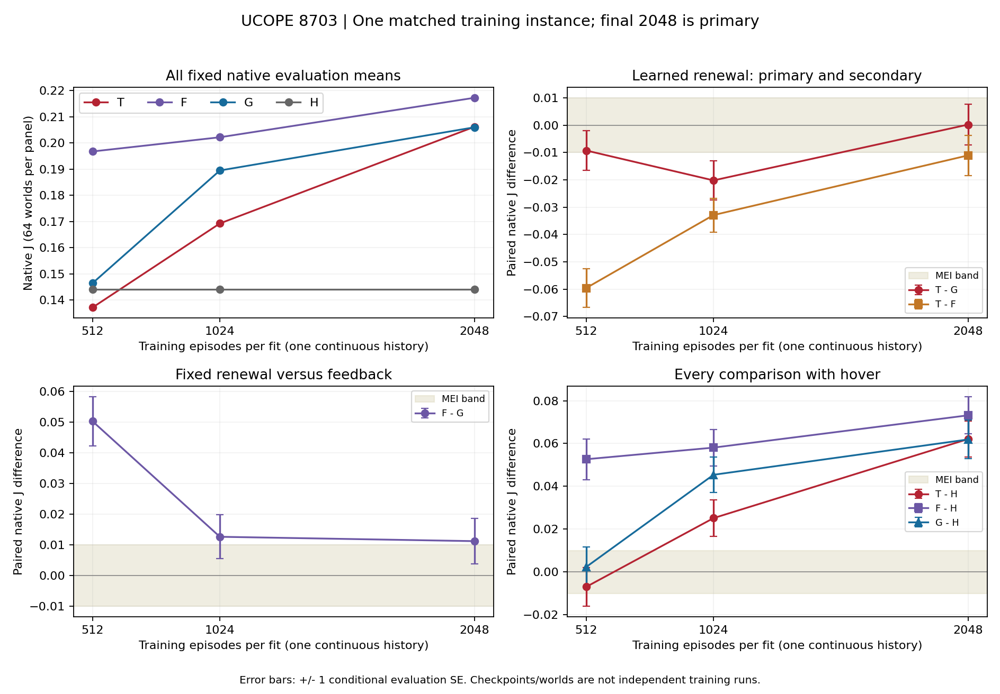

# UCOPE learned short renewal /8703 — E0 result evidence, 2026-09-10

## 1. Result and exact evidence boundary

**VALID COMPLETE / WITHIN, B/EXPLORE.** At the fixed final2048 endpoint,
T−G is **+0.00019308516986599905 J**, conditional evaluation
SE **0.007538303464769532**,31 favorable/33 adverse/0 tied worlds.
The final DOWN observed on8701 did not recur on this fresh fitted instance.
T−F is **−0.01107321367085382**; F−G is **+0.01126629884071982**.
No equivalence, stable benefit/harm, mechanism attribution, transfer, safety,
deployment or formal UAV-validation conclusion follows.

[Card§§1–6](UCOPE_UAV_SHORT_LEARNED_RENEWAL_CONTINUOUS_B01_8703_SCIENCE_CARD_20260910.md) was frozen before output in
**0c88c81b14adeda97b9543daaf4e2bdee1d5d6f8**. Exact source is
**c40a4cd66cacc892d13afd9b277407b6505b8742**; technical acceptance b2e4f5afe
and accepted-launch/Monitor record50bbc7f9 precede collection. Frozen master8703,
T learned physical{1,2}, F identical initially but whole-head frozen at half{1,2},
G private primitive feedback, H zero velocity, raw reward and primitive-credit
PPO remain unchanged. No fourth fit, repeated evaluation or scientific retry occurred.

The accepted handle is `ucope-uav-short-learned-renewal-continuous-b01-8703-20260910`, node `hmasd-wsl-node`,
cwd `/home/wu/hmasd-worktrees/ucope-uav-short-learned-renewal-continuous-b01-8703-20260910`, CPU FP32/one Torch compute and
interop thread. Supervisor finished exit0 at **2026-09-11T05:54:23+08:00**,
duration2109s; exact task tmux was inactive at terminal collection.
The supplied Monitor text records local observation **2026-09-10T22:13:12-07:00**.
These timestamps are preserved literally; no cross-clock subtraction is used.

Actual-node admission at **2026-09-10T21:19:14.748389Z** passed physical and
effective memory:15260344320 bytes versus4294967296 required; failures[].
Its cgroup fields are unavailable, not zero. All **13 native/supervisor files**
and **14 declared source/test paths** match remote/local SHA256 readback;
the exact remote HEAD is c40a4cd66 and tracked status clean. The
[numerical summary](UCOPE_UAV_SHORT_LEARNED_RENEWAL_CONTINUOUS_B01_8703_RESULT_SUMMARY_20260910.json) retains all vectors,
counts, source/artifact hashes, admission and collection receipt. Raw originals
remain in `temp/directions/ucope/exp/ucope-uav-short-learned-renewal-continuous-b01-8703-20260910/collection`.

## 2. Verbatim reading rule and technical checks

Card§5: **“WITHIN: −0.01 ≤ Delta_2048 ≤ +0.01”** and **“No demonstrated point
gain at this scale on the new instance; not equivalence.”** Its completeness
rule is **“Final T/G completeness governs the primary; complete allocation
requires all three full fits, nine panels and H.”** Every requirement is met.

Signed distances from −0.01/+0.01 are **+0.010193085169865999** and
**−0.009806914830134001**. Use the unrounded fixed final mean; no panel or
secondary comparison replaces it. T−F's descriptive DOWN is only
0.0010732136708538204 below −0.01; F−G's UP is0.0012662988407198192 above
+0.01. Their conditional SEs below limit interpretation of these point bands.

Offline checks recomputed every one of6784 episode J values as recorded native
`reward_sum/256`, checked all3072 rollouts with four finite Adam epochs,
training/reset/panel ordering, all18 paired64-world vectors/means/SEs/signs,
final endpoint identity and exposure counters. All matched publication.
This checks recorded reward aggregation, not a new primitive reward replay.
Existing accepted source/review supports the unchanged reward/information path.
`weights_only` CPU readback found finite FP32 actor/critic tensors in all three
final files and matched duration-head displacement at FP32 scale. No model,
optimizer, environment or RNG was created for collection/analysis.

## 3. All fixed panels and comparisons

| Episodes per fit | T mean J | F mean J | G mean J | H mean J | T−G band |
| ---: | ---: | ---: | ---: | ---: | --- |
| 512 | 0.137151105274 | 0.196761063087 | 0.146445051190 | 0.144094850928 | WITHIN |
| 1024 | 0.169265876554 | 0.202184945260 | 0.189496332799 | 0.144094850928 | DOWN |
| 2048 | 0.206198343102 | 0.217271556772 | 0.206005257932 | 0.144094850928 | WITHIN |

| Episodes | Contrast | Mean difference | Conditional evaluation SE | Positive/negative/zero | Descriptive band |
| ---: | --- | ---: | ---: | --- | --- |
| 512 | T−G | -0.009293945916 | 0.007212542147 | 25/39/0 | WITHIN |
| 512 | T−F | -0.059609957812 | 0.007126289056 | 9/55/0 | DOWN |
| 512 | F−G | +0.050316011896 | 0.008004453920 | 48/16/0 | UP |
| 512 | T−H | -0.006943745654 | 0.009131793042 | 28/36/0 | WITHIN |
| 512 | F−H | +0.052666212159 | 0.009482391155 | 50/14/0 | UP |
| 512 | G−H | +0.002350200262 | 0.009334960468 | 33/31/0 | WITHIN |
| 1024 | T−G | -0.020230456245 | 0.007155090138 | 23/41/0 | DOWN |
| 1024 | T−F | -0.032919068706 | 0.006206566776 | 21/43/0 | DOWN |
| 1024 | F−G | +0.012688612461 | 0.007125304757 | 38/26/0 | UP |
| 1024 | T−H | +0.025171025626 | 0.008602510394 | 38/26/0 | UP |
| 1024 | F−H | +0.058090094331 | 0.008477867374 | 53/11/0 | UP |
| 1024 | G−H | +0.045401481870 | 0.008185511195 | 50/14/0 | UP |
| 2048 | T−G | +0.000193085170 | 0.007538303465 | 31/33/0 | WITHIN |
| 2048 | T−F | -0.011073213671 | 0.007344766032 | 22/42/0 | DOWN |
| 2048 | F−G | +0.011266298841 | 0.007437373147 | 40/24/0 | UP |
| 2048 | T−H | +0.062103492173 | 0.008481125652 | 53/11/0 | UP |
| 2048 | F−H | +0.073176705844 | 0.008692214755 | 54/10/0 | UP |
| 2048 | G−H | +0.061910407003 | 0.008998694705 | 55/9/0 | UP |

Only2048 T−G is primary. T's512 hover difference is negative (WITHIN),
and1024 T−G is DOWN. All three T−F panels are DOWN. F−G/F−H are UP at every
panel. All three learners finish above hover by more than MEI on average,
while T/F/G still have11/10/9 final worlds worse than hover. All adverse worlds
and earlier outcomes remain in the summary; none is excluded or relabelled.
Nonnegative absolute rewards and negative paired differences are distinct.

[Vector figure](UCOPE_UAV_SHORT_LEARNED_RENEWAL_CONTINUOUS_B01_8703_CURVES_20260910.svg). Lines connect observed panels;
bars are ±1 conditional evaluation SE. Panels and evaluation worlds are not
independent training instances, and no interpolation or best-checkpoint claim is made.

## 4. Actual learner and temporal exposure

Three real continuous fits each completed2048 training episodes,1024 rollouts,
4096 Adam calls and all512/1024/2048 panels. Aggregate: **6144 train episodes /
1572864 train team steps;640 eval episodes /163840 eval steps;1736704 total
native steps;12288 Adam calls;3072 rollouts;6784 explicit and3 constructor resets**.
T/F each has192 evaluations; G accounting includes its192 plus H64. H has
no learner or policy draws. Partial steps, duration4 and diagnostic frames are0.

T trains68553 parameters including2242 in its duration head; F/G train66311.
T head displacement at512/1024/2048 is **0.9393991827964783/0.9180821776390076/0.9798023700714111**.
Final displacement **0.9798023700714111** from initial norm3.302255630493164
is relative0.2967070026389172; all2242 coordinates changed. F's whole head
remains unchanged at all panels, its final layer stays zero, and G has no head.
All evaluation parameter-group displacements are zero; value moments are null.
These observations rule out an entirely unexposed or frozen T head here,
without attributing the return difference to head movement alone.

Native totals include6661029 velocity decisions,3793829 duration decisions,
1948110 duration2 draws,1940571 suppressed decisions and7539 horizon-censored
holds. Per-arm/phase counts and raw training interval means remain in the summary.
Five private recurrent histories advance on primitive ticks; own expiry permits
a new private velocity/duration, then the held command affects joint service
reward and primitive-row PPO while partners co-adapt. No roster/lifetime,
information, action-support, discount or evaluation-selection change occurred.

## 5. Time, scope and historical cost

Complete `/usr/bin/time` scientific command wall **2108.73s**, peak RSS
**567072KiB**; supervisor2109s is rounded. Nested internal total is
2108.366670218995s; T/F/G-with-H costs743.3080151620088/
776.6612845610362/588.3971639869269s. Outer minus summed fits is
0.3635362900281507s. Charging all that residual to any one fit yields a
maximum777.0248208510643s, within1800s/fit. Do not add the nested times again.

The source preparation/launch records measured6.816054+1.2039085s outer
support before terminal. Collection took4.055396599986125s inside4.3891134s
outer; offline checking/plotting3.3644267999916337s inside4.2337465s outer;
run-level descriptive analysis0.1268726999987848s inside0.3578382s outer.
Publication/preservation/cleanup accounting is finalized in intake§8.
Even charging the entire≤300s support reserve gives **2408.73s**, within5400s;
this is a conservative complete-budget bound, not measured support or study elapsed.
No source was changed, no new test/smoke/profile was run at terminal, and no
Engineering Scope§4 machinery was added. Prior focused checks remain2.120285737s
for8703 and50.379488367s cumulative directory time. No budget breach is observed.
Aggregate CPU work, full authoring/control-plane cost and isolated head-backward
time remain unmeasured; no claim depends on those absent measurements.

In the declared learned-short window, complete8701/8703 scientific walls sum
**4220.34s**,2110.17s per valid comparison. Including incomplete8702 gives
**4823.41s /2 valid =2411.705s** accepted-B-attempt wall per valid result.
The distinct A01 diagnostic adds592.44s; all four native commands sum5415.85s.
Support stays separate. These are summed invocation walls, not aggregate CPU,
study critical path or a newly imposed study cap. A01 is no extra performance sample.
Current-host tuned same-information headroom remains absent; H is diagnostic.

## 6. Predictions and disposition

Frozen P(T−G>0.01)=.20, P(T−F>0)=.20, P(T−H>0)=.55 score false/false/true,
Brier losses.04/.04/.2025, mean **0.09416666666666666**. Owner prediction
**not taken (unattended)**; main and direction review queries returned[] at recovery.
The earlier selection was a recorded close call; no new close-call or direction
decision is inferred from a secondary contrast near MEI. The
[full intake](UCOPE_UAV_SHORT_LEARNED_RENEWAL_CONTINUOUS_B01_8703_INTAKE_20260910.md#5-terminal-technical-acceptance-and-scientific-intake)
records interpretation, options, recommendation and executed closeout boundary.

Scoped preservation/cleanup is complete: [intake§8](UCOPE_UAV_SHORT_LEARNED_RENEWAL_CONTINUOUS_B01_8703_INTAKE_20260910.md#completed-scoped-remote-closeout) and [full receipts](UCOPE_UAV_SHORT_LEARNED_RENEWAL_CONTINUOUS_B01_8703_PRESERVATION_20260910.json). Four remote paths/cwd registration/recorded PID/session are absent;48 local originals and the verified archive remain. Final publication timing is recorded separately in the linked support receipt.
