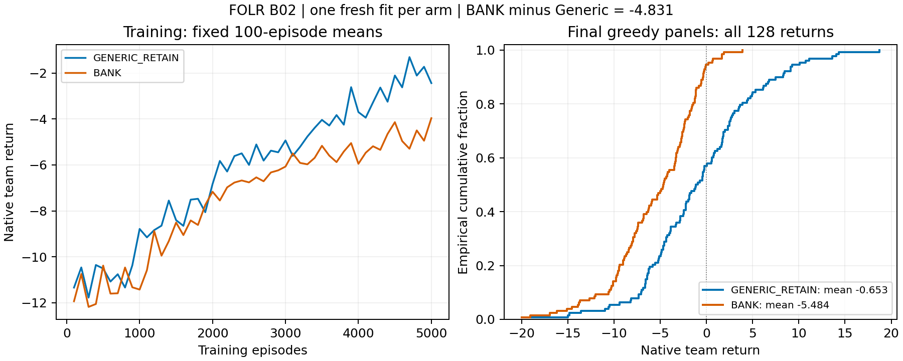

# FOLR B02: first complete fresh-learning comparison

The frozen **GENERIC_ABOVE_MEI** branch is observed:
`d_fresh = BANK - Generic = -4.830859375 < -1`. Both selected fresh fits completed.
This is an exploratory comparison of two complete learning packages on the exact
equally informed five-slot H20 host, with one fitted policy per arm. It is not
training-population superiority, a memory-component effect or Generic sufficiency.

| Final greedy panel | Generic64 | BANK16 |
| --- | ---: | ---: |
| Mean native return | -0.652968750 | -5.483828125 |
| Sample episode SD | 6.279320812 | 4.569829184 |
| Conditional episode SE | 0.555018791 | 0.403919651 |
| Negative returns | 73/128 | 121/128 |
| Minimum | -19.55 | -19.95 |
| Maximum | 18.71 | 3.90 |
| Fresh training realizations | 1 | 1 |
| Actor parameters | 103173 | 89573 |

The observed gap favoring Generic is 4.830859375 return units; the amount beyond
the frozen MEI 1 boundary is 3.830859375. These are different quantities. The strict
boundaries remain >+1 BANK_ABOVE_MEI, <-1 GENERIC_ABOVE_MEI, inclusive [-1,+1]
WITHIN_MEI. No post-result tolerance or statistical test replaced that rule.

## Exposure and integrity

The [frozen card](FOLR_ENTITY_HISTORY_B02_SCIENCE_CARD_20260914.md) was published at
0a1b5facc before scientific execution. Both source/commands are exactly
`82b12d7e0f205ea228ca69e28e581ca6ee5f2ca6`; independent Sol/high review found no
material defect and 18 committed remote tests passed before DM acceptance 5094e1a00.
Complete acceptance and review are under entity_history_b02_781401/.

Each arm used training 781401 and evaluation 1781401, full fresh Learner, CPU FP32
Torch intra/inter-op 1/1, 5000 training episodes/100000 native ticks/4969 updates,
one final checkpoint and 128 final greedy episodes/2560 ticks. Block totals:
two fits, 205120 native ticks,9938 optimizer steps,256 final episodes. No selected
model or seed was run as a smoke test. No second fit, panel, tuning, model reuse,
score stop or scientific retry occurred beyond the two specified arms.

Generic ran first. After its full terminal collection, BANK was launched with
fresh adjacent 4 GiB admission and a digest-checked Generic summary only for
publication. Its weights, replay, optimizer and RNG were newly constructed.
Both native admissions passed (Generic 15630786560 and BANK 15628066816 available
bytes), both supervisors ended exit 0, and complete finite arrays/counts/identities
were independently checked. Versions are NumPy 1.26.3 and Torch 2.7.0+cu118 running
on CPU; the CUDA-enabled build label does not imply CUDA execution.

Each archived checkpoint loaded as weights_only on CPU without constructing an
actor, resetting science RNG, resuming learning or evaluating. Stored arm and 4969
updates match; all actor/target/mixer tensors are finite FP32. A Generic support
assertion initially compared all state_dict elements against parameter count;
its 26 registered buffer elements resolved the mismatch exactly. Two Generic
checkpoint reads and one BANK read are disclosed, with the failed support check.
The native model, result and later BANK invocation were unchanged.

The Monitor twice ended early during Generic. DM resumed the same child, retained
the actual supervision gaps, and reconciled the unchanged run. The repaired
observer delivered Generic's terminal event; DM then actually collected and
launched BANK. BANK adoption/terminal delivery completed on that same batch child.
There are no live selected scientific handles. This does not claim fault-free or
uninterrupted monitoring, or that an idle-parent restart was tested.

## Analysis and interpretation limits

RESULT_SUMMARY.json and the 68-line analyze.py independently reproduce both panels
and the native primary. RUN_LEVEL_SUMMARY.json uses the existing scientific-tools
summarizer without --paired: n=1 per arm, no training SD and no paired differences.
The 2.719 s local analysis batch generated the figure below and removed its exact
owned scratch. All curves/outcomes were retained; fixed 100-episode training means
are descriptive, not checkpoint selection. Both curves improve over the run;
neither convergence nor a training-budget-independent ranking is established.

The 128 episodes describe each fitted policy conditionally. Equal seed labels do
not establish exogenous paired evaluation worlds,128 independent training fits,
paired episode uncertainty or a population confidence interval. The whole packages
differ in architecture/capacity as recorded. Same legal information does not imply
equal capacity, tuned headroom, sufficiency or a component-causal intervention.
Generic's 73 negative episodes and negative mean preclude describing this as
demonstrated good service or competence. It is the better observed package here.

B02 supplies a complete new learning comparison. It does not repair E, whose
Generic final endpoint/checkpoint and original pair primary remain unavailable.
It does not change F's outcome-informed fixed-reference GENERIC_ONLY_BANK_WORSE
use result (-5.932421875), pool either F/E panel, or make F a fresh/fresh replicate.
Old scalar H/typed-state outcomes, recast limits and all negative evidence remain.
No population, memory cause/necessity, matched-capacity, exact-containment,
tuned-headroom, speed/scaling, original-CAMA, C/UAV or transfer claim follows.

## Cost and recoverability

| Complete native invocation | Generic | BANK | Sum |
| --- | ---: | ---: | ---: |
| Wall seconds | 1252.33 | 1789.13 | 3041.46 |
| User CPU seconds | 1134.62 | 1383.02 | 2517.64 |
| System CPU seconds | 117.40 | 406.53 | 523.93 |
| Peak RSS KiB | 757916 | 745284 | not additive |

The valid learning-comparison count is 1, so observed native wall per such result
is 3041.46 s. Approximate study elapsed is 3375 s from first supervisor start to
last terminal, including the 333 s inter-arm collection/publication gap and integer
clock rounding. Aggregate native CPU is 3041.57 s. These quantities are distinct;
neither the arm timing contrast nor the historical F timing is a speed result.

COST_SUMMARY.json retains selected non-overlapping measured support windows with
lower bound 25.6949695 s at this snapshot. It excludes earlier 90/60/55 s SSH timeout
windows and unmeasured lazy-fetch delay, other reading/authoring/Git/review/monitor,
collection/closeout and provider/model work; complete support/direction/provider
cost stays UNKNOWN. The 51 s factual Portfolio acknowledgment is separately noted.
Native plans 3600 per arm/7200 sum were not exceeded; full 1800 support/9000 total
planning compliance is not established from this partial account. Those plans
were DM operational allowances, not owner caps or scientific endpoints.

GENERIC_RAW.tar.gz and BANK_RAW.tar.gz preserve all native arm files, including
the unique final learner checkpoints and full arrays. SUPERVISOR_RAW.tar.gz
preserves both terminal supervisor directories. The three collection manifests
record exact members/bytes/SHA256; extracted summary copies agree with native
hashes. Published preservation and exact scoped cleanup are recorded separately.
No other direction, historical archive, author checkout or shared object store
is a cleanup target. E and F remain separate historical cost/evidence accounts.

Published preservation and cleanup completed before the new scientific review.
The [receipt](entity_history_b02_781401/CLEANUP_RECEIPT_20260914.json) verifies all
three archive Git blobs at 88bc759283502a5047c89edab6b6dbce168c7b5b, every remote
member digest, clean exact source, terminal supervisors and absent live processes.
Only the B02 detached execution checkout and its two supervisor directories were
removed; the worktree is unregistered. Full learner checkpoints remain published.
This measured preservation/cleanup window adds 3.327356 s, bringing the selected
measured support lower bound to 29.0223255 s; full cost remains UNKNOWN.

## Post-result scientific review and disposition

The complete independent review at b4a67c7bf7b0eec726f107bf7acdf148f7e60109 found
no material design, primary or rule defect. DM read the entire answer and accepted
all three findings in the [review intake](pro_packets/20260914_entity_history_b02_review/INTAKE.md).
No numerical result, frozen rule, source or historical exposure was changed.

For precision, negative returns are not collision counts/failure probabilities;
no absolute competence cutoff is defined. Lack of demonstrated competence does
not prove incompetence. The plotted training curves are changing-policy training
returns, not repeated greedy evaluations or forecasts of further improvement.
The final [DM lifecycle decision](FOLR_ENTITY_HISTORY_B02_INTAKE_20260914.md#final-dm-lifecycle-decision--2026-09-14)
is reversible PARK/MEDIUM, marked close-call. Another fresh block remains a
legitimate action-changing possibility. The reviewer did not choose the lifecycle.
The [Chinese owner brief](../../portfolio/owner/briefs/vap_folr_core/2026-09-14_FOLR_ENTITY_HISTORY_B02_781401.md)
records the valid result and the final boundary.
