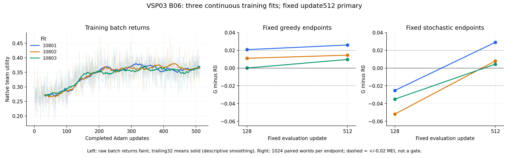

# VSP03 B06 intake — three continuous 512-update fits

**Decision:** accept all three completed B/EXPLORE fits. Fixed update-512
greedy G beats R0 and R in each sampled comparison. The primary mean is
**+0.016730143229166668**, descriptive sample SD **0.008378536806060969**,
over **three independent training fits**. The mean within-fit 128→512 change
is **+0.006103515625000007**. Both observations retain their modest size and
native tradeoffs; neither establishes stable superiority or convergence.

All three finite invocations are complete. This intake allocates no successor.
The smallest recommended future discriminator is one fresh fit of the same
512-update recipe with the same fixed panels, for the reasons in §8. That is
a recommendation, not a fourth B06 invocation, new card or family disposition.
Recasts remain **1**; the old independent-128, N1 and T/initialization pauses
remain. Root retains Portfolio sequencing, allocation and integration.

## 1. Authority, evidence and what was checked

The [frozen B06 card](VSP03_B06_CONTINUOUS512_SCIENCE_CARD_20260909.md), scientific
freeze `eb3ea385254bae3e55909731d7fa11ebf9c0299b`, implements the complete
[Convergence answer](pro_packets/20260909_continuous512_convergence/archive/RESPONSE.md)
at `5af9c448879bba3129df32e07a788839658f8a4f`. The later allocation wording at
`8a9280c6d0b86b850150e09c2e19460fb15c1ccc` applies Root's
[explicit three-fit allocation](https://github.com/CartmanFatass/My-paper-code/blob/be3061829b0465054f6007a27d8167c541c71fba/docs/research/portfolio/decisions/2026-09-09-synthesis-execution.md#vsp03-selected-b06-now-explicitly-allocated).
The allocation did not change the primary, prediction, rules, learning law,
caps or one-invocation-per-fit bound. Root's 2026-09-09 final-intake assignment
requires all outcomes, fixed endpoints, dependent Q, modes, curves and full costs.

CM accepted the [complete E0](VSP03_B06_RESULT_EVIDENCE_20260909.md),
[aggregate](VSP03_B06_AGGREGATE_20260909.json), three COLLECTION records and
three matching ARTIFACTS archives. Accepted source is
**`edb74aaf5292600480763403cd30cbd733dd1583`**; complete documentary repair and
normalization ends at **`9eaae7edf8138c0bbe1af62dbf50552de52b3c3e`**.
Root reports those technical inputs integrated through `2c1d606e2`.

DM checked the complete E0 against card §§2–7; the new continuous driver and
CM's [technical acceptance](VSP03_B06_TECHNICAL_ACCEPTANCE_20260909.md) and
[independent source review](VSP03_B06_SOURCE_REVIEW_20260909.md); exact source,
fit identities, admissions, controller/payload and journal exit facts; actual
exposure, both panels, primary and paired-Q output; and all three retained
archive hashes. CM's full native-row, rule-panel, contrast, entropy and snapshot
readback is reused rather than repeating its executions. The first collection
contains additional unit metadata; later collections carry the required unit
facts in their terminal record. That envelope difference does not omit a fit.

DM used the existing scientific-tools `summarize_runs.py` on already computed
per-fit contrasts, with endpoint and mode groups kept separate. This yields
descriptive n, mean and sample SD, without confidence intervals or a success
test. [DM analysis](VSP03_B06_DM_ANALYSIS_20260909.json) records the values,
native decomposition, curve windows, receipt checks and methods. It confirms
the CM's primary aggregate and SE=SD/32 for paired Q. Curve rows were read
directly from the archives; no model or world was constructed or reevaluated.
The [figure](VSP03_B06_CURVES_20260909.png) was visually checked for legibility.
Intake adds **zero** models, worlds, optimizer steps, evaluations or test runs.

Evidence-spec §§4, 5.2 and 11 control this B reading. The already selected
FOUNDATIONS/empirical-topic concepts distinguish a fit from its checkpoints,
a fixed endpoint from a selected maximum, and finite performance from
convergence. The accepted P74 literature context is reused; the native
accounting below makes no new mechanism or related-work claim requiring a new
search. Current relevant instructions/specifications have no change from the
previous acceptance boundary. Historical pauses and evidence are not rewritten.

## 2. Frozen rule applied verbatim

From card §4:

> **Reading rule:** final 512 greedy G above both R0 and R supports the sampled
> longer-budget controller; above R0 but below R supports only the R0 comparison.
> Positive Q with native accounting supports budget-sensitive improvement along
> these paths, even when 512 still loses to rules. An endpoint gain with small or
> negative Q supports that endpoint without showing that continuation produced it.
> Flat, adverse or mixed Q does not establish convergence, policy-class limits or
> optimizer failure. Inside-MEI values retain their signs and sizes. A zero/adverse
> final primary favors readiness for that sampled comparison. Stochastic losses
> limit a greedy gain to its declared mode. Preserve every outcome and failure;
> neither all-positive fits nor a significance test gates the reading.

**Applied branch:** all three final greedy margins exceed both fixed rules;
all three Q values are positive with intact native accounting. This supports
the sampled longer-budget controllers and budget-sensitive improvement along
these three paths. The positive Q values are small relative to their
conditional world variation, and substantial endpoint gains were already
present at 128 in the first two fits. Continuation does not explain the entire
final margin. Added data, optimizer updates and partner co-adaptation remain
combined; the experiment does not isolate a pure optimization effect.

All three primary endpoints and both panels are valid, so the card permits
the selected three-fit mean and sample SD. No missing-endpoint substitution,
quarantine, replacement, best-fit or best-checkpoint selection applies. B has
no consumption state; completion ends this finite allocation, not a C object.

## 3. Fixed primary and dependent budget change

All values are absolute native team utility. Parentheses are conditional
paired-world SE for that fit's fixed policies, not training-population SE.

| Fit | D128: greedy G−R0 (SE) | Primary D512: greedy G−R0 (SE) | Q=D512−D128 (SE) |
| --- | ---: | ---: | ---: |
| 10801 | +0.020761719 (0.003459052) | +0.025996094 (0.006836352) | +0.005234375 (0.006870996) |
| 10802 | +0.011074219 (0.007395595) | +0.014506836 (0.004010367) | +0.003432617 (0.007779798) |
| 10803 | +0.000043945 (0.007209330) | +0.009687500 (0.004009965) | +0.009643555 (0.007561877) |
| Three-fit mean | +0.010626628 | **+0.016730143** | **+0.006103516** |
| Descriptive sample SD, ddof=1 | 0.010366137 | **0.008378537** | **0.003195386** |

Each fit uses the same 1,024 worlds, phases and stochastic action tapes at
128 and 512. Q uses per-world `b=d512−d128`, whose SDs are
0.219871871846595 / 0.24895354662646277 / 0.2419800507548193. Dividing each
by 32 gives the table's Q SE. Independent endpoint variance addition would
discard the actual dependence and is not used. No variance reduction amount
is inferred merely from pairing. The rules' identical panels were executed
and retained, even though R0 cancels in Q algebraically.

The independent learning unit is a whole continuous fit: **n=3**, not six
checkpoints, 24 mode panels or 24,576 evaluation episodes. Across-fit SD
includes evaluation noise and does not estimate pure training variance.
All signs are observed outcomes, not an all-positive requirement. There is
no new significance threshold, confidence claim or stopping rule.

## 4. Every execution mode and native tradeoff

Four absolute means at both fixed endpoints:

| Fit / update | Greedy G | Stochastic G | R0 | R |
| --- | ---: | ---: | ---: | ---: |
| 10801 / 128 | 0.372187500 | 0.326142578 | 0.351425781 | 0.352822266 |
| 10801 / 512 | 0.377421875 | 0.380478516 | 0.351425781 | 0.352822266 |
| 10802 / 128 | 0.371411133 | 0.308432617 | 0.360336914 | 0.361655273 |
| 10802 / 512 | 0.374843750 | 0.368330078 | 0.360336914 | 0.361655273 |
| 10803 / 128 | 0.352099609 | 0.317021484 | 0.352055664 | 0.351904297 |
| 10803 / 512 | 0.361743164 | 0.356445313 | 0.352055664 | 0.351904297 |

All five contrasts remain visible; full conditional SD/SE is in the DM JSON
and collections. Every three-fit summary below uses these same three units.

| Update / contrast | 10801 | 10802 | 10803 | Mean | Sample SD |
| --- | ---: | ---: | ---: | ---: | ---: |
| 128 greedy−R0 | +0.020761719 | +0.011074219 | +0.000043945 | +0.010626628 | 0.010366137 |
| 128 greedy−R | +0.019365234 | +0.009755859 | +0.000195312 | +0.009772135 | 0.009584971 |
| 128 stochastic−R0 | −0.025283203 | −0.051904297 | −0.035034180 | −0.037407227 | 0.013468265 |
| 128 stochastic−R | −0.026679687 | −0.053222656 | −0.034882812 | −0.038261719 | 0.013590256 |
| 128 stochastic−greedy | −0.046044922 | −0.062978516 | −0.035078125 | −0.048033854 | 0.014056132 |
| 512 greedy−R0 | +0.025996094 | +0.014506836 | +0.009687500 | +0.016730143 | 0.008378537 |
| 512 greedy−R | +0.024599609 | +0.013188477 | +0.009838867 | +0.015875651 | 0.007738576 |
| 512 stochastic−R0 | +0.029052734 | +0.007993164 | +0.004389648 | +0.013811849 | 0.013321403 |
| 512 stochastic−R | +0.027656250 | +0.006674805 | +0.004541016 | +0.012957357 | 0.012774246 |
| 512 stochastic−greedy | +0.003056641 | −0.006513672 | −0.005297852 | −0.002918294 | 0.005210033 |

At 128, stochastic execution loses to both rules and its own greedy mode in
every fit. At 512, stochastic execution beats both rules in every fit, so
the final native gains against rules are observed in both declared modes.
Stochastic execution still loses to its own greedy mode in fits 10802/10803;
the three-fit mode contrast is negative. These losses are retained separately
from greedy gains and from stochastic recovery against rules. No mode is
selected after seeing results.

Native utility decomposes as `0.5×successes −0.025×attempts −waiting_ticks/400`.
The following contributions sum to each observed contrast; negative components
are costs or lost successes, not errors to be erased.

| Contrast / fit | Success contribution | Attempt contribution | Waiting contribution | Net |
| --- | ---: | ---: | ---: | ---: |
| D512 / 10801 | +0.025878906 | −0.003051758 | +0.003168945 | +0.025996094 |
| D512 / 10802 | +0.010253906 | −0.003564453 | +0.007817383 | +0.014506836 |
| D512 / 10803 | +0.004394531 | −0.003808594 | +0.009101562 | +0.009687500 |
| Q / 10801 | +0.007324219 | −0.000219727 | −0.001870117 | +0.005234375 |
| Q / 10802 | −0.015136719 | −0.003222656 | +0.021791992 | +0.003432617 |
| Q / 10803 | −0.005371094 | −0.003222656 | +0.018237305 | +0.009643555 |

Every final greedy controller has more successes and less waiting than R0,
at the price of more attempts. During continuation, fit 10801 gains successes
while incurring more waiting and attempts; fits 10802/10803 lose successes
and incur more attempts but reduce waiting enough to improve total utility.
Thus positive Q is not componentwise improvement or a common causal account.
Opportunity/blocking rows remain in the raw archives; those counts alone do
not identify missed counterfactual opportunities or competent alternative actions.

The binding path remains: a public opportunity occurs → the fixed controller
owns its pending job → own/partner readiness and clocks enter the 14 public
features → SUBMIT occupies the shared slot for eight ticks → valid decision
rows receive the actual remaining team return → the partner's opportunities,
successes, attempts and waiting determine native utility. One shared actor and
critic co-adapt during learning and freeze for each panel. This is fixed N=2,
not membership churn. Fully public centralized scheduling remains a surviving
explanation; the results do not isolate a uniquely MARL causal benefit.

## 5. Training curves, exposure and receipts

The plot retains all 512 collection-time stochastic batch returns per fit;
faint raw traces and trailing-32 means are descriptive. Endpoint lines connect
only the two prescribed evaluations and do not imply intermediate held-out
measurements. Dashed ±0.02 lines show the card's scale, not a decision gate.

| Fit | Mean training return updates 1–32 | 97–128 | 481–512 | Initial→128 parameter L2 movement | Initial→512 movement |
| --- | ---: | ---: | ---: | ---: | ---: |
| 10801 | 0.270408936 | 0.305472412 | 0.368809814 | 3.148693800 | 5.637589455 |
| 10802 | 0.273847656 | 0.306391602 | 0.363594971 | 2.962277651 | 5.455665588 |
| 10803 | 0.269946289 | 0.310941162 | 0.367980957 | 3.057424545 | 5.323563099 |

These windows and smoothing were chosen for post-result description, not
checkpoint selection or a convergence test. Higher late training means and
nonzero displacement demonstrate observed learning activity; the trustworthy
native endpoint comparisons establish performance. A visually flatter late
trace does not establish asymptotic convergence or that 128 was undertrained.

Each fit uses 2,083 parameters, one continuous model/Adam, 512 backward calls
and steps, 65,536 training episodes and 8,192 evaluation episodes. The unchanged
global entropy coefficient is zero from update 64 onward. Evaluation at 128
does not reset or mutate learning. Exactly two immediate detached weight
snapshots and all curves are retained.

| Observed exposure | 10801 | 10802 | 10803 | Total |
| --- | ---: | ---: | ---: | ---: |
| New models | 1 | 1 | 1 | 3 |
| Backward calls / Adam steps | 512 / 512 | 512 / 512 | 512 / 512 | 1,536 / 1,536 |
| Total episodes | 73,728 | 73,728 | 73,728 | 221,184 |
| Team ticks | 2,949,120 | 2,949,120 | 2,949,120 | 8,847,360 |
| Target transitions | 5,898,240 | 5,898,240 | 5,898,240 | 17,694,720 |
| Gradient rows | 405,660 | 396,954 | 392,143 | 1,194,757 |
| All decision rows | 460,422 | 453,381 | 446,850 | 1,360,653 |
| Rollout model batch calls | 8,712 | 8,704 | 8,709 | 26,125 |

The exposure matches the selected count law; 26,125 actual rollout calls
remain below the 26,316 bound, which excludes objective/critic/backward calls.
Total training/evaluation episodes are 196,608/24,576. No added validation
episodes, fitted candidate search, retries or replacement fits occurred.

All runs use remote `wsl_4070`, CPU float32, source-enforced one compute thread,
and float64 worlds, at the same exact source. Fresh actual-node physical and
effective admission values are 15,192,563,712 / 15,194,279,936 / 15,608,881,152
bytes; each exceeds 4 GiB. Cgroup headroom is unmeasured, not zero. Controller,
payload and supervisor exit status are zero for all three; no timeout, error
or remaining descendants is recorded. Terminated/reaped child lists are
normal containment facts, not a claim that no child ever required termination.
The declared inherited technical envelope `VSP03_B04` does not change the
B06 keys, commands or scientific identity. No admission is inferred from a
different node or from an exit code alone.

Raw artifact SHA256, matched to the collection receipts:

- 10801: `e4a9774475502f7bb3b710b0c4282ea50089bb887cfd596dbda7342a0ebe1c0f`
- 10802: `a11f011f21a39ac4767cd64098ccf7bfd7fc519daf9adf6826236ffbd561423c`
- 10803: `b72d197f9877af902b2423d095df6ff80c3a19624d70bd478578cf38f52d8e13`

## 6. Full measured costs and engineering limits

| Fit | Complete manager-to-Finished wall, s | Unit aggregate CPU, s | Learner peak RSS, bytes |
| --- | ---: | ---: | ---: |
| 10801 | 8.888241 | 8.762 | 494,186,496 |
| 10802 | 8.718389 | 8.712 | 493,867,008 |
| 10803 | 8.380174 | 8.313 | 494,153,728 |
| Sum | **25.986804** | **25.787** | Not summed |
| Per valid completed fit | **8.662268** | **8.595667** | Not averaged for a peak claim |

Complete wall includes manager startup, actual-node admission, imports,
initialization, learning, both panels, snapshots/readback/publication, exit
and descendant termination. Every fit is below its 60 s complete cap; the
work/cleanup/kill origins remain 50/58/59 s. The 180 s bound is summed complete
invocation wall. **457.616116 s** study elapsed, from the first manager origin
to the last Finished event, includes collection/monitoring/control gaps and
does not violate that sum bound. Aggregate CPU is a third quantity, reported
to unit millisecond precision. Supervisor memory-peak observations are not
substituted for learner peak RSS.

All measured complete walls fall below the prospective 13.012736–16.766912 s
per-fit extrapolation. That does not turn the projection or these three
measurements into a future runtime guarantee. Full authoring, delegation,
analysis and integration cost is not measured by these invocation totals.

CM added 188 non-test source lines: driver 151, runner 28, package 1 and
launch 8, plus 102 test lines. Old objective/environment/rules and adapter
bytes remain unchanged. Only the card-named task-local deadline adapter is
reused from scope-spec §4; no unrequested machinery or known §5 budget breach
is accepted. Independent semantic review found no remaining blocker.

Focused literal/mock tests initially had one pass and two failures caused by
an unmocked Windows peak-RSS fallback importing unavailable `psutil`. A
test-only mock repaired this, and the two failing cases then passed. Production
source and dependencies were not changed for that issue. New command time was
6.412162 s; documented cumulative directory test charges are 59.658848 s
against the existing 300 s allowance. Earlier short syntax/import commands
were not all timed, so this is not an exact remaining-budget claim. No repeated
legacy fixture or scientific smoke was added. Engineering conformance does
not by itself supply a scientific effect.

The Markdown publication was truncated by an encoding failure in `a6365f5ef`;
CM restored its historical text and complete summary in `97198c367`, then
normalized at `9eaae7edf`. DM checked final UTF-8 content. Raw fit-10803 data
and aggregate JSON were unaffected. Intermediate commits remain in history;
this was documentary repair with zero new scientific exposure.

Root confirmed at 23:09 UTC that scoped remote closeout is accepted: the exact
source worktree, three supervisor wrapper directories and three private socket
directories are absent, including the required registration/process checks.
The scientific roots, adjacent admission/terminal/payload receipts, committed
raw archives and recovery source reference remain. This is Root/CM closure
evidence, not an independent DM remote re-observation.

**Remaining technical blocker:** automatic approval review rejected the initial
combined test/owned-scratch-cleanup command before execution, with reason
`blocked by policy`. Permitted separate tests ran. CM retains cleanup of
`temp/directions/vsp_03/test/b06_cm_20260909` and `b06_cm_fix_20260909`;
no bypass or repeated rejected deletion was attempted. This local scratch
blocker was excluded from remote closeout and does not impair result validity.

## 7. Prediction, owner surfaces and decisions this intake produces

Card §5 froze the low-confidence prediction `abs(mean_i D(i,512))<=0.02`.
All three primaries exist; **+0.016730143229166668 matches it**. This was not
a sign forecast or a forecast that every fit lies inside 0.02: fit 10801 is
above that scale. The card's 0.02 MEI equals eight waiting ticks/400 and remains
an interpretive size, not an equivalence, significance or follow-up gate.
Tuned current-N2 headroom remains absent, not zero; R0/R are fixed same-information
controls and are neither tuned uppers nor policy-class maxima.

At 2026-09-09 23:15 UTC, the primary checkout at
`c6bda65c8a6c4517dbcf97dc553bf3b2eb231e03` returned no unapplied owner reviews
and no nonempty VSP03 ledger owner overrides. Owner prediction is **not taken
(unattended)**; no answer is invented. The existing P2 selection/card item
`20260909-vsp03-004` and Root's allocation trace remain intact. Ordinary valid
result, prediction and technical decisions receive no separate owner-console
item. [Chinese owner brief](../../portfolio/owner/briefs/vsp_03/2026-09-09_B06.md)
and today's audit rows accompany this intake.

### Decisions this intake produces

1. **Object tier, technical acceptance.** Options: (a) accept all three complete
   fits and trustworthy measurements; (b) quarantine for documentary repair,
   legacy envelope or unmeasured cgroup headroom; (c) request redundant science.
   Recommend and select **(a)**: retained bytes, actual source, exposure and
   primary measurement are intact; the limitations above are explicit.
   **Owner-delegated decision (unattended, 2026-09-03 instruction): (a).**
2. **Object tier, scientific reading and prediction.** Options: (a) apply the
   frozen positive-final/positive-Q branches, retain mode/component losses and
   matched mean-magnitude forecast at n=3; (b) erase positive effects inside MEI;
   (c) claim stable replacement, convergence or a unique MARL cause. Recommend
   and select **(a)**. The competent readiness alternative and old contrary
   record remain. **Owner-delegated decision (unattended, 2026-09-03 instruction):
   (a).**
3. **Object tier, finite-batch closure.** Options: (a) complete this intake and
   return the bounded next-discriminator recommendation to Root; (b) run a
   fourth fit, 2048 updates or more evaluations; (c) decide a family or Portfolio
   disposition locally. Recommend and select **(a)**, implementing Root's
   no-successor allocation boundary. **Owner-delegated decision (unattended,
   2026-09-03 instruction): (a).** No next object is selected or allocated here.

Owner flags: none newly generated by these ordinary acceptance decisions.
The previously flagged selection close call remains historical; it is not
silently changed into owner approval. The local scratch rejection remains a
technical open fact with CM ownership.

## 8. Claim ceiling, strongest evidence and next discriminator

**Strongest support:** all three new fixed-512 greedy controllers beat both
rules, with positive within-fit Q; stochastic execution recovers against both
rules by 512; observed complete cost is 8.38–8.89 s per fit. These are real
native-return observations from independent continuous learning processes.

**Strongest contradiction/limit:** the primary mean is inside the declared
0.02 scale; two final greedy margins are individually inside it, the first
two fits already have gains at 128, and conditional uncertainty is appreciable
for Q. Two Q improvements sacrifice successes; one adds waiting; every Q adds
attempt cost. Two final stochastic policies still lose to their own greedy
execution. The old independently trained 128-update seeds 5/6/7 remain
**−0.013974609375 / +0.0026123046875 / +0.0023291015625**, descriptive mean
**−0.0030110677083333365**, with all their stochastic comparisons to rules
negative. They are not pooled with the new fits or reinterpreted as invalid.
Seed 4 remains separate discovery. Different new learning paths and data mean
the old/new aggregate difference cannot be attributed solely to extra updates.

**Claim ceiling:** sampled finite-budget native performance on this public
fixed-N2 shared-service task. No stable superiority, inferiority or equivalence;
no exact optimum, initialization value, pure optimization cause, unique MARL
effect, asymptotic convergence, C promotion, UAV entry or deployment claim.
Fully public scheduling and the sufficiency of competent readiness remain
plausible alternatives. Missing tuned headroom does not invalidate or zero the
observed margin.

**Recommended smallest future object:** one new independent continuous G fit
at the same 512-update budget, fixed 128/512 four-mode panels and update-512
greedy−R0 primary. Its question is whether a fresh learning path retains the
native endpoint advantage and what portion appears during continuation,
including the stochastic recovery and success/attempt/waiting tradeoffs. One
fit is a legal bounded B observation; the proposal does not require another
positive sign or a seed quorum. It is favored over more updates, a sweep,
best-checkpoint search or exact diagnosis because the unresolved question is
variation across learning paths at the now-observed budget, and one fit
directly measures that at the smallest real-learning scale. Ending current
execution remains mandatory; an additional observation is a future choice.

Proposal arithmetic only: one model ×512 batches ×128 training episodes,
plus 2 endpoints ×4 modes ×1,024 evaluation worlds = **73,728 episodes**,
**2,949,120 team ticks**, **5,898,240 target transitions**, **512 backward/Adam
steps**, and at most **8,772 rollout model batch calls**. No nested candidates,
solver, added validation or old-weight reevaluation is proposed. The observed
8.38–8.89 s complete walls inform planning, not a guarantee; retain a 60 s
complete cap if later selected. No RNG key, source change, new card, Pro request
or invocation is created by this recommendation. It is not an automatic fourth
B06 fit and does not reopen the paused independent-128 or N1/T families.

Root's next action is to accept and integrate this scientific intake, retain
the completed-batch state and CM's scratch blocker, and sequence any future
bounded assignment within the applicable direction scope and Portfolio
allocation. DM retains the scientific decision route under the ladder;
direction-tier changes return to the original Convergence node. Continuing
beyond the exact three-fit package needs an explicit new selection and
allocation, not an automatic continuation inferred from this result. This
return does not ask Root to reinterpret the frozen result. The shared local direction checkout
remains for Root's integration boundary; no remote run remains to observe.
