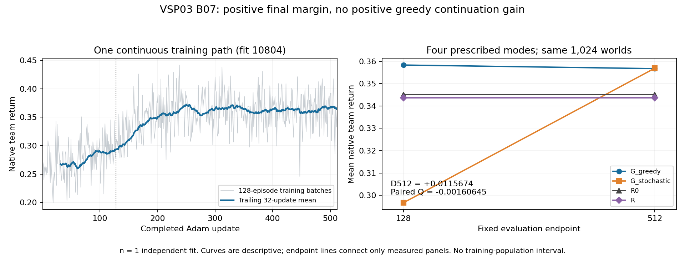

# VSP03 B07 intake — one fresh continuous512 fit

**Decision:** accept the complete B/EXPLORE result at one independent training
unit. Fixed update-512 greedy G exceeds R0 by **+0.0115673828125** and R by
**+0.013076171875**, both inside the card's 0.02 scale. The actual paired
128→512 change is **−0.0016064453125**. This supports the sampled endpoint
controller, without showing that continuation improved its greedy return.
Stochastic execution recovers against both rules by 512; every native cost
and the earlier stochastic losses remain visible.

The single allocated invocation is complete. No retry, replacement, extra
fit, 2048 extension, new object, family closure or Portfolio disposition is
selected here. Recasts remain **1**; the independent128, N1 and T/initialization
families remain stopped. B06's three-fit result stays a separate historical
record, without pooling a new four-fit primary.

## 1. Authority, evidence and checks

The [B07 card](VSP03_B07_CONTINUOUS512_SCIENCE_CARD_20260910.md), frozen with
source at **`adcff0a92559ac5552e24a9861e2b65572b478c5`**, implements the
one-fit VSP03 choice in the complete Portfolio response at
`08e989073839fe5f0f91c6a8ad90a399bee37b6c`, checked by its designated DM in
[Portfolio intake](../../portfolio/decisions/2026-09-10-next-five-chains.md)
and [L0 mapping](../../portfolio/pro_packets/20260910_next_five_chains/EXECUTION_MAPPING.md#vsp03--one-new-continuous512-g-fit).
Root assigned the full chain on2026-09-10. This new allocation was selected
after B06, while B07's own instance, endpoints and predictions preceded its
result. It is exploratory replication, not prospective confirmation of an
unchanged development history. No new Pro round was a B launch condition.

DM directly implemented and technically accepted the minimal instance wiring,
with independent Astra/high review. The complete review and focused checks
are retained in [E0](VSP03_B07_RESULT_EVIDENCE_20260910.md). Root integrated
the accepted source as `4f005bc94`; that integration is not a scientific
verdict. [Launch](VSP03_B07_LAUNCH_20260910.json) records exact remote staging,
one submission and direct Monitor dispatch. Root forwarded Monitor's terminal
receipt observed2026-09-10T16:56:07.3329491Z before collection began.

DM checked result against card §§2–7, including actual new instance10804 /
Torch50804, CPU float32/thread1, exact source and cwd, fresh admission,
controller/payload/supervisor exits, full counts and manager-origin wall.
[Collection](VSP03_B07_COLLECTION_20260910.json) retains summary, receipts,
raw journal, Monitor evidence and readback results. All20 scientific files
matched their remote byte sizes and SHA256 after transport. The
[raw archive](VSP03_B07_ARTIFACTS_20260910.tar.gz),219454 bytes, also retains
the six supervisor files; its SHA256 is
`0cd6a91504065af646cf1e7d036aa31ff64e3b5a168f179120e7c4b4db677741`.

Readback recomputed native utility and accounting on all8192 evaluation rows,
all four means and five contrasts at both endpoints, exact rule-panel identity,
the actual1024 dependent Q values and their conditional SD/SE. It checked
all512 curve rows, gradient and decision-row sums, the global entropy schedule,
and exactly the two immediate128/512 snapshot files with the runner's successful
boundary readbacks. No model, world, optimizer, historical checkpoint replay or
additional evaluation was constructed. This is verification of retained bytes.

[DM analysis](VSP03_B07_DM_ANALYSIS_20260910.json) uses float64 arithmetic
with absolute1e-9 recomputation tolerance, far below one native mean quantum
`1/(400*1024)`. It uses the scientific-tools `summarize_runs.py` on one score
per fit/endpoint/contrast. Every group has n=1 and no across-fit SD; the eight
panels and two checkpoints do not enlarge the independent training unit.
Conditional world uncertainty describes these fixed policies, not a training
population. The figure was visually checked. Analysis adds zero scientific
exposure and no new test-suite invocation.

Evidence-spec §§4,5.2,11.8–11.10 control this reading. The existing
FOUNDATIONS §§3–6, empirical topic and verified P74 literature are reused:
public information fixes the model-class ceiling, checkpoints are dependent
policy states, and finite return change is not convergence. These concepts
bound the negative-Q interpretation without inventing a causal explanation or
a new literature-search prerequisite. No changed mechanism, comparator or
related-work claim is made.

## 2. Frozen rule applied verbatim

From card §4:

> **Reading rule:** final 512 greedy G above both R0 and R supports the sampled
> longer-budget controller; above R0 but below R supports only the R0 comparison.
> Positive Q with native accounting supports budget-sensitive improvement along
> this path, even when 512 still loses to rules. An endpoint gain with small or
> negative Q supports that endpoint without showing that continuation produced it.
> Flat, adverse or mixed native components do not establish convergence,
> policy-class limits or optimizer failure. Inside-MEI values retain their signs
> and sizes. A zero/adverse final primary favors readiness for this sampled
> comparison. Stochastic losses limit a greedy gain to its declared mode.
> Preserve every outcome and failure; no positive-sign or significance gate applies.

Apply the **above-both-rules / endpoint-gain-with-negative-Q** branches.
The result supports this fit's final controller. It does not support positive
greedy improvement along its128→512 continuation. It is neither a missing
endpoint nor a zero/adverse final-primary result; readiness did not win this
sampled endpoint. The small Q loss remains a measured sign, not evidence of
population degradation, convergence or optimizer failure.

## 3. All fixed endpoints and uncertainty

| Mode | Update128 absolute mean | Update512 absolute mean |
| --- | ---: | ---: |
| Greedy G |0.3583056640625|0.35669921875|
| Stochastic G |0.2967041015625|0.3568994140625|
| R0 |0.3451318359375|0.3451318359375|
| R |0.343623046875|0.343623046875|

All differences below use the same1024 worlds within this fit. SD is the
sample SD of actual paired world differences, ddof1; SE=SD/32. These are
conditional world quantities, not confidence intervals for training seeds.

| Endpoint / contrast | Mean | Conditional world SD | Conditional world SE |
| --- | ---: | ---: | ---: |
|128 greedy−R0|+0.013173828125|0.091054886|0.002845465|
|128 greedy−R|+0.014682617188|0.097451754|0.003045367|
|128 stochastic−R0|−0.048427734375|0.314792937|0.009837279|
|128 stochastic−R|−0.046918945313|0.314703858|0.009834496|
|128 stochastic−greedy|−0.0616015625|0.321633133|0.010051035|
|**512 greedy−R0 (primary)**|**+0.011567382813**|0.096137829|0.003004307|
|512 greedy−R|+0.013076171875|0.102284798|0.003196400|
|512 stochastic−R0|+0.011767578125|0.142490077|0.004452815|
|512 stochastic−R|+0.013276367188|0.146674885|0.004583590|
|512 stochastic−greedy|+0.000200195313|0.119911111|0.003747222|
|**Paired Q: D512−D128**|**−0.001606445313**|0.052882525|0.001652579|

Q uses per-world changes before taking variance; independent endpoint
variances were not added. The primary stays512 despite128's higher greedy
mean. Both complete endpoints and every mode remain in the report.

At128 stochastic G loses to both rules and greedy G. At512 it beats both
rules, while its tiny positive point against greedy is much smaller than
its conditional SE. No stable execution-mode advantage follows. Recovery
of stochastic return is distinct from the negative greedy continuation Q.

## 4. Native consequences and limits of attribution

Utility is `0.5*successes −0.025*attempts −waiting_ticks/400`. The signed
contributions below sum to each contrast; increased attempts and lost
successes remain costs even when total return is positive.

| Contrast | Success contribution | Attempt contribution | Waiting contribution | Net |
| --- | ---: | ---: | ---: | ---: |
|512 greedy−R0|+0.00830078125|−0.00322265625|+0.006489257813|+0.011567382813|
|Greedy128→512 (Q)|−0.0029296875|−0.0005859375|+0.001909179688|−0.001606445313|
|512 stochastic−greedy|−0.00048828125|−0.00029296875|+0.000981445313|+0.000200195313|
|Stochastic128→512|+0.07861328125|+0.000659179688|−0.019077148438|+0.0601953125|

Final greedy G has0.0166015625 more successes and2.595703125 fewer waiting
ticks per team than R0, at0.12890625 extra attempts. During continuation,
it loses0.005859375 successes and adds0.0234375 attempts; saving0.763671875
waiting ticks does not offset those costs. Stochastic continuation gains
0.1572265625 successes and reduces attempts by0.0263671875, while adding
7.630859375 waiting ticks. Its net recovery therefore has a different native
composition. Full contrasts, absolute costs and opportunity/blocking counts
remain in collection and analysis, without selecting a favorable component.

The responsible path stays: a public opportunity occurs → the fixed controller
owns its pending job → own/partner readiness and clocks enter14 public features
→ a SUBMIT occupies the shared slot for eight ticks → valid decisions receive
the actual remaining team return through t=40 → partner opportunities,
successes, attempts and waiting determine native utility. Targets persist;
there is no membership replacement or hidden-state inference. One shared actor
and critic co-adapt during training and freeze for each panel. Fully public
centralized scheduling remains a containing explanation. The result does not
isolate a unique MARL effect, a pure optimization cause, or counterfactual
mistakes from the blocking counts.

## 5. Curves, actual exposure and full cost

All512 stochastic collection-time training returns are shown, with a trailing32
mean chosen for description after the result. Mean training return is
0.26735595703125 for updates1–32,0.29340087890625 for97–128, and
0.3641259765625 for481–512. The late rise does not overturn negative greedy Q:
the changing training batches and execution mode answer different measurements.
Endpoint lines connect only the two prescribed evaluations. No checkpoint is
selected, and apparent late flattening is not a convergence test.

The one model has2083 parameters and one continuous Adam. Initial total L2 is
5.835648059844971; initial-to128 displacement is2.648746967315674 and
initial-to512 displacement5.499176502227783. Initial/first/128/512 actor,
critic and total scales are retained. Movement and nonzero updates establish
exposure, while the native panels establish sampled performance.

| Quantity | Actual |
| --- | ---: |
| Models / independent fits |1 /1|
| Backward calls / Adam steps |512 /512|
| Training / evaluation episodes |65536 /8192|
| Total episodes / team ticks / target transitions |73728 /2949120 /5898240|
| Gradient rows / all decision rows |377648 /431296|
| Rollout model batch calls |8716 (bound8772)|
| Added scientific validation models / episodes / updates |0 /0 /0|
| Complete manager-origin-to-Finished wall |**8.927880 s**|
| Study elapsed across this one invocation |**8.927880 s**|
| Unit-reported aggregate CPU |**9.244309 s**|
| Learner peak RSS |493867008 bytes|

The work law is `1*512*128*40*2` training plus `1*2*4*1024*40*2`
evaluation target transitions. Rollout batch calls exclude objective/critic/
backward. The complete wall comes from manager origin517780.880234 through
the journal Finished event517789.808114, including admission, imports,
initialization, learning, both panels, snapshots, publication/readback, actual
exit and descendant termination. This is below the one60s cap with unchanged
work50/cleanup58/kill59 origins. CPU uses journal `CPU_USAGE_NSEC=9244309000`,
separate from elapsed wall. Study elapsed equals invocation wall for this
one-fit study; it does not include authoring, staging, monitoring, collection
or integration. Full support cost remains unmeasured.

Fresh physical/effective admission was15183974400 bytes on the actual remote
node; both exceed4GiB. Cgroup headroom/current/max are unavailable and marked
`resources_unmeasured`, not zero. This does not annul the trustworthy result.
The outer unit's8785920-byte memory peak is separate from learner RSS, not a
substitute. One compute thread is source-enforced; no extra live census ran.
Controller, payload and supervisor report exit0, no timeout/error and no
remaining descendants. Outer killed/reaped lists are retained as containment
facts; no claim is made that no descendant required termination. The inherited
raw `VSP03_B04` adapter label was declared prospectively and does not change
the B07 summary, command, source or instance.

## 6. Engineering conformance and cleanup boundary

The source change is12 added/3 removed non-test lines: new summary/CLI binding
and the eight-line wrapper. Old learner, environment, rules, panels, paired-Q
calculation and deadline adapter are unchanged. Independent review found no
material issue; four mock tests passed in3.4078499s command time, with focused
static checks retained in E0. The measured directory subtotal is63.4287585s,
plus earlier partly untimed short commands, within the existing cumulative300s
allowance. It was not reset. No repeated scientific smoke or timing pilot ran.
Only the card-named existing deadline adapter from Scope §4 is reused; no
unrequested machinery or known §5 budget breach is accepted. Technical
conformance and publication success are separate from the scientific reading.

Remote scientific root
`/home/wu/projects/HMASD/temp/directions/vsp_03/exp/b07_10804_20260910`
and adjacent `_admission.json`, `_terminal.json`, `_terminal.payload.json`
remain evidence, with the committed raw archive and source. The cleanup
inventory is the detached source cwd, its one supervisor wrapper directory
and private `_terminal.tmux` directory, all named in E0. DM owns scoped
reclamation; Root confirms integration/retention and accepts closure. No live
scientific invocation or remaining budget exists. The designated local shared
authoring checkout remains in use for this completion boundary.

**Separate technical blocker:** automatic approval review rejected the exact
owned local scratch `Remove-Item -LiteralPath .../b07_dm_20260910_1643 -Recurse -Force`
before execution, reason **`blocked by policy`**. The resolved path was verified
inside this checkout's `temp/` and remains present. No bypass or repeat was
attempted. DM owns this new scratch; old B06 directories remain CM-owned.
This limitation does not affect scientific validity or authorize deleting
another task's evidence.

**Remote closeout completed** at2026-09-10T17:21:35.216252Z: the detached cwd
is absent from disk and Git registration; its supervisor and private socket
directories are absent; all20 original scientific files/receipts retain their
hashes. Source and generated files are preserved in the published source archive.
An initial cleanup connection timed out while its own Git fetch waited. DM
reconciled exact paths/processes before action, terminated only that orphaned
cleanup and its Git descendants, then completed the allowed removal without
repeating the fetch. No scientific process was relaunched or interrupted.
[E0 closeout](VSP03_B07_RESULT_EVIDENCE_20260910.md#completed-scoped-remote-closeout)
and collection preserve the raw command/reconciliation receipts. The only
remaining local cleanup issue is the separate automatic-approval rejection.
Root receives final integration/retention and reclamation acceptance; no remote
execution or remote cleanup dependency remains.

## 7. Predictions, owner records and decisions this intake produces

The frozen primary prediction **`0 < D(512) <= 0.02` matched**. The separately
frozen **`Q > 0` prediction did not match**. Both required endpoints are intact;
neither forecast is unscored. The primary forecast was low-confidence and does
not predict stable superiority. MEI0.02 is the size of eight waiting ticks/400,
not an equivalence or validity threshold. Tuned current-N2 headroom remains
**absent, not zero**; fixed same-information R0/R are not tuned uppers.

At2026-09-10T17:04:11.847377Z, the primary checkout at
`e65bdce30b40f5b23202b557f0e292d4966e7de3` returned no unapplied reviews and
no nonempty VSP03 audit-owner entries. Owner prediction is **not taken
(unattended)**; no reply is invented. The final closeout boundary at
2026-09-10T17:22:43.690714Z also found no unapplied reviews or VSP03 audit
overrides on primary `d21a88d437bc196dc92e1e022e3d7a4fd8a52047`. Existing new-card item
`20260910-vsp03-001` receives the actual application trace. Ordinary result,
prediction and technical decisions stay in this intake/audit, without a new
P1/P2 item. The [Chinese brief](../../portfolio/owner/briefs/vsp_03/2026-09-10_B07.md)
accompanies the intake.

### Decisions this intake produces

1. **Object tier, technical acceptance.** Options: (a) accept the complete
   trustworthy fit; (b) quarantine because Q is negative, legacy labels remain
   or cgroup telemetry is absent; (c) run redundant validation. Recommend and
   select **(a)**. Source, native bytes, exposure and primary are intact.
   **Owner-delegated decision (unattended, 2026-09-03 instruction): (a).**
2. **Object tier, scientific reading and predictions.** Options: (a) apply the
   endpoint-positive/negative-Q branch, retain all costs and stochastic recovery,
   score primary matched and secondary not matched; (b) erase small positive
   return or the Q loss; (c) select128 or pool B06 to rescue a stronger claim.
   Recommend and select **(a)** at n=1, with conditional-world uncertainty.
   **Owner-delegated decision (unattended, 2026-09-03 instruction): (a).**
3. **Object tier, allocated-instance completion.** Options: (a) complete intake
   and scoped closeout with no successor allocation; (b) add an unchanged seed,
   more updates or more evaluation; (c) decide a family/Portfolio disposition
   locally. Recommend and select **(a)**. The allocated question is answered;
   positive performance creates no entitlement to further compute.
   **Owner-delegated decision (unattended, 2026-09-03 instruction): (a).**

Owner flags: no new close call, critic dissent, second recast or Portfolio
action from these ordinary decisions. The scratch rejection is a retained
technical open fact. No decision here parks or closes the direction.

## 8. Bounded conclusion and next discriminator

**Strongest support:** this fresh512 controller again beats both fixed rules;
the final gains appear under greedy and stochastic execution, and complete
wall is8.927880s. Greedy G combines more successes and less waiting than R0,
despite extra attempts. These are real sampled native-return observations.

**Strongest contrary evidence:** the primary is inside0.02 and greedy128
already performs slightly better. Q is negative here, unlike B06's three
positive Q values, while success and attempt costs offset saved waiting.
This weakens an account that unchanged continuation reliably improves greedy
return, without proving it ineffective. B06's three-fit mean
0.016730143229166668 and SD0.008378536806060969 remain separate; the older
independent128 primaries−0.013974609375 /+0.0026123046875 /+0.0023291015625
and their stochastic losses are preserved. The protocols are not pooled.

**Claim ceiling:** this one fit's finite-budget native performance on a fully
public fixed-N2 shared-service task. No stable superiority or equivalence,
training-population uncertainty estimate, exact optimum, initialization value,
pure optimization diagnosis, unique MARL effect, convergence, C/UAV entry or
transfer claim follows. Competent public readiness and centralized scheduling
remain viable alternatives; missing tuned headroom does not zero the gain.

**Next discriminator:** no successor is selected or allocated. This fit was
the selected minimal check of whether a fresh same-budget path retained the
endpoint gain and positive Q; it retained the first and contradicted the
second prediction. The card and Portfolio narrative already identify a further
small gain as evidence favoring an end to unchanged repetitions. DM therefore
recommends completing the selected chain without another identical fit or an
automatic longer-budget extension. That is the current finite allocation
boundary, not a direction-family closure. A future investment needs a new
decision question that could change which controller is used; this intake
does not supply a justified new treatment, host or ready successor card.
Any family change belongs to the original direction node and any cross-direction
investment choice to Portfolio Pro. Root's current actions are integration,
retention/cleanup acceptance and execution tracking, not reinterpretation of
this frozen result.
