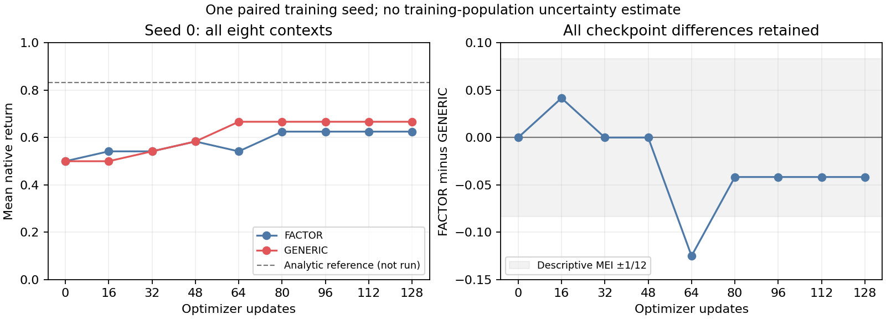

# VSP-C1 K4 factor-value B01 — seed-0 result evidence

Evidence class: **B/EXPLORE**. Object: `VSPC1-K4-FACTOR-VALUE-B01`. Both selected arm invocations completed and were technically accepted. The bounded result is **FACTOR lower than GENERIC on both the fixed endpoint and the prespecified full-curve AUC in one training-seed pair**. There is no consumption state for B and no direction closure follows.

## Question, fixed rule and actual scope

The [original card](VSPC1_K4_FACTOR_VALUE_B01_SCIENCE_CARD_20260905.md) compares the selected factorized versus fully conditioned generic Q networks on all eight public-plan service contexts, with the same environment, information, training and evaluation budget. The relevant card branch is applied verbatim:

> GENERIC is better without a credible FACTOR advantage in the other prespecified measurement → Local contrary evidence for this factorized parameterization at this budget. Inspect existing initialization, learning curves and action strata, especially conflicting first-action preferences, before attributing the cause. No new diagnostic or learner arm is automatically added.

Primary `Delta J = -0.04166666666666663`; normalized full-curve `Delta AUC = -0.02864583333333326`. Both favor GENERIC. They are inside the card's descriptive absolute MEI `1/12`; this is not an equivalence result or a significance test. FACTOR's update-16 lead is a retained transient observation, not a prospectively selected short-window endpoint that can replace these measurements.

## Implementation and receipts

Actual launch source: `e7e574b4496875f45e1d1b9b41c02cd35cf3684e`. CM technical acceptance: `931e4ba7efd68bc765d9a00b80cedb731cfac268`, in `VSPC1_K4_FACTOR_VALUE_B01_CM_TECHNICAL_RECORD_20260905.md`. Independent source and primary-output reviewers found no material defect. Four pure reporting/arithmetic/parser tests passed with no additional model, environment or optimizer exposure. The implementation is 339 non-test lines, including a 66-line runner; no scope-budget breach or new §4 machinery was reported.

Both serial tasks used configured `wsl_4070`, detached cwd `/home/wu/hmasd-worktrees/vspc1-b01-e7e574b44`, CPU FP32, single compute thread, batch32, Python3.10.21/NumPy1.26.3/Torch2.7.0+cu118 with CPU tensors. Source was pushed before execution. Each task joined its own actual-node memory preflight with the complete timed runner under a 2700-second timeout. Required publication/readback remained inside the invocation.

| Fact | FACTOR | GENERIC |
| --- | --- | --- |
| Supervisor task | `vspc1_b01_factor_s0_e7e574b44_01` | `vspc1_b01_generic_s0_e7e574b44_01` |
| Admission UTC | 2026-09-05 23:55:03.974447 | 2026-09-05 23:55:59.793693 |
| Physical/effective available bytes | 15,404,367,872 | 15,411,888,128 |
| Terminal UTC | 2026-09-05 23:55:05 | 2026-09-05 23:56:03 |
| Exit | 0 | 0 |
| Complete GNU time wall seconds | 1.76 | 3.95 |
| Complete user + system CPU seconds | 1.71 | 1.76 |
| External maximum RSS KiB | 510,076 | 510,008 |

The minimum physical/effective floor was 4,294,967,296 bytes; both passed. Cgroup fields were unavailable, not measured unlimited capacity. Total invocation wall was 5.71 seconds and aggregate CPU 3.47 seconds. The roughly 60-second study elapsed includes serial handoff/observation time. Git/SSH preparation cost was not measured. Peak RSS is a high-water observation, not a sum of simultaneous process peaks. The longer GENERIC wall has no identified cause and supplies no algorithm-speed claim. No separate calibration, reference evaluation, extra seed or pre-run was executed. The shared tracker independently reported both exits; both notices were acknowledged.

## Actual learning exposure

| Quantity | FACTOR | GENERIC |
| --- | ---: | ---: |
| Training episodes | 4,096 | 4,096 |
| Training joint primitive steps | 24,576 | 24,576 |
| Renewal transitions | 8,192 | 8,192 |
| Short / long renewal rows | 6,144 / 2,048 | 6,144 / 2,048 |
| Adam optimizer steps | 128 | 128 |
| Evaluation episodes / joint steps | 72 / 432 | 72 / 432 |
| Complete joint steps | 25,008 | 25,008 |
| Trainable parameters | 188 | 191 |
| Initial parameter norm | 4.011008263 | 3.658432961 |
| Actual parameter displacement | 2.032857895 | 1.596985579 |
| Displacement / initial norm | 0.506819673 | 0.436521756 |

Every exogenous training context received 512 episodes. Each arm's 4,168 actual episodes were checked, with zero reported held-action, partner-timing, reward, return, terminal-bootstrap or loss-weight violations and no primary dependency defect. Some runtime checks share generation expressions; they are not independent correctness proofs by themselves. Independent source and output inspection supplies separate evidence. Actual displacement comes from the learner records; no model replay or cross-host bit comparison was performed. The counts and movement establish real finite-budget learning, not convergence or mechanism value.

## All primary observations

| Update | FACTOR J | GENERIC J | Difference |
| ---: | ---: | ---: | ---: |
| 0 | 0.500000000 | 0.500000000 | 0.000000000 |
| 16 | 0.541666667 | 0.500000000 | +0.041666667 |
| 32 | 0.541666667 | 0.541666667 | 0.000000000 |
| 48 | 0.583333333 | 0.583333333 | 0.000000000 |
| 64 | 0.541666667 | 0.666666667 | -0.125000000 |
| 80 | 0.625000000 | 0.666666667 | -0.041666667 |
| 96 | 0.625000000 | 0.666666667 | -0.041666667 |
| 112 | 0.625000000 | 0.666666667 | -0.041666667 |
| 128 | 0.625000000 | 0.666666667 | -0.041666667 |

FACTOR normalized AUC is 0.580729166667, GENERIC 0.609375. The respective gains from initialization are 0.125 and 0.166666666667. Equal mean J0 does not mean equal initial policies; the archived per-context values differ at initialization. The largest recorded checkpoint gap is adverse to FACTOR at update64, and both subsequent curves plateau through update128.

At the final checkpoint, both arms return `2/3` on all four short-period contexts. GENERIC returns `2/3` on all four long-period contexts; FACTOR does so on three, but returns `1/3` at `(p=6,tau=2,c=1)`. This one mirrored conflicting-plan context accounts for the endpoint difference. It identifies the location of the observed loss, not its unique cause. Action counts retain all legal cells and zero cells; they are not forced to balance or treated as independent training samples.

The declared analytical free-policy reference remains `5/6`, not an executed arm. Its difference from the observed untuned GENERIC endpoint is `1/6`; this is a seed-0 diagnostic gap, not tuned headroom or a rewrite of historical A01. Neither learner attaining the analytic reference is not evidence of missing learner execution. The identical short-period limitation leaves substantial within-host optimization room and is retained alongside the local FACTOR loss.

## Analysis, evidence files and limits

The exact collected result packages are preserved in [FACTOR](results/k4_factor_value_b01_seed0_20260905/factor/summary.json) and [GENERIC](results/k4_factor_value_b01_seed0_20260905/generic/summary.json), with each arm's admission, complete timing, task log, exit/start witnesses and exact supervisor runner beside it. Summary byte hashes are `e442e2db862cdde9dedf82147fa0d58e44e11281a059cb47a1edce85b280b61c` and `6b6ffd99e27f1513d1713315513f69f0be45e7ec900488bf81c2559e1c39ba67` respectively. These are archival provenance, not new runtime guards.

The scientific-tools `summarize_runs.py` read one final score per arm/seed from [endpoint scores](results/k4_factor_value_b01_seed0_20260905/endpoint_scores.csv); its [descriptive output](results/k4_factor_value_b01_seed0_20260905/endpoint_summary.json) correctly reports one paired seed, no estimated sample SD and no interval or significance classification. Separate read-only Python arithmetic preserved every checkpoint, context/stratum, learning gain and fixed AUC in [computed observations](results/k4_factor_value_b01_seed0_20260905/computed_observations.json). Matplotlib produced the displayed curve from those stored values; no additional experiment or model evaluation occurred.

One paired training seed cannot support a training-population superiority, equivalence or causal-sharing claim. The fully public fixed partner, tiny host, generic shared features, initialization, bilinear optimization and segment-credit alternatives remain. The old A01 unavailable-host result and SCDMP D6 PARK boundary remain intact. The [DM intake](VSPC1_K4_FACTOR_VALUE_B01_INTAKE_20260905.md) records the bounded scientific update and any separately selected follow-up.
