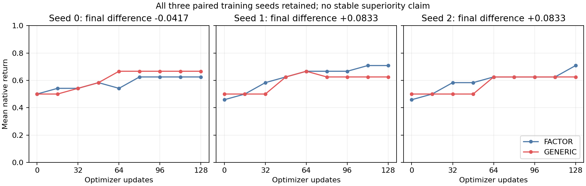

# VSP-C1 B01 seeds 1/2 — complete result evidence

Evidence: **B/EXPLORE**, the two prospectively selected new paired training seeds. All four invocations completed and were technically accepted; no extra seed, arm, tuning, smoke or repair was run. The [seed-extension card](VSPC1_K4_FACTOR_VALUE_B01_SEED12_SCIENCE_CARD_20260905.md) and original comparison are unchanged. The source permission change was one CLI line at `e2f00991f4d6ccd169e531ef411ebc1547f2d371`; the accepted learner/host/evaluator body remained identical to seed0. CM completion is `57dc032fea9c728629a876ab630bb10eb487315d`, in the [technical record](VSPC1_K4_FACTOR_VALUE_B01_CM_TECHNICAL_RECORD_20260905.md).

## Rule and measurements

The applicable new-seed card branch, verbatim, is:

> The new seeds show a FACTOR endpoint or fixed-AUC benefit → Preserve the contrary seed0 and any opposite metric/strata. This is a limited, seed-dependent signal; no automatic benchmark promotion or further seeds are authorized.

Both new seeds favor FACTOR at the fixed endpoint and normalized full AUC. The exact two new endpoint differences are `1/12` at native-return arithmetic precision. This meets the descriptive MEI in these two seeds; it is not a significance or stable-superiority threshold. The prior seed0 has the opposite sign in both measurements and is preserved unchanged.

| Seed | FACTOR J0 | GENERIC J0 | FACTOR J128 | GENERIC J128 | Delta J | FACTOR AUC | GENERIC AUC | Delta AUC |
| ---: | ---: | ---: | ---: | ---: | ---: | ---: | ---: | ---: |
| 0, historical | 0.500000 | 0.500000 | 0.625000 | 0.666667 | -0.041667 | 0.580729 | 0.609375 | -0.028646 |
| 1, new | 0.458333 | 0.500000 | 0.708333 | 0.625000 | +0.083333 | 0.625000 | 0.591146 | +0.033854 |
| 2, new | 0.458333 | 0.500000 | 0.708333 | 0.625000 | +0.083333 | 0.593750 | 0.570313 | +0.023438 |

New-seed mean differences: endpoint `+0.0833333333333`, AUC `+0.0286458333333`. The explicitly historical-inclusive three-seed mean endpoint is FACTOR `0.680555555556` versus GENERIC `0.638888888889`, difference `+0.0416666666667`; mean AUC difference is `+0.00954861111111`. The three paired endpoint differences have descriptive sample SD `0.0721687836487`, with signs `-,+,+`. No training-population interval or significance classification is produced. Two identical new endpoint differences are coarse endpoint observations, not proof of zero population variation; their curves and context outcomes differ.

In each new seed FACTOR starts lower, then gains0.25 versus GENERIC0.125. Thus its favorable new-seed measurements are not explained by a better initial *mean return*. Different initial policies, optimizer paths, general parameterization and feature sharing remain live causes. Equal gains or endpoint means do not imply identical weights or trajectories.

At both new final checkpoints, all four long-period contexts return2/3 in both arms: seed0's long-period FACTOR error does not persist. In the short-period contexts, FACTOR achieves1 on `(tau4,c1)` in seed1 and `(tau4,c0)` in seed2, with2/3 elsewhere. GENERIC instead returns1/3 on `(tau2,c1)` in seed1 and `(tau2,c0)` in seed2, with2/3 elsewhere. This moves the observed comparative loss between contexts and models; it is evidence of training-instance sensitivity, not a unique negative-transfer explanation. The analytic reference remains unexecuted; neither arm solves all short-period contexts.

## Actual exposure and technical evidence

Each new invocation completed4,096 training episodes,24,576 training joint steps,8,192 renewals (6,144/2,048 by period),128 Adam steps,72 evaluation episodes and432 evaluation joint steps, totaling25,008 joint steps. Every training context has512 episodes; each evaluator has all nine fixed eight-context checkpoints. All actual primary-dependency lists are empty. Runtime checks and independent source/output inspection support technical completeness, not stronger unperformed replay or thread-sampling claims.

| Invocation | Init norm | Actual displacement | Ratio | Complete wall seconds | Complete CPU seconds | Max RSS KiB |
| --- | ---: | ---: | ---: | ---: | ---: | ---: |
| FACTOR1 | 4.019371033 | 1.841727972 | 0.458212978 | 2.77 | 2.68 | 510160 |
| GENERIC1 | 3.579924822 | 1.660745025 | 0.463905000 | 2.76 | 2.71 | 509652 |
| FACTOR2 | 3.883702517 | 2.191782236 | 0.564353790 | 2.90 | 2.81 | 509960 |
| GENERIC2 | 3.486590147 | 1.653138041 | 0.474141775 | 2.86 | 2.80 | 509892 |

The four new invocations total100,032 joint steps,512 updates,11.29 complete wall seconds and11.00 CPU seconds. The conditional same-shape wall projection was11.42s, not a gate or guarantee. Approximately109s study elapsed includes serial handoff gaps. Across all six observed invocations, total exposure is150,048 joint steps,49,152 training renewals,768 updates and432 evaluation episodes; summed complete wall is17.00s and aggregate CPU14.47s. No general runtime speedup or wall-difference cause is inferred.

Remote node, CPU FP32, single process/compute thread and batch32 remain fixed. Cwd was `/home/wu/hmasd-worktrees/vspc1-b01-e2f00991f`. Tasks were `vspc1_b01_factor_s1_e2f00991f_01`, `vspc1_b01_generic_s1_e2f00991f_01`, `vspc1_b01_factor_s2_e2f00991f_01`, `vspc1_b01_generic_s2_e2f00991f_01`, serial in this order. Each fresh actual-node preflight passed both4GiB floors immediately before its complete timed runner. Respective physical/effective available bytes were15,364,902,912;15,365,132,288;15,049,617,408;14,968,045,568. All four exit0 witnesses and tracker notices agree; all notices were acknowledged. UTC execution dates cross into2026-09-06, while the project-local date remains2026-09-05. No scientific process remains live.

The [FACTOR1](results/k4_factor_value_b01_seed12_20260905/factor_seed1/summary.json), [GENERIC1](results/k4_factor_value_b01_seed12_20260905/generic_seed1/summary.json), [FACTOR2](results/k4_factor_value_b01_seed12_20260905/factor_seed2/summary.json) and [GENERIC2](results/k4_factor_value_b01_seed12_20260905/generic_seed2/summary.json) raw packages preserve complete context/action/curve values plus admission, complete GNU time, task log, exit/start and exact runner. External time includes startup/imports, initialization, training/evaluation/checks, all required write/read, stdout and shutdown. RSS/cgroup/preparation limitations remain those in the CM record.

Approved scientific-tools summaries used one endpoint/AUC score per arm and independent training seed: [new endpoint](results/k4_factor_value_b01_seed12_20260905/new_endpoint_summary.json), [new AUC](results/k4_factor_value_b01_seed12_20260905/new_auc_summary.json), [all endpoint](results/k4_factor_value_b01_seed12_20260905/all_endpoint_summary.json), [all AUC](results/k4_factor_value_b01_seed12_20260905/all_auc_summary.json). Their CSV inputs are archived beside them. [Read-only computed observations](results/k4_factor_value_b01_seed12_20260905/computed_observations.json) hold all54 checkpoint populations, real movement records, actual cost/count totals and zero new consultation exposure. Analysis and plotting ran no model or environment. Interpretation and next direction-tier question are in the [DM intake](VSPC1_K4_FACTOR_VALUE_B01_SEED12_INTAKE_20260905.md).
