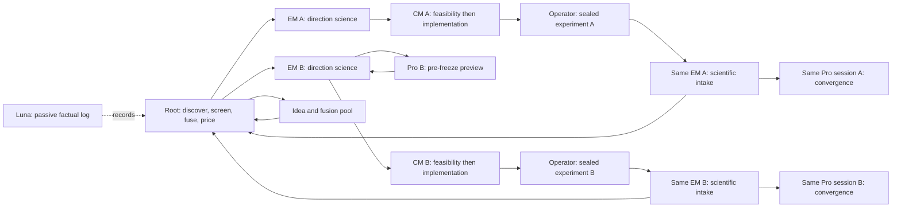

# Five-loop concurrent research-team blueprint

Five loops are completion receipts, not a serial queue. Root keeps the
portfolio loop live while direction-scoped work advances whenever its own
predecessors and resource limits permit.

## Scheduling invariants

- Root continuously ranks expected decision information against wall time,
  engineering/runtime cost, opportunity cost, reversibility and reuse.
- EM is an on-demand, reusable, multi-turn teammate for one direction. Parallel
  EM processes reduce latency; they do not form separate portfolio workflows.
- CM may perform bounded read-only feasibility work before freeze and starts
  implementation as soon as one treatment is actionable, without waiting for
  unrelated directions.
- Pro is used for answer-changing preview, code-science alignment, convergence
  or an exhausted blocker. One direction keeps one exact conversation; a
  formal new fusion direction gets a new conversation.
- A zero-runtime source/host audit is a factual reuse/provenance observation,
  not an idea or direction gate. It may close only the exact retrospective
  existence/provenance formulation. Root/EM must separately consider the
  strongest construct-first prospective successor; code/host absence routes to
  bounded CM feasibility when the successor is answer-changing. Only
  scientific redundancy, unresolved identifiability or comparator failure,
  ineliminable external dependency, or poor decision value relative to
  CM-estimated total cost can park it. No activity is created merely to keep a
  role busy.
- Shared compute is parallelized only when budgets do not conflict; otherwise
  ready experiments are deliberately staggered while research and review lanes
  continue.

## Completion receipt for each loop

A loop counts only after it has a direction-scoped scientific freeze, a
technically accepted implementation, the authorized experiment result, intake
by the same logical direction EM, an archived External-Pro convergence result,
and Root's final evidence-chain audit. Loops 3--5 remain dynamically unassigned
until Root's value/cost screen admits a candidate.
